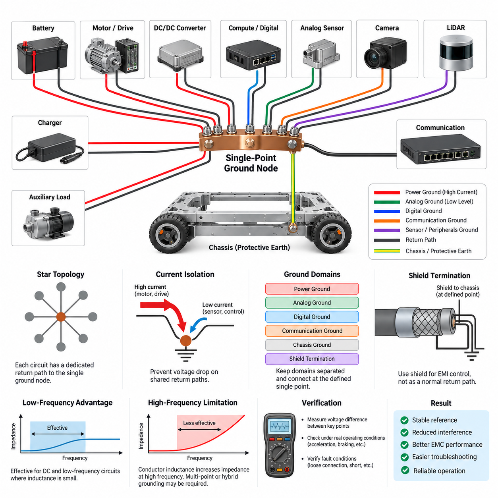
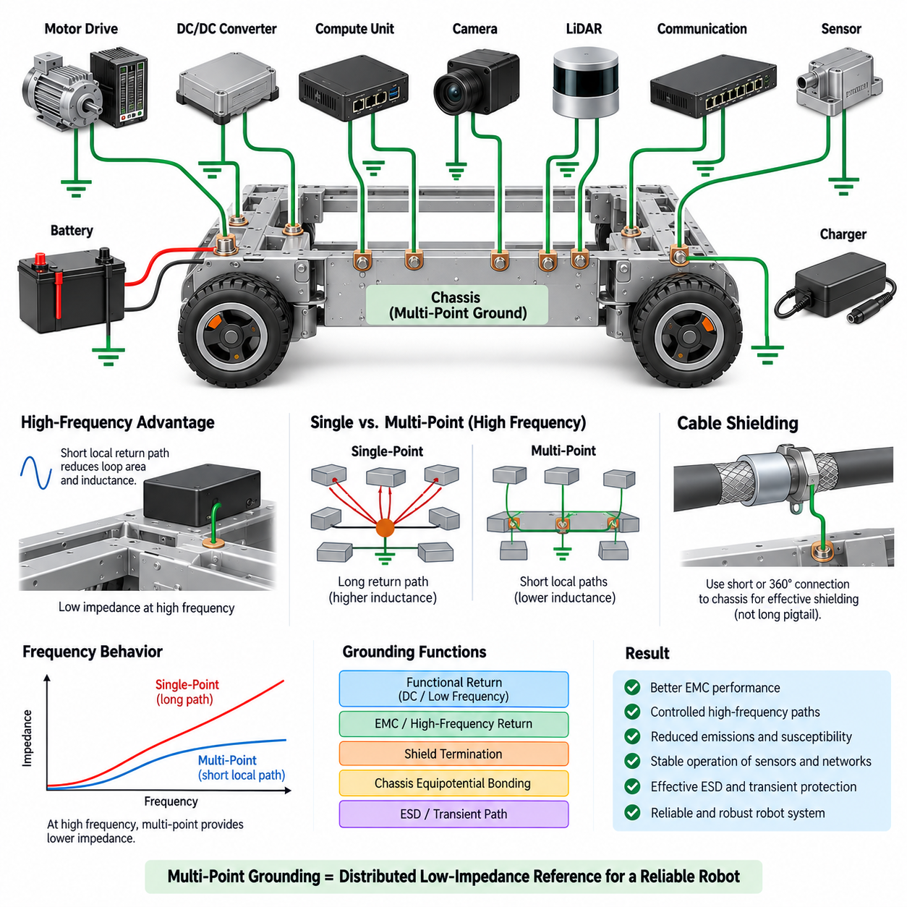
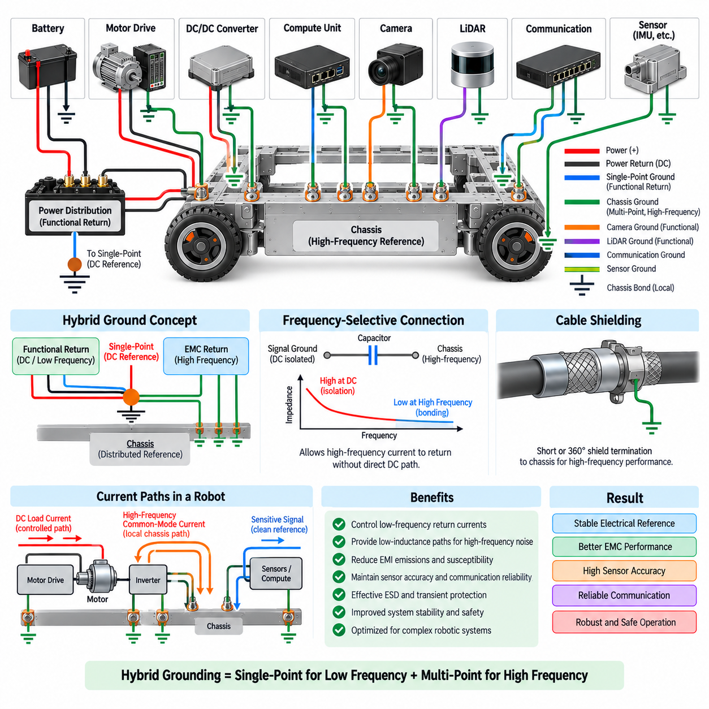
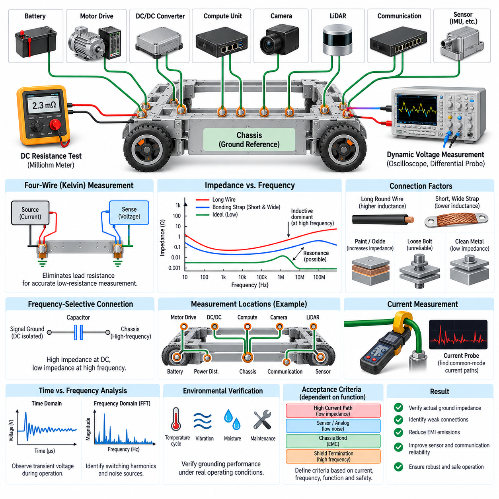
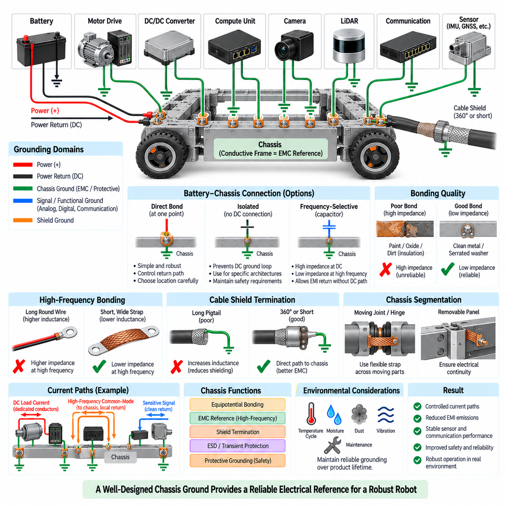

**Volume 05. Grounding and EMC**


# Chapter 01. Grounding Theory

##  

## 01.01. Single Point Ground

{width="7.268055555555556in" height="7.268055555555556in"}

A single-point ground architecture connects the reference returns of multiple electrical and electronic subsystems to one intentionally defined grounding node. Instead of allowing return currents to flow through arbitrary chassis paths or several interconnected ground points, the architecture establishes a controlled reference location where power, control, sensing, and communication grounds are coordinated. This method is especially useful when predictable low-frequency behavior is more important than minimizing high-frequency impedance.

The fundamental objective is to prevent shared return paths from converting load current into unwanted signal voltage. Every conductor has resistance and inductance, so a current flowing through a common ground conductor produces a voltage difference according to its impedance. If a motor, relay, processor, and analog sensor share the same uncontrolled return path, large transient currents can disturb the reference voltage used by sensitive electronics. A single-point structure separates these paths until they reach the designated common node.

A practical single-point ground is often visualized as a star topology. Individual circuits or functional domains receive dedicated return conductors that converge at a central grounding point rather than being connected sequentially from one device to another. High-current loads should therefore not return through conductors used by low-level sensors or communication electronics. The star arrangement makes current paths easier to understand, calculate, measure, and troubleshoot because each branch has a relatively explicit electrical function.

Ground location is a system-level design decision rather than simply a convenient mechanical connection. The selected point should normally have a low and stable impedance to the intended reference, sufficient current capability, reliable mechanical construction, and controlled relationships with battery return and chassis. In a robot, the grounding node may be located near the power distribution unit, battery return junction, or another intentionally designed distribution structure depending on the overall electrical architecture and safety requirements.

Single-point grounding is particularly effective for DC and relatively low-frequency circuits because conductor inductance has limited influence in that frequency range. Analog sensors, low-frequency measurement circuits, reference supplies, and sensitive control electronics can benefit from clearly separated return paths. The technique reduces common impedance coupling and helps prevent variations in propulsion or actuator current from directly shifting the electrical reference used by low-level measurement circuits.

The architecture does not imply that every ground in a complex robot should be electrically identical. Designers commonly distinguish power ground, analog ground, digital ground, communication reference, chassis ground, shield termination, and protective bonding according to their functions. These domains can remain physically or functionally separated over portions of the system and meet only at deliberately selected locations. The important principle is that connections between domains must be engineered rather than created accidentally through mounting hardware or cable shields.

Power-ground branches require special attention because traction motors, servo drives, pumps, heaters, DC/DC converters, and other high-current loads can produce substantial steady-state and transient currents. Their return conductors should follow controlled low-impedance routes toward the main grounding node. Sensitive electronics should use separate branches so that voltage drops produced by high-current loads do not appear directly in sensor or processor references. This separation is essential in mobile robots where load currents change rapidly during acceleration and braking.

Analog grounding requires additional care because sensor outputs may represent millivolt-level information while nearby power electronics switch tens of amperes. A dedicated analog return path can reduce interference caused by shared impedance, but the connection between analog and digital domains must still be defined carefully. If an ADC or mixed-signal device transfers information between the two domains, the grounding strategy should support the actual current flow around that interface rather than relying only on schematic ground labels.

Digital systems can also generate substantial ground noise because processors, memory devices, communication controllers, and switching regulators draw rapidly changing currents. Local decoupling capacitors provide short high-frequency current loops close to devices, while the system grounding network establishes the larger reference structure. Consequently, single-point grounding should not be interpreted as forcing every transient current to travel physically to the central node. Local current loops and system-level reference management perform different but complementary functions.

Chassis ground must be distinguished from ordinary signal return. The conductive robot frame can provide shielding, fault-current control, electrostatic discharge paths, and electromagnetic compatibility functions, but uncontrolled chassis connections may also create unintended parallel return paths. If electronic ground is bonded to chassis at a defined point, additional bonds through mounting screws, connector shells, sensor housings, or cable shields must be reviewed carefully. Otherwise, the intended single-point topology can silently become a multi-point network.

Cable shields require similar consideration. A shield is primarily intended to control electromagnetic fields and common-mode interference rather than serve as a normal operating-current return conductor. Connecting a shield to signal ground at arbitrary locations can introduce noise into the reference network or create an unintended ground loop. Shield termination therefore has to be coordinated with grounding architecture, connector construction, frequency range, chassis design, and EMC objectives rather than treated as an independent wiring detail.

The major limitation of single-point grounding appears as operating frequency increases. Long conductors possess inductance, and their impedance rises with frequency, so a physically remote star point may no longer behave as an equipotential reference for fast switching edges or RF currents. High-frequency interference often requires short chassis bonds, low-inductance planes, distributed capacitive coupling, or multi-point grounding techniques. For this reason, sophisticated robotic systems frequently evolve toward hybrid grounding architectures instead of applying a pure single-point method everywhere.

Physical implementation determines whether the theoretical architecture actually works. Ground conductors should be sized for expected current and transient conditions, while connection resistance should remain low throughout vibration, temperature cycling, humidity, oxidation, and service life. Crimp joints, studs, busbars, PCB connections, and chassis bonds should be designed so their electrical function remains reproducible. A beautifully drawn star-ground schematic provides little benefit if several branches share an undersized harness segment before reaching the actual grounding node.

Ground-voltage measurements are useful during validation. Engineers can measure voltage differences between battery negative, the central ground node, controller ground, sensor ground, chassis, and high-current load returns while operating the robot under realistic conditions. Acceleration, regenerative braking, steering actuation, manipulator motion, charger operation, and communication activity can reveal disturbances that are invisible during static testing. Both steady voltage drop and transient behavior should be evaluated because different mechanisms dominate at different frequencies.

Grounding verification should also include fault conditions. A loose return terminal, damaged conductor, corroded chassis bond, short circuit, or disconnected sensor ground can force current through unexpected secondary paths. These paths may include communication cables, shields, mechanical structures, or interface electronics that were never intended to carry substantial current. Understanding these possibilities during design helps prevent connector damage, intermittent communication failures, sensor offsets, controller resets, and difficult field failures.

In an AMR, a useful implementation may place the battery and power distribution system near the principal DC reference while propulsion drives, steering controllers, compute units, sensors, and auxiliary loads use controlled return branches. High-current propulsion returns can be kept electrically distinct from LiDAR, camera, IMU, GNSS, and compute references until the intended convergence point. This organization supports both EMC performance and systematic troubleshooting as the robot architecture becomes more complex.

Single-point grounding should therefore be treated as a current-path management strategy rather than merely a rule stating that all grounds must meet at one location. Its effectiveness depends on identifying where operating currents, transient currents, fault currents, common-mode currents, and shield currents actually flow. When those paths are intentionally separated and reunited according to their electrical functions, the architecture provides a stable reference foundation for reliable sensing, computation, communication, and power control.

A successful design ultimately balances grounding topology with frequency, physical dimensions, current magnitude, EMC requirements, safety, and mechanical packaging. Single-point grounding offers a strong foundation for understanding and controlling low-frequency return currents, while its limitations naturally lead to multi-point and hybrid techniques addressed elsewhere in the grounding architecture. This makes it an essential starting concept for designing predictable electrical behavior in AMRs, manipulators, autonomous vehicles, and other Physical AI systems.

단일점 접지(Single-Point Ground) 아키텍처는 여러 전기 및 전자 서브시스템(Subsystem)의 기준 리턴(Reference Return)을 의도적으로 정의된 하나의 접지 노드(Grounding Node)에 연결하는 방식이다. 리턴 전류(Return Current)가 임의의 섀시(Chassis) 경로나 여러 개의 상호 연결된 접지점을 통해 흐르도록 두는 대신, 전원(Power), 제어(Control), 센싱(Sensing), 통신(Communication) 접지가 하나의 제어된 기준 위치에서 조정되도록 구성한다. 이 방식은 특히 고주파 임피던스(High-Frequency Impedance)의 최소화보다 예측 가능한 저주파 동작(Low-Frequency Behavior)이 중요한 시스템에서 효과적이다.

단일점 접지(Single-Point Ground)의 기본 목적은 공유 리턴 경로(Shared Return Path)를 통해 부하 전류(Load Current)가 원하지 않는 신호 전압(Signal Voltage)으로 변환되는 것을 방지하는 것이다. 모든 도체(Conductor)는 저항(Resistance)과 인덕턴스(Inductance)를 가지므로 공통 접지 도체를 통해 전류가 흐르면 그 임피던스(Impedance)에 따라 전압 차이가 발생한다. 모터(Motor), 릴레이(Relay), 프로세서(Processor), 아날로그 센서(Analog Sensor)가 제어되지 않은 동일한 리턴 경로를 공유하면 큰 과도 전류(Transient Current)가 민감한 전자회로의 기준 전압(Reference Voltage)을 교란할 수 있다. 단일점 구조는 이러한 경로를 지정된 공통 노드에 도달할 때까지 분리한다.

실제 단일점 접지(Single-Point Ground)는 흔히 스타 토폴로지(Star Topology) 형태로 구현된다. 개별 회로나 기능 도메인(Functional Domain)은 한 장치에서 다음 장치로 순차 연결되는 대신 중앙 접지점(Central Grounding Point)으로 모이는 전용 리턴 도체(Dedicated Return Conductor)를 사용한다. 따라서 고전류 부하(High-Current Load)의 리턴은 저레벨 센서(Low-Level Sensor)나 통신 전자장치가 사용하는 도체를 통과해서는 안 된다. 스타 구조는 각 분기의 전기적 기능을 명확하게 만들어 전류 경로를 이해하고 계산하며 측정하고 문제를 진단하기 쉽게 한다.

접지 위치(Ground Location)는 단순히 기계적으로 연결하기 편리한 장소가 아니라 시스템 수준(System-Level)의 설계 결정 사항이다. 선택된 지점은 일반적으로 의도된 기준점에 대해 낮고 안정적인 임피던스(Low and Stable Impedance), 충분한 전류 용량(Current Capability), 신뢰성 있는 기계적 구조를 가져야 하며 배터리 리턴(Battery Return) 및 섀시(Chassis)와의 관계도 제어되어야 한다. 로봇에서는 전체 전기 아키텍처(Electrical Architecture)와 안전 요구사항에 따라 전력 분배 장치(Power Distribution Unit), 배터리 리턴 접속부(Battery Return Junction), 또는 별도로 설계된 분배 구조 근처에 접지 노드를 배치할 수 있다.

단일점 접지(Single-Point Ground)는 도체의 인덕턴스(Inductance) 영향이 상대적으로 작은 직류(DC) 및 비교적 낮은 주파수 회로에서 특히 효과적이다. 아날로그 센서(Analog Sensor), 저주파 측정 회로(Low-Frequency Measurement Circuit), 기준 전원(Reference Supply), 민감한 제어 전자장치(Control Electronics)는 명확히 분리된 리턴 경로를 통해 이점을 얻을 수 있다. 이러한 방식은 공통 임피던스 결합(Common Impedance Coupling)을 줄이고 추진장치나 액추에이터(Actuator)의 전류 변화가 저레벨 측정 회로의 전기적 기준을 직접 변화시키는 것을 방지하는 데 도움이 된다.

이 아키텍처가 복잡한 로봇의 모든 접지를 전기적으로 동일하게 만들어야 한다는 의미는 아니다. 설계자는 일반적으로 전력 접지(Power Ground), 아날로그 접지(Analog Ground), 디지털 접지(Digital Ground), 통신 기준(Communication Reference), 섀시 접지(Chassis Ground), 실드 종단(Shield Termination), 보호 본딩(Protective Bonding)을 각각의 기능에 따라 구분한다. 이러한 도메인은 시스템의 일정 구간에서 물리적 또는 기능적으로 분리된 상태를 유지하다가 의도적으로 선택된 위치에서만 결합될 수 있다. 핵심은 도메인 간 연결이 장착 하드웨어나 케이블 실드(Cable Shield)를 통해 우연히 형성되지 않고 설계되어야 한다는 것이다.

전력 접지(Power Ground) 분기는 구동 모터(Traction Motor), 서보 드라이브(Servo Drive), 펌프(Pump), 히터(Heater), DC/DC 컨버터(DC/DC Converter)와 기타 고전류 부하가 상당한 정상상태 및 과도 전류를 발생시킬 수 있으므로 특별한 주의가 필요하다. 이들의 리턴 도체는 주 접지 노드(Main Grounding Node)를 향하는 제어된 저임피던스 경로(Low-Impedance Path)를 따라야 한다. 민감한 전자장치는 별도의 분기를 사용하여 고전류 부하에서 발생하는 전압 강하(Voltage Drop)가 센서나 프로세서 기준에 직접 나타나지 않도록 해야 한다. 이러한 분리는 가속과 제동 과정에서 부하 전류가 빠르게 변하는 이동 로봇(Mobile Robot)에서 특히 중요하다.

아날로그 접지(Analog Ground)는 센서 출력이 밀리볼트(Millivolt) 수준의 정보를 나타내는 반면 주변 전력전자장치(Power Electronics)는 수십 암페어(Ampere)를 스위칭할 수 있기 때문에 추가적인 주의가 필요하다. 전용 아날로그 리턴 경로(Dedicated Analog Return Path)는 공유 임피던스에서 발생하는 간섭을 줄일 수 있지만 아날로그와 디지털 도메인 사이의 연결도 신중하게 정의해야 한다. ADC(Analog-to-Digital Converter)나 혼합신호 장치(Mixed-Signal Device)가 두 도메인 사이에서 정보를 전달한다면 접지 전략은 단순한 회로도의 접지 라벨이 아니라 해당 인터페이스 주변에서 실제로 흐르는 전류를 고려해야 한다.

디지털 시스템(Digital System) 역시 프로세서(Processor), 메모리 장치(Memory Device), 통신 컨트롤러(Communication Controller), 스위칭 레귤레이터(Switching Regulator)가 빠르게 변화하는 전류를 소비하기 때문에 상당한 접지 잡음(Ground Noise)을 발생시킬 수 있다. 로컬 디커플링 커패시터(Local Decoupling Capacitor)는 장치 가까이에서 짧은 고주파 전류 루프(High-Frequency Current Loop)를 제공하며, 시스템 접지 네트워크(System Grounding Network)는 더 큰 범위의 기준 구조를 형성한다. 따라서 단일점 접지는 모든 과도 전류가 물리적으로 중앙 노드까지 이동하도록 강제하는 것으로 이해해서는 안 된다. 로컬 전류 루프와 시스템 수준의 기준 관리는 서로 다른 역할을 수행하면서 상호 보완한다.

섀시 접지(Chassis Ground)는 일반적인 신호 리턴(Signal Return)과 구분해야 한다. 전도성 로봇 프레임(Conductive Robot Frame)은 차폐(Shielding), 고장 전류 제어(Fault-Current Control), 정전기 방전(Electrostatic Discharge) 경로, 전자기 적합성(Electromagnetic Compatibility) 기능을 제공할 수 있지만 제어되지 않은 섀시 연결은 의도하지 않은 병렬 리턴 경로(Parallel Return Path)를 만들 수도 있다. 전자회로 접지를 특정 지점에서 섀시에 본딩(Bonding)한다면 장착 나사, 커넥터 셸(Connector Shell), 센서 하우징(Sensor Housing), 케이블 실드 등을 통한 추가적인 연결도 신중하게 검토해야 한다. 그렇지 않으면 의도했던 단일점 토폴로지가 실제로는 다점 네트워크(Multi-Point Network)로 변할 수 있다.

케이블 실드(Cable Shield)도 이와 유사한 관점에서 고려해야 한다. 실드는 정상적인 동작 전류의 리턴 도체로 사용하기보다는 전자기장(Electromagnetic Field)과 공통 모드 간섭(Common-Mode Interference)을 제어하는 것이 주요 목적이다. 임의의 위치에서 실드를 신호 접지(Signal Ground)에 연결하면 기준 네트워크에 잡음이 유입되거나 의도하지 않은 접지 루프(Ground Loop)가 형성될 수 있다. 따라서 실드 종단(Shield Termination)은 독립적인 배선 세부사항이 아니라 접지 아키텍처, 커넥터 구조, 주파수 범위, 섀시 설계, EMC 목표와 함께 조정되어야 한다.

단일점 접지(Single-Point Ground)의 주요 한계는 동작 주파수가 증가하면서 나타난다. 긴 도체는 인덕턴스(Inductance)를 가지며 주파수가 증가하면 임피던스가 상승하기 때문에 물리적으로 멀리 떨어진 스타 포인트(Star Point)가 빠른 스위칭 에지(Switching Edge)나 RF 전류(RF Current)에 대해 더 이상 등전위 기준(Equipotential Reference)처럼 동작하지 않을 수 있다. 고주파 간섭(High-Frequency Interference)을 제어하려면 짧은 섀시 본딩(Chassis Bond), 저인덕턴스 플레인(Low-Inductance Plane), 분산형 용량성 결합(Distributed Capacitive Coupling), 또는 다점 접지(Multi-Point Grounding)가 필요할 수 있다. 따라서 복잡한 로봇 시스템에서는 모든 곳에 순수한 단일점 방식을 적용하기보다 하이브리드 접지(Hybrid Grounding) 아키텍처를 사용하는 경우가 많다.

물리적 구현(Physical Implementation)은 이론적인 접지 아키텍처가 실제로 제대로 동작하는지를 결정한다. 접지 도체는 예상되는 정상 전류와 과도 조건을 고려하여 적절한 크기로 선정해야 하며, 연결 저항(Connection Resistance)은 진동(Vibration), 온도 사이클(Temperature Cycling), 습도(Humidity), 산화(Oxidation), 장기간의 사용 조건에서도 낮게 유지되어야 한다. 크림프 접속(Crimp Joint), 스터드(Stud), 버스바(Busbar), PCB 연결, 섀시 본딩은 전기적 기능이 반복 가능하고 안정적으로 유지되도록 설계해야 한다. 회로도에서 완벽한 스타 접지를 설계했더라도 실제 접지 노드에 도달하기 전에 여러 분기가 하나의 가는 하니스(Harness) 구간을 공유한다면 기대한 효과를 얻기 어렵다.

접지 전압 측정(Ground-Voltage Measurement)은 검증 과정에서 매우 유용하다. 엔지니어는 실제 로봇의 동작 조건에서 배터리 음극(Battery Negative), 중앙 접지 노드(Central Ground Node), 컨트롤러 접지(Controller Ground), 센서 접지(Sensor Ground), 섀시, 고전류 부하 리턴 사이의 전압 차이를 측정할 수 있다. 가속(Acceleration), 회생 제동(Regenerative Braking), 조향 작동(Steering Actuation), 매니퓰레이터 동작(Manipulator Motion), 충전기 작동(Charger Operation), 통신 활동은 정적인 시험에서는 발견하기 어려운 교란을 드러낼 수 있다. 서로 다른 주파수에서 지배적인 메커니즘이 달라지므로 정상상태 전압 강하와 과도 응답을 모두 평가해야 한다.

접지 검증(Grounding Verification)에는 고장 조건(Fault Condition)도 포함되어야 한다. 느슨해진 리턴 단자(Return Terminal), 손상된 도체, 부식된 섀시 본드(Chassis Bond), 단락(Short Circuit), 분리된 센서 접지는 전류가 예상하지 못한 2차 경로(Secondary Path)를 통해 흐르게 만들 수 있다. 이러한 경로에는 통신 케이블, 실드, 기계 구조물, 인터페이스 전자장치가 포함될 수 있으며 원래 상당한 전류를 전달하도록 설계되지 않았을 가능성이 높다. 설계 단계에서 이러한 가능성을 파악하면 커넥터 손상, 간헐적 통신 장애, 센서 오프셋(Sensor Offset), 컨트롤러 리셋(Controller Reset), 현장에서 진단하기 어려운 고장을 예방하는 데 도움이 된다.

자율이동로봇(AMR, Autonomous Mobile Robot)에서는 배터리와 전력 분배 시스템(Power Distribution System)을 주요 DC 기준점 근처에 배치하고 추진 드라이브(Propulsion Drive), 조향 컨트롤러(Steering Controller), 컴퓨팅 장치(Compute Unit), 센서, 보조 부하(Auxiliary Load)에 제어된 리턴 분기를 제공하는 방식이 유용하다. 고전류 추진계 리턴은 의도된 결합 지점에 도달할 때까지 라이다(LiDAR), 카메라(Camera), 관성측정장치(IMU), 위성항법시스템(GNSS), 컴퓨팅 시스템의 기준과 전기적으로 구분할 수 있다. 이러한 구성은 로봇의 전기 아키텍처가 복잡해질수록 EMC 성능과 체계적인 고장 진단을 모두 향상시킨다.

따라서 단일점 접지(Single-Point Ground)는 단순히 모든 접지가 하나의 위치에서 만나야 한다는 규칙이 아니라 전류 경로 관리(Current-Path Management) 전략으로 이해해야 한다. 그 효과는 정상 동작 전류(Operating Current), 과도 전류(Transient Current), 고장 전류(Fault Current), 공통 모드 전류(Common-Mode Current), 실드 전류(Shield Current)가 실제로 어디로 흐르는지를 파악하는 데 달려 있다. 이러한 경로를 의도적으로 분리하고 각각의 전기적 기능에 따라 다시 결합하면 안정적인 센싱, 연산, 통신, 전력 제어를 위한 기준 구조를 구축할 수 있다.

성공적인 접지 설계는 궁극적으로 접지 토폴로지(Grounding Topology)를 주파수(Frequency), 물리적 크기(Physical Dimensions), 전류 크기(Current Magnitude), EMC 요구사항, 안전(Safety), 기계적 패키징(Mechanical Packaging)과 균형 있게 조정해야 한다. 단일점 접지는 저주파 리턴 전류를 이해하고 제어하기 위한 강력한 기반을 제공하며, 그 한계를 이해하는 과정은 자연스럽게 다점 접지(Multi-Point Grounding)와 하이브리드 접지(Hybrid Grounding) 기법으로 이어진다. 따라서 단일점 접지는 자율이동로봇(AMR), 매니퓰레이터(Manipulator), 자율주행차량(Autonomous Vehicle), 그리고 기타 피지컬 AI(Physical AI) 시스템에서 예측 가능한 전기적 동작을 설계하기 위한 핵심적인 출발 개념이다.

##  

## 01.02. Multi Point Ground

{width="7.268055555555556in" height="7.268055555555556in"}

Multi-point grounding connects circuit references, equipment enclosures, shields, and chassis structures at multiple locations rather than forcing all return paths to converge at one central node. The objective is to create a distributed, low-impedance reference network, particularly for high-frequency currents whose behavior is strongly influenced by conductor inductance. In complex robotic systems, this approach can provide more effective electromagnetic control than a physically long single-point return structure.

The fundamental reason for using multi-point grounding is that a conductor does not behave as an ideal zero-impedance connection at high frequency. As frequency increases, parasitic inductance becomes increasingly important, and even a relatively short wire can develop significant impedance. A remote single grounding point may therefore cease to provide a common electrical reference for fast switching edges, RF currents, digital interfaces, and electromagnetic interference generated by modern power electronics.

In a multi-point architecture, equipment grounds are connected to a conductive reference structure at several strategically selected locations. This reference may be a chassis, enclosure, ground plane, structural frame, or another intentionally designed conductive network. Because high-frequency currents can reach the reference through short connections, their loop area and associated inductance can be reduced. The resulting structure provides many parallel paths rather than one long return path extending across the complete system.

The effectiveness of multi-point grounding depends heavily on connection impedance. A physically short and wide connection generally provides lower high-frequency inductance than a long, narrow wire. Bonding straps, conductive mounting surfaces, PCB ground planes, enclosure walls, and carefully designed chassis interfaces can therefore perform important grounding functions. At high frequency, connection geometry may be as important as DC resistance because inductive impedance can dominate the behavior of the current path.

Chassis structures are especially useful in multi-point grounding when they are intentionally designed as electromagnetic reference structures. A conductive robot frame can connect multiple electronic modules, motor-drive enclosures, power converters, communication interfaces, and cable shields through short local bonds. This does not mean that the chassis should automatically carry normal DC load current. Functional return currents and high-frequency common-mode currents should be distinguished so that the chassis performs its intended EMC and protective functions.

Multi-point grounding is particularly relevant to switching power systems. Motor inverters, servo drives, DC/DC converters, switching regulators, and high-speed processors generate current components extending far beyond their nominal operating frequencies. Fast voltage transitions create displacement currents through parasitic capacitances between circuits, heat sinks, motor windings, cables, and chassis structures. Providing controlled local high-frequency return paths can prevent these currents from traveling through sensitive signal circuits or long harness paths.

Motor-drive systems illustrate this principle clearly. PWM switching produces rapid voltage transitions that can couple through motor cables and parasitic capacitances into the mechanical structure. If the motor-drive enclosure, cable shield, motor housing, and chassis have low-impedance high-frequency connections, common-mode current can follow a controlled path. Poor bonding can instead force this current through bearings, sensor wiring, communication cables, or other unintended routes, increasing both emissions and susceptibility problems.

Cable shielding also benefits from multi-point grounding at sufficiently high frequencies. A shield intended to suppress electromagnetic coupling performs best when its termination provides a low-impedance continuation into the surrounding conductive structure. Long pigtail connections introduce inductance and can significantly reduce shielding effectiveness. For high-frequency applications, short or 360-degree shield terminations to connector shells or chassis structures are often more effective than routing the shield through a long wire to a distant ground node.

Digital communication networks introduce another important application. Ethernet, high-speed serial interfaces, cameras, LiDARs, processors, and distributed controllers contain rapidly changing signals that can generate common-mode noise. Their signal integrity depends primarily on properly controlled differential paths, but unwanted common-mode energy still requires a suitable return structure. Local chassis bonding, connector shielding, and distributed grounding can reduce the high-frequency voltage differences that otherwise develop between physically separated modules.

A multi-point network must not be interpreted as permission to connect every ground indiscriminately. Uncontrolled connections can create circulating currents, unexpected coupling, and low-frequency ground-loop problems. Each bond should have a defined purpose, such as RF return, shield termination, chassis equipotential bonding, ESD control, or fault-current management. The designer must understand which current components are expected to use each path and which currents should remain confined to dedicated power or signal-return conductors.

Frequency therefore becomes a central design parameter. At low frequency and DC, multiple conductive paths between separated nodes can permit unwanted circulating currents when small potential differences exist. At higher frequencies, however, the inductance of long single-point connections can make distributed local bonding preferable. This frequency-dependent behavior explains why multi-point grounding is not simply the opposite of single-point grounding; each architecture addresses different dominant physical mechanisms.

Ground planes provide a compact example of multi-point grounding. On a PCB, numerous components may connect directly to a continuous conductive plane through short traces and vias. The plane offers many parallel current paths and minimizes return-loop area for high-speed signals. Similar reasoning can be extended to equipment-level structures, although a robot chassis is electrically and geometrically more complicated than a PCB plane and must therefore be characterized with greater attention to joints, dimensions, coatings, and discontinuities.

Mechanical interfaces can strongly influence grounding performance. Painted surfaces, anodized aluminum, corrosion, loose fasteners, bearings, hinges, and structural joints may have acceptable mechanical characteristics while presenting unpredictable electrical impedance. Where a chassis connection is required for EMC, the bonding interface should be intentionally engineered. Conductive surfaces, suitable fasteners, bonding straps, controlled contact pressure, and corrosion protection help maintain predictable electrical behavior throughout the robot\'s service life.

Distributed grounding also interacts with electrostatic discharge and transient immunity. When an ESD event reaches a robot enclosure or external connector, the resulting current contains very fast components and naturally seeks low-inductance paths. A well-bonded conductive structure can distribute this energy around sensitive electronics rather than through them. Poorly connected panels or isolated structural sections can develop substantial transient voltage differences, increasing the possibility of processor resets, communication errors, or component damage.

Validation should examine the grounding network under realistic operating conditions rather than relying solely on DC continuity measurements. A low resistance measured with a multimeter does not guarantee low impedance at several megahertz. Engineers may evaluate bonding impedance, common-mode current, conducted emissions, radiated emissions, transient behavior, and voltage differences between chassis locations while motors, converters, processors, sensors, and communication systems operate simultaneously.

Current probes, oscilloscopes, spectrum analyzers, impedance measurement techniques, and near-field probes can help identify unexpected high-frequency paths. Measurements should be performed during operating states that generate strong electrical disturbances, including motor acceleration, PWM switching, regenerative braking, DC/DC load transitions, communication activity, and actuator operation. The objective is to determine whether noise currents remain within the intended grounding and shielding network or migrate into sensitive interfaces.

For an AMR or other Physical AI platform, multi-point grounding can connect motor-drive enclosures, compute housings, shielded connectors, sensor housings, and selected chassis locations into a distributed electromagnetic reference. Cameras, LiDARs, Ethernet interfaces, high-performance edge computers, and propulsion electronics can then use short local high-frequency connections while their functional DC returns remain deliberately controlled. This separation between functional current paths and EMC current paths is critical to robust system integration.

Multi-point grounding is therefore best understood as a distributed impedance-management strategy. Its purpose is not merely to increase the number of physical ground connections, but to provide short, predictable paths for high-frequency and common-mode currents while preventing those currents from interfering with sensitive electronics. Effective implementation requires coordinated design of chassis bonding, PCB grounding, connector shells, cable shields, enclosures, harness routing, and power-electronic interfaces.

In practical robotics, neither pure single-point nor pure multi-point grounding is universally optimal. Low-frequency sensor and power-return requirements may favor controlled single-point relationships, while high-frequency EMC requirements favor local multi-point bonding. Understanding this distinction provides the foundation for hybrid grounding architectures, where different grounding mechanisms coexist according to frequency and function. Such an approach is increasingly important as robots combine high-power actuators, fast switching converters, high-speed networks, precision sensors, and powerful edge computing within a compact conductive structure.

다점 접지(Multi-Point Grounding)는 모든 리턴 경로(Return Path)를 하나의 중앙 노드(Central Node)에 집중시키는 대신, 회로 기준(Circuit Reference), 장비 인클로저(Equipment Enclosure), 실드(Shield), 섀시 구조(Chassis Structure)를 여러 위치에서 연결하는 방식이다. 그 목적은 분산형 저임피던스 기준 네트워크(Distributed Low-Impedance Reference Network)를 형성하는 것이며, 특히 도체 인덕턴스(Conductor Inductance)의 영향을 크게 받는 고주파 전류(High-Frequency Current)를 제어하는 데 효과적이다. 복잡한 로봇 시스템에서는 물리적으로 긴 단일점 리턴 구조보다 효과적인 전자기 제어(Electromagnetic Control)를 제공할 수 있다.

다점 접지(Multi-Point Grounding)를 사용하는 근본적인 이유는 도체(Conductor)가 고주파에서 이상적인 영 임피던스(Zero-Impedance) 연결로 동작하지 않기 때문이다. 주파수가 증가하면 기생 인덕턴스(Parasitic Inductance)의 영향이 커지고, 비교적 짧은 전선에서도 상당한 임피던스(Impedance)가 발생할 수 있다. 따라서 멀리 떨어진 하나의 접지점은 빠른 스위칭 에지(Switching Edge), RF 전류(RF Current), 디지털 인터페이스(Digital Interface), 현대 전력전자장치(Power Electronics)가 발생시키는 전자기 간섭(EMI)에 대해 더 이상 공통 전기 기준(Common Electrical Reference)을 제공하지 못할 수 있다.

다점 아키텍처(Multi-Point Architecture)에서는 장비 접지(Equipment Ground)를 전략적으로 선택된 여러 위치에서 전도성 기준 구조(Conductive Reference Structure)에 연결한다. 이 기준 구조는 섀시(Chassis), 인클로저(Enclosure), 접지면(Ground Plane), 구조 프레임(Structural Frame), 또는 의도적으로 설계된 다른 전도성 네트워크일 수 있다. 고주파 전류가 짧은 연결을 통해 기준 구조에 도달할 수 있기 때문에 전류 루프 면적(Current Loop Area)과 관련 인덕턴스를 줄일 수 있다. 결과적으로 전체 시스템을 가로지르는 하나의 긴 리턴 경로 대신 여러 개의 병렬 경로(Parallel Path)를 제공한다.

다점 접지의 효과는 연결 임피던스(Connection Impedance)에 크게 좌우된다. 물리적으로 짧고 넓은 연결은 일반적으로 길고 가는 전선보다 낮은 고주파 인덕턴스(High-Frequency Inductance)를 제공한다. 따라서 본딩 스트랩(Bonding Strap), 전도성 장착면(Conductive Mounting Surface), PCB 접지면(PCB Ground Plane), 인클로저 벽(Enclosure Wall), 세심하게 설계된 섀시 인터페이스(Chassis Interface)가 중요한 접지 기능을 수행할 수 있다. 고주파에서는 유도성 임피던스(Inductive Impedance)가 전류 경로의 특성을 지배할 수 있으므로 연결 형상(Connection Geometry)이 직류 저항(DC Resistance)만큼 중요할 수 있다.

섀시 구조(Chassis Structure)는 의도적으로 전자기 기준 구조(Electromagnetic Reference Structure)로 설계할 경우 다점 접지에서 특히 유용하다. 전도성 로봇 프레임(Conductive Robot Frame)은 여러 전자 모듈(Electronic Module), 모터 드라이브 인클로저(Motor-Drive Enclosure), 전력 변환기(Power Converter), 통신 인터페이스(Communication Interface), 케이블 실드(Cable Shield)를 짧은 로컬 본드(Local Bond)를 통해 연결할 수 있다. 그렇다고 섀시가 정상적인 DC 부하 전류(DC Load Current)를 자동으로 전달해야 한다는 의미는 아니다. 섀시가 의도된 EMC 및 보호 기능을 수행하도록 기능적 리턴 전류(Functional Return Current)와 고주파 공통 모드 전류(High-Frequency Common-Mode Current)를 구분해야 한다.

다점 접지는 특히 스위칭 전력 시스템(Switching Power System)에서 중요하다. 모터 인버터(Motor Inverter), 서보 드라이브(Servo Drive), DC/DC 컨버터(DC/DC Converter), 스위칭 레귤레이터(Switching Regulator), 고속 프로세서(High-Speed Processor)는 공칭 동작 주파수보다 훨씬 높은 주파수 성분을 포함하는 전류를 발생시킨다. 빠른 전압 천이(Voltage Transition)는 회로, 히트싱크(Heat Sink), 모터 권선(Motor Winding), 케이블, 섀시 구조 사이의 기생 커패시턴스(Parasitic Capacitance)를 통해 변위 전류(Displacement Current)를 발생시킨다. 제어된 로컬 고주파 리턴 경로를 제공하면 이러한 전류가 민감한 신호 회로나 긴 하니스(Harness) 경로를 통과하는 것을 방지할 수 있다.

모터 드라이브 시스템(Motor-Drive System)은 이러한 원리를 명확하게 보여준다. PWM 스위칭(PWM Switching)은 빠른 전압 천이를 발생시키며, 이는 모터 케이블과 기생 커패시턴스를 통해 기계 구조물(Mechanical Structure)에 결합될 수 있다. 모터 드라이브 인클로저, 케이블 실드, 모터 하우징(Motor Housing), 섀시가 낮은 고주파 임피던스로 연결되어 있다면 공통 모드 전류가 제어된 경로를 따라 흐를 수 있다. 반대로 본딩(Bonding)이 불량하면 전류가 베어링(Bearing), 센서 배선, 통신 케이블 또는 기타 의도하지 않은 경로를 통과하여 방출(Emission)과 내성(Susceptibility) 문제를 증가시킬 수 있다.

케이블 차폐(Cable Shielding) 역시 충분히 높은 주파수에서 다점 접지의 이점을 얻을 수 있다. 전자기 결합(Electromagnetic Coupling)을 억제하기 위한 실드는 주변 전도성 구조와 낮은 임피던스로 연속 연결될 때 가장 효과적으로 동작한다. 긴 피그테일 연결(Pigtail Connection)은 인덕턴스를 증가시켜 차폐 효과(Shielding Effectiveness)를 크게 저하시킬 수 있다. 따라서 고주파 응용에서는 실드를 긴 전선을 통해 멀리 떨어진 접지 노드로 연결하는 것보다 커넥터 셸(Connector Shell)이나 섀시에 짧게 연결하거나 360도 실드 종단(360-Degree Shield Termination)을 적용하는 것이 더 효과적인 경우가 많다.

디지털 통신 네트워크(Digital Communication Network)는 또 다른 중요한 적용 영역이다. 이더넷(Ethernet), 고속 직렬 인터페이스(High-Speed Serial Interface), 카메라(Camera), 라이다(LiDAR), 프로세서(Processor), 분산형 컨트롤러(Distributed Controller)는 빠르게 변화하는 신호를 포함하며 공통 모드 잡음(Common-Mode Noise)을 발생시킬 수 있다. 신호 무결성(Signal Integrity)은 주로 적절하게 제어된 차동 경로(Differential Path)에 의존하지만, 원하지 않는 공통 모드 에너지에는 여전히 적절한 리턴 구조가 필요하다. 로컬 섀시 본딩(Local Chassis Bonding), 커넥터 차폐(Connector Shielding), 분산형 접지(Distributed Grounding)는 물리적으로 떨어진 모듈 사이에서 발생하는 고주파 전압 차이를 줄일 수 있다.

다점 네트워크(Multi-Point Network)를 모든 접지를 무분별하게 연결해도 된다는 의미로 이해해서는 안 된다. 제어되지 않은 연결은 순환 전류(Circulating Current), 예상하지 못한 결합(Unexpected Coupling), 저주파 접지 루프(Ground Loop) 문제를 발생시킬 수 있다. 각각의 본드는 RF 리턴(RF Return), 실드 종단(Shield Termination), 섀시 등전위 본딩(Chassis Equipotential Bonding), 정전기 방전 제어(ESD Control), 고장 전류 관리(Fault-Current Management)와 같이 명확한 목적을 가져야 한다. 설계자는 각 경로를 어떤 전류 성분이 사용해야 하는지, 그리고 어떤 전류가 전용 전력 또는 신호 리턴 도체에 제한되어야 하는지를 이해해야 한다.

따라서 주파수(Frequency)는 핵심적인 설계 변수(Design Parameter)가 된다. 저주파와 DC에서는 서로 떨어진 노드 사이에 여러 전도 경로가 존재하면 작은 전위차(Potential Difference)에 의해서도 원하지 않는 순환 전류가 발생할 수 있다. 그러나 고주파에서는 긴 단일점 연결의 인덕턴스로 인해 분산형 로컬 본딩(Distributed Local Bonding)이 더 유리할 수 있다. 이러한 주파수 의존적 특성(Frequency-Dependent Behavior)은 다점 접지가 단순히 단일점 접지(Single-Point Grounding)의 반대 개념이 아니며, 각각의 아키텍처가 서로 다른 지배적인 물리 현상을 해결한다는 것을 보여준다.

접지면(Ground Plane)은 다점 접지의 대표적인 소형 사례이다. PCB에서는 많은 부품이 짧은 트레이스(Trace)와 비아(Via)를 통해 연속적인 전도성 플레인(Conductive Plane)에 직접 연결될 수 있다. 이 플레인은 여러 병렬 전류 경로를 제공하고 고속 신호의 리턴 루프 면적을 최소화한다. 동일한 원리를 장비 수준 구조에도 확장할 수 있지만 로봇 섀시는 PCB 플레인보다 전기적·기하학적으로 훨씬 복잡하므로 접합부(Joint), 크기, 표면 코팅(Coating), 구조적 불연속(Discontinuity)에 더욱 주의를 기울여야 한다.

기계적 인터페이스(Mechanical Interface)는 접지 성능에 큰 영향을 미칠 수 있다. 도장된 표면(Painted Surface), 양극 산화 알루미늄(Anodized Aluminum), 부식(Corrosion), 느슨한 체결부, 베어링, 힌지(Hinge), 구조 접합부(Structural Joint)는 기계적으로는 적절하더라도 예측하기 어려운 전기적 임피던스를 나타낼 수 있다. EMC를 위한 섀시 연결이 필요한 경우 본딩 인터페이스를 의도적으로 설계해야 한다. 전도성 표면, 적절한 체결부, 본딩 스트랩, 제어된 접촉 압력(Contact Pressure), 부식 방지(Corrosion Protection)를 적용하면 로봇의 수명주기 동안 예측 가능한 전기적 특성을 유지하는 데 도움이 된다.

분산형 접지(Distributed Grounding)는 정전기 방전(Electrostatic Discharge)과 과도현상 내성(Transient Immunity)에도 영향을 준다. ESD가 로봇 인클로저나 외부 커넥터에 유입되면 발생 전류는 매우 빠른 주파수 성분을 포함하며 자연스럽게 낮은 인덕턴스 경로를 찾는다. 잘 본딩된 전도성 구조는 이러한 에너지가 민감한 전자장치를 통과하지 않고 주변으로 분산되도록 할 수 있다. 반대로 연결 상태가 불량한 패널이나 전기적으로 고립된 구조 구간은 상당한 과도 전압 차이(Transient Voltage Difference)를 발생시켜 프로세서 리셋, 통신 오류 또는 부품 손상 가능성을 높일 수 있다.

검증(Validation)은 단순한 DC 연속성(DC Continuity) 측정에만 의존하지 않고 실제 동작 조건에서 접지 네트워크를 평가해야 한다. 멀티미터(Multimeter)로 측정한 낮은 저항값이 수 MHz 영역에서도 낮은 임피던스를 보장하는 것은 아니다. 엔지니어는 모터, 컨버터, 프로세서, 센서, 통신 시스템이 동시에 작동하는 상태에서 본딩 임피던스(Bonding Impedance), 공통 모드 전류, 전도성 방출(Conducted Emission), 복사성 방출(Radiated Emission), 과도 응답(Transient Behavior), 섀시 위치 간 전압 차이를 평가할 수 있다.

전류 프로브(Current Probe), 오실로스코프(Oscilloscope), 스펙트럼 분석기(Spectrum Analyzer), 임피던스 측정 기법(Impedance Measurement Technique), 근접장 프로브(Near-Field Probe)는 예상하지 못한 고주파 경로를 식별하는 데 도움이 된다. 측정은 모터 가속, PWM 스위칭, 회생 제동(Regenerative Braking), DC/DC 부하 천이(Load Transition), 통신 활동, 액추에이터 작동처럼 강한 전기적 교란을 발생시키는 상태에서 수행해야 한다. 목적은 잡음 전류(Noise Current)가 의도된 접지 및 차폐 네트워크 내부에 유지되는지, 아니면 민감한 인터페이스로 이동하는지를 확인하는 것이다.

자율이동로봇(AMR, Autonomous Mobile Robot)이나 기타 피지컬 AI(Physical AI) 플랫폼에서는 모터 드라이브 인클로저, 컴퓨팅 장치 하우징(Compute Housing), 차폐 커넥터(Shielded Connector), 센서 하우징(Sensor Housing), 선택된 섀시 위치를 분산형 전자기 기준(Distributed Electromagnetic Reference)으로 연결할 수 있다. 카메라, 라이다, 이더넷 인터페이스, 고성능 엣지 컴퓨터(Edge Computer), 추진 전자장치(Propulsion Electronics)는 짧은 로컬 고주파 연결을 사용할 수 있으며, 기능적인 DC 리턴은 별도로 의도적으로 제어할 수 있다. 이러한 기능 전류 경로와 EMC 전류 경로의 분리는 강건한 시스템 통합(Robust System Integration)에 매우 중요하다.

따라서 다점 접지(Multi-Point Grounding)는 분산형 임피던스 관리(Distributed Impedance Management) 전략으로 이해하는 것이 가장 적절하다. 그 목적은 단순히 물리적인 접지 연결 수를 늘리는 것이 아니라 고주파 및 공통 모드 전류에 대해 짧고 예측 가능한 경로를 제공하면서 이러한 전류가 민감한 전자장치를 방해하지 않도록 하는 것이다. 효과적인 구현을 위해서는 섀시 본딩, PCB 접지, 커넥터 셸, 케이블 실드, 인클로저, 하니스 라우팅(Harness Routing), 전력전자 인터페이스(Power-Electronic Interface)를 통합적으로 설계해야 한다.

실제 로봇 시스템에서는 순수한 단일점 접지(Pure Single-Point Grounding)나 순수한 다점 접지(Pure Multi-Point Grounding) 중 어느 하나가 모든 상황에서 최적이라고 할 수 없다. 저주파 센서와 전력 리턴 요구사항에는 제어된 단일점 관계가 유리할 수 있지만, 고주파 EMC 요구사항에는 로컬 다점 본딩(Local Multi-Point Bonding)이 더 적합하다. 이러한 차이를 이해하는 것은 서로 다른 접지 메커니즘이 주파수와 기능에 따라 공존하는 하이브리드 접지(Hybrid Grounding) 아키텍처의 기반이 된다. 고출력 액추에이터(High-Power Actuator), 고속 스위칭 컨버터(Fast-Switching Converter), 고속 네트워크(High-Speed Network), 정밀 센서(Precision Sensor), 고성능 엣지 컴퓨팅(Edge Computing)을 좁은 전도성 구조 안에 통합하는 현대 로봇에서는 이러한 접근이 점점 더 중요해지고 있다.

##  

## 01.03. Hybrid Ground Architecture

{width="7.268055555555556in" height="7.268055555555556in"}

Hybrid grounding architecture combines single-point and multi-point grounding principles so that different current components can follow paths appropriate to their frequency, function, and electromagnetic behavior. Low-frequency functional returns may converge through controlled single-point connections, while high-frequency noise and common-mode currents use short distributed bonds to chassis or other reference structures. This allows one system to satisfy requirements that neither pure grounding method can address efficiently by itself.

The need for a hybrid architecture arises because grounding behavior changes with frequency. At DC and low frequencies, conductor resistance and shared return voltage drops are important, making controlled single-point paths useful for preventing unwanted coupling between power and sensitive circuits. At higher frequencies, conductor inductance becomes increasingly significant, so long wires leading to a remote star point may present excessive impedance and prevent noise currents from returning through the intended path.

A hybrid system therefore separates the concepts of functional current return and electromagnetic current return. Functional DC currents from controllers, sensors, processors, and power loads are routed through intentionally defined conductors toward the appropriate power reference. High-frequency common-mode currents, ESD transients, switching noise, and shield currents may instead be coupled or bonded locally to chassis. The two networks interact at controlled locations but are not assumed to perform identical electrical functions.

A typical robotic implementation may use battery negative as the principal DC power reference while a conductive chassis acts as a distributed high-frequency reference. Motor drives, DC/DC converters, compute units, sensors, and communication devices receive dedicated or carefully grouped functional return conductors. At the same time, their conductive housings, connector shells, and cable shields may be bonded locally to chassis through short, low-inductance connections, creating an effective multi-point structure for electromagnetic interference.

The connection between electrical ground and chassis is one of the most important decisions in a hybrid architecture. A deliberate DC bond may be established at a selected location to control static potential and fault behavior, while additional high-frequency connections can be implemented through capacitors, shield terminations, or low-inductance enclosure bonds where appropriate. Each connection should have a defined electrical purpose because accidental bonds can change current distribution and undermine the intended architecture.

Frequency-selective connections are particularly useful when low-frequency isolation and high-frequency bonding are both required. A capacitor can present high impedance at DC while providing progressively lower impedance as frequency increases. This allows certain noise components to return to chassis without creating a direct low-frequency conductive path. However, capacitor voltage rating, capacitance, parasitic inductance, placement, safety requirements, and expected transient energy must all be considered before such a connection is adopted.

Power electronics represent a major driver for hybrid grounding. Motor inverters, servo amplifiers, switching regulators, and DC/DC converters produce rapid voltage and current transitions that generate both differential-mode and common-mode interference. Their normal load currents should remain within controlled power-return loops, while high-frequency common-mode currents often require short paths through enclosures, heat sinks, cable shields, or chassis. Mixing these mechanisms into one long ground conductor can increase emissions and disturb sensitive electronics.

Motor and inverter integration demonstrates the importance of this separation. Battery and motor-drive DC currents may follow dedicated positive and negative conductors, avoiding the use of the chassis as a normal load return. Meanwhile, the inverter enclosure, motor housing, and motor-cable shield can be connected to the chassis with low-inductance bonds. This arrangement allows high-frequency switching currents to circulate locally while minimizing their tendency to flow through sensor references, communication wiring, or computing equipment.

Sensitive sensor circuits generally benefit from controlled low-frequency references. Analog sensors, IMUs, measurement circuits, and precision converters can experience errors when high-current voltage drops appear in their reference paths. A hybrid architecture can preserve dedicated sensor or analog returns while still providing high-frequency coupling to chassis where required for EMC. The challenge is to maintain a clean functional reference without leaving the sensor assembly electrically uncontrolled at frequencies where long wires become inductive.

Digital electronics require a similar but frequency-aware approach. Edge computers, MCUs, GPUs, memory systems, Ethernet controllers, and high-speed interfaces generate rapidly changing local currents that should primarily circulate through PCB ground planes and nearby decoupling structures. Equipment-level grounding then manages lower-frequency reference relationships and external common-mode currents. Chassis bonding of conductive enclosures and connector shells can provide an additional high-frequency path without forcing normal processor supply current through the robot frame.

Cable shields form an important bridge between single-point and multi-point concepts. Low-frequency instrumentation systems sometimes use a shield connection at one end to avoid circulating shield current, while high-frequency interfaces often benefit from bonding at both ends because shield inductance and electromagnetic coupling dominate. Hybrid designs select termination according to frequency, cable function, interface type, and chassis configuration rather than applying one universal rule to every cable in the robot.

High-speed communication links such as Ethernet require particular attention to common-mode behavior. Differential signaling provides strong rejection of many disturbances, but imbalance, parasitic capacitance, connector geometry, and cable coupling can still create common-mode currents. Shielded connectors and local chassis termination can provide short high-frequency paths, while signal references remain controlled according to the transceiver architecture. This prevents communication grounding from becoming an unintended path for propulsion or power-converter currents.

Mechanical construction becomes part of the electrical design because the chassis serves as a distributed high-frequency reference. Painted panels, anodized surfaces, hinges, bearings, removable covers, and bolted joints can introduce substantial and variable impedance. Bonding straps or controlled conductive interfaces may therefore be required across mechanical discontinuities. The objective is not necessarily to make every structural component an ideal conductor, but to establish predictable paths wherever EMC currents are expected to flow.

A hybrid architecture must also address fault currents separately from normal and EMC currents. Protective bonding should provide safe paths for electrical faults without relying on small signal conductors, communication shields, or sensitive electronic interfaces. The grounding design should therefore distinguish functional return, protective bonding, chassis reference, shield current, and common-mode noise paths. Although these networks may connect at selected points, their conductor sizing and physical implementation are determined by different electrical requirements.

Ground loops remain possible in hybrid systems if multiple conductive connections create low-frequency circulating paths. For this reason, every additional chassis bond should be evaluated according to its impedance across the relevant frequency range rather than simply classified as connected or disconnected. A path that is undesirable at DC may be valuable at tens of megahertz. Hybrid grounding intentionally exploits this frequency-dependent behavior while preventing uncontrolled current circulation in the frequency ranges where it would cause errors.

Physical layout is critical because a theoretically correct hybrid schematic can perform poorly when implemented with long wires or poorly located bonds. High-frequency connections should generally be short and have low inductance, while sensitive functional returns should avoid sharing conductors with noisy loads. Cable routing, connector placement, enclosure bonding, ground planes, power distribution, and chassis geometry must therefore be developed together. Grounding is an architectural property of the physical system rather than only a schematic convention.

Validation should examine both low-frequency voltage differences and high-frequency electromagnetic behavior. Measurements can include voltage drop between functional ground nodes, current flowing through chassis bonds and cable shields, common-mode noise, conducted emissions, radiated emissions, and transient response. Tests should be performed while propulsion drives, steering systems, manipulators, DC/DC converters, computers, cameras, LiDARs, and communication networks operate under realistic combinations of load and switching activity.

For an AMR, the resulting architecture may maintain a controlled battery-negative and power-return network for propulsion, auxiliary loads, compute equipment, and sensors while using the metal chassis as a distributed EMC reference. Motor-drive housings, shielded motor cables, compute enclosures, Ethernet connector shells, and selected sensor housings can be locally bonded to chassis. Carefully defined connections between DC ground and chassis then establish system potential without allowing the frame to become an uncontrolled normal-current return.

Hybrid grounding is therefore not a compromise between two competing grounding methods, but a deliberate frequency- and function-dependent architecture. Single-point principles control low-frequency reference relationships and shared return currents, while multi-point principles provide low-inductance paths for high-frequency interference, shielding, and transient energy. When these mechanisms are coordinated, the robot gains a more stable electrical reference without sacrificing the EMC advantages of distributed chassis bonding.

Modern Physical AI platforms make this approach increasingly important because high-current actuators, precision sensors, high-speed Ethernet, cameras, LiDARs, GPU computers, switching converters, and wireless systems operate within the same compact structure. A well-engineered hybrid grounding architecture manages the different current paths according to their physical behavior, supporting signal integrity, EMC compliance, sensor accuracy, communication reliability, transient immunity, and robust operation across the complete robotic system.

하이브리드 접지 아키텍처(Hybrid Grounding Architecture)는 단일점 접지(Single-Point Grounding)와 다점 접지(Multi-Point Grounding)의 원리를 결합하여 서로 다른 전류 성분이 주파수, 기능, 전자기적 특성에 적합한 경로를 따라 흐르도록 하는 방식이다. 저주파 기능 리턴(Low-Frequency Functional Return)은 제어된 단일점 연결을 통해 모일 수 있으며, 고주파 잡음(High-Frequency Noise)과 공통 모드 전류(Common-Mode Current)는 섀시(Chassis) 또는 다른 기준 구조로 연결된 짧은 분산형 본드(Distributed Bond)를 사용한다. 이를 통해 순수한 하나의 접지 방식만으로는 효율적으로 해결하기 어려운 요구사항을 하나의 시스템에서 동시에 만족시킬 수 있다.

하이브리드 아키텍처(Hybrid Architecture)가 필요한 이유는 접지 특성이 주파수에 따라 변화하기 때문이다. DC와 저주파에서는 도체 저항(Conductor Resistance)과 공유 리턴 전압 강하(Shared Return Voltage Drop)가 중요하므로, 전력 회로와 민감한 회로 사이의 원하지 않는 결합을 방지하기 위해 제어된 단일점 경로가 유용하다. 반면 높은 주파수에서는 도체 인덕턴스(Conductor Inductance)의 영향이 점점 커지므로, 멀리 떨어진 스타 포인트(Star Point)까지 연결되는 긴 전선은 과도한 임피던스(Impedance)를 나타내어 잡음 전류가 의도된 경로로 귀환하는 것을 방해할 수 있다.

따라서 하이브리드 시스템(Hybrid System)은 기능 전류 리턴(Functional Current Return)과 전자기 전류 리턴(Electromagnetic Current Return)의 개념을 분리한다. 컨트롤러, 센서, 프로세서, 전력 부하에서 발생하는 기능적 DC 전류는 의도적으로 정의된 도체를 통해 적절한 전력 기준(Power Reference)으로 전달된다. 반면 고주파 공통 모드 전류, 정전기 방전 과도현상(ESD Transient), 스위칭 잡음(Switching Noise), 실드 전류(Shield Current)는 섀시에 로컬 방식으로 결합(Coupling)되거나 본딩(Bonding)될 수 있다. 두 네트워크는 제어된 위치에서 상호 연결되지만 동일한 전기적 기능을 수행하는 것으로 간주하지 않는다.

일반적인 로봇 구현에서는 배터리 음극(Battery Negative)을 주요 DC 전력 기준으로 사용하고, 전도성 섀시(Conductive Chassis)를 분산형 고주파 기준(Distributed High-Frequency Reference)으로 사용할 수 있다. 모터 드라이브(Motor Drive), DC/DC 컨버터(DC/DC Converter), 컴퓨팅 장치(Compute Unit), 센서, 통신 장치는 전용 또는 신중하게 그룹화된 기능 리턴 도체(Functional Return Conductor)를 사용한다. 동시에 전도성 하우징(Conductive Housing), 커넥터 셸(Connector Shell), 케이블 실드(Cable Shield)는 짧은 저인덕턴스 연결(Low-Inductance Connection)을 통해 로컬에서 섀시에 본딩되어 전자기 간섭(EMI)에 효과적인 다점 구조를 형성할 수 있다.

전기 접지(Electrical Ground)와 섀시 사이의 연결은 하이브리드 아키텍처에서 가장 중요한 설계 결정 중 하나이다. 정전위(Static Potential)와 고장 동작(Fault Behavior)을 제어하기 위해 선택된 위치에 의도적인 DC 본드(DC Bond)를 구성할 수 있으며, 필요한 경우 커패시터(Capacitor), 실드 종단(Shield Termination), 저인덕턴스 인클로저 본드(Low-Inductance Enclosure Bond)를 통해 추가적인 고주파 연결을 구현할 수 있다. 우발적인 본딩은 전류 분포를 변화시키고 의도된 아키텍처를 훼손할 수 있으므로 각각의 연결에는 명확한 전기적 목적이 있어야 한다.

주파수 선택형 연결(Frequency-Selective Connection)은 저주파 절연(Low-Frequency Isolation)과 고주파 본딩(High-Frequency Bonding)이 동시에 필요한 경우 특히 유용하다. 커패시터는 DC에서는 높은 임피던스를 나타내면서 주파수가 증가할수록 점차 낮은 임피던스를 제공할 수 있다. 이를 통해 직접적인 저주파 전도 경로를 만들지 않으면서 특정 잡음 성분을 섀시로 귀환시킬 수 있다. 그러나 이러한 연결을 적용하기 전에 커패시터의 정격 전압(Voltage Rating), 정전용량(Capacitance), 기생 인덕턴스(Parasitic Inductance), 배치(Placement), 안전 요구사항, 예상 과도 에너지(Transient Energy)를 모두 고려해야 한다.

전력전자장치(Power Electronics)는 하이브리드 접지를 필요로 하는 주요 원인 중 하나이다. 모터 인버터(Motor Inverter), 서보 증폭기(Servo Amplifier), 스위칭 레귤레이터(Switching Regulator), DC/DC 컨버터는 빠른 전압 및 전류 천이를 발생시키며, 이는 차동 모드 간섭(Differential-Mode Interference)과 공통 모드 간섭(Common-Mode Interference)을 모두 생성한다. 정상 부하 전류는 제어된 전력 리턴 루프(Power-Return Loop) 내부에 유지해야 하지만, 고주파 공통 모드 전류는 인클로저, 히트싱크(Heat Sink), 케이블 실드 또는 섀시를 통한 짧은 경로가 필요한 경우가 많다. 이러한 메커니즘을 하나의 긴 접지 도체에 혼합하면 방출(Emission)이 증가하고 민감한 전자장치를 교란할 수 있다.

모터와 인버터의 통합은 이러한 분리의 중요성을 잘 보여준다. 배터리 및 모터 드라이브의 DC 전류는 전용 양극 및 음극 도체를 통해 흐르게 하여 섀시를 정상 부하 리턴(Normal Load Return)으로 사용하지 않을 수 있다. 동시에 인버터 인클로저(Inverter Enclosure), 모터 하우징(Motor Housing), 모터 케이블 실드(Motor-Cable Shield)는 저인덕턴스 본드(Low-Inductance Bond)를 통해 섀시에 연결할 수 있다. 이러한 구성은 고주파 스위칭 전류가 로컬 영역에서 순환하도록 하면서 센서 기준, 통신 배선 또는 컴퓨팅 장비를 통해 흐르는 경향을 최소화한다.

민감한 센서 회로(Sensitive Sensor Circuit)는 일반적으로 제어된 저주파 기준(Controlled Low-Frequency Reference)을 사용할 때 이점을 얻는다. 아날로그 센서(Analog Sensor), 관성측정장치(IMU), 측정 회로(Measurement Circuit), 정밀 컨버터(Precision Converter)는 고전류로 인한 전압 강하가 기준 경로에 나타날 경우 오차가 발생할 수 있다. 하이브리드 아키텍처는 전용 센서 또는 아날로그 리턴(Analog Return)을 유지하면서 EMC를 위해 필요한 경우 섀시에 고주파 결합을 제공할 수 있다. 핵심 과제는 깨끗한 기능 기준을 유지하면서 긴 전선이 인덕턴스 특성을 나타내는 주파수 영역에서 센서 어셈블리(Sensor Assembly)가 전기적으로 제어되지 않은 상태가 되지 않도록 하는 것이다.

디지털 전자장치(Digital Electronics)에도 이와 유사한 주파수 기반 접근이 필요하다. 엣지 컴퓨터(Edge Computer), MCU, GPU, 메모리 시스템(Memory System), 이더넷 컨트롤러(Ethernet Controller), 고속 인터페이스(High-Speed Interface)는 빠르게 변화하는 로컬 전류를 발생시키며, 이러한 전류는 주로 PCB 접지면(PCB Ground Plane)과 인접한 디커플링 구조(Decoupling Structure)를 통해 순환해야 한다. 장비 수준 접지(Equipment-Level Grounding)는 이후 저주파 기준 관계와 외부 공통 모드 전류를 관리한다. 전도성 인클로저와 커넥터 셸을 섀시에 본딩하면 정상적인 프로세서 전원 전류를 로봇 프레임으로 흘리지 않으면서 추가적인 고주파 경로를 제공할 수 있다.

케이블 실드(Cable Shield)는 단일점과 다점 개념을 연결하는 중요한 요소이다. 저주파 계측 시스템(Low-Frequency Instrumentation System)에서는 순환 실드 전류(Circulating Shield Current)를 방지하기 위해 실드를 한쪽 끝에서만 연결하는 경우가 있지만, 고주파 인터페이스에서는 실드 인덕턴스와 전자기 결합이 지배적이므로 양쪽 끝에서 본딩하는 것이 유리할 수 있다. 하이브리드 설계는 로봇의 모든 케이블에 하나의 규칙을 일괄 적용하는 대신 주파수, 케이블 기능, 인터페이스 유형, 섀시 구성에 따라 종단 방식을 선택한다.

이더넷(Ethernet)과 같은 고속 통신 링크(High-Speed Communication Link)는 공통 모드 특성(Common-Mode Behavior)에 특별한 주의가 필요하다. 차동 신호(Differential Signaling)는 많은 교란에 대해 높은 제거 능력을 제공하지만 불균형(Imbalance), 기생 커패시턴스(Parasitic Capacitance), 커넥터 형상(Connector Geometry), 케이블 결합(Cable Coupling)에 의해 공통 모드 전류가 여전히 발생할 수 있다. 차폐 커넥터(Shielded Connector)와 로컬 섀시 종단(Local Chassis Termination)은 짧은 고주파 경로를 제공할 수 있으며, 신호 기준은 트랜시버 아키텍처(Transceiver Architecture)에 따라 별도로 제어된다. 이를 통해 통신 접지가 추진계나 전력 컨버터 전류의 의도하지 않은 경로가 되는 것을 방지할 수 있다.

섀시가 분산형 고주파 기준으로 사용되므로 기계 구조(Mechanical Construction) 자체가 전기 설계의 일부가 된다. 도장된 패널(Painted Panel), 양극 산화 표면(Anodized Surface), 힌지(Hinge), 베어링(Bearing), 탈착식 커버(Removable Cover), 볼트 체결부(Bolted Joint)는 크고 변동성이 높은 임피던스를 만들 수 있다. 따라서 기계적 불연속 구간에는 본딩 스트랩(Bonding Strap)이나 제어된 전도성 인터페이스(Controlled Conductive Interface)가 필요할 수 있다. 목적은 모든 구조 부품을 이상적인 도체로 만드는 것이 아니라 EMC 전류가 흐를 것으로 예상되는 위치에 예측 가능한 경로를 구축하는 것이다.

하이브리드 아키텍처는 고장 전류(Fault Current)를 정상 전류 및 EMC 전류와 별도로 고려해야 한다. 보호 본딩(Protective Bonding)은 작은 신호 도체, 통신 실드 또는 민감한 전자 인터페이스에 의존하지 않고 전기적 고장에 대한 안전한 경로를 제공해야 한다. 따라서 접지 설계에서는 기능 리턴(Functional Return), 보호 본딩, 섀시 기준(Chassis Reference), 실드 전류, 공통 모드 잡음 경로(Common-Mode Noise Path)를 구분해야 한다. 이러한 네트워크가 선택된 위치에서 연결될 수는 있지만, 도체 크기와 물리적 구현은 각각 서로 다른 전기적 요구사항에 의해 결정된다.

여러 전도성 연결이 저주파 순환 경로를 형성하면 하이브리드 시스템에서도 접지 루프(Ground Loop)가 발생할 수 있다. 따라서 추가되는 모든 섀시 본드는 단순히 연결 또는 비연결 상태로 구분할 것이 아니라 관련 주파수 범위에서의 임피던스를 기준으로 평가해야 한다. DC에서 바람직하지 않은 경로가 수십 메가헤르츠(MHz) 영역에서는 유용할 수 있다. 하이브리드 접지는 이러한 주파수 의존적 특성을 의도적으로 활용하면서 오류를 발생시키는 주파수 범위에서는 제어되지 않은 전류 순환을 방지한다.

물리적 레이아웃(Physical Layout)은 매우 중요하다. 이론적으로 올바른 하이브리드 회로도라도 긴 전선이나 부적절하게 배치된 본드로 구현하면 성능이 크게 저하될 수 있다. 고주파 연결은 일반적으로 짧고 낮은 인덕턴스를 가져야 하며, 민감한 기능 리턴은 잡음이 많은 부하와 도체를 공유하지 않아야 한다. 따라서 케이블 라우팅(Cable Routing), 커넥터 배치(Connector Placement), 인클로저 본딩, 접지면, 전력 분배(Power Distribution), 섀시 형상을 함께 설계해야 한다. 접지는 단순한 회로도 규칙이 아니라 물리적 시스템 전체의 아키텍처 특성이다.

검증(Validation)에서는 저주파 전압 차이와 고주파 전자기적 동작을 모두 평가해야 한다. 측정 항목에는 기능 접지 노드 사이의 전압 강하, 섀시 본드와 케이블 실드를 통해 흐르는 전류, 공통 모드 잡음, 전도성 방출(Conducted Emission), 복사성 방출(Radiated Emission), 과도 응답(Transient Response)이 포함될 수 있다. 시험은 추진 드라이브(Propulsion Drive), 조향 시스템(Steering System), 매니퓰레이터(Manipulator), DC/DC 컨버터, 컴퓨터, 카메라, 라이다, 통신 네트워크가 실제 부하와 스위칭 활동의 다양한 조합으로 동작하는 조건에서 수행해야 한다.

자율이동로봇(AMR, Autonomous Mobile Robot)에서는 추진계, 보조 부하(Auxiliary Load), 컴퓨팅 장비, 센서에 대해 제어된 배터리 음극 및 전력 리턴 네트워크를 유지하면서 금속 섀시(Metal Chassis)를 분산형 EMC 기준(Distributed EMC Reference)으로 사용할 수 있다. 모터 드라이브 하우징, 차폐 모터 케이블(Shielded Motor Cable), 컴퓨팅 인클로저, 이더넷 커넥터 셸, 선택된 센서 하우징은 로컬에서 섀시에 본딩할 수 있다. DC 접지와 섀시 사이에 신중하게 정의된 연결을 구성하면 프레임이 제어되지 않은 정상 전류 리턴으로 사용되는 것을 방지하면서 시스템 전위를 안정적으로 설정할 수 있다.

따라서 하이브리드 접지(Hybrid Grounding)는 서로 경쟁하는 두 가지 접지 방식 사이의 절충안이 아니라 주파수와 기능에 따라 의도적으로 설계되는 아키텍처이다. 단일점 접지 원리는 저주파 기준 관계와 공유 리턴 전류를 제어하고, 다점 접지 원리는 고주파 간섭, 차폐, 과도 에너지를 위한 저인덕턴스 경로를 제공한다. 이러한 메커니즘을 체계적으로 조정하면 로봇은 분산형 섀시 본딩이 제공하는 EMC 장점을 유지하면서 더욱 안정적인 전기적 기준을 확보할 수 있다.

현대 피지컬 AI(Physical AI) 플랫폼에서는 고전류 액추에이터(High-Current Actuator), 정밀 센서(Precision Sensor), 고속 이더넷(High-Speed Ethernet), 카메라(Camera), 라이다(LiDAR), GPU 컴퓨터(GPU Computer), 스위칭 컨버터(Switching Converter), 무선 시스템(Wireless System)이 하나의 좁은 구조 내부에서 동시에 동작하기 때문에 이러한 접근이 더욱 중요해지고 있다. 잘 설계된 하이브리드 접지 아키텍처는 서로 다른 전류 경로를 각각의 물리적 특성에 따라 관리함으로써 신호 무결성(Signal Integrity), 전자기 적합성(EMC), 센서 정확도(Sensor Accuracy), 통신 신뢰성(Communication Reliability), 과도현상 내성(Transient Immunity), 그리고 전체 로봇 시스템의 강건한 동작(Robust Operation)을 지원한다.

##  

## 01.04. Ground Impedance Measurement

{width="7.268055555555556in" height="7.268055555555556in"}

Ground impedance measurement determines how effectively a grounding path maintains a common electrical reference when current changes with frequency. Unlike a simple resistance measurement, impedance measurement considers resistance, inductance, capacitance, connection geometry, and frequency-dependent effects. This distinction is essential in robotic systems because a ground connection that appears excellent at DC can become a significant impedance at the frequencies produced by switching converters, motor drives, processors, and high-speed communication interfaces.

The electrical behavior of a grounding path can be represented by the complex impedance Z, which includes both resistive and reactive components. At low frequency, conductor and contact resistance may dominate, while at higher frequency the inductive reactance of wires, straps, joints, and structural paths becomes increasingly important. Parasitic capacitance can also create additional return paths. Consequently, grounding performance must be evaluated across the frequency range relevant to the actual equipment rather than represented by a single resistance value.

A basic DC resistance test remains useful because it can identify loose connections, corrosion, undersized conductors, poor crimps, and inadequate chassis bonds. A precision milliohm meter or suitable four-wire measurement method can measure very small resistance values while reducing errors caused by test-lead resistance. However, DC continuity alone cannot demonstrate EMC performance. A bond measuring only a few milliohms may still present substantial impedance to fast transient or radio-frequency current because of its physical inductance.

The four-wire, or Kelvin, measurement technique is particularly valuable for low-resistance grounding paths. Two conductors inject the test current while two separate sense conductors measure the voltage directly across the connection under evaluation. Because very little current flows through the sense leads, their resistance contributes minimally to the result. This technique is useful for evaluating busbars, battery-return joints, bonding straps, ground studs, connector interfaces, and other low-resistance structures where ordinary two-wire measurements can be misleading.

Frequency-dependent measurements require an AC stimulus or an instrument capable of characterizing impedance over frequency. An impedance analyzer, LCR meter, vector network analyzer, or specialized measurement arrangement can be used depending on the frequency range and required accuracy. The objective is to determine how the magnitude and phase of the grounding impedance change with frequency. This information reveals where a connection transitions from predominantly resistive behavior to inductive or resonant behavior.

Ground-path inductance is strongly influenced by geometry. A long round wire can have low DC resistance but relatively high inductance, while a short, wide bonding strap can provide much lower high-frequency impedance even when their DC resistances are similar. Loop area is also important because current must always complete a return path. Measurements should therefore represent the actual installed geometry rather than evaluating isolated conductors in arrangements that do not resemble their final application.

Chassis bonding measurements should be performed across the actual mechanical interfaces used by the robot. Paint, anodization, oxide layers, sealants, contamination, fastener pressure, surface roughness, and corrosion can significantly alter connection impedance. A mechanically strong joint is not automatically a reliable electrical bond. Measurements across bolted frames, removable panels, equipment mounting points, bonding straps, and enclosure interfaces help determine whether the chassis provides the intended electrical reference throughout the physical structure.

Measurement location is equally important. Engineers should identify the nodes whose voltage difference could affect system operation, such as battery negative, power distribution return, motor-drive ground, compute ground, sensor ground, communication ground, and chassis. Measuring between these points provides a map of the actual grounding network. In a distributed robotic architecture, several measurements may be required because one apparently good connection cannot guarantee low impedance across the entire platform.

Dynamic voltage measurements provide another practical way to evaluate ground behavior during operation. An oscilloscope can measure the voltage difference between selected ground nodes while motors accelerate, brakes regenerate energy, converters change load, or processors and communication interfaces become active. Since ground voltage may contain both slow variations and fast transients, appropriate bandwidth, probe configuration, and measurement technique are necessary to avoid confusing measurement artifacts with actual system behavior.

Differential probing is often preferable when measuring voltage between two ground points that may both move relative to the oscilloscope reference. A suitable differential probe can observe the actual potential difference without unintentionally connecting one point to protective earth through the instrument. Incorrect oscilloscope grounding can alter the circuit under test, create an unintended ground loop, or in some systems cause damaging current. Instrument grounding and isolation requirements must therefore be understood before connecting measurement equipment.

Probe leads can themselves introduce significant inductance at high frequency. A long ground clip may create a loop that picks up radiated noise or produces ringing that does not accurately represent the grounding structure. Short connections, low-inductance probe accessories, differential probes, coaxial arrangements, or carefully designed fixtures are preferred for high-frequency measurements. The measurement setup should have substantially better electrical behavior than the path being characterized whenever practical.

Current measurement can complement voltage and impedance measurements. A current probe placed around a bonding conductor, cable shield, power return, or selected harness section can reveal where common-mode or transient current actually flows. This is especially useful when validating hybrid or multi-point grounding because unexpected current may use chassis bonds or shields that were intended only for EMC purposes. Correlating current waveforms with ground-voltage disturbances helps identify the physical source and propagation path of interference.

Frequency-domain analysis can reveal disturbances that are difficult to interpret in the time domain. A spectrum analyzer or oscilloscope FFT can show switching fundamentals, harmonics, clock-related components, and broadband noise appearing between grounding points. When these spectral components correspond to motor PWM, DC/DC switching, processor activity, or communication traffic, engineers can trace the relationship between the noise source and the grounding network. This makes grounding measurement an important part of systematic EMC diagnosis.

For high-frequency chassis and bonding analysis, the measurement fixture must be carefully controlled. Test cables, adapters, connectors, and fixtures possess their own impedance and can dominate the result if they are not compensated or characterized. Calibration or de-embedding techniques may be necessary when precise measurements are required. The goal is to separate the electrical behavior of the grounding structure from the behavior introduced by the measurement system itself.

Ground impedance should also be evaluated under environmental and mechanical stress. Vibration can loosen fasteners, thermal cycling can change contact pressure, moisture can promote corrosion, and repeated maintenance can alter bonding surfaces. Measurements performed before and after environmental testing help determine whether the grounding architecture remains stable over the product life cycle. This is particularly important for outdoor AMRs, industrial robots, mobile manipulators, and other platforms exposed to vibration, contamination, and weather.

Acceptance criteria should be linked to function rather than relying on one universal impedance limit. A battery-return connection carrying hundreds of amperes, an analog sensor reference, a chassis bonding strap, and a high-frequency shield termination perform different tasks and therefore require different evaluation criteria. The relevant current magnitude, frequency range, allowable voltage disturbance, safety requirement, and EMC objective should determine what constitutes an acceptable grounding path.

In an AMR, measurements can begin with the main battery return and power distribution network and then extend to propulsion drives, steering controllers, DC/DC converters, edge computers, LiDARs, cameras, IMUs, communication equipment, and chassis bonds. Testing under simultaneous propulsion, computation, sensing, and communication activity is particularly valuable because interactions between subsystems may only appear when the complete robot is operating. Grounding problems that remain invisible on an individual bench can become significant after system integration.

Ground impedance measurement is therefore not merely a continuity inspection but a method for validating the electrical reference architecture across frequency, load, and operating condition. Combining low-resistance measurements, frequency-dependent impedance characterization, dynamic voltage measurements, and current-path analysis provides a more complete understanding of grounding behavior. The results can guide improvements in conductor geometry, bonding locations, chassis interfaces, cable shields, return routing, and separation of sensitive and noisy circuits.

A robust grounding design ultimately requires correlation between measurement and system behavior. If motor switching produces sensor errors, Ethernet faults, processor resets, or excessive emissions, measurements should identify the impedance and current paths that allow the disturbance to propagate. By treating ground as a real frequency-dependent electrical network rather than an ideal zero-volt symbol, engineers can verify single-point, multi-point, and hybrid grounding architectures and establish a reliable foundation for EMC performance in complex Physical AI systems.

접지 임피던스 측정(Ground Impedance Measurement)은 전류가 주파수에 따라 변화할 때 접지 경로(Grounding Path)가 공통 전기 기준(Common Electrical Reference)을 얼마나 효과적으로 유지하는지를 확인하는 과정이다. 단순한 저항 측정(Resistance Measurement)과 달리 임피던스 측정은 저항(Resistance), 인덕턴스(Inductance), 커패시턴스(Capacitance), 연결 형상(Connection Geometry), 주파수 의존적 영향(Frequency-Dependent Effect)을 함께 고려한다. 이러한 차이는 DC에서 우수해 보이는 접지 연결도 스위칭 컨버터, 모터 드라이브, 프로세서, 고속 통신 인터페이스가 발생시키는 주파수에서는 상당한 임피던스를 가질 수 있기 때문에 로봇 시스템에서 특히 중요하다.

접지 경로의 전기적 동작은 저항성 성분(Resistive Component)과 리액티브 성분(Reactive Component)을 모두 포함하는 복소 임피던스(Complex Impedance) Z로 표현할 수 있다. 저주파에서는 도체 및 접촉 저항(Contact Resistance)이 지배적일 수 있지만, 주파수가 증가하면 전선, 스트랩(Strap), 접합부(Joint), 구조적 경로의 유도성 리액턴스(Inductive Reactance)가 점점 중요해진다. 기생 커패시턴스(Parasitic Capacitance) 역시 추가적인 리턴 경로를 형성할 수 있다. 따라서 접지 성능은 하나의 저항값으로 표현하기보다 실제 장비와 관련된 주파수 범위 전체에서 평가해야 한다.

기본적인 DC 저항 시험(DC Resistance Test)은 느슨한 연결, 부식(Corrosion), 크기가 부족한 도체, 불량 크림프(Poor Crimp), 부적절한 섀시 본드(Chassis Bond)를 식별할 수 있으므로 여전히 유용하다. 정밀 밀리옴 미터(Precision Milliohm Meter)나 적절한 4선식 측정법(Four-Wire Measurement Method)을 사용하면 테스트 리드(Test Lead)의 저항으로 발생하는 오차를 줄이면서 매우 작은 저항값을 측정할 수 있다. 그러나 DC 연속성(DC Continuity)만으로 EMC 성능을 입증할 수는 없다. 수 밀리옴 정도로 측정되는 본드도 물리적인 인덕턴스 때문에 빠른 과도 전류나 무선 주파수 전류(Radio-Frequency Current)에 대해서는 상당한 임피던스를 나타낼 수 있다.

4선식 또는 켈빈 측정법(Four-Wire or Kelvin Measurement Technique)은 저저항 접지 경로(Low-Resistance Grounding Path)를 측정할 때 특히 유용하다. 두 개의 도체가 시험 전류(Test Current)를 공급하고, 별도의 두 감지 도체(Sense Conductor)가 평가 대상 연결부 양단의 전압을 직접 측정한다. 감지 리드에는 매우 작은 전류만 흐르기 때문에 감지 리드 자체의 저항이 측정 결과에 미치는 영향이 최소화된다. 이 방식은 버스바(Busbar), 배터리 리턴 접합부(Battery-Return Joint), 본딩 스트랩(Bonding Strap), 접지 스터드(Ground Stud), 커넥터 인터페이스(Connector Interface)처럼 일반적인 2선식 측정(Two-Wire Measurement)이 잘못된 결과를 제공할 수 있는 저저항 구조를 평가하는 데 유용하다.

주파수 의존적 측정(Frequency-Dependent Measurement)에는 AC 자극(AC Stimulus)이나 주파수에 따른 임피던스를 특성화할 수 있는 계측기가 필요하다. 요구되는 주파수 범위와 정확도에 따라 임피던스 분석기(Impedance Analyzer), LCR 미터(LCR Meter), 벡터 네트워크 분석기(Vector Network Analyzer), 또는 특수 측정 구성을 사용할 수 있다. 목적은 주파수에 따라 접지 임피던스의 크기(Magnitude)와 위상(Phase)이 어떻게 변화하는지 확인하는 것이다. 이를 통해 연결부가 주로 저항성으로 동작하는 영역에서 유도성 또는 공진성 동작(Resonant Behavior)으로 전환되는 지점을 확인할 수 있다.

접지 경로 인덕턴스(Ground-Path Inductance)는 형상(Geometry)의 영향을 크게 받는다. 길고 둥근 전선은 낮은 DC 저항을 가질 수 있지만 상대적으로 높은 인덕턴스를 나타낼 수 있으며, 짧고 넓은 본딩 스트랩은 두 도체의 DC 저항이 비슷하더라도 훨씬 낮은 고주파 임피던스를 제공할 수 있다. 전류는 항상 완전한 리턴 경로를 형성해야 하므로 루프 면적(Loop Area) 역시 중요하다. 따라서 측정은 최종 적용 상태와 다른 형태로 분리된 도체를 평가하기보다 실제 설치 형상을 최대한 반영해야 한다.

섀시 본딩 측정(Chassis Bonding Measurement)은 로봇에 실제 사용되는 기계적 인터페이스(Mechanical Interface)를 대상으로 수행해야 한다. 도장(Paint), 양극 산화(Anodization), 산화막(Oxide Layer), 실란트(Sealant), 오염(Contamination), 체결 압력(Fastener Pressure), 표면 거칠기(Surface Roughness), 부식은 연결 임피던스를 크게 변화시킬 수 있다. 기계적으로 견고한 접합부가 반드시 신뢰할 수 있는 전기적 본드인 것은 아니다. 볼트 체결 프레임(Bolted Frame), 탈착식 패널(Removable Panel), 장비 장착점(Equipment Mounting Point), 본딩 스트랩, 인클로저 인터페이스(Enclosure Interface)를 측정하면 섀시가 전체 물리 구조에서 의도한 전기 기준을 제공하는지 확인할 수 있다.

측정 위치(Measurement Location) 역시 중요하다. 엔지니어는 배터리 음극(Battery Negative), 전력 분배 리턴(Power Distribution Return), 모터 드라이브 접지(Motor-Drive Ground), 컴퓨팅 접지(Compute Ground), 센서 접지(Sensor Ground), 통신 접지(Communication Ground), 섀시처럼 전압 차이가 시스템 동작에 영향을 줄 수 있는 노드를 식별해야 한다. 이러한 지점 사이를 측정하면 실제 접지 네트워크의 상태를 파악할 수 있다. 분산형 로봇 아키텍처(Distributed Robotic Architecture)에서는 하나의 양호한 연결만으로 전체 플랫폼의 낮은 임피던스를 보장할 수 없기 때문에 여러 위치에서 측정해야 할 수 있다.

동적 전압 측정(Dynamic Voltage Measurement)은 실제 동작 중 접지 특성을 평가하는 또 다른 실용적인 방법이다. 오실로스코프(Oscilloscope)를 사용하여 모터가 가속하거나, 제동 시스템이 에너지를 회생하거나, 컨버터 부하가 변화하거나, 프로세서 및 통신 인터페이스가 활성화될 때 선택된 접지 노드 사이의 전압 차이를 측정할 수 있다. 접지 전압에는 느린 변화와 빠른 과도현상이 모두 포함될 수 있으므로 실제 시스템 동작과 측정 아티팩트(Measurement Artifact)를 구분하기 위해 적절한 대역폭(Bandwidth), 프로브 구성(Probe Configuration), 측정 기법이 필요하다.

두 접지점이 모두 오실로스코프 기준에 대해 변동할 가능성이 있는 경우 차동 프로빙(Differential Probing)이 더 적합한 경우가 많다. 적절한 차동 프로브(Differential Probe)를 사용하면 계측기를 통해 한 지점을 보호 접지(Protective Earth)에 의도하지 않게 연결하지 않고 실제 전위차를 측정할 수 있다. 오실로스코프 접지를 잘못 연결하면 시험 대상 회로(Circuit Under Test)의 동작을 변화시키거나 의도하지 않은 접지 루프(Ground Loop)를 만들 수 있으며, 일부 시스템에서는 손상을 일으킬 정도의 전류가 흐를 수도 있다. 따라서 측정 장비를 연결하기 전에 계측기의 접지 및 절연(Isolation) 요구사항을 이해해야 한다.

프로브 리드(Probe Lead) 자체도 고주파에서 상당한 인덕턴스를 발생시킬 수 있다. 긴 접지 클립(Ground Clip)은 복사 잡음(Radiated Noise)을 수신하거나 실제 접지 구조의 동작을 정확하게 나타내지 않는 링잉(Ringing)을 발생시키는 루프를 형성할 수 있다. 고주파 측정에서는 짧은 연결, 저인덕턴스 프로브 액세서리(Low-Inductance Probe Accessory), 차동 프로브, 동축 구성(Coaxial Arrangement), 또는 신중하게 설계된 픽스처(Fixture)를 사용하는 것이 바람직하다. 가능한 경우 측정 구성 자체의 전기적 특성이 측정하려는 접지 경로보다 충분히 우수해야 한다.

전류 측정(Current Measurement)은 전압 및 임피던스 측정을 보완할 수 있다. 본딩 도체(Bonding Conductor), 케이블 실드, 전력 리턴 또는 특정 하니스 구간에 전류 프로브(Current Probe)를 설치하면 공통 모드 전류나 과도 전류가 실제로 어디로 흐르는지 확인할 수 있다. 이는 예상하지 못한 전류가 EMC 용도로만 사용하도록 설계된 섀시 본드나 실드를 통과할 수 있기 때문에 하이브리드 접지(Hybrid Grounding) 또는 다점 접지(Multi-Point Grounding)를 검증할 때 특히 유용하다. 전류 파형(Current Waveform)과 접지 전압 교란을 연관시켜 분석하면 간섭의 물리적 발생원과 전파 경로를 파악하는 데 도움이 된다.

주파수 영역 분석(Frequency-Domain Analysis)은 시간 영역(Time Domain)에서 해석하기 어려운 교란을 확인하는 데 유용하다. 스펙트럼 분석기(Spectrum Analyzer)나 오실로스코프 FFT를 사용하면 접지점 사이에서 나타나는 스위칭 기본 주파수(Switching Fundamental), 고조파(Harmonic), 클록 관련 성분(Clock-Related Component), 광대역 잡음(Broadband Noise)을 확인할 수 있다. 이러한 스펙트럼 성분이 모터 PWM, DC/DC 스위칭, 프로세서 동작, 통신 트래픽과 일치한다면 엔지니어는 잡음원과 접지 네트워크 사이의 관계를 추적할 수 있다. 따라서 접지 측정은 체계적인 EMC 진단(Systematic EMC Diagnosis)의 중요한 부분이 된다.

고주파 섀시 및 본딩 분석(High-Frequency Chassis and Bonding Analysis)에서는 측정 픽스처를 세심하게 제어해야 한다. 테스트 케이블(Test Cable), 어댑터(Adapter), 커넥터, 픽스처 자체도 임피던스를 가지므로 이를 보상하거나 특성화하지 않으면 측정 결과를 지배할 수 있다. 정밀한 측정이 필요한 경우 교정(Calibration)이나 디임베딩(De-Embedding) 기법이 필요할 수 있다. 목적은 접지 구조 자체의 전기적 특성과 측정 시스템이 추가하는 특성을 분리하는 것이다.

접지 임피던스는 환경적 및 기계적 스트레스(Environmental and Mechanical Stress) 조건에서도 평가해야 한다. 진동(Vibration)은 체결부를 느슨하게 만들 수 있고, 열 사이클(Thermal Cycling)은 접촉 압력을 변화시킬 수 있으며, 습기는 부식을 촉진하고 반복적인 정비(Maintenance)는 본딩 표면의 상태를 변화시킬 수 있다. 환경 시험 전후에 측정을 수행하면 제품 수명주기(Product Life Cycle) 동안 접지 아키텍처가 안정적으로 유지되는지를 확인할 수 있다. 이는 진동, 오염, 날씨에 노출되는 실외 자율이동로봇(Outdoor AMR), 산업용 로봇(Industrial Robot), 이동형 매니퓰레이터(Mobile Manipulator)에서 특히 중요하다.

허용 기준(Acceptance Criteria)은 하나의 보편적인 임피던스 한계값을 적용하기보다 각 접지 경로의 기능과 연계하여 설정해야 한다. 수백 암페어를 전달하는 배터리 리턴 연결, 아날로그 센서 기준(Analog Sensor Reference), 섀시 본딩 스트랩, 고주파 실드 종단(High-Frequency Shield Termination)은 서로 다른 기능을 수행하므로 서로 다른 평가 기준이 필요하다. 관련 전류 크기(Current Magnitude), 주파수 범위(Frequency Range), 허용 가능한 전압 교란(Allowable Voltage Disturbance), 안전 요구사항, EMC 목표에 따라 허용 가능한 접지 경로를 정의해야 한다.

자율이동로봇(AMR, Autonomous Mobile Robot)에서는 주 배터리 리턴(Main Battery Return)과 전력 분배 네트워크(Power Distribution Network)부터 측정을 시작하여 추진 드라이브(Propulsion Drive), 조향 컨트롤러(Steering Controller), DC/DC 컨버터, 엣지 컴퓨터(Edge Computer), 라이다(LiDAR), 카메라(Camera), 관성측정장치(IMU), 통신 장비, 섀시 본드까지 범위를 확장할 수 있다. 추진, 컴퓨팅, 센싱, 통신이 동시에 활성화된 상태에서 시험하는 것이 특히 중요하다. 개별 장치의 벤치 시험(Bench Test)에서는 나타나지 않던 서브시스템 간 상호작용이 전체 로봇 시스템을 통합한 이후에는 중요한 접지 문제로 나타날 수 있기 때문이다.

따라서 접지 임피던스 측정은 단순한 연속성 검사(Continuity Inspection)가 아니라 주파수, 부하, 동작 조건에 걸쳐 전기적 기준 아키텍처(Electrical Reference Architecture)를 검증하는 방법이다. 저저항 측정(Low-Resistance Measurement), 주파수 의존적 임피던스 특성화(Frequency-Dependent Impedance Characterization), 동적 전압 측정, 전류 경로 분석(Current-Path Analysis)을 결합하면 접지 동작을 보다 완전하게 이해할 수 있다. 측정 결과는 도체 형상, 본딩 위치, 섀시 인터페이스, 케이블 실드, 리턴 라우팅(Return Routing), 민감 회로와 잡음 회로의 분리 방법을 개선하는 데 활용할 수 있다.

강건한 접지 설계(Robust Grounding Design)를 위해서는 궁극적으로 측정 결과와 실제 시스템 동작 사이의 상관관계를 확인해야 한다. 모터 스위칭이 센서 오류, 이더넷 장애, 프로세서 리셋, 과도한 전자기 방출을 발생시킨다면 측정을 통해 교란이 전파될 수 있도록 만드는 임피던스와 전류 경로를 식별해야 한다. 접지를 이상적인 0볼트 기호가 아니라 실제 주파수 의존적 전기 네트워크(Frequency-Dependent Electrical Network)로 취급함으로써 엔지니어는 단일점 접지(Single-Point Grounding), 다점 접지(Multi-Point Grounding), 하이브리드 접지 아키텍처를 검증하고 복잡한 피지컬 AI(Physical AI) 시스템의 EMC 성능을 위한 신뢰성 높은 기반을 구축할 수 있다.

##  

## 01.05. Chassis Ground Design

{width="7.268055555555556in" height="7.268055555555556in"}

Chassis ground design defines how the conductive frame, enclosure, structural members, and equipment housings of a robot participate in the electrical reference and electromagnetic compatibility system. The chassis should not be treated as an accidental collection of metal parts. Its electrical role must be intentionally defined so that fault currents, high-frequency interference, electrostatic discharge, and shield currents follow controlled paths without disturbing functional power and signal returns.

A fundamental distinction must be maintained between chassis ground and functional electrical return. Battery negative, power return, analog ground, digital ground, and communication references carry currents required for normal circuit operation, whereas the chassis primarily supports equipotential bonding, EMC control, shielding, transient-current management, and protective functions. Connecting these domains without understanding their current paths can allow propulsion or converter currents to circulate through the mechanical structure.

The relationship between battery negative and chassis is therefore a system-level architectural decision. Some robotic systems establish a deliberate conductive bond at one controlled location, while others use isolation or frequency-selective coupling depending on safety, EMC, power architecture, and interface requirements. When a direct connection is used, its location should be chosen so that normal return currents remain within designated conductors and do not use the chassis as an unintended parallel path.

A conductive chassis can provide an effective distributed reference for high-frequency currents because its large surface area generally offers lower inductance than long grounding wires. Motor-drive enclosures, DC/DC converter housings, compute enclosures, connector shells, and sensor housings can be bonded locally to this structure where appropriate. Short connections reduce loop area and help high-frequency common-mode currents return close to their source instead of propagating through sensitive harnesses.

Bonding quality determines whether the chassis actually behaves as a useful electrical reference. Mechanical contact alone does not guarantee a low-impedance electrical connection. Paint, powder coating, anodization, oxide layers, adhesives, sealants, dirt, corrosion, and insufficient contact pressure can electrically isolate two structural parts that appear mechanically connected. Grounding interfaces must therefore specify conductive contact areas and reliable joining methods rather than assuming every bolted assembly provides adequate bonding.

Where electrical continuity across a mechanical joint is required, conductive surface preparation, appropriate fasteners, serrated washers, bonding straps, conductive gaskets, or other controlled interfaces may be used. The selected method must remain effective under vibration, thermal cycling, moisture, contamination, and repeated maintenance. Corrosion compatibility between different metals is also important because galvanic effects can progressively increase contact resistance and degrade chassis performance over the product lifetime.

Bonding conductors intended for high-frequency currents should generally be short and wide. A long round wire may have sufficiently low DC resistance while still presenting substantial inductive impedance at high frequency. Braided straps, wide conductive links, short enclosure contacts, and direct metal-to-metal interfaces can provide better high-frequency behavior. The geometry of the complete current loop is important because minimizing loop area reduces inductance and electromagnetic coupling.

Motor and inverter systems require particular attention because PWM switching produces rapid voltage transitions and common-mode currents. The inverter enclosure, motor housing, cable shield, and chassis can form a controlled high-frequency return structure when appropriately bonded. The normal motor-drive DC current should remain in dedicated power conductors, while switching-related common-mode current is given a short EMC path. This separation reduces the likelihood that noise will flow through sensors or communication equipment.

Cable shields should be integrated into chassis ground design rather than connected arbitrarily to signal ground. For high-frequency interfaces, a short or 360-degree shield termination at a conductive connector shell can transfer interference current directly to the enclosure or chassis. A long pigtail adds inductance and can significantly reduce shielding effectiveness. The shield should normally control electromagnetic coupling rather than become a substitute conductor for normal functional return current.

High-speed communication interfaces also depend on proper chassis integration. Ethernet and other differential links reject many disturbances through balanced signaling, but parasitic coupling and imbalance can still generate common-mode energy. Shielded connectors, enclosure bonds, and controlled chassis interfaces can provide paths for this energy without contaminating the digital reference. Communication cable shields should not unintentionally become return paths for motor, battery, or converter currents.

Sensor installation requires careful consideration because many sensors are mechanically mounted directly to conductive robot structures. A camera, LiDAR, IMU, GNSS receiver, or other sensor may obtain an unintended chassis connection through its housing, bracket, connector shell, or mounting fasteners. Designers should determine whether this connection is required, permitted, capacitively coupled, or intentionally isolated. Otherwise, an apparently isolated sensor ground can become part of an uncontrolled multi-point network after mechanical assembly.

Compute equipment presents similar issues. Edge computers, GPUs, embedded controllers, and network switches often contain conductive enclosures connected internally to connector shields or power references in ways that may not be obvious from an external wiring diagram. Their mounting points should therefore be evaluated electrically as well as mechanically. Understanding internal chassis-to-circuit connections helps prevent duplicate bonds, unexpected ground loops, and common-mode current paths during system integration.

Chassis segmentation can become important in large or articulated robots. Hinges, bearings, suspension elements, rotating joints, removable panels, and modular frames may interrupt electrical continuity even when the mechanical structure appears continuous. Flexible bonding straps may be required across moving or removable interfaces where a predictable high-frequency reference must be maintained. Bearings and mechanical joints should not be assumed to provide reliable long-term electrical bonding unless they are specifically designed for that purpose.

Electrostatic discharge places additional requirements on chassis design. When a person, tool, payload, or external object transfers an ESD pulse to the robot, the current contains extremely fast components and seeks a low-inductance path. A well-bonded conductive enclosure can distribute the transient around sensitive electronics. Poor chassis continuity can instead create large local voltage differences, allowing discharge current to pass through processors, sensor interfaces, communication ports, or other vulnerable circuitry.

Protective grounding and fault-current management must be considered independently from ordinary EMC optimization. If the system can be connected to external mains-powered equipment, chargers, industrial machinery, or grounded infrastructure, fault conditions may create hazardous currents or potential differences. Protective bonding conductors and connections must therefore be designed according to applicable safety requirements rather than relying solely on thin EMC straps, cable shields, or signal-ground conductors.

The physical placement of chassis bonds should follow expected current paths. High-frequency bonds are most effective when located close to the source or entry point of interference, such as a motor drive, converter, shielded connector, or external cable interface. Routing a noise current across a long internal path before connecting it to chassis increases loop area and coupling opportunities. Grounding, enclosure design, connector placement, cable routing, and power distribution should consequently be developed as one coordinated architecture.

Verification begins with inspection and low-resistance measurements but should extend to impedance and dynamic behavior. Engineers can measure continuity and resistance across frame joints, equipment bonds, enclosure interfaces, and designated battery-to-chassis connections. High-frequency impedance, common-mode current, transient voltage, conducted emissions, and radiated emissions provide additional evidence of whether the chassis performs its intended EMC function under realistic operating conditions.

Validation should be performed while the complete robot is operating. Motor acceleration, regenerative braking, steering, manipulator motion, DC/DC converter load changes, GPU computation, Ethernet traffic, camera operation, and LiDAR activity can produce combinations of interference that are absent during component-level tests. Measuring chassis voltage differences and bond currents under these conditions can reveal unintended paths and structural discontinuities that only become important after full system integration.

Environmental durability is essential because chassis grounding must remain reliable throughout the service life. Outdoor AMRs and other mobile platforms experience vibration, shock, water, dust, temperature cycling, corrosion, and maintenance activity. Ground interfaces should therefore be accessible for inspection where practical, protected against environmental degradation, and documented so that coatings or replacement hardware do not accidentally remove required electrical contact during manufacturing or service.

For an AMR, a practical chassis ground design can maintain dedicated battery and power-return conductors while using the metal frame as a distributed EMC reference. Motor drives, converter housings, compute enclosures, shielded connectors, and selected sensor housings can be bonded locally according to their electromagnetic requirements. A deliberately controlled relationship between chassis and functional ground then prevents the mechanical frame from becoming an uncontrolled normal-current return network.

Chassis ground design is therefore an integration discipline connecting electrical architecture, mechanical structure, power electronics, harness engineering, shielding, EMC, and safety. A successful chassis is not simply conductive; it provides predictable impedance and intentional current paths over the required frequency range. When its bonds, interfaces, shields, and functional-ground relationships are systematically engineered, the chassis becomes an important part of reliable electrical operation in AMRs and other Physical AI systems.

섀시 접지 설계(Chassis Ground Design)는 로봇의 전도성 프레임(Conductive Frame), 인클로저(Enclosure), 구조 부재(Structural Member), 장비 하우징(Equipment Housing)이 전기적 기준(Electrical Reference)과 전자기 적합성(EMC) 시스템에서 어떠한 역할을 수행할지를 정의한다. 섀시는 우연히 조립된 금속 부품의 집합으로 취급해서는 안 된다. 고장 전류(Fault Current), 고주파 간섭(High-Frequency Interference), 정전기 방전(ESD), 실드 전류(Shield Current)가 기능적 전력 및 신호 리턴을 방해하지 않고 제어된 경로를 따라 흐르도록 섀시의 전기적 역할을 의도적으로 정의해야 한다.

섀시 접지(Chassis Ground)와 기능적 전기 리턴(Functional Electrical Return)은 근본적으로 구분해야 한다. 배터리 음극(Battery Negative), 전력 리턴(Power Return), 아날로그 접지(Analog Ground), 디지털 접지(Digital Ground), 통신 기준(Communication Reference)은 정상적인 회로 동작에 필요한 전류를 전달하는 반면, 섀시는 주로 등전위 본딩(Equipotential Bonding), EMC 제어, 차폐(Shielding), 과도 전류 관리(Transient-Current Management), 보호 기능(Protective Function)을 지원한다. 이러한 도메인의 전류 경로를 이해하지 않고 연결하면 추진계나 컨버터 전류가 기계 구조를 통해 순환할 수 있다.

따라서 배터리 음극과 섀시 사이의 관계는 시스템 수준 아키텍처(System-Level Architecture)에서 결정해야 한다. 일부 로봇 시스템은 제어된 하나의 위치에서 의도적인 전도성 본드(Conductive Bond)를 구성하는 반면, 다른 시스템은 안전, EMC, 전력 아키텍처, 인터페이스 요구사항에 따라 절연(Isolation)이나 주파수 선택형 결합(Frequency-Selective Coupling)을 사용한다. 직접 연결을 사용하는 경우 정상 리턴 전류가 지정된 도체 내부에 유지되고 섀시를 의도하지 않은 병렬 경로(Parallel Path)로 사용하지 않도록 연결 위치를 선정해야 한다.

전도성 섀시는 넓은 표면적을 가지므로 일반적으로 긴 접지 전선보다 낮은 인덕턴스(Inductance)를 제공하며, 이에 따라 고주파 전류에 효과적인 분산형 기준(Distributed Reference)을 형성할 수 있다. 모터 드라이브 인클로저(Motor-Drive Enclosure), DC/DC 컨버터 하우징(DC/DC Converter Housing), 컴퓨팅 인클로저(Compute Enclosure), 커넥터 셸(Connector Shell), 센서 하우징(Sensor Housing)은 필요한 경우 이 구조에 로컬 방식으로 본딩할 수 있다. 짧은 연결은 루프 면적(Loop Area)을 줄이고 고주파 공통 모드 전류(Common-Mode Current)가 민감한 하니스를 통해 전파되지 않고 발생원 가까이에서 귀환하도록 한다.

본딩 품질(Bonding Quality)은 섀시가 실제로 유용한 전기적 기준으로 동작할 수 있는지를 결정한다. 기계적 접촉만으로 낮은 임피던스(Low Impedance)의 전기적 연결이 보장되는 것은 아니다. 도장(Paint), 분체 도장(Powder Coating), 양극 산화(Anodization), 산화막(Oxide Layer), 접착제(Adhesive), 실란트(Sealant), 먼지, 부식(Corrosion), 불충분한 접촉 압력은 기계적으로 연결되어 보이는 두 구조물을 전기적으로 절연할 수 있다. 따라서 모든 볼트 조립부가 적절한 본딩을 제공한다고 가정하기보다 전도성 접촉 영역과 신뢰할 수 있는 접합 방식을 접지 인터페이스에 명확하게 규정해야 한다.

기계적 접합부에서 전기적 연속성(Electrical Continuity)이 필요한 경우 전도성 표면 처리(Conductive Surface Preparation), 적절한 체결부(Fastener), 톱니형 와셔(Serrated Washer), 본딩 스트랩(Bonding Strap), 전도성 개스킷(Conductive Gasket) 또는 기타 제어된 인터페이스를 사용할 수 있다. 선택된 방식은 진동(Vibration), 열 사이클(Thermal Cycling), 습기, 오염, 반복적인 정비 조건에서도 효과를 유지해야 한다. 서로 다른 금속 사이의 갈바닉 영향(Galvanic Effect)이 시간이 지남에 따라 접촉 저항을 증가시키고 섀시 성능을 저하시킬 수 있으므로 금속 간 부식 적합성(Corrosion Compatibility)도 중요하다.

고주파 전류를 위한 본딩 도체(Bonding Conductor)는 일반적으로 짧고 넓게 구성하는 것이 유리하다. 길고 둥근 전선은 충분히 낮은 DC 저항을 가지더라도 고주파에서는 상당한 유도성 임피던스(Inductive Impedance)를 나타낼 수 있다. 편조 스트랩(Braided Strap), 넓은 전도성 링크(Wide Conductive Link), 짧은 인클로저 접촉부, 직접적인 금속 대 금속 인터페이스(Metal-to-Metal Interface)는 더 우수한 고주파 특성을 제공할 수 있다. 루프 면적을 최소화하면 인덕턴스와 전자기 결합(Electromagnetic Coupling)이 감소하므로 전체 전류 루프의 형상도 중요하다.

모터와 인버터 시스템(Motor and Inverter System)은 PWM 스위칭(PWM Switching)이 빠른 전압 천이와 공통 모드 전류를 발생시키므로 특별한 주의가 필요하다. 인버터 인클로저(Inverter Enclosure), 모터 하우징(Motor Housing), 케이블 실드(Cable Shield), 섀시를 적절하게 본딩하면 제어된 고주파 리턴 구조를 형성할 수 있다. 정상적인 모터 드라이브 DC 전류는 전용 전력 도체(Dedicated Power Conductor)에 유지하면서 스위칭에 의해 발생하는 공통 모드 전류에는 짧은 EMC 경로를 제공해야 한다. 이러한 분리는 잡음이 센서나 통신 장비를 통해 흐를 가능성을 감소시킨다.

케이블 실드는 신호 접지(Signal Ground)에 임의로 연결하는 것이 아니라 섀시 접지 설계에 통합해야 한다. 고주파 인터페이스에서는 전도성 커넥터 셸에 짧게 연결하거나 360도 실드 종단(360-Degree Shield Termination)을 적용하여 간섭 전류를 인클로저 또는 섀시로 직접 전달할 수 있다. 긴 피그테일(Pigtail)은 인덕턴스를 증가시키고 차폐 효과(Shielding Effectiveness)를 크게 저하시킬 수 있다. 실드는 일반적인 기능 리턴 전류를 대신하는 도체가 아니라 전자기 결합을 제어하는 역할을 수행해야 한다.

고속 통신 인터페이스(High-Speed Communication Interface) 역시 적절한 섀시 통합에 영향을 받는다. 이더넷(Ethernet)과 기타 차동 링크(Differential Link)는 균형 신호(Balanced Signaling)를 통해 많은 교란을 억제하지만 기생 결합(Parasitic Coupling)과 불균형(Imbalance)에 의해 공통 모드 에너지가 여전히 발생할 수 있다. 차폐 커넥터(Shielded Connector), 인클로저 본드(Enclosure Bond), 제어된 섀시 인터페이스는 디지털 기준을 오염시키지 않으면서 이러한 에너지를 위한 경로를 제공할 수 있다. 통신 케이블 실드가 모터, 배터리 또는 컨버터 전류의 의도하지 않은 리턴 경로가 되지 않도록 해야 한다.

센서는 전도성 로봇 구조물에 기계적으로 직접 장착되는 경우가 많기 때문에 설치 과정에서 세심한 검토가 필요하다. 카메라(Camera), 라이다(LiDAR), 관성측정장치(IMU), 위성항법 수신기(GNSS Receiver) 또는 기타 센서는 하우징, 브래킷(Bracket), 커넥터 셸, 장착 체결부를 통해 의도하지 않은 섀시 연결을 가질 수 있다. 설계자는 이러한 연결이 필요한지, 허용되는지, 용량성 결합(Capacitive Coupling)되어야 하는지 또는 의도적으로 절연되어야 하는지를 결정해야 한다. 그렇지 않으면 원래 절연된 것으로 설계된 센서 접지가 기계 조립 이후 제어되지 않은 다점 네트워크(Multi-Point Network)의 일부가 될 수 있다.

컴퓨팅 장비(Compute Equipment)에도 유사한 문제가 존재한다. 엣지 컴퓨터(Edge Computer), GPU, 임베디드 컨트롤러(Embedded Controller), 네트워크 스위치(Network Switch)는 외부 배선도만으로는 쉽게 확인하기 어려운 방식으로 내부에서 커넥터 실드나 전력 기준과 연결된 전도성 인클로저를 사용하는 경우가 많다. 따라서 장착 지점은 기계적 관점뿐만 아니라 전기적 관점에서도 평가해야 한다. 내부의 섀시-회로 연결(Chassis-to-Circuit Connection)을 이해하면 시스템 통합 과정에서 중복 본딩(Duplicate Bond), 예상하지 못한 접지 루프(Ground Loop), 공통 모드 전류 경로를 방지할 수 있다.

대형 또는 관절형 로봇(Articulated Robot)에서는 섀시 분할(Chassis Segmentation)이 중요할 수 있다. 힌지(Hinge), 베어링(Bearing), 서스펜션 요소(Suspension Element), 회전 조인트(Rotating Joint), 탈착식 패널(Removable Panel), 모듈형 프레임(Modular Frame)은 기계 구조가 연속되어 보이더라도 전기적 연속성을 방해할 수 있다. 예측 가능한 고주파 기준을 유지해야 하는 이동식 또는 탈착식 인터페이스에는 유연한 본딩 스트랩(Flexible Bonding Strap)이 필요할 수 있다. 베어링과 일반적인 기계 접합부는 특별히 전기적 본딩을 목적으로 설계되지 않았다면 장기간 신뢰할 수 있는 전기 연결을 제공한다고 가정해서는 안 된다.

정전기 방전(Electrostatic Discharge)은 섀시 설계에 추가적인 요구사항을 부여한다. 사람, 공구, 페이로드(Payload), 외부 물체에서 로봇으로 ESD 펄스가 전달되면 전류는 매우 빠른 주파수 성분을 포함하며 낮은 인덕턴스 경로를 찾게 된다. 잘 본딩된 전도성 인클로저는 이러한 과도 전류가 민감한 전자장치를 통과하지 않고 주변으로 분산되도록 할 수 있다. 반대로 섀시 연속성이 불량하면 큰 국부 전압 차이(Local Voltage Difference)가 발생하여 방전 전류가 프로세서, 센서 인터페이스, 통신 포트 또는 기타 취약한 회로를 통과할 수 있다.

보호 접지(Protective Grounding)와 고장 전류 관리는 일반적인 EMC 최적화와 별도로 고려해야 한다. 시스템이 외부 상용전원 장비(Mains-Powered Equipment), 충전기(Charger), 산업 설비 또는 접지된 인프라와 연결될 수 있다면 고장 상태에서 위험한 전류나 전위차가 발생할 수 있다. 따라서 보호 본딩 도체(Protective Bonding Conductor)와 연결부는 얇은 EMC 스트랩, 케이블 실드 또는 신호 접지 도체에 의존하지 않고 관련 안전 요구사항에 따라 설계해야 한다.

섀시 본드의 물리적 위치는 예상되는 전류 경로를 따라 결정해야 한다. 고주파 본드는 모터 드라이브, 컨버터, 차폐 커넥터, 외부 케이블 인터페이스처럼 간섭의 발생원 또는 유입 지점 가까이에 배치할 때 가장 효과적이다. 잡음 전류를 섀시에 연결하기 전에 긴 내부 경로를 따라 흐르게 하면 루프 면적과 결합 가능성이 증가한다. 따라서 접지, 인클로저 설계, 커넥터 배치, 케이블 라우팅(Cable Routing), 전력 분배(Power Distribution)를 하나의 통합된 아키텍처로 개발해야 한다.

검증(Verification)은 육안 검사와 저저항 측정(Low-Resistance Measurement)으로 시작할 수 있지만 임피던스와 동적 특성(Dynamic Behavior)의 평가까지 확장해야 한다. 엔지니어는 프레임 접합부, 장비 본드, 인클로저 인터페이스, 지정된 배터리-섀시 연결부의 연속성과 저항을 측정할 수 있다. 고주파 임피던스(High-Frequency Impedance), 공통 모드 전류, 과도 전압(Transient Voltage), 전도성 방출(Conducted Emission), 복사성 방출(Radiated Emission)을 측정하면 실제 동작 조건에서 섀시가 의도한 EMC 기능을 수행하는지 추가적으로 확인할 수 있다.

검증은 전체 로봇이 실제로 동작하는 상태에서 수행해야 한다. 모터 가속, 회생 제동(Regenerative Braking), 조향(Steering), 매니퓰레이터 동작(Manipulator Motion), DC/DC 컨버터 부하 변화, GPU 연산, 이더넷 트래픽(Ethernet Traffic), 카메라 동작, 라이다 동작은 부품 수준 시험에서는 나타나지 않는 복합적인 간섭을 발생시킬 수 있다. 이러한 조건에서 섀시 전압 차이와 본드 전류(Bond Current)를 측정하면 전체 시스템 통합 이후에만 중요하게 나타나는 의도하지 않은 경로와 구조적 불연속을 발견할 수 있다.

섀시 접지는 제품의 전체 사용 수명(Service Life) 동안 신뢰성을 유지해야 하므로 환경 내구성(Environmental Durability)이 필수적이다. 실외 자율이동로봇(Outdoor AMR)과 기타 이동 플랫폼은 진동, 충격(Shock), 물, 먼지, 온도 사이클, 부식, 정비 작업에 지속적으로 노출된다. 따라서 접지 인터페이스는 가능한 경우 검사할 수 있도록 접근성을 확보하고 환경 열화(Environmental Degradation)로부터 보호해야 한다. 또한 제조나 정비 과정에서 코팅 또는 교체된 하드웨어가 필요한 전기적 접촉을 우연히 제거하지 않도록 관련 요구사항을 문서화해야 한다.

자율이동로봇(AMR, Autonomous Mobile Robot)의 실용적인 섀시 접지 설계에서는 전용 배터리 및 전력 리턴 도체를 유지하면서 금속 프레임(Metal Frame)을 분산형 EMC 기준(Distributed EMC Reference)으로 사용할 수 있다. 모터 드라이브, 컨버터 하우징, 컴퓨팅 인클로저, 차폐 커넥터, 선택된 센서 하우징은 각각의 전자기적 요구사항에 따라 로컬에서 본딩할 수 있다. 이후 섀시와 기능 접지(Functional Ground) 사이의 관계를 의도적으로 제어하면 기계 프레임이 제어되지 않은 정상 전류 리턴 네트워크로 변하는 것을 방지할 수 있다.

따라서 섀시 접지 설계는 전기 아키텍처(Electrical Architecture), 기계 구조(Mechanical Structure), 전력전자(Power Electronics), 하니스 엔지니어링(Harness Engineering), 차폐, EMC, 안전을 연결하는 시스템 통합 분야(System Integration Discipline)이다. 성공적인 섀시는 단순히 전도성을 가지는 것이 아니라 필요한 주파수 범위에서 예측 가능한 임피던스와 의도된 전류 경로를 제공해야 한다. 본딩, 인터페이스, 실드, 기능 접지 사이의 관계를 체계적으로 설계하면 섀시는 자율이동로봇과 기타 피지컬 AI(Physical AI) 시스템에서 신뢰성 높은 전기적 동작을 구현하는 핵심 요소가 된다.
