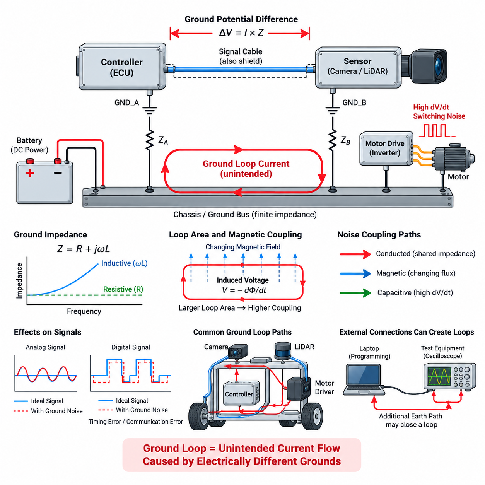
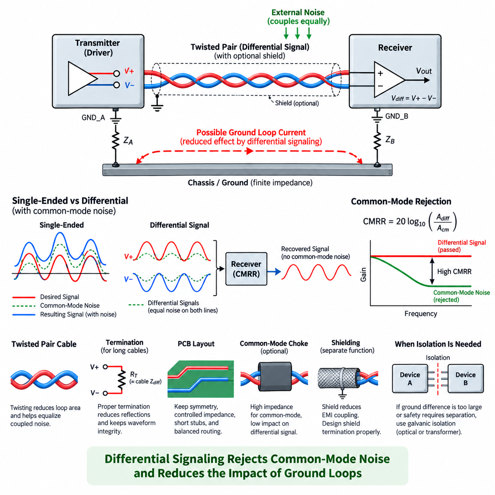
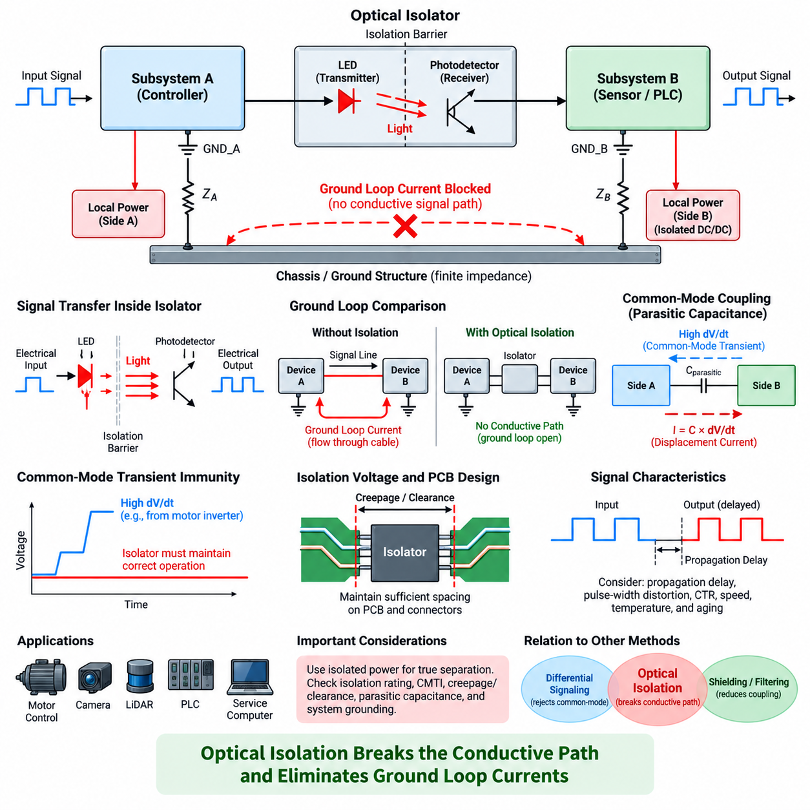
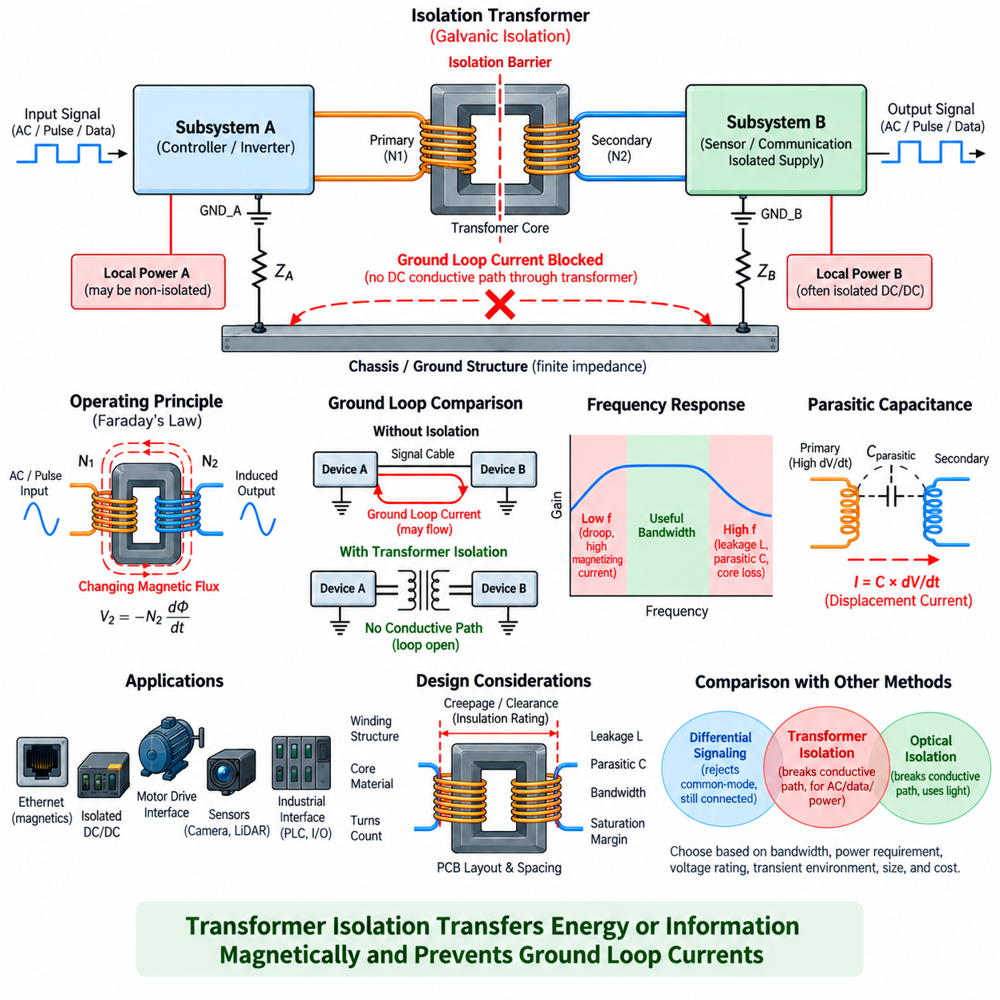
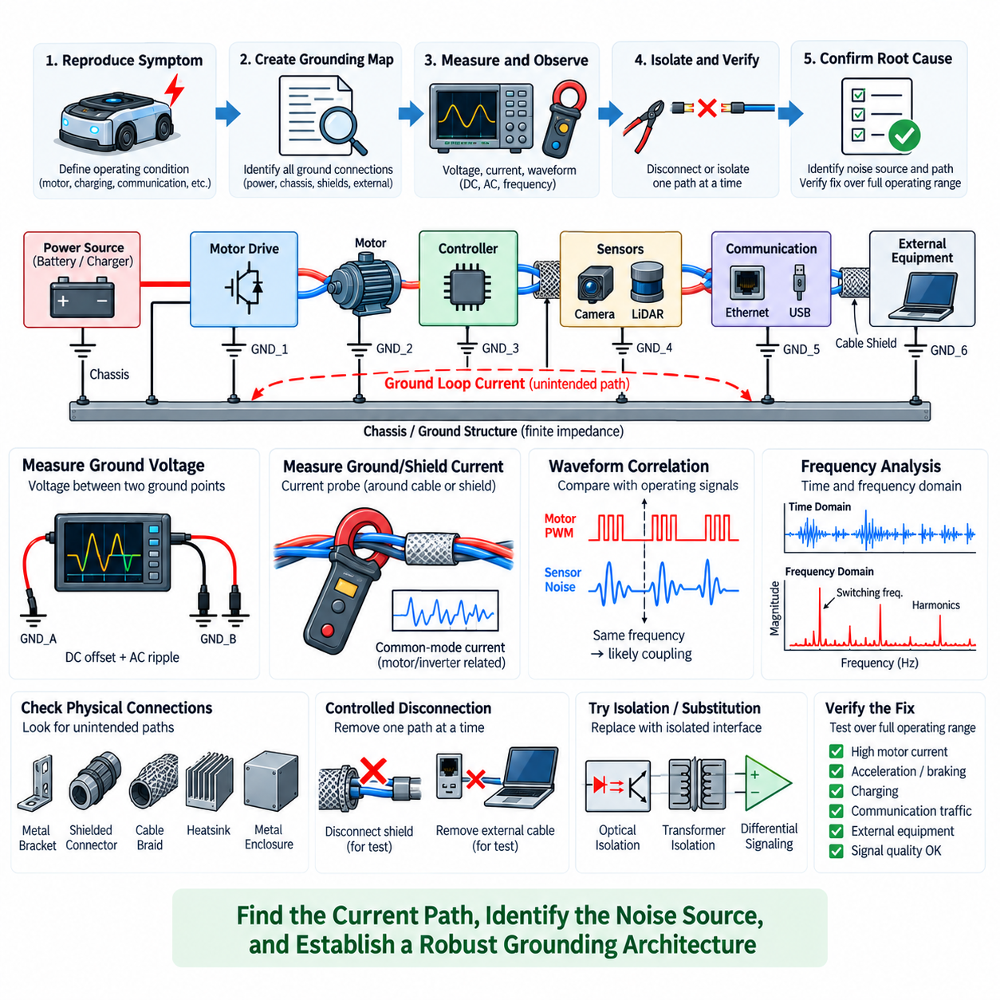

**Volume 05. Grounding and EMC**

# Chapter 02. Ground Loop

## 02.01. Ground Loop Mechanism

{width="7.268055555555556in" height="7.268055555555556in"}

A ground loop occurs when two or more electrical points that are intended to represent the same ground reference are connected through multiple conductive paths. Because every wire, chassis connection, shield, connector, and PCB trace has finite impedance, the ground potentials at these points are never perfectly identical. When a closed conductive path exists between them, even a small voltage difference can drive an unintended circulating current through the loop.

The fundamental mechanism begins with ground impedance. A conductor may appear nearly ideal at DC, but its resistance, inductance, connector contact resistance, and parasitic coupling create measurable impedance in a real system. Current flowing through this impedance produces a voltage according to V = I × Z. Consequently, two modules connected to different locations on a power return or chassis can develop different local ground potentials even though both locations are labeled GND.

When these modules are connected by an additional signal cable, shield, communication interface, or mechanical chassis path, the ground-potential difference can force current through that connection. The resulting current completes a loop through the existing power-return network. This loop current is not part of the intended signal path, yet it can create additional voltage drops that become superimposed on sensor signals, communication references, analog measurements, or control interfaces.

Ground loops become particularly troublesome when high-current loads share portions of the grounding structure with sensitive electronics. Motors, servo drives, heaters, pumps, DC/DC converters, and computing systems may draw rapidly changing currents. Their return currents produce dynamic voltage drops along cables and chassis structures. If a sensor or communication device references one end of this structure while its controller references another, the changing ground voltage can appear directly as electrical noise.

The severity of a ground loop depends not only on resistance but also on frequency. At low frequencies, conductor resistance and slowly varying ground-potential differences may dominate. At higher frequencies, parasitic inductance becomes increasingly important because inductive impedance rises with frequency. A wire that provides an acceptable DC ground can therefore behave as a significant impedance to fast switching currents, transient edges, and high-frequency common-mode noise generated by modern power electronics.

Loop geometry also affects electromagnetic behavior. A conductive loop encloses a physical area, and changing magnetic flux passing through that area can induce a voltage according to electromagnetic induction principles. Large loops formed by widely separated power and signal cables are therefore more susceptible to magnetic-field coupling. Motor phase cables, contactors, transformers, inductors, and high-current bus structures can generate fields that couple energy into nearby ground loops.

Ground-loop interference can enter a system through conducted and induced mechanisms simultaneously. Conducted interference originates from currents flowing through shared ground impedance, while magnetically induced interference results from changing fields intersecting the loop area. Capacitive coupling from high-dV/dt nodes can also inject common-mode current into chassis or cable shields. These mechanisms often coexist, making practical ground-loop problems more complex than a simple DC resistance model suggests.

Cable shields are a frequent source of unintended ground-loop paths. A shield connected to chassis at both ends provides excellent high-frequency shielding in many applications, but it also establishes a conductive connection between the two chassis points. If those points have different low-frequency potentials, current may flow through the shield. The engineer must therefore distinguish the shield\'s electromagnetic function from the signal-reference function rather than assuming that every shield connection behaves as an ideal ground.

Single-ended analog signals are especially vulnerable because the receiver interprets the signal voltage relative to its local ground. If the transmitter ground differs from the receiver ground by a voltage Vg, the receiver can observe the desired signal combined with part or all of Vg. For low-level sensors producing millivolt-scale outputs, even a modest ground offset can become comparable to the useful signal and cause measurement errors, apparent drift, oscillation, or unstable control behavior.

Digital interfaces can also be affected even though their voltage margins are usually larger. Ground-potential differences and high-frequency loop currents can shift signal levels, increase common-mode voltage, distort edges, or cause threshold crossings at incorrect times. Communication errors may then appear intermittently during motor acceleration, regenerative braking, switching-converter operation, charging, or other operating states that change the system\'s current distribution.

In robotic platforms, ground loops can form through surprisingly diverse paths. A sensor may be grounded through its power cable, connected again through an Ethernet or serial interface, bonded mechanically to a conductive frame, and indirectly connected through a shield. An edge computer, motor controller, LiDAR, camera, and battery distribution system can therefore create several overlapping loops even when each individual subsystem appears correctly grounded when examined separately.

Motor-drive systems are particularly important ground-loop sources because PWM switching produces large and rapid voltage transitions. Parasitic capacitances between motor windings, cables, heatsinks, chassis, and frame structures allow common-mode currents to flow through paths that are not obvious on the schematic. These currents can return through protective earth, chassis bonds, cable shields, bearings, communication cables, or sensor grounds, creating interference far from the original inverter.

The physical schematic alone is therefore insufficient for ground-loop analysis. Engineers must identify the actual current paths through wiring harnesses, connectors, PCB grounds, enclosures, mounting brackets, shields, protective conductors, and chassis structures. A connection that appears as a single GND symbol in a circuit diagram may correspond to several meters of wiring and multiple contact interfaces whose impedance changes with frequency, temperature, assembly condition, and mechanical aging.

A useful conceptual distinction is between intended return current and unintended circulating current. Intended current should return to its source through a deliberately controlled low-impedance path. Ground-loop current instead uses parallel paths created by system interconnections. When the two share conductors, the voltage produced by one subsystem\'s current can modulate another subsystem\'s reference. This shared-impedance coupling is one of the most common mechanisms behind apparently mysterious EMC problems.

Ground-loop behavior can also change with operating configuration. Connecting a programming laptop, oscilloscope, charger, external power supply, test equipment, or grounded Ethernet infrastructure may introduce an additional earth connection and close a loop that does not exist during standalone operation. Conversely, disconnecting laboratory equipment may make the symptom disappear. For this reason, grounding diagnosis must consider both the product architecture and every temporary external connection used during testing.

Effective engineering begins by recognizing that ground is not an equipotential abstraction but a distributed impedance network carrying multiple currents over a wide frequency range. Ground-loop prevention therefore requires control of return paths, loop area, bonding impedance, signal-reference strategy, shielding, and subsystem interfaces. Later solutions such as differential signaling, galvanic isolation, transformer coupling, and systematic diagnosis all address this same underlying mechanism: unwanted current flowing because nominally identical grounds are electrically different.

## 02.02. Differential Signal Solution

{width="7.268055555555556in" height="7.268055555555556in"}

Differential signaling is one of the most effective techniques for reducing the influence of ground loops on communication and measurement interfaces. Instead of representing information as a voltage between one signal conductor and a shared ground, a differential interface transmits the signal through two conductors. The receiver determines the information primarily from the voltage difference between these two conductors rather than from either conductor relative to ground.

In an ideal differential system, the transmitter generates complementary or otherwise controlled voltages on the positive and negative signal lines. If the two conductor voltages are represented as V+ and V−, the useful differential voltage is Vdiff = V+ − V−. Because the receiver responds to this difference, a voltage disturbance that appears approximately equally on both conductors can largely cancel when the subtraction is performed.

This cancellation mechanism is particularly valuable when two electronic modules have different local ground potentials. In a single-ended interface, the ground-potential difference can become part of the received signal because the transmitter and receiver use their respective grounds as voltage references. A differential receiver instead observes the voltage difference between the paired signal conductors, substantially reducing direct dependence on the voltage difference between the two local grounds.

Noise that couples approximately equally onto both conductors is called common-mode noise. A differential receiver ideally rejects this component while preserving the differential component containing the desired information. The ability of a receiver to reject common-mode signals is commonly characterized by its common-mode rejection ratio, or CMRR. Higher CMRR generally means better suppression of disturbances that are simultaneously present on both input conductors.

Differential signaling does not mean that ground potential becomes irrelevant. Every differential receiver has an allowable common-mode input-voltage range. If the ground-potential difference between connected devices becomes large enough to force the signal pair outside this range, the receiver can saturate, distort the waveform, generate communication errors, or even experience electrical overstress. Differential signaling therefore tolerates ground offsets within defined limits rather than providing complete galvanic isolation.

Balanced physical construction is essential for obtaining the full benefit of differential signaling. The two conductors should have similar impedance, geometry, parasitic capacitance, and exposure to external electromagnetic fields. When external interference couples similarly into both conductors, it becomes predominantly common-mode noise and can be rejected by the receiver. Significant imbalance converts part of that interference into differential-mode voltage, which cannot be removed by common-mode rejection.

Twisted-pair wiring is widely used because twisting continuously exchanges the physical positions of the two conductors along the cable. An external magnetic or electric field therefore tends to couple comparable disturbances into both wires over successive twists. This reduces the effective loop area and improves field cancellation. The twist rate, pair geometry, cable construction, and routing environment all influence the resulting immunity to electromagnetic interference.

Differential signaling is especially useful in robotic platforms where sensors, motor controllers, edge computers, distributed I/O modules, and communication nodes may be separated by substantial cable lengths. Their local grounds can experience different voltage drops because of battery currents, motor currents, DC/DC converters, chassis bonding, or transient events. A properly designed differential interface allows information to cross these regions without directly using the chassis or power return as the primary signal conductor.

Industrial and robotic communication standards commonly exploit this principle. CAN and CAN FD communicate through the differential relationship between CAN_H and CAN_L, while RS-422 and RS-485 use balanced differential pairs for robust communication over electrically noisy environments. Ethernet physical layers likewise employ differential transmission techniques, allowing high-speed data to operate in systems containing switching converters, motors, processors, and other significant electromagnetic noise sources.

The signal return path must still be considered carefully. Adding a ground conductor between two differential transceivers can help control common-mode voltage, but it may also provide another path for ground-loop current if the two subsystem grounds differ significantly. Whether such a reference conductor is required depends on the interface architecture, transceiver specifications, cable length, expected ground offset, shielding arrangement, and system-level grounding strategy.

Termination is another important part of differential-interface design. When cable lengths become electrically significant relative to signal rise time, the pair behaves as a transmission line rather than as an ideal wire. A termination resistor matched to the differential characteristic impedance reduces reflections and preserves waveform integrity. Incorrect termination can produce ringing, overshoot, threshold uncertainty, and communication errors that may be mistakenly attributed to grounding or electromagnetic interference.

Cable shielding and differential signaling perform related but different functions. Differential signaling rejects disturbances that appear similarly on both conductors, while shielding reduces electromagnetic coupling into or out of the cable. A shield should therefore not be treated automatically as the differential signal return conductor. Its termination strategy must be designed according to frequency, chassis architecture, EMC requirements, connector construction, and the possibility of shield current caused by ground-potential differences.

PCB layout must preserve the electrical symmetry established by the cable. Differential traces should be routed with controlled geometry, appropriate spacing, consistent reference structures, and minimal unnecessary discontinuities. Stubs, asymmetric vias, unmatched filtering components, connector transitions, and unequal parasitic capacitances can introduce imbalance. Such imbalance converts common-mode disturbances into differential noise and reduces the practical noise immunity expected from the differential architecture.

Common-mode chokes and carefully selected filtering components can supplement differential signaling when high-frequency common-mode currents are significant. A common-mode choke presents substantial impedance to currents flowing in the same direction on both conductors while allowing the intended differential current to pass with comparatively little interference. Component selection must account for signal bandwidth, differential impedance, parasitic capacitance, saturation behavior, and the EMC spectrum being controlled.

Differential signaling is particularly beneficial for analog sensors when low-level information must travel between physically separated modules. Instrumentation amplifiers and differential ADC inputs can measure the voltage difference between sensor outputs while rejecting a substantial portion of shared common-mode disturbance. However, sensor grounding, bias-current paths, source impedance matching, cable balance, input protection, and the receiver\'s common-mode range remain essential parts of the complete design.

For digital communication, the same principle improves immunity to motor switching, relay operation, converter transients, and chassis-potential variation. The receiver makes its logical decision from the differential voltage rather than from an individual signal relative to a remote ground. As long as differential amplitude, common-mode range, timing margin, termination, and transceiver limits remain valid, substantial environmental disturbance can be tolerated without corrupting the transferred information.

A differential interface should therefore be understood as a method for reducing sensitivity to ground differences, not as a method for eliminating the electrical connection between grounds. When ground-potential differences are too large, when safety requires separation, or when circulating current must be physically interrupted, galvanic isolation becomes necessary. Optical isolation and transformer isolation provide fundamentally different solutions because they break the direct conductive path rather than merely rejecting common-mode disturbance.

In practical robotics EMC engineering, the strongest approach combines differential transmission with controlled grounding, balanced cabling, appropriate termination, shielding, careful routing, and management of common-mode current. Differential signaling prevents many ground-loop disturbances from becoming useful-signal errors, while the surrounding architecture keeps the interface within its electrical limits. This makes differential communication a primary design tool between simple shared-ground wiring and complete galvanic isolation.

## 02.03. Optical Isolation Solution

{width="7.268055555555556in" height="7.268055555555556in"}

Optical isolation provides a direct method for interrupting the conductive path that allows ground-loop current to circulate between electrical subsystems. Instead of relying only on common-mode rejection, an optical isolator transfers information across an electrical isolation barrier using light. Because no metallic signal conductor crosses the barrier, the transmitting and receiving circuits can maintain independent local ground references.

A conventional optocoupler contains a light-emitting diode on the input side and a photosensitive device on the output side. An electrical input drives the LED, which converts the signal into optical energy. The detector receives this light and reconstructs an electrical output referenced to the receiving-side ground. Signal information therefore crosses the isolation barrier while direct current associated with ground-potential differences cannot follow the same path.

This mechanism fundamentally changes the ground-loop topology. With a conventional conductive interface, a signal cable may provide an additional connection between two subsystem grounds and complete a closed loop through power returns, chassis bonds, or protective earth. Optical isolation removes that conductive signal path. If no other unintended connection remains, the loop becomes electrically open and circulating ground current through the interface is eliminated.

The distinction between differential signaling and optical isolation is important. Differential signaling tolerates a certain amount of ground-potential difference by rejecting common-mode voltage, but the two systems normally remain electrically connected. Optical isolation instead provides galvanic isolation between the two sides. Consequently, it is appropriate when expected ground offsets exceed interface limits or when the design requires physical interruption of unwanted current paths.

An isolation barrier does not mean that absolutely no coupling exists between the two circuits. Practical optocouplers and digital isolators have parasitic capacitance across their isolation barriers. Rapid common-mode voltage transitions can drive displacement current through this capacitance according to I = C × dV/dt. The current may be small, but high-dV/dt switching environments can make this coupling significant for sensitive electronics and high-frequency EMC performance.

Common-mode transient immunity is therefore an important parameter when selecting an isolation device for robotic power electronics. Motor inverters, servo drives, switching converters, and high-voltage battery systems can generate rapid voltage transitions between electrical domains. An isolator must continue transferring valid information while its two sides experience these transients. Insufficient transient immunity can cause false switching, corrupted data, or temporary loss of communication.

The isolation voltage rating must also match the electrical architecture. Isolation components are specified for parameters such as working voltage, transient withstand capability, dielectric strength, and insulation coordination. PCB creepage and clearance distances around the isolator must preserve the intended barrier. A high-rated isolation component cannot provide system-level isolation if copper traces, mounting hardware, contamination, or connector structures bypass the required spacing.

Power distribution requires equal attention because isolating only the signal path may not actually remove the ground loop. If both sides of an optical interface are powered from a common non-isolated supply with a shared return conductor, the conductive connection remains through the power network. True galvanic separation normally requires an isolated power supply, such as an isolated DC/DC converter, for the isolated-side circuitry when complete ground separation is required.

Optocouplers have characteristics that influence signal accuracy and timing. Propagation delay, pulse-width distortion, switching speed, output configuration, temperature dependence, and device aging must be considered. Traditional phototransistor optocouplers can be appropriate for relatively slow control and status signals, while higher-speed optical devices are required for communication or precise timing. The selected technology must match the bandwidth and latency requirements of the interface.

Current transfer ratio is another important characteristic of traditional optocouplers. It describes the relationship between input LED current and output detector current and can vary with temperature, operating current, manufacturing tolerance, and aging. A design should not assume a single nominal value. Input drive current, output pull-up resistance, switching thresholds, and worst-case margins must be chosen so that reliable operation is maintained throughout the intended service life.

Optical isolation is useful for discrete control signals such as enable commands, fault indications, emergency status interfaces, relay commands, and selected digital I/O. It can also be applied to serial communication when suitable isolated transceivers or optical communication devices are used. In each case, isolation prevents the communication conductor itself from becoming a low-frequency path for equalizing ground potentials between separated electrical domains.

Analog signals require a more specialized approach because a basic digital optocoupler does not reproduce arbitrary analog amplitude with high precision. Linear optocouplers, isolated amplifiers, isolated ADC architectures, or conversion of the measurement into a digital representation before crossing the barrier may be used. Accuracy, linearity, bandwidth, offset, temperature drift, and isolation requirements determine which approach is appropriate for a particular sensor interface.

In an AMR or mobile robot, optical isolation can separate noisy motor-control domains from sensitive control and perception electronics. Motor drives may generate large PWM-related common-mode currents, while cameras, LiDARs, navigation processors, and measurement circuits require stable references. Strategic isolation at selected interfaces can prevent motor-domain ground disturbances from propagating through control wiring into computing and sensor ground networks.

Isolation can also be valuable at external interfaces. Service computers, laboratory instruments, charging equipment, industrial machines, PLCs, and externally powered sensors may introduce earth-referenced connections that are not present during normal autonomous operation. An isolated interface prevents these external ground references from automatically becoming part of the robot\'s internal grounding network, reducing configuration-dependent ground-loop problems during operation and testing.

However, inserting isolation everywhere is not necessarily desirable. Each isolation barrier adds components, cost, PCB area, propagation delay, power-supply requirements, and possible reliability concerns. Excessive isolation can also make troubleshooting and reference management more complicated. The engineering objective is therefore to identify electrical domain boundaries where isolation provides a meaningful reduction in circulating current, common-mode stress, or safety risk.

Placement of the isolation barrier should follow actual current-path analysis rather than schematic convenience. The designer should identify where unwanted current enters an interface, where it returns to its source, and which conductive connection closes the loop. The isolator should then be positioned so that the problematic path is physically interrupted while required signal functionality, power delivery, shielding, diagnostics, and safety behavior remain intact.

Shielding must be treated separately from signal isolation. A signal may cross an optical barrier while a cable shield or chassis connection still bridges the two electrical domains. Depending on the EMC architecture, that shield connection may be intentional for high-frequency current control, but it can also preserve part of the original ground-loop path. Isolation design must therefore consider signal conductors, power returns, shields, chassis bonds, and protective earth together.

A robust robotic grounding architecture often combines several techniques rather than relying on optical isolation alone. Differential signaling handles moderate common-mode disturbance efficiently, shielding controls electromagnetic coupling, filtering suppresses unwanted frequency components, and controlled bonding provides predictable return paths. Optical isolation is introduced where a conductive interface would otherwise create unacceptable ground-loop current or where electrical-domain separation is specifically required.

Optical isolation should therefore be understood as a topology-level solution to ground-loop problems. Its primary advantage is not simply improved noise rejection but removal of the direct conductive signal path between different ground domains. When combined with isolated power, appropriate barrier ratings, controlled parasitic coupling, careful PCB spacing, and deliberate shield termination, it provides a powerful method for preventing ground-potential differences from becoming circulating currents and system-level interference.

## 02.04. Transformer Isolation

{width="7.268055555555556in" height="7.268055555555556in"}

Transformer isolation provides galvanic separation between electrical circuits by transferring energy or information through magnetic coupling rather than through a direct conductive connection. Primary and secondary windings are electrically separated while sharing magnetic flux through a transformer core. Because no intentional metallic path connects the windings, low-frequency ground-loop current cannot pass directly from one electrical ground domain to another.

When an alternating voltage is applied to the primary winding, it produces a changing magnetic flux in the transformer core. This flux induces a voltage in the secondary winding according to Faraday\'s law. The secondary circuit reconstructs the transferred waveform relative to its own local ground. The primary and secondary sides can therefore operate at different ground potentials while exchanging AC energy or encoded information across the isolation barrier.

This behavior directly addresses the conductive mechanism responsible for many ground loops. If two grounded subsystems are connected by an ordinary signal conductor, the connection may complete a loop through chassis, power returns, cable shields, or protective earth. Replacing the conductive signal path with transformer coupling opens the DC connection between the signal domains and prevents steady ground-potential differences from driving current through that interface.

Transformer isolation is fundamentally different from differential signaling. A differential receiver rejects common-mode disturbances while the connected systems can remain electrically linked. A transformer instead interrupts the galvanic path itself. It therefore provides strong protection against low-frequency ground offsets and circulating currents, provided that other conductors, shields, power returns, or chassis connections do not create an alternative path around the isolation barrier.

Unlike optical isolation, transformer isolation transfers information through a magnetic field rather than light. This makes transformer coupling especially suitable for AC signals, pulse signals, communication waveforms, and isolated power conversion. It cannot directly transfer a constant DC level because electromagnetic induction requires changing magnetic flux. DC information must therefore be encoded as transitions, pulses, modulation, or another time-varying waveform before crossing the transformer.

Frequency response is a central consideration in transformer-isolated interfaces. At low frequencies, the magnetizing inductance may not provide sufficient impedance, causing waveform droop, distortion, or excessive magnetizing current. At high frequencies, leakage inductance, winding capacitance, core loss, and parasitic effects limit performance. Transformer design must therefore be matched carefully to the signal spectrum, data rate, pulse width, and required bandwidth.

Core saturation must also be prevented. Excessive volt-seconds applied to the primary winding can drive the magnetic core beyond its usable flux range. Once saturation occurs, magnetizing current can rise sharply and waveform transfer becomes distorted. Transformer-coupled circuits consequently require controlled duty cycle, balanced excitation, suitable core material, appropriate turns count, and protection against abnormal DC bias or prolonged asymmetric pulses.

Transformers provide isolation, but practical devices still contain parasitic capacitance between the primary and secondary windings. High-frequency common-mode voltage changes can drive displacement current through this capacitance even though the DC conductive path is open. The magnitude is approximately related to I = C × dV/dt, making interwinding capacitance particularly important near motor inverters, switching converters, and other high-dV/dt power-electronic circuits.

Winding construction strongly affects this common-mode coupling. Physical separation between primary and secondary windings can reduce capacitance but may increase leakage inductance. Interleaved windings can improve magnetic coupling and bandwidth but often increase capacitive coupling across the isolation barrier. Transformer engineering therefore involves a tradeoff among isolation strength, coupling efficiency, leakage inductance, parasitic capacitance, bandwidth, size, and EMC performance.

Communication networks provide familiar examples of transformer isolation. Conventional Ethernet interfaces commonly use magnetics between the PHY and the cable, allowing differential data to cross while providing galvanic separation and common-mode management. The transformer also participates in impedance matching and common-mode behavior. Correct center-tap connections, termination networks, PCB routing, connector construction, and chassis strategy are essential for achieving the intended EMC performance.

Transformer coupling is also widely used in isolated power supplies. An isolated DC/DC converter first converts DC energy into a switching waveform, transfers that energy through a transformer, and then rectifies and regulates it on the secondary side. The resulting secondary supply can float relative to the primary ground. This is particularly useful when an isolated communication or measurement interface also requires independent power on its isolated side.

In robotic systems, transformer isolation can separate communication, control, or power domains exposed to different noise environments. Motor drives and high-current power electronics may produce substantial common-mode disturbances, while edge computers, Ethernet networks, sensors, and control electronics require stable signal references. Proper transformer isolation can prevent low-frequency ground equalization currents from using communication or auxiliary-power wiring as unintended return paths.

The technique is especially valuable where cables leave the robot or connect equipment with uncertain ground references. External industrial networks, service equipment, charging infrastructure, remote controllers, and separately powered subsystems can introduce new chassis or earth connections. Transformer-isolated interfaces reduce the likelihood that these external connections will automatically close a conductive ground loop through the robot\'s internal electronics.

Isolation voltage and insulation construction must be selected according to the expected electrical environment. The winding insulation, bobbin structure, creepage distance, clearance distance, dielectric withstand capability, and working-voltage rating collectively determine the integrity of the isolation barrier. PCB layout must preserve these distances so that conductive contamination, copper geometry, mounting hardware, or connector structures do not bypass the transformer isolation.

Shielding around a transformer requires careful treatment. An electrostatic shield between windings can reduce capacitive coupling when it is connected appropriately, but the shield itself introduces capacitance and requires a controlled return path. Cable shields and chassis bonds outside the transformer can also reconnect electrical domains at high or low frequencies. Transformer isolation must therefore be analyzed together with the complete shielding and grounding architecture.

Signal integrity remains important even when galvanic isolation is achieved. Impedance mismatch, excessive leakage inductance, parasitic capacitance, insufficient magnetizing inductance, poor termination, and PCB discontinuities can distort transferred waveforms. In high-speed communication, the transformer should be considered part of the transmission channel rather than merely an isolation component. Its electrical characteristics must be coordinated with the transmitter, receiver, cable, and termination network.

Transformer isolation and optical isolation consequently occupy related but distinct roles. Optical devices are convenient for discrete logic and many control signals, whereas transformers naturally support AC-coupled communication and isolated power transfer. The appropriate choice depends on bandwidth, latency, power requirements, voltage rating, common-mode transient environment, lifetime expectations, physical size, cost, and the type of information that must cross the isolation boundary.

For ground-loop mitigation, the essential design question is whether the transformer actually interrupts the problematic current path. A transformer-isolated signal may still coexist with a shared power return, chassis bond, shield termination, or external earth connection that preserves another loop. Engineers must trace all conductive paths between domains and determine which currents flow at DC, power frequency, switching frequency, and communication frequencies before declaring the interface isolated.

Transformer isolation should therefore be viewed as both a galvanic-isolation technique and a frequency-dependent EMC component. It blocks direct DC ground-loop current while transferring desired time-varying energy magnetically, but parasitic capacitance still permits some high-frequency common-mode current. When transformer characteristics, insulation, termination, shielding, isolated power, PCB layout, and grounding are coordinated, it provides a robust solution for separating noisy electrical domains in robotic systems.

## 02.05. Ground Loop Diagnosis

{width="7.268055555555556in" height="7.268055555555556in"}

Ground-loop diagnosis begins by treating ground as a distributed electrical network rather than assuming that every point labeled GND has the same potential. The objective is to identify unintended conductive paths, determine where circulating current flows, and establish how that current affects sensitive signals. Effective diagnosis therefore combines schematic review, physical inspection, voltage measurement, current observation, and controlled configuration changes.

The first step is to reproduce the symptom under clearly defined operating conditions. Ground-loop problems are often intermittent because current distribution changes with motor torque, inverter switching, battery charging, regenerative braking, communication activity, or external equipment connections. Recording the operating state associated with each failure helps distinguish grounding-related interference from software faults, sensor defects, or ordinary communication problems.

A system-level grounding map should then be created from the actual hardware rather than from GND symbols alone. The map should include battery returns, power-distribution units, DC/DC converters, motor drives, controllers, sensors, edge computers, cable shields, chassis bonds, protective earth, and external interfaces. Every connection between nominally separate ground regions is important because two individually acceptable connections can combine to form an unintended closed loop.

Physical inspection frequently reveals paths that are absent from the electrical schematic. Conductive mounting brackets, metal enclosures, shielded connectors, cable braid, equipment racks, heatsinks, USB cables, Ethernet shields, programming interfaces, and test instruments may connect ground domains unintentionally. Resistance measurements with power removed can help identify unexpected continuity, although low resistance alone does not describe the complete high-frequency behavior of the connection.

Ground-potential difference is one of the most useful quantities to measure. With the system operating, the voltage between two suspected ground points can be observed using appropriate differential measurement techniques. Both DC offset and AC components are relevant. A slowly varying voltage may indicate shared return resistance, while repetitive high-frequency disturbances can indicate switching currents, inductive impedance, or common-mode coupling from power electronics.

Measurement technique is critical because an oscilloscope can alter the grounding topology being investigated. A conventional earth-referenced oscilloscope probe connects its ground clip to protective earth and may unintentionally create a new current path. This can change the symptom, damage equipment, or create a safety hazard. Differential probes, isolated measurement instruments, or appropriately isolated acquisition systems are preferred when measuring voltage between separated ground domains.

Waveform correlation can provide strong evidence of the noise source. If disturbances on a sensor signal occur at the PWM switching frequency of a motor drive, during contactor transitions, or synchronously with DC/DC converter operation, the relationship indicates a likely coupling mechanism. Time-domain measurements can reveal transient events, while frequency-domain analysis can identify spectral components corresponding to switching fundamentals, harmonics, communication clocks, or mechanical operating states.

Current measurement can confirm whether an unintended loop actually carries significant current. A current probe placed around a cable, shield, ground strap, or grouped conductors can reveal low-frequency circulating current and high-frequency common-mode current without opening the circuit. When current appears on a signal-cable shield or communication cable and changes with motor or converter operation, it provides valuable evidence that the interface is participating in the return-current network.

Common-mode current measurement is particularly useful in EMC diagnosis. If all conductors belonging to a cable are passed through a current probe together, the intended differential currents largely cancel magnetically. The remaining measured current represents current leaving the cable through some other path and returning elsewhere. This technique can expose common-mode currents associated with chassis coupling, parasitic capacitance, shields, and switching power electronics.

Controlled disconnection is another powerful diagnostic method. Suspected secondary ground paths can be removed temporarily, one at a time, while observing whether the symptom changes. Disconnecting a shield at an appropriate test point, removing an external communication cable, separating test equipment, or substituting an isolated interface can reveal which connection closes the loop. Such tests must respect electrical safety, protective-earth requirements, and equipment limitations.

A useful diagnostic principle is to change only one path at a time. If several grounds, shields, filters, and cables are modified simultaneously, improvement may occur without revealing which change solved the problem. A controlled test matrix makes the diagnosis repeatable. Each configuration should record the connection state, operating condition, measured ground voltage, observed current, signal quality, communication error rate, and resulting system behavior.

External equipment deserves special attention because it frequently creates temporary ground loops. A robot that operates correctly from its battery may exhibit noise when connected to a programming laptop, charger, oscilloscope, Ethernet switch, PLC, or laboratory power supply. The external device may introduce protective earth or another grounded network path. Comparing standalone and externally connected configurations can quickly identify this class of configuration-dependent problem.

Signal symptoms can help locate the affected path. Analog ground-loop interference may appear as offset, ripple, drift, periodic modulation, or unstable measurements. Digital interfaces may show corrupted frames, increased error counters, unexpected resets, or failures synchronized with high-current events. Comparing multiple signals referenced to different ground domains can reveal whether the disturbance originates locally or propagates through a shared grounding structure.

Cable routing should be examined together with electrical continuity. A ground loop with a large physical area is more susceptible to magnetic coupling from motor phase cables, contactors, transformers, and high-current conductors. Re-routing a signal pair temporarily, reducing loop area, increasing separation from noisy cables, or using a tightly twisted differential pair can help distinguish magnetic induction from interference caused primarily by shared conductive impedance.

Frequency dependence provides another important clue. A connection that appears satisfactory when measured with a multimeter may exhibit substantial impedance at switching frequencies because of wire and bond inductance. Conversely, a chassis connection that carries little DC current may provide a dominant high-frequency return path through parasitic capacitance. Diagnosis must therefore consider resistance, inductance, capacitance, and physical geometry rather than relying on DC continuity measurements alone.

Substitution tests can separate interface sensitivity from noise generation. A single-ended connection can temporarily be replaced with a differential interface, or a conductive interface can be replaced with optical or transformer isolation. If the problem disappears after galvanic isolation, the result strongly indicates that a conductive ground path was important. If interference remains, radiated coupling, capacitive coupling, power-supply noise, or another return path should be investigated.

The diagnosis should ultimately identify both the noise source and the complete coupling path. Simply finding a noisy motor drive is insufficient because the same drive may operate correctly in a different grounding architecture. The engineer should determine how noise is generated, which impedance converts current into unwanted voltage, how the disturbance reaches the victim circuit, and through which path the current returns to its source.

Corrective action should be verified across the full operating envelope rather than only at the condition where the fault was discovered. Tests should include high motor current, acceleration and braking, converter load changes, charging, communication traffic, sensor operation, and relevant external connections. Measurements should confirm reduced ground-potential differences or unwanted currents while ensuring that signal integrity, shielding, safety bonding, and protective functions remain valid.

Ground-loop diagnosis is therefore a process of reconstructing real current flow from observable electrical evidence. Ground maps, differential voltage measurements, current probes, waveform correlation, controlled disconnection, routing experiments, and isolation tests progressively narrow the possible mechanisms. The final objective is not merely to make the symptom disappear, but to establish a predictable grounding architecture in which intended return currents and unwanted common-mode or circulating currents can be clearly distinguished.
