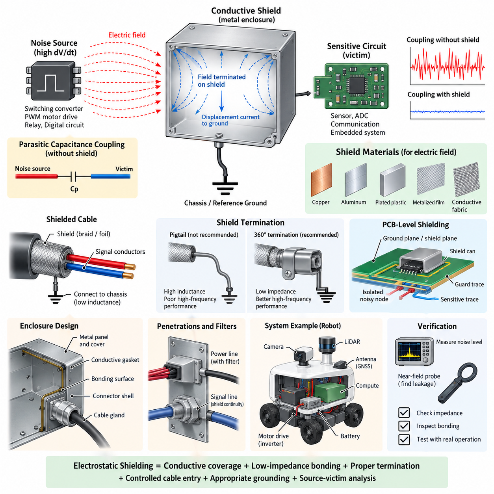
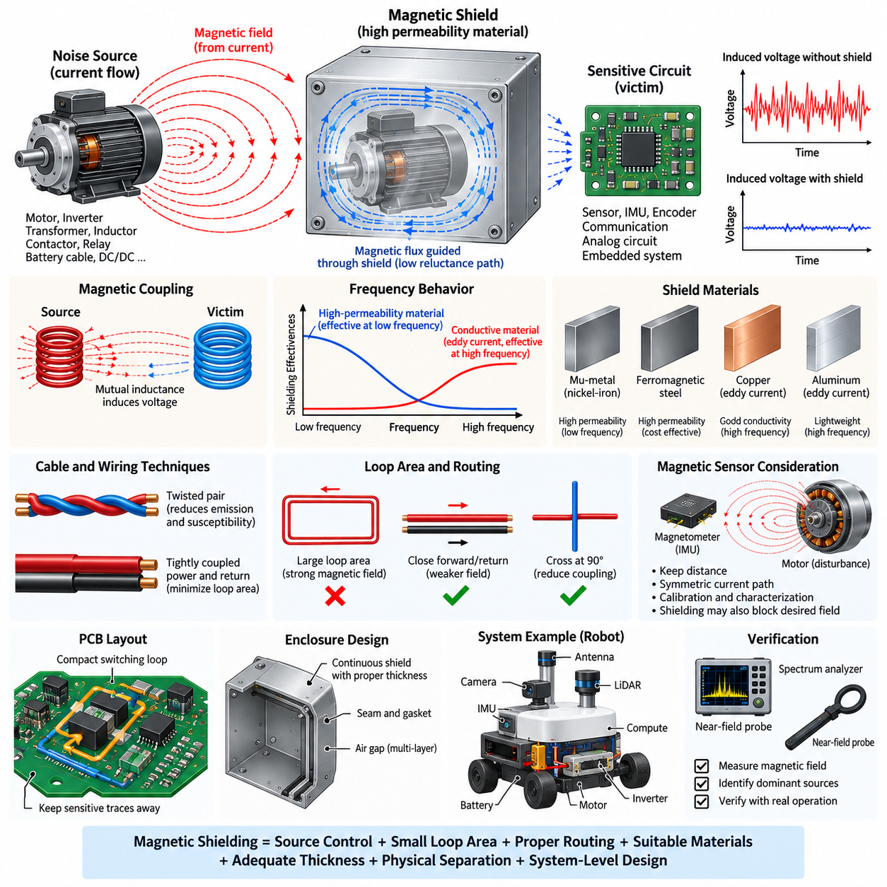
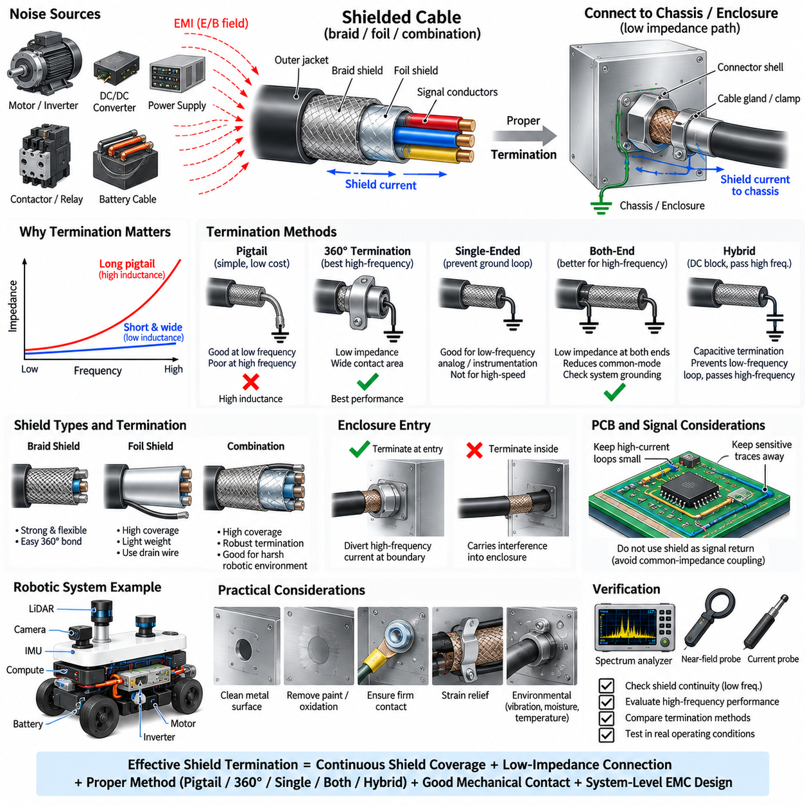
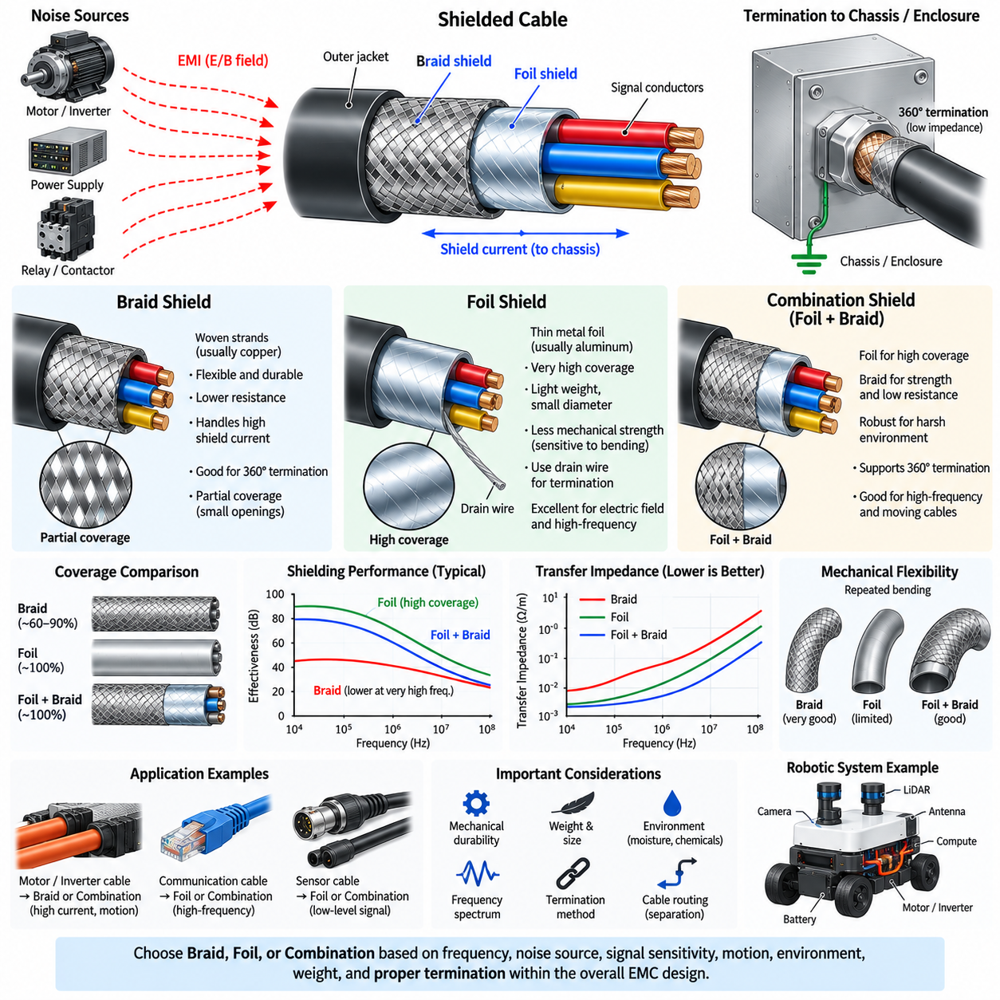
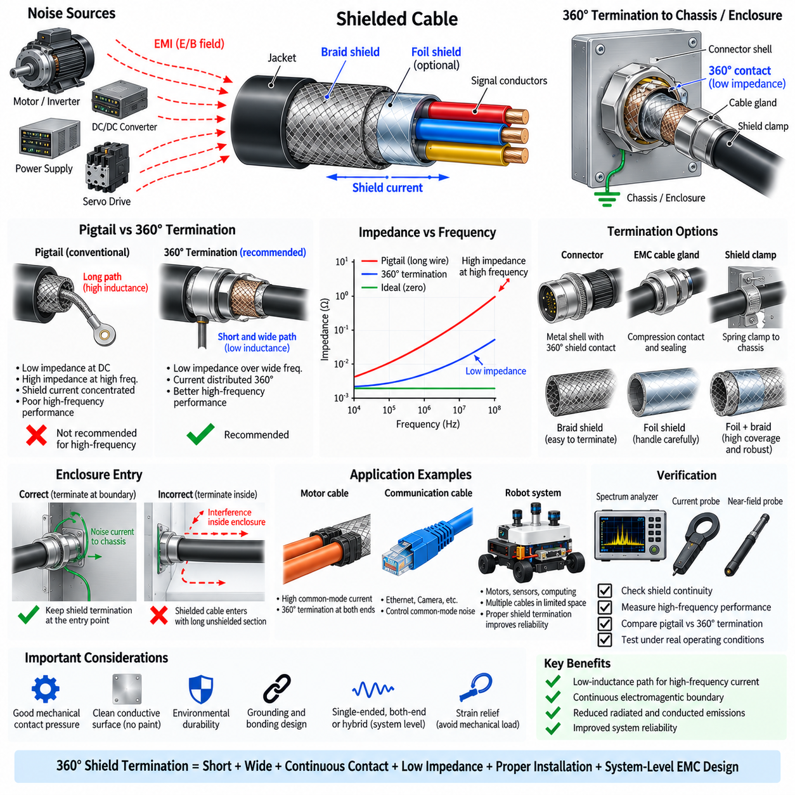

**Volume 05. Grounding and EMC**

# Chapter 03. Shielding Design

## 03.01. Electrostatic Shield

{width="7.268055555555556in" height="7.268055555555556in"}

An electrostatic shield is a conductive barrier placed between an electric-field noise source and a sensitive circuit to reduce capacitive coupling. When a time-varying voltage exists on a conductor, an electric field develops around it and can couple displacement current into nearby wiring, PCB traces, sensors, or electronic modules through parasitic capacitance. The shield intercepts this field before it reaches the protected circuit and provides a controlled path for the coupled current.

The operating principle can be understood through parasitic capacitance. Without shielding, a noise source and a victim conductor form an unintended coupling capacitance, allowing current approximately proportional to capacitance and the rate of voltage change to flow into the victim. Because switching converters, PWM motor drives, relays, and digital circuits can generate large dV/dt, even very small parasitic capacitances may inject significant high-frequency noise into high-impedance circuits.

A conductive shield changes the coupling structure by inserting a low-impedance conductive surface between the source and victim. Instead of the electric field terminating primarily on the sensitive conductor, most field lines terminate on the shield. The resulting displacement current is then directed through the shield connection toward chassis, reference ground, or another designated return structure. Effective shielding therefore depends not only on conductive material but also on how the shield is electrically terminated.

Shield materials are generally selected for electrical conductivity, mechanical requirements, weight, corrosion resistance, manufacturability, and environmental durability. Copper and aluminum provide excellent electric-field shielding because of their high conductivity, while conductive coatings, plated plastics, metalized films, and conductive fabrics may be used where a complete metallic enclosure is impractical. For electrostatic shielding, high magnetic permeability is normally unnecessary because the primary objective is controlling electric rather than magnetic fields.

The effectiveness of an electrostatic shield is strongly influenced by continuity. Gaps, seams, connector openings, ventilation holes, poorly bonded panels, and long grounding leads can create local regions where electric fields penetrate the enclosure or where shield current develops excessive voltage. A mechanically complete enclosure may therefore perform poorly at high frequency if its electrical joints have significant impedance. Bonding surfaces and interfaces must be treated as functional parts of the EMC design.

The shield connection must provide a suitable return path for the intercepted noise current. At low frequencies, a single-point connection may sometimes prevent unwanted low-frequency circulating currents, but the inductance of a long grounding wire becomes increasingly important as frequency rises. At high frequencies, short and wide connections, chassis bonding, conductive mounting surfaces, and low-inductance termination become preferable because shield performance depends on impedance rather than DC resistance alone.

Cable shielding applies the same electrostatic principle to distributed wiring. A conductive foil or braid surrounding signal conductors intercepts electric-field coupling from nearby power cables, motor phases, switching nodes, and other noise sources. The shield should normally remain physically separated from the signal return function unless the interface is intentionally designed otherwise. Treating the shield as an ordinary current-carrying signal conductor can introduce common impedance coupling and compromise noise performance.

Shield termination strategy depends on signal frequency, system grounding architecture, cable length, and susceptibility requirements. A pigtail connection may appear electrically adequate during continuity testing but introduces inductance that can severely degrade high-frequency performance. Circumferential termination provides a much lower-impedance path because current can flow around the connector perimeter instead of through a narrow wire. This becomes increasingly important for fast digital interfaces and motor-related EMC environments.

Electrostatic shielding is especially important around high-impedance analog circuits. Sensor inputs, ADC front ends, capacitive measurement circuits, high-value resistor networks, and low-level instrumentation can respond strongly to small coupled currents. Guard structures, conductive enclosures, grounded PCB regions, and shielded cables can reduce this susceptibility. The shield reference must nevertheless be chosen carefully so that shielding does not unintentionally create another noise path through the measurement system.

PCB-level electrostatic shielding can be implemented with ground planes, copper pours, guard traces, shield cans, and controlled layer structures. A grounded conductive region placed between a noisy switching node and a sensitive trace can reduce capacitive coupling, but the geometry must be considered carefully. A shield plane connected through a long or inductive path may develop high-frequency voltage and become a secondary radiator. Multiple low-inductance connections can therefore be valuable in high-frequency structures.

In robotic electrical systems, important electrostatic noise sources include DC/DC converters, inverter switching nodes, PWM motor drivers, battery switching devices, high-current contactors, display electronics, and high-speed digital interfaces. Sensitive victims may include IMUs, cameras, LiDAR interfaces, GNSS receivers, analog sensors, Ethernet electronics, and embedded computing systems. Physical separation remains useful, but shielding provides another coupling-control layer when packaging constraints force noisy and sensitive subsystems into close proximity.

An enclosure used as an electrostatic shield should be treated as part of the electrical architecture rather than merely as mechanical packaging. Metal chassis panels, covers, cable glands, connector shells, mounting brackets, and conductive gaskets can collectively form a shielding boundary. Their interfaces should maintain sufficiently low impedance across the frequency range of concern. Paint, anodization, oxidation, contamination, and loose fasteners can increase contact impedance and reduce the effectiveness of otherwise conductive structures.

Penetrations through a shield require particular attention because every cable or conductor crossing the boundary can carry noise through it. Power lines may require feedthrough filtering, signal interfaces may require appropriate common-mode suppression, and shielded connectors should preserve shield continuity across the enclosure boundary. The transition between cable shield and chassis should be designed so that high-frequency current is diverted at the boundary instead of traveling deeper into the protected electronic region.

Electrostatic shielding should not be confused with magnetic shielding. Conductive materials are highly effective against electric-field coupling when properly referenced, but low-frequency magnetic fields produced by large currents can penetrate ordinary conductive shields relatively easily. Those problems are usually addressed through loop-area reduction, source-victim separation, twisted conductors, current-return control, or magnetic materials where appropriate. EMC design must therefore identify the dominant coupling mechanism before selecting a shielding method.

Verification should combine electrical inspection with system-level EMC testing. Engineers can measure shield-to-chassis impedance, inspect bonding points, compare noise levels with and without shielding, and use near-field probes to locate leakage around seams or cable penetrations. Testing under realistic motor operation, converter loading, communication activity, and sensor acquisition is important because the dominant interference paths may only appear when several robot subsystems operate simultaneously.

A robust electrostatic shielding design ultimately combines conductive coverage, low-impedance bonding, controlled cable entry, appropriate grounding, physical separation, and careful source-victim analysis. Shielding cannot compensate for every poor grounding or layout decision, but it can greatly reduce capacitive coupling when integrated with the overall grounding and EMC architecture. In robots, AMRs, manipulators, and other Physical AI platforms, this coordinated approach helps maintain reliable sensing, communication, computation, and control in electrically noisy environments.

## 03.02. Magnetic Shield

{width="7.268055555555556in" height="7.268055555555556in"}

Magnetic shielding is the practice of reducing unwanted magnetic-field coupling between an interference source and a sensitive electrical or electronic system. Unlike electrostatic shielding, which primarily intercepts electric fields with conductive surfaces, magnetic shielding must control magnetic flux generated by current flow. Its effectiveness depends strongly on field frequency, source geometry, material permeability, conductivity, shield thickness, and the physical distance between source and victim.

Magnetic fields are produced whenever electrical current flows through conductors. In robotic systems, significant sources include motors, inverter phase conductors, transformers, inductors, contactors, relays, high-current battery cables, DC/DC converters, and power distribution paths. These fields can couple into nearby wiring loops, sensor circuits, PCB traces, or electronic modules and induce unwanted voltage according to the rate of change of magnetic flux passing through the victim loop.

Magnetic coupling is fundamentally related to mutual inductance between the source and victim circuits. A changing source current creates a changing magnetic field, and a portion of its flux may intersect a nearby circuit loop. The resulting induced voltage increases with mutual inductance and the rate of current change. Consequently, fast-switching motor drives and converters can produce magnetic interference even when the nominal operating current or voltage appears acceptable from a conventional DC electrical perspective.

Low-frequency magnetic fields are particularly difficult to shield because ordinary conductive enclosures do not necessarily provide sufficient attenuation. At frequencies near DC and the power-frequency range, shielding generally relies on high-permeability materials that provide a preferred low-reluctance path for magnetic flux. Instead of simply blocking the field, the shield redirects flux around the protected region, reducing the magnetic flux density that penetrates sensitive components located inside or behind the shielding structure.

Materials used for low-frequency magnetic shielding may include high-permeability nickel-iron alloys, specialized magnetic alloys, and appropriately selected ferromagnetic steels. Material selection must consider permeability, saturation flux density, mechanical properties, thickness, manufacturing processes, temperature, and cost. A material with extremely high permeability may perform well for weak fields but can lose effectiveness if the magnetic flux density becomes large enough to drive the material toward magnetic saturation.

Magnetic saturation is therefore a major design consideration. When a shield is placed very close to a powerful motor, bus bar, transformer, or high-current cable, magnetic flux can concentrate within the shielding material. If the local flux density approaches the material\'s saturation region, its effective permeability decreases and additional magnetic flux penetrates the protected area. Increasing thickness, increasing distance, using multiple layers, or selecting a material with higher saturation capability can improve performance.

At higher frequencies, conductive shielding becomes increasingly effective because changing magnetic fields induce circulating eddy currents within the conductive material. These currents generate opposing magnetic fields according to electromagnetic induction, reducing penetration into the protected region. Copper and aluminum can therefore provide useful high-frequency magnetic shielding even though they do not have high magnetic permeability. Shield behavior consequently changes substantially with frequency, making broadband EMC design more complex than simple material selection.

Skin depth is an important parameter in high-frequency magnetic shielding. As frequency increases, induced current becomes concentrated near the surface of a conductor, and electromagnetic fields penetrate progressively less deeply into the material. Skin depth depends on frequency, conductivity, and magnetic permeability. Shield thickness relative to skin depth therefore affects absorption loss, although practical shielding performance is also influenced by seams, apertures, bonding impedance, geometry, and the distance from the interference source.

Physical separation is one of the most effective magnetic-field countermeasures available in robotic electrical architecture. Magnetic field strength generally decreases significantly as distance from a localized source increases, although the exact relationship depends on source geometry. Increasing the spacing between motor phase conductors and sensitive sensor cables, relocating inductors away from IMUs, or separating power distribution assemblies from low-level analog electronics can provide substantial improvement without adding shielding mass.

Loop-area reduction is equally important because induced interference depends on the magnetic flux passing through a circuit loop. Power supply and return conductors should therefore be routed close together so that their opposing magnetic fields partially cancel. Signal and return conductors should also remain closely coupled. Large current loops created by widely separated battery positive and negative cables can generate strong magnetic fields and should be avoided wherever packaging and safety requirements permit.

Twisted-pair wiring provides a practical method for reducing both magnetic emission and susceptibility. Each twist repeatedly reverses the orientation of the conductor loop, causing magnetic coupling over successive sections to partially cancel. Differential communication networks such as CAN, CAN FD, RS-485, and Ethernet benefit from controlled conductor geometry for this reason. Twisting is also useful for low-level differential sensor signals operating near motors, converters, relays, and other electromagnetic noise sources.

Cable routing must therefore be considered before adding dedicated magnetic shielding. High-current motor cables, inverter outputs, battery conductors, and switching power paths should be separated from sensor cables and communication harnesses whenever possible. Parallel routing over long distances increases coupling opportunity, while crossing noisy and sensitive cables approximately perpendicular to each other can reduce the effective coupling region. Harness architecture is consequently an important part of magnetic EMC control.

PCB layout follows similar principles. High-current switching loops around MOSFETs, capacitors, inductors, and power devices should be made as compact as possible. The forward and return paths should be closely coupled, while sensitive analog traces and magnetic sensors should be located away from these loops. Ground and power planes can help control current-return geometry, but ordinary copper planes should not automatically be assumed to provide effective shielding against strong low-frequency magnetic fields.

Magnetic sensors require particular attention because their intended function is to detect magnetic fields. Magnetometers used with IMUs can be disturbed by motors, speakers, relays, steel structures, permanent magnets, and high-current conductors. Shielding such sensors may also attenuate the environmental magnetic field they are intended to measure. For this reason, physical placement, source separation, current-path symmetry, calibration, and interference characterization are often preferable to enclosing the sensor in a magnetic shield.

Robotic platforms create challenging magnetic environments because propulsion motors, steering actuators, manipulators, servo drives, battery systems, computing electronics, and precision sensors operate within a compact structure. An AMR may carry hundreds of amperes through traction circuits while simultaneously relying on IMUs, encoders, GNSS receivers, cameras, LiDAR, and communication networks. Magnetic EMC design must therefore be coordinated with mechanical packaging, harness routing, grounding, power distribution, and sensor placement.

Enclosure design for magnetic shielding must consider more than material type. Shield geometry, thickness, openings, joints, corners, and mechanical deformation can affect the magnetic flux path. Continuous structures generally provide more predictable performance than fragmented pieces, while sharp geometric transitions can locally concentrate flux. Multiple shielding layers separated by air gaps can sometimes provide better attenuation than a single layer because each layer progressively redirects or attenuates the remaining field.

Manufacturing processes can also influence high-permeability magnetic materials. Forming, bending, welding, machining, and mechanical stress may alter magnetic properties, particularly in specialized high-permeability alloys. The final component can therefore exhibit different shielding performance from the raw material specification. Where demanding attenuation is required, manufacturing sequence, heat treatment, mounting stress, and assembly procedures should be included in the engineering validation rather than treating permeability as a fixed catalog value.

Magnetic shielding should be designed together with source suppression. Reducing current-loop area, controlling switching slew rates where appropriate, placing DC-link capacitors close to switching devices, optimizing bus-bar geometry, and maintaining tightly coupled forward and return currents can reduce magnetic emission before it reaches the shield. This source-control approach is often more efficient than attempting to contain a strong field after poor electrical geometry has already created it.

Verification requires measurements under realistic operating conditions. Magnetic near-field probes, current probes, oscilloscopes, spectrum analyzers, and magnetic-field sensors can identify dominant sources and frequencies. Measurements should be repeated during motor acceleration, regenerative braking, high converter load, steering operation, manipulator motion, charging, and communication activity. Comparing field strength and victim response before and after countermeasures helps distinguish actual improvements from theoretical expectations.

A robust magnetic shielding strategy therefore combines source-current control, minimum loop area, tightly coupled forward and return paths, physical separation, optimized cable routing, suitable shield materials, appropriate thickness, and frequency-aware design. High-permeability materials are important for low-frequency flux redirection, while conductive materials and eddy-current effects become increasingly useful at higher frequencies. Effective EMC engineering selects the combination appropriate to the actual interference spectrum and geometry.

In robots, AMRs, manipulators, UAVs, and other Physical AI platforms, magnetic shielding should ultimately be viewed as one element of system-level electromagnetic compatibility rather than an isolated enclosure treatment. Coordinating power architecture, PCB layout, harness design, sensor placement, grounding, shielding, and validation minimizes interference at its source and along its coupling path, allowing perception, communication, computation, and control systems to operate reliably within compact high-power electrical environments.

## 03.03. Shield Cable Termination

{width="7.268055555555556in" height="7.268055555555556in"}

Shield cable termination is the method used to electrically connect a cable shield to chassis, enclosure, connector shell, or another designated reference so that electromagnetic interference current is diverted away from the protected signal conductors. A shielded cable alone does not guarantee effective EMC performance. The termination determines whether intercepted noise current follows a controlled low-impedance path or develops voltage that couples back into the signal circuit.

A cable shield normally consists of conductive braid, foil, or a combination surrounding one or more internal conductors. External electric and electromagnetic fields induce current on this conductive layer, while fields generated by the internal conductors may also produce shield current. For the shield to perform effectively, these currents must reach an appropriate reference without passing through sensitive electronics or creating excessive impedance along the termination path.

Shield termination must therefore be evaluated in terms of impedance rather than DC resistance alone. A short piece of wire may measure nearly zero resistance with a multimeter but exhibit substantial inductive impedance at high frequency. As frequency increases, even several centimeters of narrow wire can significantly degrade shield performance. This is why termination geometry, conductor width, length, contact area, and connection to the chassis are fundamental EMC design parameters.

The traditional pigtail termination connects the cable shield to ground or chassis through a short wire. It is inexpensive, easy to manufacture, and often adequate for low-frequency applications. However, the pigtail behaves as an inductive element at higher frequencies. Noise current flowing through this inductance generates voltage between the shield and chassis, reducing shielding effectiveness and potentially allowing common-mode current to couple into nearby circuits.

A 360-degree shield termination provides substantially better high-frequency performance. Instead of collecting shield current into a narrow pigtail, the conductive shield is connected around its circumference to a connector shell, cable gland, clamp, or enclosure surface. The larger contact area and shorter current path reduce termination inductance. High-frequency shield current can therefore transfer directly to the chassis without being forced through a long, narrow conductor.

Connector design is an important part of this termination concept. A shielded connector should maintain electrical continuity between the cable shield and conductive connector shell with minimum impedance. The mating connector should then transfer this current to the equipment enclosure or chassis. When implemented correctly, the connector becomes part of the shielding boundary rather than simply serving as a mechanical interface for signal contacts.

The point at which the cable enters an enclosure is particularly important. Ideally, high-frequency common-mode current traveling on the cable shield should be diverted to the enclosure at the entry boundary. Allowing a shielded cable to enter deeply into an enclosure before terminating its shield can carry interference into the protected region. A short, direct shield-to-chassis connection at the boundary minimizes the internal path over which noise can radiate or capacitively couple.

Single-ended shield termination is sometimes used for low-frequency analog and instrumentation circuits. Connecting the shield at only one end can prevent low-frequency circulating current caused by ground potential differences between two pieces of equipment. This technique can be useful where ground-loop effects dominate. However, an unterminated shield end behaves differently at high frequency, so single-ended termination should not automatically be applied to broadband or high-speed interfaces.

Both-end termination is generally more effective for high-frequency electromagnetic interference because it provides low-impedance connections at both ends of the cable. This approach can reduce common-mode voltage and improve the cable\'s behavior as part of an overall shielding structure. The disadvantage is that low-frequency current may flow through the shield if chassis potentials differ. System grounding and bonding architecture must therefore be considered together with termination strategy.

Hybrid termination can be used when both low-frequency ground-loop control and high-frequency shielding are required. One end may be directly bonded while the other uses capacitive coupling or another frequency-selective connection. At low frequency, the connection remains effectively open and limits circulating current, while at high frequency the capacitor provides a low-impedance path for interference current. Component voltage rating, parasitic inductance, safety requirements, and expected transient conditions must be considered.

Cable braid and foil shields behave differently during termination. A braid offers mechanical strength, flexibility, and a convenient structure for circumferential bonding, while foil provides high coverage with low weight and is often effective against electric-field and high-frequency interference. Foil shields frequently include a drain wire for practical connection, but relying only on a long drain-wire termination can introduce inductance and reduce high-frequency performance.

Combination shields can use foil to provide high coverage and braid to improve mechanical robustness and low-impedance termination. Such construction is useful in electrically noisy robotic environments where cables are exposed to continuous motion, vibration, motor switching, and high-speed communication. Shield performance must nevertheless be evaluated as a complete assembly because cable construction, connector design, termination method, enclosure bonding, and routing all interact.

The shield should not normally be treated as an ordinary signal return conductor unless the interface architecture explicitly requires it. Signal return current flowing through the same impedance used by shield current can produce common-impedance coupling. Sensitive circuits may then experience noise even though the cable appears fully shielded. Separating signal reference functions from chassis and shield-current paths is therefore an important consideration in robust EMC architecture.

Termination quality also depends on surface preparation and mechanical contact. Paint, anodized coatings, oxidation, contamination, adhesives, and corrosion can increase impedance between connector shells, clamps, brackets, and chassis panels. A mechanically secure joint is not necessarily a good high-frequency electrical bond. Conductive surfaces, appropriate plating, controlled contact pressure, suitable hardware, and corrosion protection should be considered throughout the expected service life.

Shield discontinuities can create localized EMC weaknesses. A cable may provide excellent shielding over several meters but lose much of its effectiveness at a poorly terminated connector or short unshielded section. Long exposed conductors between the end of the shield and connector contacts increase the region available for radiation and coupling. Maintaining shield coverage as close as practical to the connector interface helps preserve the shielding boundary.

Robotic systems make termination design particularly important because power and communication cables often share compact routing spaces. Motor phase cables, battery wiring, DC/DC converters, servo drives, Ethernet links, cameras, LiDAR, encoders, and sensor harnesses may operate close together. Proper termination prevents high-frequency currents generated by power electronics from propagating through the robot structure and coupling into perception or communication electronics.

Motor cables are a demanding example because PWM inverters generate fast common-mode voltage transitions. Shield current can flow from the motor cable toward the inverter and chassis through parasitic capacitances. A circumferential shield connection at the inverter enclosure and motor housing provides a low-impedance return path for these high-frequency currents. Long pigtails at either end can significantly increase common-mode voltage and radiated emission.

High-speed communication interfaces also benefit from controlled shield termination. Ethernet and other differential networks primarily rely on balanced signaling, but cable shields and connector shells can help control common-mode interference in severe EMC environments. Termination must preserve the intended impedance and isolation architecture of the interface. Poorly designed shield connections can convert common-mode disturbances into differential noise or introduce unintended chassis-current paths.

Mechanical reliability must be considered together with electrical performance. Mobile robots and manipulators experience vibration, shock, repetitive cable flexing, connector mating cycles, temperature variation, moisture, and contamination. A termination that performs well during laboratory testing may degrade after prolonged operation if clamp pressure decreases or conductive surfaces corrode. Strain relief should prevent cable movement from mechanically loading the shield bond or connector termination.

Verification should include both low-frequency continuity checks and high-frequency EMC evaluation. Resistance measurements can detect open shields or gross bonding problems, but they cannot fully characterize termination impedance. Current probes, near-field probes, spectrum analyzers, network measurements, and system-level emission or immunity tests can reveal high-frequency weaknesses. Comparing pigtail and circumferential configurations can demonstrate how strongly termination geometry influences actual EMC performance.

A robust shield cable termination strategy combines continuous shield coverage, short current paths, large contact area, low-inductance chassis bonding, appropriate connector construction, and a termination scheme matched to the operating frequency. Single-ended, both-end, hybrid, pigtail, and 360-degree methods should not be selected by habit. Their suitability depends on signal characteristics, ground architecture, common-mode current, environmental conditions, and EMC requirements.

In robots, AMRs, manipulators, UAVs, and other Physical AI platforms, cable shield termination should be treated as part of the complete grounding and EMC architecture. Effective termination connects cable shielding, conductive enclosures, chassis bonding, connector shells, filtering, and cable routing into a continuous interference-control structure. When these elements are coordinated, unwanted shield current is directed away from sensitive electronics, improving the reliability of sensing, communication, computation, and control.

## 03.04. Braid vs Foil Shield

{width="7.268055555555556in" height="7.268055555555556in"}

Braid and foil shields are two widely used conductive structures for controlling electromagnetic interference in shielded cables. Both surround the internal conductors and reduce coupling between the cable and its electromagnetic environment, but they differ significantly in construction, coverage, impedance, flexibility, mechanical durability, frequency behavior, and termination method. Selecting between them requires consideration of the actual EMC environment and cable application.

A braid shield is formed from many fine conductive strands woven around the cable core. Copper is commonly used because of its high conductivity, while tinned copper may provide improved corrosion resistance and manufacturing durability. The woven structure produces a mechanically flexible cylindrical shield that can tolerate bending and movement while maintaining electrical continuity, making braid particularly useful in industrial machinery, mobile robots, manipulators, and moving cable assemblies.

Because braid consists of interwoven strands, it does not normally provide complete geometric coverage. Small openings remain between the conductors, and the percentage of cable surface covered depends on braid angle, strand diameter, number of carriers, and manufacturing density. Typical high-quality braid can provide substantial coverage, but electromagnetic fields can still interact through the openings, particularly as wavelength and coupling conditions become unfavorable at higher frequencies.

One important advantage of braid is its relatively low longitudinal resistance and robust current-carrying capability. High-frequency common-mode current intercepted by the shield can be distributed across many conductive strands and transferred toward the termination. This characteristic makes braid suitable where substantial shield current may occur, such as motor-drive cables, inverter connections, industrial servo systems, and electrically noisy robotic power architectures.

Braid also supports effective 360-degree termination. The woven shield can be exposed around the circumference of the cable and bonded directly to a conductive connector shell, EMC gland, or shield clamp. This produces a short, wide, low-inductance current path to chassis. Proper circumferential termination preserves the electromagnetic advantages of the braid much more effectively than gathering the strands into a narrow pigtail connection.

A foil shield is typically constructed from a thin metallic layer, often aluminum bonded to a polymer film, wrapped around the cable conductors. Because the foil can overlap around the cable core, it can provide nearly complete physical coverage with very little additional thickness or weight. This high coverage makes foil particularly useful for controlling electric-field coupling and high-frequency interference in communication, instrumentation, and sensor cables.

Foil shields are thinner and mechanically less robust than braided shields. Repeated bending, twisting, vibration, or severe handling can damage the metallic layer or create cracks that reduce electrical continuity. For fixed installations this limitation may be relatively unimportant, but continuously moving robot joints, drag chains, manipulators, and mobile-machine harnesses require careful evaluation of foil construction and specified flex life.

Because thin foil is difficult to terminate directly with conventional crimping or clamping methods, foil-shielded cables commonly include a drain wire. The drain wire maintains electrical contact with the foil and provides a convenient conductor for termination. This arrangement simplifies manufacturing and low-frequency continuity, but a long drain-wire connection behaves like a pigtail and introduces inductance that can compromise the high-frequency advantage provided by the foil\'s high coverage.

Foil and braid therefore exhibit complementary characteristics rather than representing universally better and worse shielding technologies. Foil offers very high surface coverage, low weight, and compact construction, while braid provides mechanical strength, flexibility, low resistance, and convenient low-impedance termination. The most appropriate choice depends on whether the dominant requirement is high-frequency coverage, mechanical durability, shield-current handling, flexing capability, or termination quality.

Frequency behavior must be considered together with shield geometry. At relatively low frequencies, shielding performance may be influenced strongly by shield resistance, grounding configuration, and magnetic coupling. At higher frequencies, apertures, transfer impedance, termination inductance, and shield continuity become increasingly important. A foil shield may provide excellent high-frequency coverage, but poor drain-wire termination can dominate the overall performance of the complete cable assembly.

Transfer impedance is a useful parameter for evaluating cable shield performance. It describes the relationship between current flowing on the shield and the unwanted voltage appearing inside the cable per unit length. Lower transfer impedance generally indicates better shielding against common-mode interference. Braid construction, foil continuity, material conductivity, frequency, cable geometry, and termination all affect transfer impedance, making it more informative than coverage percentage alone.

Combination shields use both foil and braid to exploit their complementary advantages. A foil layer provides high geometric coverage, while an outer braid improves mechanical durability, lowers shield resistance, and provides a practical structure for 360-degree termination. Such configurations are commonly appropriate for demanding EMC environments where high-frequency communication or sensitive signals operate near motors, inverters, converters, and other high-power switching electronics.

The order and construction of combination layers also matter. Foil must maintain continuous overlap and electrical contact, while braid density should be sufficient for the required frequency range and mechanical environment. The complete shield structure should maintain continuity through connectors and enclosure boundaries. Excellent cable construction can lose much of its effectiveness when terminated through long exposed conductors, poorly bonded connector shells, or high-inductance pigtails.

Mechanical flexibility is especially important in robotics. Cable routing through articulated arms, steering mechanisms, suspension structures, drag chains, rotating joints, and moving sensor assemblies can subject shields to millions of bending cycles. Braid can redistribute mechanical strain among individual strands and is therefore generally well suited to repeated flexing. Specialized flex-rated foil or combination constructions may also be used when high coverage and long mechanical life are simultaneously required.

Cable diameter and weight can influence shield selection in mobile platforms. A dense copper braid increases mass and outer diameter, which may be important for UAVs, lightweight manipulators, quadrupeds, and highly dynamic robot joints. Foil provides shielding with relatively little mass, but mechanical protection may then require additional jacket construction. Shield optimization therefore involves electromagnetic, mechanical, packaging, thermal, and weight requirements rather than EMC performance alone.

Environmental durability must also be considered. Moisture, chemicals, salt, temperature cycling, abrasion, and contamination can affect shield conductors and termination surfaces. Tinned copper braid may be advantageous where corrosion resistance is important, while foil layers depend strongly on jacket integrity and manufacturing quality. The selected cable must maintain both shielding continuity and termination integrity throughout the intended service environment.

Motor and inverter cables often favor braid or combination shielding because fast PWM switching produces substantial common-mode currents and the cable may experience vibration or motion. The shield should provide a low-impedance path from the motor housing toward the inverter chassis, preferably through circumferential termination at both boundaries. High braid coverage, low transfer impedance, and mechanically reliable termination are particularly valuable in this application.

Sensor and communication cables may favor foil or foil-plus-braid construction depending on the environment. Low-level analog signals can benefit from high electric-field coverage, while Ethernet, camera links, encoders, and other high-speed interfaces may require broadband common-mode control. In compact robots where these cables run near power electronics, a combination shield can provide greater robustness than relying on either coverage or mechanical strength alone.

Neither braid nor foil can compensate for poor cable routing. Shielded signal cables should still be separated from motor phase conductors, high-current battery paths, inductors, transformers, and switching nodes whenever possible. Excessive parallel routing with strong noise sources increases electromagnetic stress on the shield. Shielding should therefore complement physical separation, compact current loops, controlled return paths, grounding, bonding, and filtering.

Termination frequently determines whether the theoretical advantage of a shield construction is realized. A high-coverage foil shield connected through a long drain wire may perform worse at high frequency than a moderately dense braid with proper 360-degree termination. Likewise, an excellent braid terminated to painted or oxidized chassis surfaces may provide poor results. Cable and termination must therefore be engineered as a single electromagnetic structure.

Verification should be performed on the actual cable assembly rather than relying only on material descriptions. Shield continuity, resistance, transfer impedance where applicable, common-mode current, radiated emission, and susceptibility can be evaluated under representative conditions. Flex testing, vibration, temperature cycling, and environmental exposure may also be required because degradation of mechanical shield construction can eventually become an EMC failure mechanism.

For robotic and Physical AI platforms, braid is generally attractive where repeated motion, mechanical durability, substantial shield current, and reliable 360-degree termination are priorities. Foil is attractive where low weight, small diameter, high coverage, and electric-field or high-frequency shielding are dominant requirements. Combination shielding provides a strong solution when both electromagnetic coverage and mechanical robustness are required within the same cable system.

The engineering decision between braid, foil, and combination shielding should therefore be based on frequency spectrum, noise-source characteristics, signal sensitivity, cable motion, environmental exposure, weight, packaging, connector architecture, and termination method. Effective shielding is achieved not by selecting a material in isolation but by coordinating cable construction, routing, grounding, chassis bonding, connectors, and low-impedance termination across the complete EMC architecture.

## 03.05. 360 Degree Shield Termination

{width="7.268055555555556in" height="7.268055555555556in"}

A 360-degree shield termination is a method of bonding the entire circumference of a cable shield directly to a conductive connector shell, EMC cable gland, clamp, or enclosure boundary. Unlike a pigtail termination that concentrates shield current into a narrow wire, circumferential termination distributes current over a broad contact region. This creates a short, low-inductance path that is especially effective for controlling high-frequency electromagnetic interference.

The fundamental objective is to preserve shield continuity as electromagnetic current moves from the cable into the equipment chassis or enclosure. A shielded cable behaves as part of a distributed electromagnetic structure rather than simply as an insulated bundle of wires. When the shield reaches an enclosure, its current should transfer smoothly onto the conductive boundary without encountering a large change in impedance or an extended unshielded region.

Termination impedance becomes increasingly important as frequency rises. A conventional pigtail may have very low DC resistance, yet its inductance produces significant impedance at high frequency. Because inductive reactance increases with frequency, fast common-mode currents generated by inverters, converters, motors, and high-speed electronics can develop substantial voltage across a pigtail. A circumferential connection minimizes this inductive discontinuity by making the current path short and wide.

The term 360-degree refers to electrical contact around substantially the full perimeter of the cable shield. The shield may be compressed against a conductive connector backshell, captured by a metallic gland, or bonded through a purpose-designed EMC clamp. The objective is not merely mechanical contact around the cable but a continuous electrical interface with sufficiently low impedance across the frequency range relevant to the system\'s EMC requirements.

A useful way to understand the advantage is through current distribution. In a pigtail connection, shield current distributed around the cable circumference must converge into one narrow conductor before reaching chassis. This concentration increases current density, inductance, and local voltage. With circumferential termination, current can transfer radially from the shield to the surrounding conductive structure, greatly reducing the geometrical disturbance encountered by high-frequency common-mode current.

The enclosure entry point is usually the preferred location for 360-degree termination. Interference current traveling on the outside of the cable shield should be diverted to the chassis immediately when the cable crosses the electromagnetic boundary. If the cable enters the enclosure and continues for some distance before its shield is bonded, the internal shield section can radiate noise or capacitively and inductively couple interference into sensitive electronics.

Connector architecture must support this shielding concept. A metallic connector shell can provide a continuous transition between the cable shield and equipment enclosure when both mating halves maintain conductive contact. The connector mounting interface should then bond the shell directly to the chassis with low impedance. A shield connection routed from the connector shell through a long PCB trace or thin grounding wire defeats much of the high-frequency benefit of circumferential termination.

EMC cable glands provide another practical implementation. The cable jacket is locally prepared so that the braid or conductive shield contacts a spring, compression element, or conductive ring inside the gland. Tightening the gland creates circumferential electrical contact while also providing mechanical retention and environmental sealing. Properly selected glands can therefore combine strain relief, ingress protection, and low-impedance shield termination at an enclosure boundary.

Shield clamps are frequently used inside industrial equipment and robotic platforms. The cable shield is exposed over a short section and pressed directly against a conductive mounting plate or chassis rail using a spring clamp. A broad contact region reduces inductance and provides a convenient assembly method. The mounting plate itself must have a low-impedance connection to the primary chassis structure, otherwise the clamp simply transfers the termination problem to another interface.

Braid shields are particularly suitable for 360-degree termination because their woven conductive structure can be mechanically compressed while maintaining electrical contact. The braid should normally be exposed only as much as necessary to establish the connection. Excessively long exposed sections reduce environmental protection and may create unwanted electromagnetic discontinuities. The outer jacket and strain-relief structure should prevent cable movement from repeatedly loading the shield bond.

Foil shields require greater care because thin metallic foil can tear or lose continuity when mechanically compressed. Some cable and connector systems provide specialized circumferential termination features for foil, while combination foil-and-braid shields use the braid as the primary mechanical termination interface. This allows the foil to provide high coverage while the braid provides robust low-impedance contact to the connector or chassis.

Surface condition is critical to successful circumferential bonding. Paint, anodized layers, oxidation, corrosion, contamination, and nonconductive coatings can create significant contact impedance even when the mechanical assembly appears secure. Contact regions may require conductive plating, controlled removal of insulating finishes, appropriate surface preparation, or conductive gaskets. Long-term corrosion protection must be considered so that improving initial conductivity does not create a future reliability problem.

Mechanical contact pressure also affects performance. Insufficient pressure can create intermittent contact points or increase impedance under vibration, while excessive pressure can damage braid, foil, or connector components. Spring structures are useful because they can maintain contact force despite dimensional tolerance, thermal expansion, vibration, and aging. Mechanical design and EMC design are therefore closely coupled in a reliable 360-degree termination.

A 360-degree termination does not automatically mean that every cable shield must be bonded at both ends. Circumferential termination describes the geometry of the connection, while single-ended or both-end termination describes the system-level grounding strategy. A cable may have a 360-degree connection at one end only, at both ends, or as part of a hybrid arrangement depending on frequency, ground potential differences, interface requirements, and common-mode current behavior.

For high-frequency EMC, both-end circumferential termination is often highly effective because the shield becomes continuously integrated with the conductive structures at both equipment boundaries. Common-mode current can return through controlled chassis paths instead of producing large shield voltages. However, low-frequency potential differences between chassis structures may cause circulating current, so grounding, bonding, equipotential design, and safety requirements must be evaluated together.

Motor-drive systems are an important application because PWM inverter switching creates rapid voltage transitions and substantial common-mode currents. Motor cable shields can provide a controlled return path between the motor housing and inverter enclosure when circumferentially bonded at both ends. Replacing these connections with long pigtails can increase high-frequency impedance, causing shield voltage to rise and increasing conducted or radiated electromagnetic emissions.

High-speed communication systems can also benefit from 360-degree shield termination. Ethernet, camera interfaces, industrial networks, and other differential links may encounter common-mode interference even when their signal pairs are properly balanced. A continuous shield and connector-shell structure can intercept external fields and control common-mode current. The termination must nevertheless preserve the isolation and impedance architecture specified for the communication interface.

Robotic systems make circumferential termination particularly valuable because motors, servo drives, battery cables, converters, computing platforms, cameras, LiDAR, encoders, and communication networks coexist in limited space. High-frequency noise currents can otherwise spread through cable shields and mechanical structures. Establishing deliberate shield-to-chassis transfer points at enclosure boundaries helps partition noisy power regions from sensitive perception and computing regions.

Installation quality can determine whether a theoretically correct design performs as intended. The shield should not be excessively unraveled, twisted into a wire, or extended through a long unshielded section before termination. Connector shells, clamps, glands, and chassis surfaces should form a physically short electromagnetic transition. Cable routing after the termination should also prevent shield-current paths from coupling directly into sensitive wiring or PCB regions.

Verification should evaluate more than simple shield continuity. A multimeter can confirm that the shield is electrically connected, but it cannot determine whether the connection remains low impedance at tens or hundreds of megahertz. Current probes, near-field probes, spectrum analyzers, impedance measurements, conducted-emission tests, and radiated-emission tests can reveal high-frequency termination problems that remain invisible during ordinary resistance measurements.

Comparative testing is particularly useful during development. Engineers can measure common-mode current or radiated emission using a pigtail configuration and then repeat the test with a 360-degree termination while keeping other conditions unchanged. Differences can identify whether termination inductance is a dominant coupling mechanism. Testing should be conducted during realistic motor switching, converter loading, communication traffic, and sensor operation rather than only under static conditions.

Environmental and lifetime validation are also necessary for mobile and industrial robots. Vibration, repeated cable motion, thermal cycling, humidity, dust, chemicals, and corrosion can gradually degrade the shield interface. Strain relief should isolate the electrical contact from mechanical cable loads, while materials and plating should remain compatible over the expected service life. Periodic inspection may be required in severe environments where connector or clamp degradation is possible.

Effective 360-degree shield termination therefore combines circumferential electrical contact, minimum connection length, large conductive area, low contact impedance, reliable chassis bonding, suitable connector or gland construction, and mechanical durability. Its primary advantage is the preservation of a low-inductance path for high-frequency shield current, allowing the cable shield and enclosure to behave as a more continuous electromagnetic boundary.

In robots, AMRs, manipulators, UAVs, and other Physical AI platforms, 360-degree termination should be integrated with cable shielding, enclosure design, grounding, bonding, filtering, routing, and source-control measures. It is not merely a connector detail but an important system-level EMC technique. Proper implementation prevents high-frequency interference current from penetrating protected regions and improves the reliability of sensing, communication, computation, and control.
