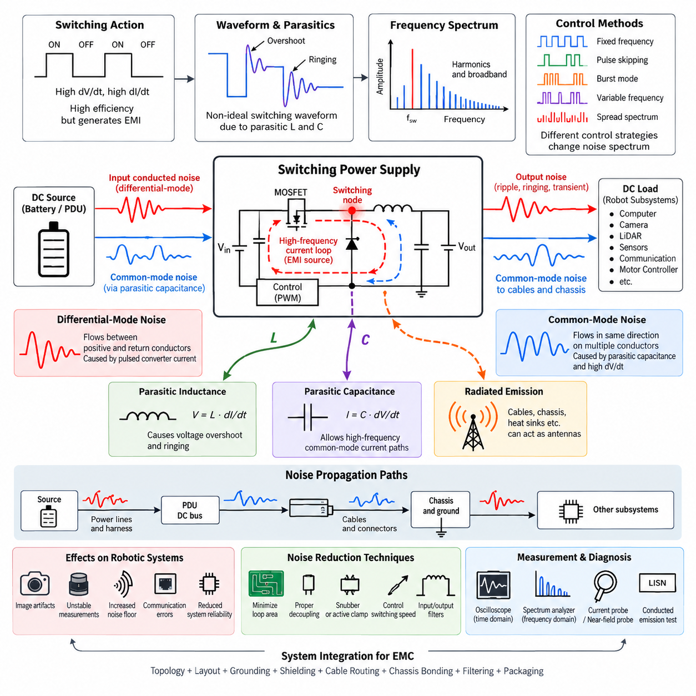
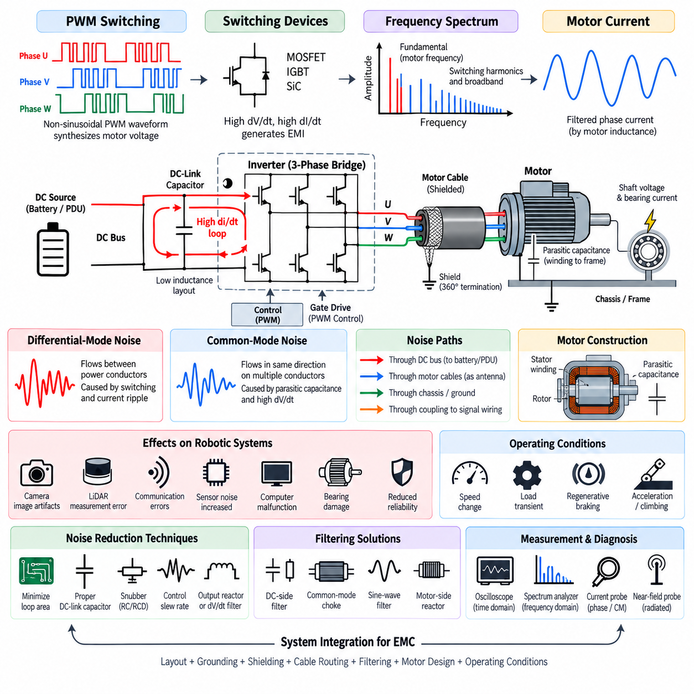
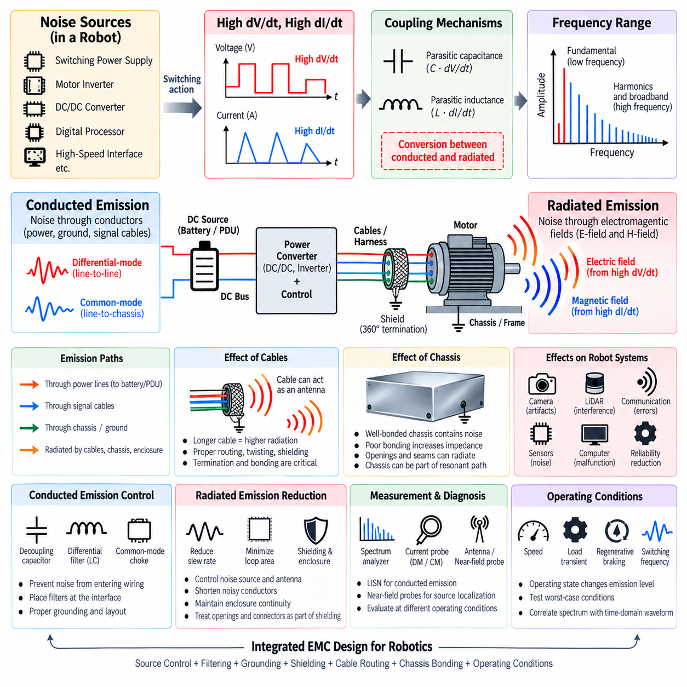
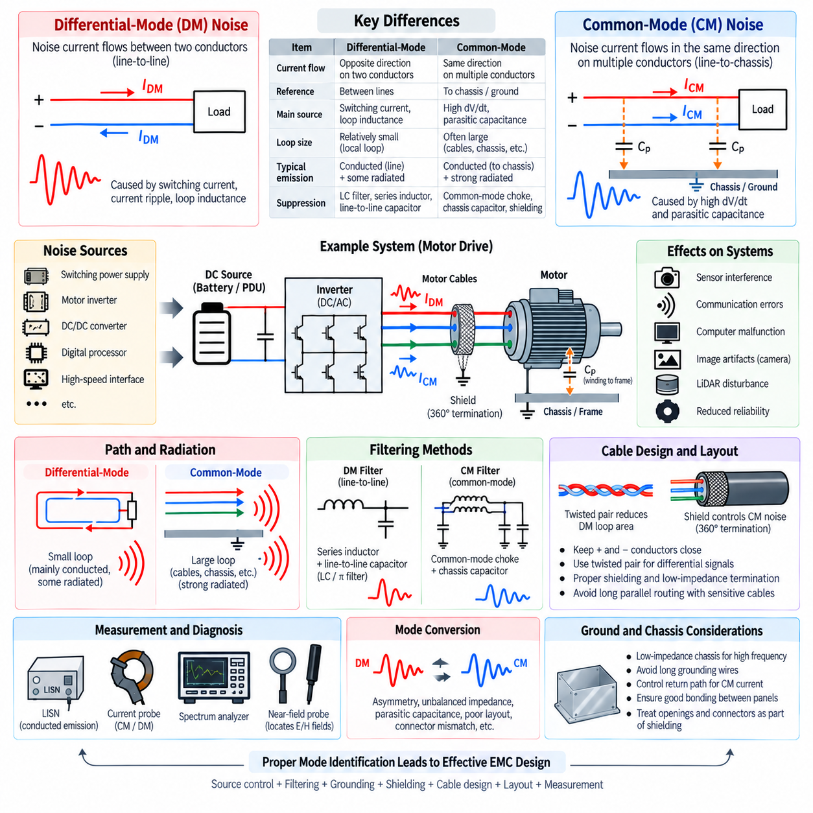
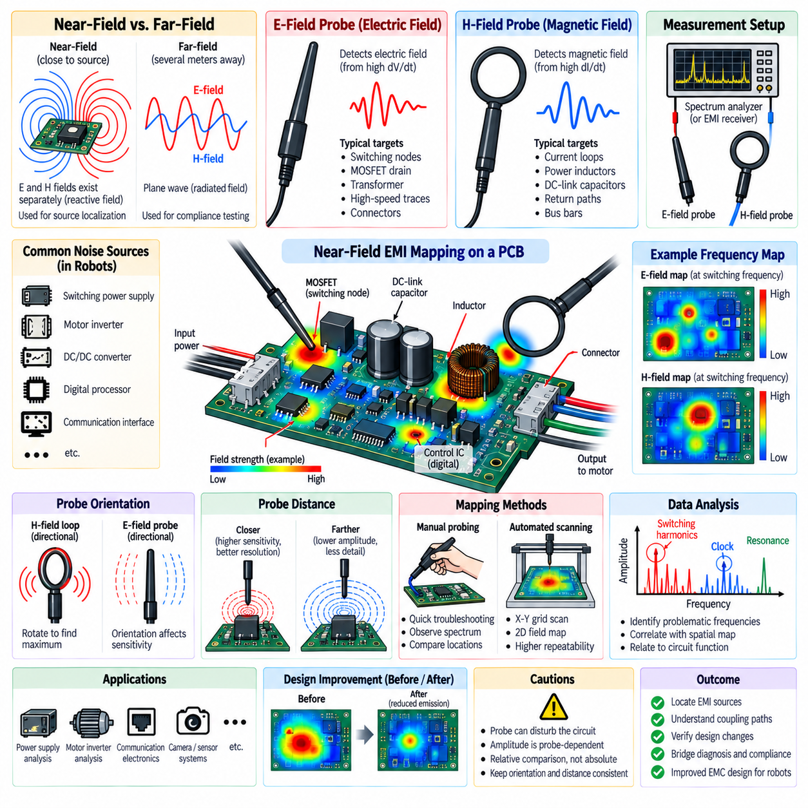

**Volume 05. Grounding and EMC**

# Chapter 04. Noise Sources Analysis

## 04.01. Switching Power Supply Noise

{width="7.268055555555556in" height="7.268055555555556in"}

Switching power supplies are major noise sources in robotic electrical systems because they regulate voltage by rapidly turning semiconductor devices on and off rather than dissipating excess energy continuously. This switching action provides high conversion efficiency, but every transition produces rapid changes in voltage and current. These high dV/dt and dI/dt events create broadband electromagnetic energy that can propagate through power conductors, ground structures, cables, and nearby space.

The fundamental noise mechanism begins at the switching node of a converter. In buck, boost, flyback, and other switched-mode topologies, MOSFETs or similar devices repeatedly connect and disconnect energy-storage components at frequencies ranging from tens of kilohertz to several megahertz. Although the nominal switching frequency may be relatively low, the sharp waveform edges contain harmonics extending far beyond the fundamental frequency and can therefore affect sensitive electronic circuits.

Switching power supply noise should be understood as both differential-mode and common-mode interference. Differential-mode noise flows between the positive and return conductors of the power path and is strongly associated with pulsed converter currents. Common-mode noise flows in the same direction on multiple conductors relative to chassis or surrounding structures. Parasitic capacitance often provides the return path that allows high-frequency common-mode currents to circulate through an otherwise unexpected route.

The current loops inside the converter strongly determine the magnitude of generated electromagnetic interference. During each switching state, current flows through MOSFETs, diodes or synchronous switches, inductors, and capacitors. If the high-frequency loop has a large physical area, its parasitic inductance increases and the loop becomes a stronger magnetic-field source. Compact placement of switching components and short, wide current paths are therefore fundamental EMC requirements rather than merely PCB layout preferences.

Parasitic inductance becomes particularly important during fast current transitions. According to the relationship V = L·dI/dt, even a small interconnection inductance can generate substantial voltage overshoot when current changes rapidly. Package leads, PCB traces, vias, connector pins, and capacitor connections all contribute to this inductance. The resulting ringing can introduce additional spectral peaks and significantly increase emissions beyond those predicted from the nominal switching frequency alone.

Parasitic capacitance produces another important coupling mechanism. Rapid voltage transitions at the switching node drive displacement current according to I = C·dV/dt. Capacitance may exist between semiconductor devices and heat sinks, transformer windings, PCB copper and chassis, or power circuits and nearby signal structures. Consequently, apparently isolated mechanical or electrical structures can become high-frequency current paths and convert localized switching activity into system-level common-mode noise.

Input-side conducted noise occurs because a switching converter does not normally draw perfectly continuous current from its source. Pulsating current is partially supplied by local input capacitors, but residual high-frequency components can travel backward through the power harness toward batteries, PDUs, or upstream converters. If several robotic subsystems share the same DC distribution network, one noisy converter can therefore disturb sensors, communication equipment, computing modules, and other loads connected elsewhere on the vehicle.

Output noise consists of switching ripple, transient components, ringing, and broadband high-frequency energy superimposed on the regulated DC voltage. Output capacitors and inductors reduce this energy, but their effectiveness depends on impedance across frequency rather than nominal capacitance alone. Equivalent series resistance, equivalent series inductance, PCB geometry, and capacitor technology determine whether a component remains useful at the frequencies where switching noise actually exists.

Radiated emission develops when high-frequency switching currents encounter structures capable of acting as antennas. Long power cables, poorly controlled return paths, heat sinks, chassis sections, and cable shields can convert conducted common-mode current into electromagnetic radiation. A converter that performs acceptably as an isolated laboratory board may therefore produce significantly greater emissions after installation in a robot because the final harness and mechanical structure become part of the electromagnetic system.

The switching frequency itself is only the starting point of noise analysis. A converter operating at 500 kHz, for example, can generate energy at integer harmonics and broadband components extending into tens or hundreds of megahertz because of nanosecond-scale switching edges. Resonances caused by parasitic inductance and capacitance may create additional peaks unrelated to simple harmonic predictions. EMC analysis must therefore examine the complete frequency spectrum rather than focusing only on the converter clock.

Control strategy also influences the noise spectrum. Fixed-frequency pulse-width modulation produces relatively predictable spectral lines, whereas pulse skipping, burst operation, variable-frequency control, and discontinuous conduction can create complex low-frequency and broadband signatures. Spread-spectrum modulation intentionally varies the switching frequency to distribute energy across a wider band, reducing peak spectral amplitude, but it does not eliminate the underlying electromagnetic energy or correct poor current-loop design.

Ground architecture determines how converter noise spreads through a robot. If high-current switching returns share impedance with sensor or communication returns, voltage developed across that common impedance can appear directly as unwanted signal disturbance. The problem becomes more severe when multiple DC/DC converters, motor controllers, computers, LiDARs, cameras, and communication interfaces share distributed grounding. High-frequency return-current paths must therefore be considered independently from ideal low-frequency ground assumptions.

Sensitive perception systems can be especially vulnerable to switching power noise. Cameras may exhibit image artifacts or communication errors, LiDAR electronics may experience unstable measurements, and analog sensor interfaces can suffer offset or increased noise floor. Ethernet and other high-speed communication links are primarily differential systems, but excessive common-mode disturbance can still degrade receiver margin or increase emissions through cables and connectors.

Noise reduction should begin at the source rather than relying exclusively on filters. Minimizing switching-loop area, placing decoupling capacitors directly across high-frequency current paths, reducing parasitic inductance, controlling MOSFET transition speed, and managing switching-node copper area can substantially reduce generated energy. Snubber networks or active-clamp techniques may be used to suppress ringing where appropriate, while careful gate-drive design can balance switching loss against EMC performance.

Input and output filtering provides the next level of containment. Differential-mode inductors, capacitors, ferrite elements, common-mode chokes, and feedthrough structures can attenuate unwanted frequency components when their impedances are properly matched to the noise source and load. Filter placement is critical because long conductors between the noise source and filter allow electromagnetic coupling before attenuation occurs. A filter should therefore be located close to the boundary where noise must be contained.

Effective diagnosis requires measurement of both time-domain waveforms and frequency-domain emissions. Oscilloscope measurements can reveal switching-node overshoot, ringing, ripple, and transient behavior, while spectrum analysis helps identify fundamental switching components, harmonics, and resonant peaks. Current probes, differential probes, LISN-based conducted-emission measurements, and near-field probes can help determine whether the dominant mechanism is differential-mode conduction, common-mode conduction, or radiation.

In robotic systems, switching power supply noise must ultimately be treated as a system-integration problem rather than an isolated converter characteristic. Converter topology, PCB layout, grounding, shielding, cable routing, chassis bonding, filter placement, load behavior, and mechanical packaging jointly establish the final EMC performance. Designing these elements together prevents switching energy from migrating into perception, communication, control, and computing subsystems.

## 04.02. Motor and Inverter Noise

{width="7.268055555555556in" height="7.268055555555556in"}

Motor and inverter systems are among the strongest electromagnetic noise sources in robotic electrical architectures because they combine high power, rapidly switched voltage, and large transient current. An inverter converts DC bus power into controlled phase voltages using semiconductor switches operated by pulse-width modulation. The resulting high dV/dt and dI/dt transitions generate conducted and radiated interference that can propagate throughout the robot.

The inverter power stage typically uses MOSFETs, IGBTs, or wide-bandgap devices such as silicon-carbide switches arranged in half-bridge or three-phase bridge structures. Each switching event rapidly transfers current between devices and motor phases. Although the fundamental motor electrical frequency may be relatively low, PWM switching occurs at kilohertz frequencies, while fast semiconductor edges generate spectral energy extending into the megahertz region.

PWM waveforms are intentionally non-sinusoidal because the inverter synthesizes the required motor voltage from discrete DC bus switching states. The motor inductance filters much of the switching waveform into relatively smooth phase current, but high-frequency voltage components remain present at the inverter output. These components produce switching harmonics, ringing, and transient currents that can couple into power distribution, chassis structures, communication cables, and nearby sensor wiring.

The DC-link current loop is a critical source of inverter EMI. During semiconductor commutation, current rapidly transfers between the DC-link capacitor and switching bridge. Parasitic inductance in bus bars, PCB conductors, capacitor terminals, and semiconductor packages produces voltage overshoot according to V = L·dI/dt. Minimizing this commutation-loop area and placing low-inductance DC-link capacitors close to the power switches are therefore fundamental inverter layout requirements.

Motor phase outputs create another major noise path because they repeatedly transition between DC-bus potentials. High dV/dt at each phase terminal drives displacement current through parasitic capacitances inside the motor and cable system. Capacitance exists between motor windings and stator core, phase conductors and cable shields, semiconductor devices and heat sinks, and mechanical structures connected to chassis. These paths transform inverter switching into substantial common-mode current.

Common-mode motor current can flow from inverter phase nodes through winding-to-frame capacitance into the motor housing and then return through chassis, grounding conductors, cable shields, or other structural paths. Because these paths may extend across the robot, common-mode current can generate both conducted and radiated emissions far from the inverter itself. Grounding and bonding must therefore control the complete high-frequency return path rather than only the inverter enclosure.

Differential-mode noise primarily flows between power conductors and is associated with switching and phase-current ripple. Common-mode noise, in contrast, appears simultaneously on multiple conductors relative to chassis. These mechanisms often coexist and may dominate different frequency ranges. Correctly identifying the dominant mode is essential because differential inductors and capacitors address different current paths from common-mode chokes, shielding, and chassis-referenced filtering.

Motor cables can become efficient EMI coupling structures because they carry high-current PWM waveforms over relatively long distances. Large cable loops increase magnetic-field radiation, while common-mode voltage can drive cable conductors and shields as unintended antennas. Routing phase conductors closely together reduces loop area, and properly designed shielded motor cables help contain electric-field coupling and provide a controlled high-frequency return path for common-mode current.

Cable shield termination is particularly important at inverter and motor interfaces. A shield that is connected through a long pigtail introduces significant high-frequency inductance and can lose effectiveness as frequency increases. Low-impedance, 360-degree shield termination to conductive connector shells or chassis structures generally provides better high-frequency performance. The shield connection should be treated as part of the current-return architecture rather than merely as electrostatic protection.

Motor construction also influences EMI behavior. Winding arrangement, stator geometry, insulation structure, rotor configuration, bearing design, and parasitic capacitance determine how switching energy couples into the mechanical assembly. High-frequency common-mode voltage can produce shaft voltage and bearing current. Repeated electrical discharge through bearings can damage bearing surfaces over time, making inverter-generated common-mode noise both an EMC issue and a potential reliability concern.

Fast switching devices improve inverter efficiency by reducing transition losses, but faster edges can increase electromagnetic emissions. Silicon-carbide and other wide-bandgap semiconductors can achieve very high switching speeds, producing substantially greater dV/dt than conventional devices. Gate resistance and gate-driver configuration can be adjusted to control slew rate, allowing designers to trade switching efficiency against voltage overshoot, ringing, insulation stress, and EMC performance.

Dead time and semiconductor commutation behavior can also influence the generated spectrum. Switching transitions involving body diodes, reverse recovery, device output capacitance, and nonlinear parasitic elements can create sharp current pulses and ringing. These effects may not be obvious from ideal inverter models. Practical EMC design therefore requires measurement of switching-node voltage, phase current, DC-link current, and common-mode current under realistic motor loading conditions.

Mechanical operating conditions affect motor and inverter noise as well. Motor speed, torque, modulation index, regenerative braking, acceleration, and load transients change phase current and switching behavior. A robot may therefore exhibit acceptable EMC performance while stationary or lightly loaded but experience interference during rapid acceleration, steering, climbing, or regenerative deceleration. Testing should reproduce representative worst-case operating conditions rather than rely only on idle measurements.

In mobile robots, inverter noise can couple into perception and communication subsystems through shared power, grounding, or physical routing. LiDAR, cameras, GNSS receivers, IMUs, Ethernet links, CAN networks, and analog interfaces may operate near traction wiring. Parallel routing between motor phase cables and sensitive signal harnesses increases coupling. Physical separation, controlled crossing geometry, shielding, and deliberate harness zoning are therefore important system-level countermeasures.

Source suppression should be applied before relying on external filters. Reducing commutation-loop inductance, optimizing bus-bar geometry, placing DC-link capacitors close to switching devices, controlling gate-drive slew rate, and suppressing resonances can significantly reduce generated EMI. RC or RCD snubbers may reduce switching-node ringing, while appropriate dV/dt filters or output reactors can reduce high-frequency voltage stress and noise delivered to long motor cables.

Filtering must be selected according to the identified noise mechanism. DC-side filters can prevent inverter switching noise from propagating into the battery and PDU network, while common-mode chokes and appropriately referenced capacitors can reduce common-mode current. Motor-side reactors, sine-wave filters, or dV/dt filters may be required when cable length, motor insulation stress, or EMC requirements justify them, although added size, mass, loss, and thermal load must be considered.

Diagnosis should combine time-domain and frequency-domain measurements. Differential voltage probes can measure switching-node and phase voltage, while current probes can observe DC-link, phase, shield, or common-mode currents. Spectrum analyzers and near-field probes help identify harmonic structures and localized radiation sources. Measurements under different speed, torque, switching-frequency, and load conditions can reveal which operating state produces the highest electromagnetic disturbance.

Motor and inverter EMI must ultimately be addressed as a complete electromechanical system problem. Semiconductor switching, DC-link design, bus-bar geometry, motor parasitics, cable construction, shield termination, chassis bonding, grounding, filtering, harness routing, and operating conditions jointly determine EMC behavior. Coordinating these elements prevents traction and actuator power electronics from degrading the sensing, communication, computing, and control functions required for reliable robotic operation.

## 04.03. Radiated vs Conducted Emission

{width="7.268055555555556in" height="7.268055555555556in"}

Radiated and conducted emissions are the two principal paths by which unwanted electromagnetic energy leaves an electrical or electronic subsystem. Conducted emission propagates through physical conductors such as power lines, ground paths, and signal cables, while radiated emission propagates through electromagnetic fields in surrounding space. In robotic systems, both mechanisms frequently originate from the same switching events and can interact through cables, chassis structures, and grounding networks.

Conducted emission is produced when noise voltage or current generated inside a device enters external wiring. Switching power supplies, motor inverters, DC/DC converters, digital processors, and high-speed communication interfaces can inject high-frequency components into shared power and return networks. Once coupled onto a harness, this energy may travel through a PDU, battery bus, grounding system, or signal cable and interfere with equipment located far from the original noise source.

Radiated emission occurs when time-varying currents and voltages generate electric and magnetic fields that couple into surrounding space. High dV/dt nodes are strong electric-field sources, while high dI/dt current loops are strong magnetic-field sources. PCB traces, bus bars, heat sinks, cable shields, motor cables, and chassis structures can become effective radiating elements when switching energy excites them at frequencies where their dimensions and impedances support significant electromagnetic coupling.

The distinction between conducted and radiated emission is useful for engineering analysis, but the two mechanisms are not completely independent. Conducted common-mode current flowing along a long cable can transform the cable into an antenna and produce radiated emission. Conversely, an electromagnetic field generated by a nearby inverter or motor cable can couple into another harness and appear as conducted noise at the input of a sensitive electronic module. EMC diagnosis must therefore examine conversion between propagation mechanisms.

Frequency strongly influences which propagation mechanism becomes dominant. At relatively low frequencies, circuit dimensions are usually much smaller than the electromagnetic wavelength, so noise commonly propagates through conductive paths and lumped impedances. As frequency increases, parasitic capacitance, parasitic inductance, cable length, enclosure openings, and structural resonances become increasingly important. A system that behaves like a simple circuit at low frequency can behave like a distributed electromagnetic structure at higher frequency.

Differential-mode conducted emission appears as unwanted voltage or current between two intended conductors, such as the positive and negative lines of a DC supply. It is commonly generated by pulsed load current and switching-current loops. The noise travels outward through the same conductors used to deliver useful power. Input capacitors, differential inductors, LC filters, and careful current-loop design are typical methods used to reduce this propagation mechanism.

Common-mode conducted emission flows in the same direction on multiple conductors relative to chassis or another reference structure. Parasitic capacitance often creates the return path for this current. Fast switching nodes in power converters and motor inverters can capacitively couple current into heat sinks, motor frames, cable shields, or chassis. Common-mode noise is especially important because even relatively small currents can generate substantial radiated emission when they flow along long cables.

Radiated emission can also be interpreted according to electric-field and magnetic-field coupling. A high-voltage switching node with a large exposed conductive area can capacitively couple electric fields into nearby structures. A high-current loop with a large physical area produces stronger magnetic fields. Reducing switching-node area, minimizing current-loop area, maintaining close forward and return paths, and controlling shielding boundaries directly reduce the electromagnetic structures responsible for radiation.

Near-field and far-field behavior provide another useful distinction. Close to a noise source, electric and magnetic fields can behave relatively independently, and near-field probes can identify localized high dV/dt nodes or high dI/dt loops. At greater distance, the fields develop into electromagnetic radiation with a predictable relationship between electric and magnetic components. This distinction is important when diagnosing whether an emission originates from a PCB region, cable, connector, enclosure opening, or larger system structure.

Cables frequently provide the bridge between conducted and radiated emissions in robots. A motor phase cable may carry PWM-related common-mode current, while a power harness can carry converter switching noise and a communication cable can carry unwanted common-mode energy. If cable length becomes electromagnetically significant, the cable can radiate efficiently. Cable routing, twisting, shielding, termination, connector design, and chassis bonding therefore influence both conducted and radiated EMC performance.

The robot chassis can either help contain noise or unintentionally participate in its propagation. A well-bonded conductive chassis can provide a low-impedance high-frequency return path and support effective cable-shield termination. Poor bonding between panels, long grounding straps, painted interfaces, or uncontrolled mechanical joints can increase impedance and create voltage differences between structural regions. The chassis may then become part of a resonant current path or radiating structure rather than an effective EMC reference.

Conducted-emission control should begin by preventing noise from entering external wiring. High-frequency decoupling capacitors should be placed close to switching current loops, while input and output filters should be positioned near the interface through which noise could escape. Differential-mode filters suppress line-to-line noise, whereas common-mode chokes and appropriately connected capacitors control common-mode currents. Filter effectiveness depends strongly on parasitic impedance, grounding, placement, and physical layout.

Radiated-emission reduction requires control of both the noise source and the antenna structure. Slowing excessive switching edges, reducing ringing, minimizing loop area, shortening noisy conductors, shielding cables, and improving enclosure continuity can reduce radiation. Shielding is most effective when electromagnetic energy is contained before it reaches external wiring. Openings, seams, connectors, and cable penetrations must therefore be treated as part of the shielding system rather than considered independently from the enclosure.

Harness segregation is particularly important in robotic platforms containing motors, inverters, sensors, and high-speed computing. High-current PWM cables should not be routed in long parallel paths beside camera, LiDAR, GNSS, Ethernet, or low-level analog wiring. Increasing separation reduces capacitive and inductive coupling, while controlled crossing angles reduce interaction length. Proper zoning of power, actuator, communication, and sensor harnesses prevents radiated energy from becoming conducted interference in sensitive circuits.

Conducted emissions are commonly evaluated by measuring noise voltage or current at defined electrical interfaces. A line impedance stabilization network, or LISN, provides a controlled impedance and measurement point for power-line emissions, while current probes can measure common-mode or differential-mode currents on cables. Spectrum analysis then identifies switching fundamentals, harmonics, resonances, and broadband components, allowing engineers to correlate measured peaks with specific operating mechanisms.

Radiated-emission diagnosis uses antennas and near-field probes to identify electromagnetic energy leaving the system. Electric-field and magnetic-field probes can localize PCB switching nodes, current loops, connectors, and cable regions during development. Formal radiated-emission testing evaluates the electromagnetic field at specified distances and configurations. Rotating or repositioning the equipment and cables can reveal directional radiation patterns and identify structures acting as dominant antennas.

Measurement results should always be correlated with operating state. Motor speed, inverter load, switching frequency, processor activity, communication traffic, converter mode, and regenerative braking can change both conducted and radiated spectra. Turning individual subsystems on and off or varying their operating conditions can reveal the responsible source. Time-domain measurements can then confirm whether spectral peaks correspond to PWM transitions, clock activity, ringing, communication edges, or periodic control events.

For robotic EMC engineering, radiated and conducted emissions should ultimately be analyzed as interconnected manifestations of the same electromagnetic energy. Source generation, coupling path, propagation structure, and receiving subsystem form a complete interference chain. PCB layout, filtering, grounding, shielding, chassis bonding, connector design, and harness routing must therefore be coordinated so that noise is reduced at its source, blocked along conductive paths, and prevented from exciting radiating structures.

## 04.04. Common Mode vs Differential Mode

{width="7.268055555555556in" height="7.268055555555556in"}

Common-mode and differential-mode noise describe two fundamentally different ways unwanted electrical energy propagates through conductors in an electronic system. Differential-mode noise flows between two intended conductors, such as positive and return power lines, while common-mode noise flows in the same direction on multiple conductors relative to chassis or another reference. Distinguishing these modes is essential because their sources, coupling paths, radiation behavior, and suppression methods differ significantly.

Differential-mode noise is generated when unwanted voltage appears between conductors that normally carry useful differential power or signals. In a DC/DC converter, pulsed switching current can create high-frequency noise between the positive supply and return line. In a motor inverter, switching and phase-current ripple generate similar differential components. The noise current leaves the source through one conductor and returns through the other, forming a closed differential current loop.

The magnitude of differential-mode emission depends strongly on switching-current amplitude, edge speed, loop impedance, and the physical geometry of the current path. Parasitic inductance in PCB traces, bus bars, capacitor connections, and wiring can convert rapid current changes into voltage disturbances according to V = L·dI/dt. Large current loops also increase magnetic-field coupling, allowing differential-mode current to contribute to both conducted interference and radiated electromagnetic emission.

Common-mode noise follows a different path. Instead of circulating primarily between two intended conductors, common-mode current travels in the same direction on several conductors and returns through chassis, protective earth, cable shields, mechanical structures, or parasitic capacitance. The intended circuit diagram may not show this path because it is frequently created by unintended capacitances distributed throughout the physical system.

High dV/dt switching nodes are major sources of common-mode current. When voltage changes rapidly, parasitic capacitance carries displacement current according to I = C·dV/dt. Capacitance between switching devices and heat sinks, motor windings and frames, PCB copper and chassis, transformer windings, or cables and surrounding structures can therefore inject high-frequency current into the chassis. Even small parasitic capacitances can become important when switching edges are sufficiently fast.

A useful way to distinguish the two modes is to examine current direction. In differential mode, current in one conductor travels toward the load while approximately equal current returns through the paired conductor. In common mode, high-frequency noise current travels in the same direction along both conductors relative to the reference structure. The common-mode return current then finds another path through chassis, shielding, parasitic capacitance, or surrounding conductive structures.

The physical loop geometry is consequently different for each mode. Differential-mode current normally forms a relatively localized loop involving the source, conductors, and load. Common-mode current can form a much larger loop involving cables, chassis, enclosures, motor frames, grounding connections, and parasitic coupling. Because the effective loop and antenna structures can become large, relatively small common-mode currents may produce unexpectedly strong radiated emissions.

Motor inverter systems provide a practical example of both mechanisms occurring simultaneously. PWM switching creates differential-mode components between motor phase conductors, while rapid phase-node voltage transitions drive common-mode current through winding-to-frame capacitance. The current can then flow through the motor housing, chassis, cable shield, and inverter structure. The same inverter can therefore require separate differential-mode and common-mode countermeasures.

Switching power supplies show similar behavior. Pulsating input current generates differential-mode noise on the DC input pair, while switching-node voltage transitions couple through parasitic capacitance to chassis or nearby structures and generate common-mode noise. Output wiring can carry both modes simultaneously. Treating all measured noise as a single phenomenon can therefore lead to ineffective filters because a component designed for one propagation mode may provide little attenuation for the other.

Differential-mode filtering generally uses components that present impedance to noise flowing between the line conductors. Series inductors combined with capacitors connected across the supply form common LC or π-filter structures. Input and output capacitors also provide short local paths for switching current. Their effectiveness depends on frequency-dependent impedance, equivalent series resistance, equivalent series inductance, placement, and the parasitic characteristics of the surrounding PCB and wiring.

Common-mode filtering requires components that impede currents flowing in the same direction on multiple conductors. A common-mode choke provides high impedance to common-mode current while allowing intended differential current to pass with relatively low impedance. Chassis-referenced capacitors can provide controlled high-frequency return paths where safety and system architecture permit. Shielding and low-impedance chassis bonding are also important because common-mode suppression depends heavily on controlling the return path.

Cable design has a strong influence on both modes. Closely spaced positive and return conductors reduce differential-loop area and associated magnetic radiation. Twisted pairs further improve field cancellation for differential currents. Cable shields primarily help control common-mode electric-field coupling and provide a defined high-frequency return path when properly terminated. Poor shield termination, especially through long pigtails, can add inductance and reduce effectiveness at high frequencies.

Common-mode noise is particularly important in long robotic harnesses because cables can behave as efficient antennas. A small high-frequency current flowing simultaneously along multiple cable conductors can excite the entire cable relative to chassis. Motor cables, power harnesses, Ethernet cables, sensor cables, and external interfaces can therefore radiate even when their intended differential signals are well balanced. Connector shielding and 360-degree shield termination help prevent this conversion into radiation.

Mode conversion can occur when circuit or cable symmetry is imperfect. Differential-mode energy may be converted into common-mode energy by unequal conductor impedance, asymmetric PCB routing, connector imbalance, mismatched filtering, or inconsistent parasitic capacitance. Conversely, externally coupled common-mode disturbance can produce differential voltage at a receiver if the two conductors experience different impedances. Maintaining symmetry is therefore an important EMC design principle for differential interfaces.

Ground and chassis architecture are especially relevant to common-mode behavior. At high frequencies, current follows the path of lowest impedance rather than simply the path with the lowest DC resistance. Long grounding wires may have significant inductive impedance, while broad chassis connections can provide much lower high-frequency impedance. A grounding scheme that appears correct in a DC continuity test may therefore perform poorly when carrying megahertz common-mode currents.

Measurement techniques can separate differential-mode and common-mode components. A current probe placed around both conductors of a power pair measures the residual current flowing in the same direction and therefore provides information about common-mode current. Measuring conductors individually and mathematically combining their currents can provide additional mode information. Differential voltage probes, LISN measurements, and spectrum analysis can then characterize line-to-line differential noise and frequency-dependent emission behavior.

Diagnosis should also consider how measured noise changes when grounding, cable routing, shielding, or filter components are modified. A strong response to chassis bonding or shield termination often indicates an important common-mode path, while changes caused by line-to-line capacitors or series differential inductance suggest a differential-mode mechanism. Near-field probing can complement conducted measurements by locating high dV/dt electric-field sources and high dI/dt magnetic-field loops.

In robotic systems, common-mode and differential-mode noise must ultimately be managed as related but distinct components of the electromagnetic interference environment. Switching converters, motor drives, computing systems, cables, sensors, chassis structures, and communication interfaces create many opportunities for both modes to propagate and convert between one another. Correct mode identification allows filtering, grounding, shielding, layout, bonding, and harness design to target the actual physical noise path rather than treating EMC as a generic filtering problem.

## 04.05. Near Field EMI Mapping

{width="7.268055555555556in" height="7.268055555555556in"}

Near-field EMI mapping is a diagnostic technique used to locate electromagnetic noise sources and coupling paths directly around electronic hardware. Instead of measuring emissions several meters away as in formal radiated-emission testing, near-field mapping examines localized electric and magnetic fields close to PCBs, converters, motor drives, connectors, cables, and enclosures. It provides spatial information that helps engineers determine where unwanted electromagnetic energy is generated.

The electromagnetic field close to a circuit behaves differently from a fully developed far-field electromagnetic wave. In the near-field region, electric and magnetic field components may exist with different relative strengths depending on the source structure. High-voltage, high-impedance switching nodes tend to create strong electric fields, whereas high-current loops and rapidly changing currents tend to generate strong magnetic fields. Separate probes are therefore commonly used to investigate these mechanisms.

An electric-field probe, often called an E-field probe, responds primarily to electric fields produced by rapidly changing voltages. It is useful for examining switching nodes, MOSFET drain regions, transformer windings, high-speed digital traces, connectors, and other structures with high dV/dt. Moving the probe across a PCB allows engineers to identify regions where electric-field intensity increases and to relate those regions to specific circuit functions or switching events.

A magnetic-field probe, or H-field probe, is particularly useful for locating high-frequency current loops. The probe normally contains a small loop that responds to changing magnetic flux. Areas around switching MOSFETs, DC-link capacitors, rectifiers, inductors, power traces, and return paths can be scanned to locate high dI/dt loops. Smaller probe loops provide better spatial resolution, while larger probes generally offer greater sensitivity but less precise localization.

Near-field mapping is most useful when spatial position is combined with frequency information. A probe can be connected to a spectrum analyzer or suitable measurement receiver while it is moved over the equipment under test. At each position, the amplitude of selected frequencies or frequency bands can be recorded. Repeating the measurement across a defined surface produces a map showing where specific switching harmonics, resonances, clock frequencies, or broadband disturbances are strongest.

Manual probing provides a rapid method for troubleshooting during development. An engineer can move the probe over suspicious PCB areas while observing the spectrum analyzer and identify locations where emission peaks increase significantly. This approach is effective for quickly comparing switching nodes, power loops, connectors, cable exits, and grounding regions. However, probe orientation, height, pressure, and position must remain reasonably consistent if measurements are to be compared reliably.

Automated near-field scanning improves repeatability by moving a probe across the device using a controlled positioning system. A defined X-Y grid is scanned while frequency-domain measurements are collected at each point. The resulting data can be converted into two-dimensional field-intensity maps. More advanced systems may scan at multiple heights or orientations, allowing engineers to investigate how electromagnetic fields spread away from the PCB or enclosure surface.

Probe orientation is critical because near-field probes are directional. Rotating an H-field loop changes its sensitivity to magnetic flux orientation and can reveal the direction of current flow or the geometry of a dominant loop. Similarly, E-field measurements depend on probe geometry and orientation relative to conductive surfaces. A single scan orientation may therefore miss an important source, so suspicious regions should often be examined using multiple probe orientations.

Probe distance also has a strong effect on measured amplitude and spatial resolution. Bringing a probe closer to the source generally increases sensitivity to localized fields and helps distinguish neighboring structures. Increasing the distance causes fields from multiple sources to combine and reduces spatial detail. For comparative mapping, maintaining a consistent probe height is essential because amplitude changes caused by distance can otherwise be mistaken for differences in actual emission strength.

The measurement system must provide sufficient frequency range and dynamic range for the expected noise source. Switching converters may generate harmonics far above their fundamental switching frequency, while digital processors and communication interfaces can produce emissions extending into hundreds of megahertz or beyond. Spectrum analyzer resolution bandwidth, detector settings, frequency span, preamplification, and probe characteristics should be selected according to the diagnostic objective rather than using one configuration for every measurement.

Near-field mapping is especially valuable for analyzing switching power supplies. Strong magnetic-field regions often reveal high-frequency commutation loops involving MOSFETs, diodes, input capacitors, and switching paths. Electric-field scans can identify large switching-node copper regions or transformer structures carrying rapid voltage transitions. Comparing maps before and after layout changes, snubber installation, gate-slew adjustment, or capacitor relocation provides direct evidence of whether a countermeasure reduces local electromagnetic activity.

Motor inverters can be investigated in a similar manner. H-field probing can identify high dI/dt regions around DC-link capacitors, bus bars, switching bridges, and phase outputs, while E-field probing can locate high dV/dt switching structures. Scanning connectors and cable exits can reveal where internal inverter noise begins coupling onto external wiring. These measurements help distinguish a localized power-stage problem from a cable, shielding, grounding, or chassis-related propagation problem.

Near-field measurements are also useful for communication and perception electronics. Ethernet PHY regions, clock oscillators, processors, memory interfaces, camera interfaces, and high-speed serial links can produce localized spectral signatures. A field map can reveal whether emissions originate from the device itself, PCB routing, connector transitions, or cable common-mode currents. This is valuable in robots where sensitive communication electronics operate close to high-power motor and converter systems.

A major advantage of near-field mapping is the ability to correlate physical location with circuit behavior. If a spectral peak occurs at the switching frequency and its harmonics, the strongest mapped region may identify the responsible converter loop. A peak associated with a processor clock may localize around digital routing or a connector. Combining schematic knowledge, PCB layout, time-domain waveforms, and near-field maps allows the electromagnetic source and coupling mechanism to be identified more confidently.

Near-field mapping can also evaluate design modifications before expensive compliance testing. Engineers can compare baseline and modified scans after changing component placement, reducing loop area, improving decoupling, adding shielding, modifying ground connections, or rerouting cables. A reduction in localized field amplitude does not automatically guarantee regulatory compliance, but it provides a practical indication that the underlying emission mechanism has been reduced before formal chamber measurements are performed.

Care must be taken because a near-field probe can disturb the circuit being measured. Conductive probe structures placed very close to sensitive nodes can alter parasitic capacitance, inductance, resonance frequency, or local current distribution. The measured amplitude is also probe-dependent and should not automatically be interpreted as absolute radiated field strength at a regulatory distance. Near-field mapping is primarily a comparative and diagnostic technique unless the measurement system has been specifically calibrated for quantitative field reconstruction.

A systematic robotic EMI investigation can therefore begin with system-level spectrum measurements, identify problematic frequencies, and then use near-field mapping to localize their physical origins. The investigation can progress from enclosure and cable regions toward individual PCB sections and components. Once the dominant source is identified, engineers can modify layout, filtering, grounding, shielding, switching behavior, or cable routing and repeat the scan to verify whether the electromagnetic field has been reduced.

Near-field EMI mapping ultimately connects frequency-domain EMC measurements with the physical architecture of a robotic electrical system. By distinguishing electric-field and magnetic-field sources, mapping their spatial distribution, and correlating them with switching and operating conditions, engineers can trace noise from semiconductor devices and PCB loops into connectors, cables, chassis structures, and neighboring electronics. This makes near-field mapping a powerful bridge between EMC diagnosis, design correction, and final system validation.
