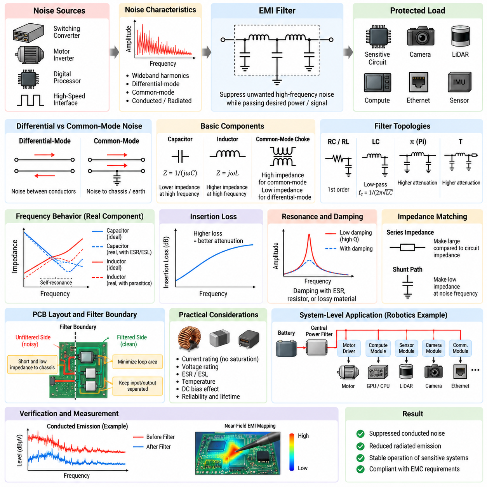
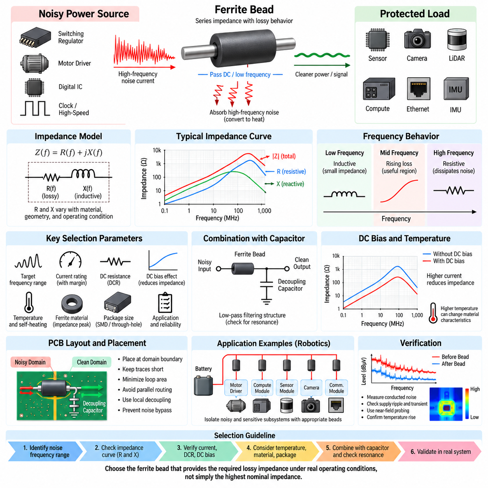
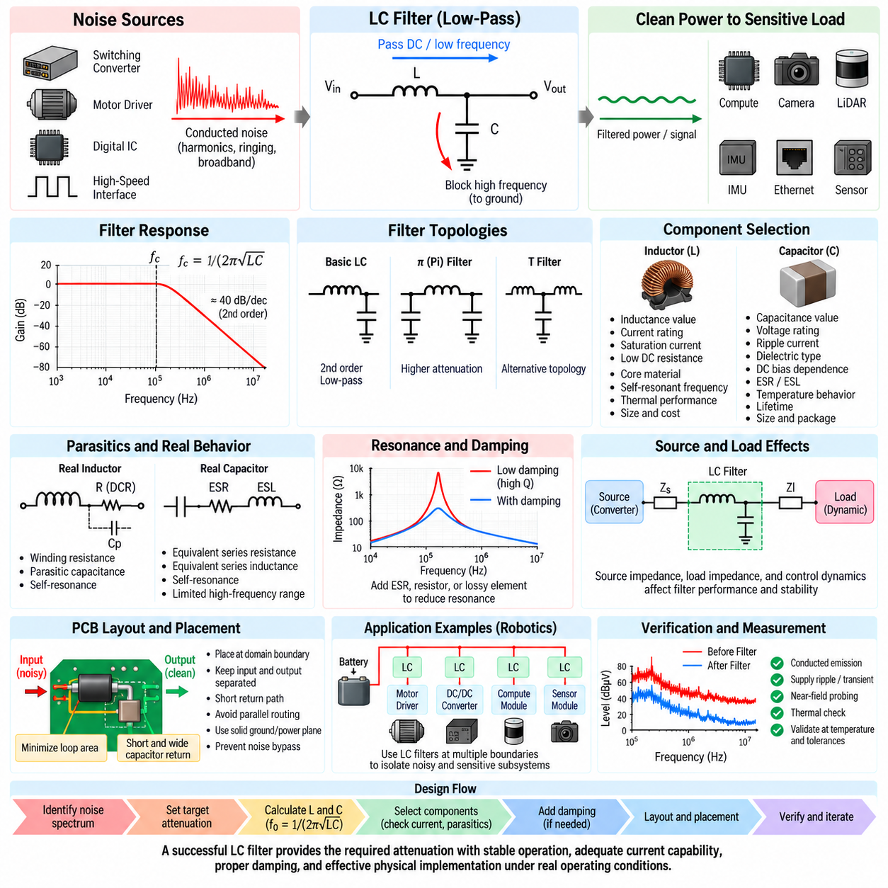
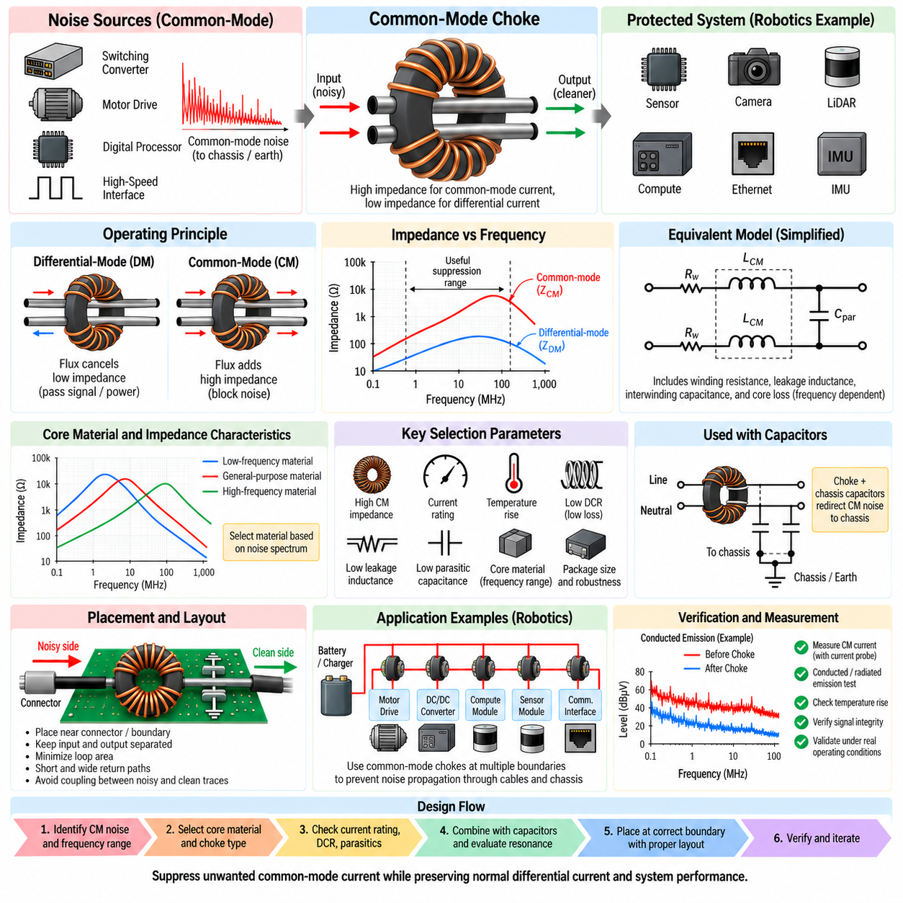
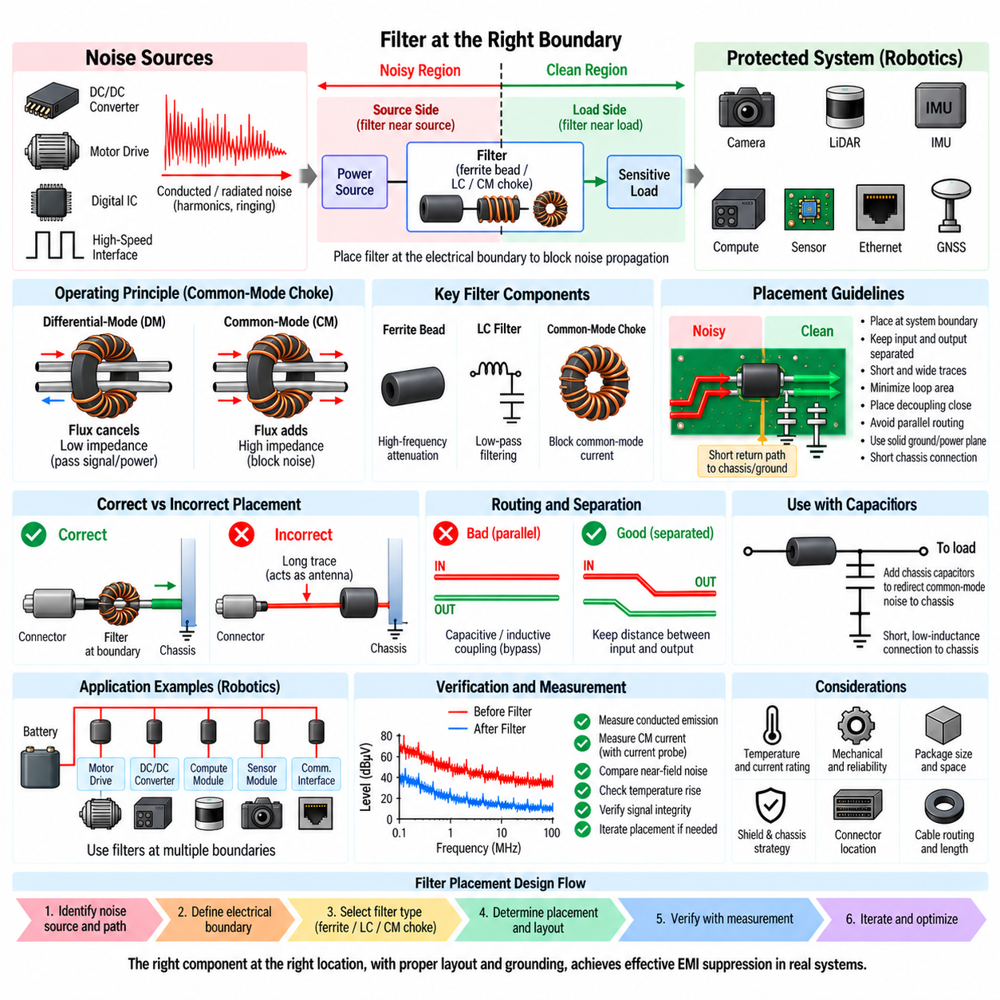

**Volume 05. Grounding and EMC**


# Chapter 05. Filtering Design

##  

## 05.01. EMI Filter Design

{width="7.268055555555556in" height="7.268055555555556in"}

EMI filter design is the systematic process of controlling unwanted conducted electromagnetic energy before it propagates between electronic subsystems, cables, power networks, and sensitive circuits. Within the filtering design structure of this volume, it provides the general foundation for later treatment of ferrite beads, LC filters, common-mode chokes, and filter placement rules.

An EMI filter should be designed from the actual noise mechanism rather than selected only from a nominal frequency range. The engineer first identifies the noise source, propagation path, affected circuit, frequency spectrum, and dominant coupling mode. Information obtained from conducted-emission measurements and near-field EMI mapping can therefore become direct input to the filter design process.

Differential-mode noise appears as an unwanted voltage or current between two conductors, while common-mode noise travels in the same direction on multiple conductors relative to chassis, earth, or another reference structure. These two mechanisms require different filtering strategies. A filter effective against differential-mode switching ripple may provide little attenuation against common-mode cable current.

The fundamental function of an EMI filter is to introduce a frequency-dependent impedance discontinuity that suppresses unwanted high-frequency energy while allowing the intended power or signal energy to pass. Series elements normally increase impedance to noise current, whereas shunt elements provide a low-impedance return path for unwanted energy. Their combination determines the attenuation characteristic.

Capacitors are widely used because their impedance decreases with increasing frequency according to the ideal relationship Z = 1/(jωC). A capacitor placed across power conductors can divert differential-mode noise, while capacitors connected toward chassis can provide paths for common-mode current. Real capacitors, however, include equivalent series resistance and inductance that limit high-frequency performance.

Inductors provide increasing impedance with frequency according to the ideal relationship Z = jωL and are therefore useful as series filtering elements. At practical frequencies, winding resistance, parasitic capacitance, magnetic-core losses, saturation, and self-resonance modify this behavior. An inductor must consequently be selected using impedance-versus-frequency characteristics as well as its nominal inductance.

A simple first-order RC or RL network can suppress moderate high-frequency disturbances, but power electronic systems commonly require LC, π, or T-type networks to obtain stronger attenuation. The ideal cutoff frequency of an LC section is approximately f_c = 1/(2π√LC). This equation provides an initial design estimate, while actual attenuation must include source impedance, load impedance, and parasitic components.

Filter insertion loss is a more meaningful engineering quantity than component values alone. It describes how much unwanted energy is reduced after the filter is inserted between the source and load. A theoretically high-order filter can perform poorly when connected to unexpected impedances, because the source-filter-load combination changes poles, resonances, damping, and the effective transfer characteristic.

Impedance mismatch is therefore central to practical EMI filtering. A series impedance is generally most effective when it is large compared with the surrounding circuit impedance, while a shunt path should present substantially lower impedance to the unwanted frequency components. Designing from this perspective prevents the common mistake of treating an EMI filter as an isolated two-port component.

Resonance requires particular attention in LC-based filters. Low-loss inductors and capacitors can form a high-Q network that produces amplification near resonance instead of uniform suppression. Damping may be introduced through component ESR, intentional resistance, RC damping branches, lossy magnetic materials, or other controlled mechanisms so that attenuation remains stable across realistic operating conditions.

Common-mode filtering requires control of current flowing between the electrical system and chassis or surrounding structures. Common-mode chokes can present high impedance to currents moving in the same direction while allowing differential operating current to pass with relatively little impedance. Chassis-referenced capacitors may then provide a short high-frequency return path that prevents noise from reaching external cables.

Differential-mode filtering primarily targets switching ripple and noise circulating between supply and return conductors. Series inductance combined with a capacitor across the conductors forms a basic low-pass structure. The selected components must withstand operating current, transient voltage, ripple current, temperature, and fault conditions while maintaining adequate filtering throughout the expected frequency range.

Filter design must also consider the source of the noise itself. Switching converters, motor inverters, PWM motor drivers, digital processors, and high-speed interfaces generate different spectral signatures. Fast switching edges contain significant high-frequency harmonics, meaning that reducing only the fundamental switching frequency component may leave substantial conducted and radiated EMI at much higher frequencies.

Parasitic capacitance strongly influences common-mode noise in robotic power systems. High dV/dt switching nodes can capacitively couple current into chassis, motor housings, heat sinks, cable shields, and mechanical structures. Once this current reaches a long cable, the cable may become an efficient antenna. Filtering must therefore control both the conducted path and the unintended high-frequency return path.

Component self-resonance is another practical limitation. Above its self-resonant frequency, a capacitor may become predominantly inductive and an inductor may become increasingly capacitive. Effective broadband filtering therefore often requires components with complementary frequency characteristics rather than one very large capacitor or inductor. Small high-frequency capacitors may supplement larger bulk capacitors where appropriate.

PCB layout can determine whether a correctly calculated EMI filter succeeds or fails. Input and output conductors should be physically separated so that noise cannot bypass the filter through electric or magnetic coupling. Connections to shunt capacitors should be short and low impedance, loop areas should be minimized, and noisy traces should not run parallel to filtered traces across the filter boundary.

The concept of a filter boundary is especially important. The unfiltered side should be treated as electromagnetically different from the filtered side, with controlled current paths between them. If traces, planes, cables, or chassis connections accidentally couple across this boundary, high-frequency energy can bypass the components entirely. Mechanical packaging and connector placement are therefore part of EMI filter design.

Power filters must be evaluated under real electrical loading. Inductors can saturate at peak current, capacitors can lose effective capacitance with DC bias, and ferrite materials can change impedance with current and temperature. Voltage rating, current rating, ripple capability, thermal rise, transient tolerance, insulation requirements, and reliability margins must all be considered together with attenuation.

Robotic systems make this design problem particularly demanding because high-current motor electronics operate close to sensitive perception and computing hardware. Motor drivers, DC/DC converters, GPUs, Ethernet interfaces, LiDARs, cameras, GNSS receivers, IMUs, and safety controllers may share the same battery and chassis environment. Filtering must prevent one subsystem\'s switching energy from contaminating another subsystem.

An AMR power architecture, for example, may require filtering at several hierarchical boundaries rather than one large filter at the battery. A central power filter can restrict noise propagation through the distribution network, while local filters near motor controllers, compute modules, sensors, and communication equipment suppress subsystem-specific disturbances. This distributed approach reduces the length of uncontrolled high-frequency current paths.

Filter verification should combine circuit measurements with system-level EMC evaluation. Conducted-emission measurements reveal noise remaining on power and signal lines, while near-field probes help identify leakage around components, PCB regions, connectors, and cables. Comparing spectra before and after filter installation shows whether attenuation occurs at the intended frequencies and whether new resonances have appeared.

A robust EMI filter is therefore not simply an arrangement of capacitors and inductors. It is an engineered interface between the noise source, propagation network, load, grounding system, chassis, shielding structure, and physical layout. Successful design requires simultaneous consideration of common-mode and differential-mode behavior, impedance, resonance, parasitics, placement, current capability, and environmental conditions.

The filtering chapter places this general EMI filter methodology before dedicated discussions of ferrite bead selection, LC filter design, common-mode chokes, and filter placement. This sequence reflects the engineering workflow: identify the interference mechanism, establish the required attenuation and impedance strategy, select suitable filtering technologies, and finally implement them at the physical location where noise propagation can be interrupted most effectively.

아래와 같이 원문의 문단 구조와 순서를 그대로 유지하여 번역했습니다.

전자기 간섭 필터 설계(EMI Filter Design)는 원하지 않는 전도성 전자기 에너지(Conducted Electromagnetic Energy)가 전자 서브시스템(Electronic Subsystem), 케이블(Cable), 전력 네트워크(Power Network), 민감 회로(Sensitive Circuit) 사이로 전파되기 전에 이를 제어하는 체계적인 과정이다. 이 볼륨(Volume)의 필터링 설계(Filtering Design) 구조에서 이는 이후 다루게 될 페라이트 비드(Ferrite Bead), LC 필터(LC Filter), 공통 모드 초크(Common-Mode Choke), 필터 배치 규칙(Filter Placement Rules)의 일반적인 기반을 제공한다.

전자기 간섭 필터(EMI Filter)는 단순히 공칭 주파수 범위(Nominal Frequency Range)에 따라 선택하는 것이 아니라 실제 노이즈 메커니즘(Noise Mechanism)을 기반으로 설계해야 한다. 엔지니어는 먼저 노이즈 소스(Noise Source), 전파 경로(Propagation Path), 영향을 받는 회로(Affected Circuit), 주파수 스펙트럼(Frequency Spectrum), 지배적인 결합 모드(Coupling Mode)를 식별한다. 따라서 전도성 방출 측정(Conducted-Emission Measurement)과 근접장 EMI 매핑(Near-Field EMI Mapping)에서 얻은 정보는 필터 설계 과정의 직접적인 입력이 될 수 있다.

차동 모드 노이즈(Differential-Mode Noise)는 두 도체(Conductor) 사이에서 원하지 않는 전압 또는 전류 형태로 나타나는 반면, 공통 모드 노이즈(Common-Mode Noise)는 여러 도체에서 섀시(Chassis), 접지(Earth) 또는 다른 기준 구조(Reference Structure)를 기준으로 동일한 방향으로 흐른다. 이 두 메커니즘에는 서로 다른 필터링 전략(Filtering Strategy)이 필요하다. 차동 모드 스위칭 리플(Differential-Mode Switching Ripple)에 효과적인 필터가 공통 모드 케이블 전류(Common-Mode Cable Current)에 대해서는 거의 감쇠 효과를 제공하지 못할 수도 있다.

전자기 간섭 필터(EMI Filter)의 기본 기능은 주파수 의존적인 임피던스 불연속(Frequency-Dependent Impedance Discontinuity)을 형성하여 의도된 전력 또는 신호 에너지(Signal Energy)는 통과시키면서 원하지 않는 고주파 에너지(High-Frequency Energy)를 억제하는 것이다. 직렬 소자(Series Element)는 일반적으로 노이즈 전류에 대한 임피던스를 증가시키고, 병렬 소자(Shunt Element)는 원하지 않는 에너지가 흐를 수 있는 낮은 임피던스의 귀환 경로(Return Path)를 제공한다. 이러한 소자들의 조합에 따라 전체 감쇠 특성(Attenuation Characteristic)이 결정된다.

커패시터(Capacitor)는 이상적인 관계식 Z = 1/(jωC)에 따라 주파수가 증가할수록 임피던스가 감소하기 때문에 널리 사용된다. 전원 도체(Power Conductor) 사이에 배치된 커패시터는 차동 모드 노이즈(Differential-Mode Noise)를 우회시킬 수 있으며, 섀시(Chassis) 방향으로 연결된 커패시터는 공통 모드 전류(Common-Mode Current)의 경로를 제공할 수 있다. 그러나 실제 커패시터에는 등가 직렬 저항(Equivalent Series Resistance)과 등가 직렬 인덕턴스(Equivalent Series Inductance)가 존재하므로 고주파 성능(High-Frequency Performance)이 제한된다.

인덕터(Inductor)는 이상적인 관계식 Z = jωL에 따라 주파수가 증가할수록 임피던스가 증가하기 때문에 직렬 필터링 소자(Series Filtering Element)로 유용하다. 실제 주파수 영역에서는 권선 저항(Winding Resistance), 기생 커패시턴스(Parasitic Capacitance), 자기 코어 손실(Magnetic-Core Loss), 포화(Saturation), 자기 공진(Self-Resonance)이 이러한 특성을 변화시킨다. 따라서 인덕터는 공칭 인덕턴스(Nominal Inductance)뿐만 아니라 주파수에 따른 임피던스 특성(Impedance-versus-Frequency Characteristic)을 함께 고려하여 선정해야 한다.

간단한 1차 RC 또는 RL 네트워크(First-Order RC or RL Network)는 중간 수준의 고주파 교란(High-Frequency Disturbance)을 억제할 수 있지만, 전력 전자 시스템(Power Electronic System)에서는 일반적으로 더 강한 감쇠를 얻기 위해 LC, π 또는 T형 네트워크(Network)를 사용한다. LC 구간의 이상적인 차단 주파수(Cutoff Frequency)는 대략 f_c = 1/(2π√LC)로 표현된다. 이 식은 초기 설계값을 제공하지만 실제 감쇠 성능은 소스 임피던스(Source Impedance), 부하 임피던스(Load Impedance), 기생 성분(Parasitic Component)을 함께 고려해야 한다.

필터 삽입 손실(Filter Insertion Loss)은 단순한 부품값보다 더 의미 있는 공학적 지표이다. 이는 필터가 소스(Source)와 부하(Load) 사이에 삽입된 이후 원하지 않는 에너지가 얼마나 감소하는지를 나타낸다. 이론적으로 높은 차수의 필터(High-Order Filter)도 예상하지 못한 임피던스에 연결되면 성능이 저하될 수 있는데, 이는 소스-필터-부하(Source-Filter-Load)의 조합이 극점(Pole), 공진(Resonance), 댐핑(Damping), 실질적인 전달 특성(Transfer Characteristic)을 변화시키기 때문이다.

따라서 임피던스 부정합(Impedance Mismatch)은 실제 전자기 간섭 필터링(EMI Filtering)의 핵심 요소이다. 직렬 임피던스(Series Impedance)는 일반적으로 주변 회로의 임피던스보다 충분히 클 때 가장 효과적이며, 병렬 경로(Shunt Path)는 원하지 않는 주파수 성분에 대해 충분히 낮은 임피던스를 제공해야 한다. 이러한 관점에서 설계하면 전자기 간섭 필터를 독립적인 2포트 소자(Two-Port Component)로만 취급하는 일반적인 오류를 방지할 수 있다.

LC 기반 필터(LC-Based Filter)에서는 공진(Resonance)에 특별한 주의가 필요하다. 손실이 작은 인덕터와 커패시터는 높은 품질 계수(High-Q)를 갖는 네트워크를 형성하여 균일한 억제 대신 공진 주파수 부근에서 신호를 증폭시킬 수 있다. 감쇠(Damping)는 부품의 등가 직렬 저항(ESR), 의도적으로 추가한 저항(Resistance), RC 댐핑 분기(RC Damping Branch), 손실성 자성 재료(Lossy Magnetic Material) 또는 기타 제어된 방법을 통해 도입할 수 있으며, 이를 통해 실제 운전 조건에서 안정적인 감쇠 특성을 유지할 수 있다.

공통 모드 필터링(Common-Mode Filtering)은 전기 시스템과 섀시(Chassis) 또는 주변 구조 사이를 흐르는 전류를 제어해야 한다. 공통 모드 초크(Common-Mode Choke)는 동일한 방향으로 흐르는 전류에는 높은 임피던스를 제공하면서 차동 동작 전류(Differential Operating Current)는 상대적으로 낮은 임피던스로 통과시킬 수 있다. 이후 섀시 기준 커패시터(Chassis-Referenced Capacitor)를 이용하여 짧은 고주파 귀환 경로(High-Frequency Return Path)를 제공함으로써 노이즈가 외부 케이블로 전달되는 것을 방지할 수 있다.

차동 모드 필터링(Differential-Mode Filtering)은 주로 전원선과 리턴 도체(Return Conductor) 사이를 순환하는 스위칭 리플(Switching Ripple)과 노이즈를 대상으로 한다. 직렬 인덕턴스(Series Inductance)와 도체 사이에 연결된 커패시터를 결합하면 기본적인 저역 통과 필터(Low-Pass Filter) 구조가 형성된다. 선정된 부품은 예상 주파수 범위 전체에서 충분한 필터링 성능을 유지하면서 동작 전류, 과도 전압(Transient Voltage), 리플 전류(Ripple Current), 온도 및 고장 조건(Fault Condition)을 견딜 수 있어야 한다.

필터 설계에서는 노이즈 소스(Noise Source) 자체도 고려해야 한다. 스위칭 컨버터(Switching Converter), 모터 인버터(Motor Inverter), PWM 모터 드라이버(PWM Motor Driver), 디지털 프로세서(Digital Processor), 고속 인터페이스(High-Speed Interface)는 서로 다른 스펙트럼 특성(Spectral Signature)을 발생시킨다. 빠른 스위칭 에지(Fast Switching Edge)는 상당한 고주파 고조파(High-Frequency Harmonic)를 포함하므로 기본 스위칭 주파수 성분만 감소시키는 것으로는 훨씬 높은 주파수 영역의 전도성 및 방사성 EMI(Conducted and Radiated EMI)가 상당량 남을 수 있다.

기생 커패시턴스(Parasitic Capacitance)는 로봇 전력 시스템(Robotic Power System)의 공통 모드 노이즈(Common-Mode Noise)에 큰 영향을 미친다. 높은 dV/dt를 갖는 스위칭 노드(Switching Node)는 전류를 섀시, 모터 하우징(Motor Housing), 방열판(Heat Sink), 케이블 실드(Cable Shield), 기계 구조물(Mechanical Structure)에 용량성 결합(Capacitive Coupling)시킬 수 있다. 이 전류가 긴 케이블에 도달하면 해당 케이블이 효율적인 안테나(Antenna)로 동작할 수 있다. 따라서 필터링은 전도 경로(Conducted Path)와 의도하지 않은 고주파 귀환 경로를 모두 제어해야 한다.

부품의 자기 공진(Component Self-Resonance)은 또 다른 실질적인 제한 요소이다. 자기 공진 주파수(Self-Resonant Frequency)를 넘으면 커패시터는 주로 유도성(Inductive)으로 동작할 수 있고, 인덕터는 점차 용량성(Capacitive) 특성을 나타낼 수 있다. 따라서 효과적인 광대역 필터링(Broadband Filtering)을 위해서는 하나의 매우 큰 커패시터나 인덕터에 의존하기보다 서로 보완적인 주파수 특성을 갖는 부품을 조합해야 한다. 필요한 경우 작은 고주파 커패시터(High-Frequency Capacitor)를 큰 벌크 커패시터(Bulk Capacitor)와 함께 사용할 수 있다.

인쇄회로기판 레이아웃(PCB Layout)은 계산상 정확하게 설계된 전자기 간섭 필터의 성공 여부를 결정할 수 있다. 입력 도체(Input Conductor)와 출력 도체(Output Conductor)는 전기장 또는 자기장 결합(Electric or Magnetic Coupling)을 통해 노이즈가 필터를 우회하지 못하도록 물리적으로 분리해야 한다. 병렬 커패시터로 연결되는 경로는 짧고 낮은 임피던스를 가져야 하며, 루프 면적(Loop Area)을 최소화하고 노이즈가 많은 배선과 필터링된 배선이 필터 경계(Filter Boundary)를 가로질러 평행하게 배치되지 않도록 해야 한다.

필터 경계(Filter Boundary)의 개념은 특히 중요하다. 필터링되지 않은 측(Unfiltered Side)과 필터링된 측(Filtered Side)은 전자기적으로 서로 다른 영역으로 취급해야 하며, 두 영역 사이의 전류 경로를 통제해야 한다. 배선, 전원면(Plane), 케이블 또는 섀시 연결이 이 경계를 우발적으로 결합하면 고주파 에너지가 필터 부품 자체를 완전히 우회할 수 있다. 따라서 기계적 패키징(Mechanical Packaging)과 커넥터 배치(Connector Placement) 역시 전자기 간섭 필터 설계의 일부이다.

전원 필터(Power Filter)는 실제 전기 부하 조건(Electrical Loading Condition)에서 평가해야 한다. 인덕터는 피크 전류(Peak Current)에서 포화될 수 있고, 커패시터는 직류 바이어스(DC Bias)에 의해 유효 정전용량(Effective Capacitance)이 감소할 수 있으며, 페라이트 재료(Ferrite Material)는 전류와 온도에 따라 임피던스가 변화할 수 있다. 따라서 전압 정격(Voltage Rating), 전류 정격(Current Rating), 리플 허용 능력(Ripple Capability), 온도 상승(Thermal Rise), 과도 상태 내성(Transient Tolerance), 절연 요구사항(Insulation Requirement), 신뢰성 마진(Reliability Margin)을 감쇠 성능과 함께 고려해야 한다.

로봇 시스템(Robotic System)은 대전류 모터 전자장치(High-Current Motor Electronics)가 민감한 인지 및 컴퓨팅 하드웨어(Perception and Computing Hardware)와 가까운 위치에서 동작하기 때문에 이러한 설계 문제가 특히 까다롭다. 모터 드라이버, DC/DC 컨버터(DC/DC Converter), GPU, 이더넷 인터페이스(Ethernet Interface), 라이다(LiDAR), 카메라(Camera), GNSS 수신기(GNSS Receiver), 관성 측정 장치(IMU), 안전 제어기(Safety Controller)가 동일한 배터리 및 섀시 환경을 공유할 수 있다. 필터링은 한 서브시스템의 스위칭 에너지가 다른 서브시스템을 오염시키는 것을 방지해야 한다.

예를 들어 자율이동로봇 전력 아키텍처(AMR Power Architecture)에서는 배터리에 하나의 대형 필터만 설치하기보다 여러 계층적 경계(Hierarchical Boundary)에 필터링이 필요할 수 있다. 중앙 전원 필터(Central Power Filter)는 전력 분배 네트워크(Power Distribution Network)를 통한 노이즈 전파를 제한하고, 모터 제어기, 컴퓨팅 모듈(Compute Module), 센서 및 통신 장비 주변의 로컬 필터(Local Filter)는 서브시스템별 교란을 억제한다. 이러한 분산형 접근(Distributed Approach)은 제어되지 않는 고주파 전류 경로의 길이를 줄여 준다.

필터 검증(Filter Verification)은 회로 측정과 시스템 수준 전자파 적합성 평가(System-Level EMC Evaluation)를 결합하여 수행해야 한다. 전도성 방출 측정은 전원선과 신호선에 남아 있는 노이즈를 보여주며, 근접장 프로브(Near-Field Probe)는 부품, PCB 영역, 커넥터 및 케이블 주변에서 발생하는 누설을 식별하는 데 도움을 준다. 필터 설치 전후의 스펙트럼(Spectrum)을 비교하면 의도한 주파수에서 감쇠가 발생하는지, 그리고 새로운 공진이 발생했는지를 확인할 수 있다.

따라서 견고한 전자기 간섭 필터(Robust EMI Filter)는 단순히 커패시터와 인덕터를 조합한 회로가 아니다. 이는 노이즈 소스, 전파 네트워크(Propagation Network), 부하, 접지 시스템(Grounding System), 섀시, 실드 구조(Shielding Structure), 물리적 레이아웃(Physical Layout) 사이에 형성되는 공학적 인터페이스(Engineered Interface)이다. 성공적인 설계를 위해서는 공통 모드 및 차동 모드 동작, 임피던스, 공진, 기생 성분, 배치, 전류 용량(Current Capability), 환경 조건(Environmental Condition)을 동시에 고려해야 한다.

이 필터링 설계 장(Filtering Design Chapter)은 페라이트 비드 선정(Ferrite Bead Selection), LC 필터 설계(LC Filter Design), 공통 모드 초크(Common-Mode Choke), 필터 배치 규칙(Filter Placement Rules)을 개별적으로 다루기 전에 이러한 일반적인 전자기 간섭 필터 설계 방법론(EMI Filter Methodology)을 먼저 제시한다. 이러한 구성 순서는 간섭 메커니즘(Interference Mechanism)을 식별하고, 필요한 감쇠량과 임피던스 전략(Impedance Strategy)을 설정하며, 적절한 필터링 기술을 선정한 후, 마지막으로 노이즈 전파를 가장 효과적으로 차단할 수 있는 물리적 위치에 이를 구현하는 실제 엔지니어링 작업 흐름(Engineering Workflow)을 반영한다.

##  

## 05.02. Ferrite Bead Selection

{width="7.268055555555556in" height="7.268055555555556in"}

Ferrite bead selection is a frequency-domain impedance engineering task used to suppress unwanted high-frequency currents while allowing the intended DC or low-frequency current to pass with minimal disturbance. Within an EMI filtering architecture, the bead normally acts as a compact series element whose lossy magnetic behavior converts part of the high-frequency interference energy into heat rather than merely storing and returning it.

Unlike an ideal inductor, a ferrite bead exhibits an impedance that changes substantially with frequency. Its impedance can be represented approximately as Z(f) = R(f) + jX(f), where the resistive and reactive components vary according to ferrite material, geometry, winding or conductor structure, and operating conditions. Effective selection therefore requires examination of the complete impedance-versus-frequency characteristic rather than the nominal impedance alone.

At relatively low frequencies, the bead may behave predominantly as a small inductive impedance and introduce little voltage drop into the intended supply current. As frequency rises, magnetic losses increase and the resistive component can become dominant. This lossy region is particularly useful for EMI suppression because high-frequency noise energy is dissipated instead of being strongly reflected back into the source network.

Manufacturers commonly specify ferrite beads using an impedance value measured at a reference frequency, such as 100 MHz. A rating such as 600 Ω at 100 MHz is useful for comparison, but it does not mean that the bead provides 600 Ω across the entire EMI spectrum. Two components with identical nominal ratings can have substantially different impedance curves and therefore different suppression performance in a real circuit.

The first selection step is consequently to identify the frequency range of the unwanted interference. Conducted-emission measurements, oscilloscope observations, spectrum analysis, and near-field EMI mapping can reveal switching fundamentals, harmonics, ringing frequencies, and broadband components. The selected ferrite bead should provide significant lossy impedance over the frequency region where the actual noise energy must be reduced.

Current capability is equally important because ferrite beads used on power rails carry the normal load current in addition to unwanted high-frequency components. The rated current should exceed the maximum expected operating current with appropriate design margin. Excessive current can produce thermal stress, increased DC voltage drop, or magnetic bias effects that reduce the effective impedance available for EMI suppression.

DC resistance, commonly specified as DCR, determines the conduction loss generated by the normal load current. The approximate power dissipation associated with this resistance is P = I²R. A bead with excellent high-frequency impedance but excessive DCR can therefore create unacceptable voltage drop and heating in high-current circuits. Power distribution applications require a deliberate balance between EMI attenuation and low-frequency efficiency.

DC bias can significantly alter ferrite bead performance. As the operating current increases, the magnetic material moves toward a biased operating condition and the effective permeability can decrease. Consequently, a bead that exhibits high impedance under small-signal laboratory measurements may provide considerably lower impedance when carrying substantial DC current. Bias-dependent impedance data should therefore be examined whenever available.

Temperature introduces another practical selection variable. Ferrite material characteristics and conductor resistance vary with temperature, while self-heating caused by load current can further increase component temperature. The engineer must evaluate the bead under the expected ambient temperature, enclosure conditions, airflow, PCB thermal environment, and continuous current rather than assuming that room-temperature catalog characteristics represent actual operation.

Ferrite material composition determines much of the useful frequency range. Different material formulations provide different permeability and loss characteristics, allowing some beads to perform effectively in lower-frequency EMI regions and others to target higher-frequency interference. Selection should therefore match the material\'s impedance peak and resistive-loss region to the measured noise spectrum instead of simply choosing the largest available impedance rating.

The relationship between resistance and reactance is important when interpreting impedance curves. In the predominantly inductive region, the bead can interact with circuit capacitance and potentially form a resonant network. In the predominantly resistive region, it behaves more like a frequency-selective loss element and can provide useful damping. For EMI suppression, this resistive behavior is often one of the principal advantages of ferrite components.

A ferrite bead is frequently combined with bypass or decoupling capacitors to create a low-pass filtering structure. The bead increases series impedance to high-frequency current, while the capacitor provides a low-impedance local path for that current. This combination can isolate a noisy supply domain from a sensitive domain, but the resulting network must be checked for resonance because the bead, capacitor, PCB inductance, and source impedance interact dynamically.

Capacitor selection therefore affects bead performance. Large bulk capacitance supports lower-frequency energy storage, while smaller ceramic capacitors can provide lower impedance at higher frequencies. Their effective capacitance, equivalent series resistance, equivalent series inductance, package size, and mounting geometry influence the resulting filter response. The bead and capacitor should be treated as one network rather than as independent components.

Placement is critical because a ferrite bead cannot suppress noise that bypasses it through another conductive or electromagnetic path. When isolating a sensitive circuit, the bead should generally be positioned at the boundary between the noisy and protected power domains. The associated decoupling capacitor should be located so that high-frequency current circulates locally on the protected side instead of traveling through long PCB traces.

PCB layout around the bead should minimize unintended coupling between its input and output nodes. If noisy and filtered traces run closely in parallel, electric or magnetic coupling can transfer high-frequency energy around the bead and reduce its effective insertion loss. Short connections, controlled return paths, compact loop areas, and clear separation between the unfiltered and filtered regions preserve the intended filtering boundary.

Package size affects electrical, thermal, and mechanical performance. Smaller surface-mount beads can exhibit low parasitic dimensions and good high-frequency characteristics but may have limited current capability and higher DC resistance. Larger packages can support greater current and lower conduction loss but may introduce different parasitic behavior. Package selection must therefore consider both the required frequency response and power-distribution requirements.

Ferrite beads should not automatically be inserted into every power or signal path. A poorly selected bead can create supply impedance problems, increase transient voltage variation, interact with regulator control loops, or generate resonance with local capacitors. Sensitive high-speed interfaces may also be degraded if a bead is placed directly in a signal path without consideration of signal bandwidth, characteristic impedance, and return-current continuity.

In robotic systems, ferrite beads are particularly useful for local isolation between electrically noisy and sensitive subsystems. Motor drivers, switching regulators, servo electronics, and high-current digital modules can inject broadband noise into shared power networks, while cameras, LiDARs, IMUs, GNSS receivers, communication transceivers, and analog sensing circuits may require cleaner local supplies. Proper bead selection helps restrict this noise propagation.

An AMR may therefore use different ferrite bead characteristics for different electrical domains rather than one universal component. A bead protecting a low-current sensor rail can prioritize high impedance and broadband loss, while a bead on a compute-module auxiliary supply may require much lower DCR and substantially higher current capability. Motor-related circuits may require still different filtering because their switching spectra and current levels are more severe.

Verification should be performed under representative operating conditions after the bead is installed. Conducted-noise spectra can be compared before and after installation, while oscilloscope measurements can reveal changes in supply ripple and transient behavior. Near-field probing can determine whether noise has been reduced locally or merely redirected through another path. Thermal measurements can additionally confirm that current loading remains acceptable.

If suppression is insufficient, selecting a bead with a larger nominal impedance is not automatically the correct solution. The engineer should determine whether the bead\'s resistive impedance actually overlaps the problematic frequency range, whether DC bias has reduced its effectiveness, whether noise is common-mode rather than differential-mode, and whether PCB coupling or grounding provides an alternative propagation path. The underlying mechanism should guide the correction.

Ferrite bead selection is therefore a multidimensional engineering decision involving impedance-versus-frequency behavior, resistive and reactive components, current rating, DCR, DC bias, temperature, material composition, package size, surrounding capacitance, PCB layout, and actual noise spectrum. A successful component is not necessarily the bead with the highest catalog impedance, but the one that provides the required lossy impedance under real operating conditions.

Within the broader filtering design sequence, ferrite beads provide a compact method for controlling high-frequency interference before more structured LC filtering, common-mode filtering, and physical filter placement are considered. Their effectiveness depends on treating them as frequency-dependent magnetic loss elements embedded within the complete source-filter-load network, establishing the engineering foundation for the subsequent LC filter design and common-mode choke analysis.

페라이트 비드 선정(Ferrite Bead Selection)은 의도된 직류(DC) 또는 저주파 전류(Low-Frequency Current)는 최소한의 방해로 통과시키면서 원하지 않는 고주파 전류(High-Frequency Current)를 억제하기 위한 주파수 영역 임피던스 엔지니어링(Frequency-Domain Impedance Engineering) 작업이다. 전자기 간섭 필터링 아키텍처(EMI Filtering Architecture)에서 비드는 일반적으로 소형 직렬 소자(Series Element)로 동작하며, 손실성 자기 특성(Lossy Magnetic Behavior)을 이용하여 고주파 간섭 에너지 일부를 단순히 저장하고 되돌려 보내는 대신 열로 변환한다.

이상적인 인덕터(Ideal Inductor)와 달리 페라이트 비드(Ferrite Bead)는 주파수에 따라 크게 변화하는 임피던스를 나타낸다. 그 임피던스는 대략 Z(f) = R(f) + jX(f)로 표현할 수 있으며, 여기서 저항 성분(Resistive Component)과 리액턴스 성분(Reactive Component)은 페라이트 재료(Ferrite Material), 형상(Geometry), 권선 또는 도체 구조(Conductor Structure), 동작 조건에 따라 달라진다. 따라서 효과적인 선정을 위해서는 공칭 임피던스(Nominal Impedance)만이 아니라 전체 주파수-임피던스 특성(Impedance-versus-Frequency Characteristic)을 검토해야 한다.

상대적으로 낮은 주파수에서 비드는 주로 작은 유도성 임피던스(Inductive Impedance)로 동작하여 의도된 전원 전류에 거의 전압 강하를 발생시키지 않을 수 있다. 주파수가 증가하면 자기 손실(Magnetic Loss)이 증가하면서 저항 성분이 지배적으로 나타날 수 있다. 이러한 손실 영역(Lossy Region)은 고주파 노이즈 에너지가 강하게 소스 네트워크(Source Network)로 반사되는 대신 소산되기 때문에 전자기 간섭 억제(EMI Suppression)에 특히 유용하다.

제조업체는 일반적으로 100 MHz와 같은 기준 주파수(Reference Frequency)에서 측정한 임피던스값을 이용하여 페라이트 비드의 특성을 표시한다. 예를 들어 100 MHz에서 600 Ω이라는 정격은 부품을 비교하는 데 유용하지만, 전체 EMI 스펙트럼에서 항상 600 Ω을 제공한다는 의미는 아니다. 동일한 공칭 정격(Nominal Rating)을 가진 두 부품도 상당히 다른 임피던스 곡선(Impedance Curve)을 가질 수 있으며, 따라서 실제 회로에서의 억제 성능도 크게 달라질 수 있다.

따라서 첫 번째 선정 단계는 원하지 않는 간섭의 주파수 범위(Frequency Range)를 식별하는 것이다. 전도성 방출 측정(Conducted-Emission Measurement), 오실로스코프 관측(Oscilloscope Observation), 스펙트럼 분석(Spectrum Analysis), 근접장 EMI 매핑(Near-Field EMI Mapping)을 통해 스위칭 기본 주파수(Switching Fundamental), 고조파(Harmonic), 링잉 주파수(Ringing Frequency), 광대역 성분(Broadband Component)을 확인할 수 있다. 선정된 페라이트 비드는 실제 노이즈 에너지를 감소시켜야 하는 주파수 영역에서 충분한 손실성 임피던스를 제공해야 한다.

전류 용량(Current Capability)도 마찬가지로 중요하다. 전원 레일(Power Rail)에 사용되는 페라이트 비드는 원하지 않는 고주파 성분뿐만 아니라 정상 부하 전류(Normal Load Current)도 전달한다. 정격 전류(Rated Current)는 적절한 설계 마진(Design Margin)을 포함하여 예상되는 최대 동작 전류보다 높아야 한다. 과도한 전류는 열적 스트레스(Thermal Stress), 직류 전압 강하(DC Voltage Drop), 자기 바이어스 효과(Magnetic Bias Effect)를 발생시켜 EMI 억제에 사용할 수 있는 유효 임피던스를 감소시킬 수 있다.

일반적으로 DCR로 표시되는 직류 저항(DC Resistance)은 정상 부하 전류에 의해 발생하는 전도 손실(Conduction Loss)을 결정한다. 이 저항과 관련된 대략적인 전력 손실은 P = I²R로 표현할 수 있다. 따라서 고주파 임피던스 특성이 뛰어나더라도 DCR이 지나치게 큰 비드는 고전류 회로에서 허용하기 어려운 전압 강하와 발열을 발생시킬 수 있다. 전력 분배 응용(Power Distribution Application)에서는 EMI 감쇠와 저주파 효율(Low-Frequency Efficiency) 사이의 균형을 의도적으로 고려해야 한다.

직류 바이어스(DC Bias)는 페라이트 비드 성능을 크게 변화시킬 수 있다. 동작 전류가 증가하면 자기 재료(Magnetic Material)가 바이어스된 동작 상태로 이동하고 유효 투자율(Effective Permeability)이 감소할 수 있다. 결과적으로 소신호 실험실 측정(Small-Signal Laboratory Measurement)에서 높은 임피던스를 나타내는 비드도 상당한 직류 전류를 전달할 때는 훨씬 낮은 임피던스를 제공할 수 있다. 따라서 가능한 경우 바이어스에 따른 임피던스 데이터(Bias-Dependent Impedance Data)를 검토해야 한다.

온도(Temperature)는 또 다른 실질적인 선정 변수이다. 페라이트 재료의 특성과 도체 저항(Conductor Resistance)은 온도에 따라 변화하며, 부하 전류에 의한 자기 발열(Self-Heating)은 부품 온도를 더욱 상승시킬 수 있다. 엔지니어는 실온에서의 카탈로그 특성이 실제 동작을 대표한다고 가정하지 말고 예상 주변 온도(Ambient Temperature), 인클로저 조건(Enclosure Condition), 공기 흐름(Airflow), PCB 열 환경(Thermal Environment), 연속 전류(Continuous Current)를 고려하여 비드를 평가해야 한다.

페라이트 재료 조성(Ferrite Material Composition)은 유효 주파수 범위(Useful Frequency Range)를 크게 결정한다. 서로 다른 재료 조성은 서로 다른 투자율과 손실 특성(Loss Characteristic)을 제공하므로 일부 비드는 상대적으로 낮은 주파수의 EMI 영역에서 효과적이고, 다른 비드는 더 높은 주파수 간섭을 대상으로 한다. 따라서 단순히 가장 큰 임피던스 정격을 선택하기보다 재료의 임피던스 피크(Impedance Peak)와 저항성 손실 영역(Resistive-Loss Region)을 실제 측정된 노이즈 스펙트럼과 일치시켜야 한다.

임피던스 곡선(Impedance Curve)을 해석할 때는 저항(Resistance)과 리액턴스(Reactance)의 관계가 중요하다. 주로 유도성 특성을 나타내는 영역에서 비드는 회로의 커패시턴스(Capacitance)와 상호작용하여 공진 네트워크(Resonant Network)를 형성할 가능성이 있다. 반면 저항 성분이 지배적인 영역에서는 주파수 선택적인 손실 소자(Frequency-Selective Loss Element)에 가까운 특성을 보이며 유용한 댐핑(Damping)을 제공할 수 있다. EMI 억제에서는 이러한 저항성 특성이 페라이트 부품의 주요 장점 중 하나이다.

페라이트 비드는 바이패스 또는 디커플링 커패시터(Bypass or Decoupling Capacitor)와 결합하여 저역 통과 필터(Low-Pass Filter) 구조를 형성하는 경우가 많다. 비드는 고주파 전류에 대한 직렬 임피던스를 증가시키고, 커패시터는 해당 전류에 낮은 임피던스의 국부 경로(Local Path)를 제공한다. 이러한 조합은 노이즈가 많은 전원 영역(Noisy Supply Domain)과 민감한 영역(Sensitive Domain)을 분리할 수 있지만, 비드, 커패시터, PCB 인덕턴스(PCB Inductance), 소스 임피던스(Source Impedance)가 동적으로 상호작용하기 때문에 형성된 네트워크의 공진 여부를 확인해야 한다.

따라서 커패시터 선정(Capacitor Selection)은 비드 성능에도 영향을 미친다. 큰 벌크 커패시턴스(Bulk Capacitance)는 낮은 주파수에서 에너지 저장을 지원하며, 작은 세라믹 커패시터(Ceramic Capacitor)는 높은 주파수에서 더 낮은 임피던스를 제공할 수 있다. 유효 정전용량(Effective Capacitance), 등가 직렬 저항(ESR), 등가 직렬 인덕턴스(ESL), 패키지 크기(Package Size), 실장 형상(Mounting Geometry)은 최종 필터 응답(Filter Response)에 영향을 미친다. 따라서 비드와 커패시터는 독립적인 부품이 아니라 하나의 네트워크로 취급해야 한다.

배치(Placement)는 매우 중요하다. 페라이트 비드는 다른 전도성 또는 전자기적 경로(Conductive or Electromagnetic Path)를 통해 우회하는 노이즈를 억제할 수 없기 때문이다. 민감한 회로를 격리할 경우 비드는 일반적으로 노이즈 영역(Noisy Domain)과 보호된 전원 영역(Protected Power Domain)의 경계에 배치해야 한다. 관련 디커플링 커패시터는 고주파 전류가 긴 PCB 배선을 통과하지 않고 보호된 측에서 국부적으로 순환하도록 배치해야 한다.

비드 주변의 PCB 레이아웃(PCB Layout)은 입력 노드와 출력 노드 사이의 의도하지 않은 결합을 최소화해야 한다. 노이즈가 많은 배선과 필터링된 배선이 서로 가깝게 평행하게 배치되면 전기장 또는 자기장 결합(Electric or Magnetic Coupling)을 통해 고주파 에너지가 비드를 우회하여 전달되고 유효 삽입 손실(Insertion Loss)이 감소할 수 있다. 짧은 연결, 제어된 귀환 경로(Controlled Return Path), 작은 루프 면적(Compact Loop Area), 필터링 전후 영역의 명확한 분리가 의도된 필터 경계를 유지한다.

패키지 크기(Package Size)는 전기적, 열적, 기계적 성능에 영향을 미친다. 작은 표면 실장형 비드(Surface-Mount Bead)는 작은 기생 성분과 우수한 고주파 특성을 제공할 수 있지만 전류 용량이 제한되고 직류 저항이 더 높을 수 있다. 큰 패키지는 더 높은 전류와 낮은 전도 손실을 지원할 수 있지만 서로 다른 기생 특성을 나타낼 수 있다. 따라서 패키지 선정에서는 필요한 주파수 응답과 전력 분배 요구사항을 모두 고려해야 한다.

페라이트 비드를 모든 전원 또는 신호 경로에 자동적으로 삽입해서는 안 된다. 잘못 선정된 비드는 전원 임피던스 문제(Supply Impedance Problem)를 발생시키고 과도 전압 변동(Transient Voltage Variation)을 증가시키며 레귤레이터 제어 루프(Regulator Control Loop)와 상호작용하거나 로컬 커패시터(Local Capacitor)와 공진을 형성할 수 있다. 또한 신호 대역폭(Signal Bandwidth), 특성 임피던스(Characteristic Impedance), 귀환 전류 연속성(Return-Current Continuity)을 고려하지 않고 비드를 신호 경로에 직접 배치하면 민감한 고속 인터페이스(High-Speed Interface)의 성능이 저하될 수 있다.

로봇 시스템(Robotic System)에서 페라이트 비드는 전기적으로 노이즈가 많은 서브시스템과 민감한 서브시스템 사이의 국부 격리(Local Isolation)에 특히 유용하다. 모터 드라이버(Motor Driver), 스위칭 레귤레이터(Switching Regulator), 서보 전자장치(Servo Electronics), 고전류 디지털 모듈(High-Current Digital Module)은 공유 전원 네트워크에 광대역 노이즈를 주입할 수 있는 반면, 카메라, 라이다(LiDAR), 관성 측정 장치(IMU), 위성항법시스템 수신기(GNSS Receiver), 통신 트랜시버(Communication Transceiver), 아날로그 센싱 회로(Analog Sensing Circuit)는 더욱 깨끗한 로컬 전원을 필요로 할 수 있다. 적절한 비드 선정은 이러한 노이즈의 전파를 제한하는 데 도움을 준다.

따라서 자율이동로봇(AMR)은 하나의 범용 부품을 모든 곳에 사용하는 대신 서로 다른 전기적 영역에 서로 다른 특성의 페라이트 비드를 사용할 수 있다. 저전류 센서 레일(Low-Current Sensor Rail)을 보호하는 비드는 높은 임피던스와 광대역 손실(Broadband Loss)을 우선할 수 있는 반면, 컴퓨팅 모듈 보조 전원(Compute-Module Auxiliary Supply)에 사용되는 비드는 훨씬 낮은 DCR과 상당히 높은 전류 용량이 필요할 수 있다. 모터 관련 회로는 스위칭 스펙트럼과 전류 수준이 더욱 가혹하기 때문에 또 다른 필터링 특성이 요구될 수 있다.

검증(Verification)은 비드를 설치한 후 대표적인 실제 동작 조건에서 수행해야 한다. 설치 전후의 전도성 노이즈 스펙트럼(Conducted-Noise Spectrum)을 비교할 수 있으며, 오실로스코프 측정을 통해 전원 리플(Supply Ripple)과 과도 응답(Transient Behavior)의 변화를 확인할 수 있다. 근접장 프로빙(Near-Field Probing)을 이용하면 노이즈가 실제로 국부적으로 감소했는지 또는 다른 경로로 단순히 이동했는지를 확인할 수 있다. 또한 열 측정(Thermal Measurement)을 통해 전류 부하가 허용 가능한 수준인지 검증할 수 있다.

억제 성능이 충분하지 않은 경우 단순히 더 큰 공칭 임피던스를 가진 비드를 선택하는 것이 항상 올바른 해결책은 아니다. 엔지니어는 비드의 저항성 임피던스(Resistive Impedance)가 실제 문제가 발생하는 주파수 영역과 겹치는지, 직류 바이어스로 인해 효과가 감소했는지, 노이즈가 차동 모드가 아니라 공통 모드(Common-Mode)인지, PCB 결합이나 접지(Grounding)가 대체 전파 경로를 제공하는지를 확인해야 한다. 수정 방법은 근본적인 노이즈 메커니즘을 기반으로 결정해야 한다.

따라서 페라이트 비드 선정은 주파수에 따른 임피던스 특성, 저항 및 리액턴스 성분, 전류 정격, 직류 저항(DCR), 직류 바이어스, 온도, 재료 조성, 패키지 크기, 주변 커패시턴스, PCB 레이아웃, 실제 노이즈 스펙트럼을 동시에 고려해야 하는 다차원적인 엔지니어링 의사결정(Multidimensional Engineering Decision)이다. 성공적인 부품은 카탈로그에서 가장 높은 임피던스를 갖는 비드가 아니라 실제 동작 조건에서 필요한 손실성 임피던스를 제공하는 비드이다.

전체 필터링 설계 과정(Filtering Design Sequence)에서 페라이트 비드는 보다 구조적인 LC 필터링(LC Filtering), 공통 모드 필터링(Common-Mode Filtering), 물리적 필터 배치(Physical Filter Placement)를 고려하기 전에 고주파 간섭을 제어할 수 있는 소형의 효과적인 방법을 제공한다. 그 효과를 정확하게 확보하려면 페라이트 비드를 전체 소스-필터-부하 네트워크(Source-Filter-Load Network)에 포함된 주파수 의존적 자기 손실 소자(Frequency-Dependent Magnetic Loss Element)로 이해해야 하며, 이러한 접근은 이후의 LC 필터 설계(LC Filter Design)와 공통 모드 초크 분석(Common-Mode Choke Analysis)을 위한 공학적 기반을 형성한다.

##  

## 05.03. LC Filter Design

{width="7.268055555555556in" height="7.268055555555556in"}

LC filter design is the engineering process of combining inductance and capacitance to attenuate unwanted frequency components while transferring the required DC or low-frequency power with minimal loss. Within EMI filtering, an LC network provides stronger frequency-selective attenuation than a single passive component and is particularly useful when switching converters, motor drivers, or power distribution networks generate significant conducted noise.

The fundamental LC low-pass filter normally places an inductor in series with the power path and a capacitor across the supply and return conductors. The inductor opposes rapid changes in current, while the capacitor provides a low-impedance path for high-frequency voltage components. Together they create a second-order filtering response capable of substantially greater attenuation beyond the cutoff region than a simple first-order network.

For an ideal LC low-pass network, the characteristic resonant or cutoff-related frequency is commonly estimated from f₀ = 1/(2π√LC). This relationship provides an initial basis for selecting inductance and capacitance values. In practical EMI design, however, the required filter corner should be chosen relative to the unwanted noise spectrum while remaining sufficiently separated from the intended operating bandwidth and normal power-system dynamics.

Increasing either inductance or capacitance lowers the characteristic frequency, but larger component values are not automatically better. Higher inductance may increase DC resistance, physical size, cost, and magnetic saturation risk, while larger capacitance may increase inrush current, stored energy, leakage, and interaction with power converters. Component values must therefore balance attenuation requirements against electrical, thermal, mechanical, and dynamic constraints.

The attenuation slope of an ideal second-order LC low-pass filter can approach approximately 40 dB per decade beyond its corner region. Real filters rarely achieve this ideal behavior over the entire frequency range because component parasitics, source and load impedance, PCB geometry, and electromagnetic coupling modify the response. Consequently, calculated component values should be regarded as a starting point rather than a guarantee of EMC performance.

Inductor selection requires more than specifying nominal inductance. The component must carry the maximum operating and transient current without unacceptable saturation or temperature rise. DC resistance should remain sufficiently low to control conduction loss and voltage drop. Core material, current rating, saturation current, thermal characteristics, self-resonant frequency, and impedance behavior across the target EMI spectrum must all be evaluated.

Capacitor selection similarly requires consideration beyond nominal capacitance. Voltage rating, ripple-current capability, dielectric type, DC-bias dependence, equivalent series resistance, equivalent series inductance, temperature behavior, and lifetime can influence filter performance. Ceramic capacitors are particularly effective at high frequencies, but their effective capacitance can decrease significantly under DC bias depending on dielectric material and package construction.

Real inductors and capacitors contain parasitic elements that limit their useful frequency range. An inductor includes winding resistance and parasitic capacitance, while a capacitor includes ESR and ESL. Near and above self-resonance, their behavior can differ substantially from ideal circuit models. Broadband EMI suppression may therefore require multiple capacitor values or filtering elements optimized for different portions of the interference spectrum.

Resonance is one of the most important issues in LC filter design. Because ideal inductors and capacitors store energy rather than dissipating it, a lightly damped LC network can develop a high-Q resonance. Instead of reducing interference uniformly, the filter may amplify disturbances around its resonant frequency, create supply ringing, increase transient overshoot, or interact adversely with the source converter and downstream electronic load.

Damping is therefore frequently required to obtain a stable practical response. Natural ESR and winding resistance provide some damping, but they may be insufficient. Additional resistance, an RC damping branch, a deliberately lossy element, or appropriately selected capacitor ESR can reduce the resonance peak. The objective is not simply maximum theoretical attenuation, but predictable suppression without creating harmful impedance peaks.

Source and load impedance strongly influence the actual transfer function of an LC filter. A filter designed assuming fixed resistive terminations may behave differently when connected between a switching regulator and a dynamic electronic load. The converter output impedance, cable impedance, local decoupling network, and load input impedance collectively determine damping and resonance. The complete source-filter-load system must therefore be evaluated.

Input filters connected to switching converters require particular care because they can interact with converter control dynamics. A tightly regulated converter can exhibit an effective negative incremental input impedance over part of its operating range. If the LC input filter has a strong impedance peak in that region, oscillation or degraded transient response can occur. Filter design must therefore consider both EMC attenuation and power-converter stability.

LC filters can be extended into π filters by adding capacitors on both sides of the series inductor, creating a C-L-C structure. This topology can provide stronger high-frequency attenuation when the surrounding impedances are appropriate. T-type arrangements and cascaded sections are also possible. Additional filter order increases potential attenuation, but simultaneously increases component count, resonance complexity, space requirements, and sensitivity to layout.

The capacitor return path is as important as the series inductor. High-frequency current diverted by the capacitor must return through a short, low-inductance path. Long traces or poorly defined return structures add parasitic inductance and reduce filtering effectiveness. If the capacitor is intended to redirect noise toward chassis, the chassis connection must also provide a controlled high-frequency path rather than a long connection with substantial inductance.

Physical placement determines whether the calculated LC network becomes an effective EMI filter. The filter should normally be positioned near the boundary through which unwanted conducted energy would otherwise propagate. Input and output wiring must remain separated, and noisy conductors should not couple electromagnetically to filtered conductors. Otherwise, high-frequency energy can bypass the LC components and defeat the intended attenuation.

PCB layout should minimize loop area around both the noisy current path and the filtering path. The series inductor should interrupt the intended propagation route directly, while the capacitor should connect through short and wide conductors to its return reference. Ground and power planes must be arranged so that high-frequency current does not cross unintended regions or share sensitive return paths with perception, communication, or control electronics.

Differential-mode LC filters are especially useful for suppressing switching noise circulating between supply and return conductors. They should not be assumed to solve common-mode interference automatically. Common-mode current flowing simultaneously on both conductors relative to chassis may pass through a differential LC filter with limited attenuation. Such conditions may require common-mode chokes, chassis-referenced capacitors, shielding, or improved grounding architecture.

Robotic platforms present demanding LC filter applications because high-power switching electronics and sensitive digital systems frequently share a compact electrical architecture. Motor inverters, servo drives, DC/DC converters, and battery distribution networks can generate conducted disturbances, while GPUs, cameras, LiDARs, IMUs, GNSS receivers, Ethernet interfaces, and safety controllers may require stable and relatively clean supply rails.

An AMR can therefore use LC filters at several electrical boundaries. A filter near a DC/DC converter may prevent switching noise from entering the main power distribution network, while another filter can isolate a sensitive sensor or computing branch. Filters near motor-control electronics can restrict differential switching currents locally. This distributed filtering strategy prevents high-frequency energy from traveling through long harnesses that may also become radiating structures.

Load transients must be included in the design because filtering changes the impedance between the source and load. A large inductor can limit the rate at which source current responds to sudden demand, requiring downstream capacitance to provide temporary energy. If this relationship is poorly designed, a compute module or sensor cluster may experience excessive voltage droop even though the filter provides excellent high-frequency EMI attenuation.

Verification should begin with impedance and frequency-response analysis and continue with measurements on representative hardware. Conducted-emission spectra before and after filtering can quantify suppression, while oscilloscope measurements reveal ripple, ringing, startup behavior, and load-transient response. Near-field probing can identify electromagnetic bypass paths, and thermal measurements can verify that the inductor and capacitors remain within acceptable operating limits.

Component tolerances and environmental conditions should also be included in validation. Inductance can change with current and temperature, capacitance can vary with voltage and dielectric characteristics, and ESR changes across frequency and temperature. A filter that works only with nominal room-temperature component values may become ineffective or unstable at operating extremes. Robust design therefore evaluates worst-case combinations rather than only typical values.

When measured performance differs from simulation, the engineer should investigate the physical network before simply increasing L or C. Parasitic coupling, connector inductance, cable behavior, grounding, capacitor mounting, inductor saturation, component self-resonance, and common-mode propagation may dominate the result. EMI troubleshooting should identify which current path remains uncontrolled and then modify the filter or physical architecture accordingly.

LC filter design is therefore an integrated impedance, resonance, energy-storage, layout, and EMC problem rather than a simple calculation of L and C. Successful filters combine the required frequency attenuation with adequate current capability, low conduction loss, controlled damping, converter stability, transient performance, thermal margin, and effective physical placement under realistic operating conditions.

Within the filtering design structure, LC filter design follows the general EMI filter methodology and ferrite bead selection, and precedes the dedicated treatment of common-mode chokes and filter placement rules. This progression moves from basic suppression elements toward increasingly structured control of differential and common-mode propagation, ultimately integrating electrical filter behavior with the physical EMC architecture of the robotic system.

LC 필터 설계(LC Filter Design)는 필요한 직류(DC) 또는 저주파 전력(Low-Frequency Power)을 최소한의 손실로 전달하면서 원하지 않는 주파수 성분을 감쇠하기 위해 인덕턴스(Inductance)와 커패시턴스(Capacitance)를 결합하는 공학적 설계 과정이다. 전자기 간섭 필터링(EMI Filtering)에서 LC 네트워크(LC Network)는 단일 수동 소자(Passive Component)보다 강한 주파수 선택적 감쇠(Frequency-Selective Attenuation)를 제공하며, 스위칭 컨버터(Switching Converter), 모터 드라이버(Motor Driver), 전력 분배 네트워크(Power Distribution Network)에서 상당한 전도성 노이즈(Conducted Noise)가 발생하는 경우 특히 유용하다.

기본적인 LC 저역 통과 필터(LC Low-Pass Filter)는 일반적으로 전력 경로에 인덕터(Inductor)를 직렬로 배치하고 전원 도체와 리턴 도체(Return Conductor) 사이에 커패시터(Capacitor)를 배치한다. 인덕터는 급격한 전류 변화에 저항하고, 커패시터는 고주파 전압 성분에 낮은 임피던스 경로(Low-Impedance Path)를 제공한다. 이 두 소자가 결합되면 2차 필터링 응답(Second-Order Filtering Response)을 형성하여 단순한 1차 네트워크(First-Order Network)보다 차단 영역 이후에서 훨씬 큰 감쇠를 제공할 수 있다.

이상적인 LC 저역 통과 네트워크(LC Low-Pass Network)의 특성 공진 주파수 또는 차단 관련 주파수는 일반적으로 f₀ = 1/(2π√LC)로 추정한다. 이 관계식은 인덕턴스와 커패시턴스 값을 선정하기 위한 초기 기준을 제공한다. 그러나 실제 EMI 설계에서는 필요한 필터 코너 주파수(Filter Corner Frequency)를 원하지 않는 노이즈 스펙트럼(Noise Spectrum)에 맞추어 선정하면서 의도된 동작 대역폭(Operating Bandwidth) 및 정상적인 전력 시스템 동특성(Power-System Dynamics)과는 충분히 분리해야 한다.

인덕턴스나 커패시턴스 중 어느 하나를 증가시키면 특성 주파수(Characteristic Frequency)는 낮아지지만, 더 큰 부품값이 항상 더 좋은 것은 아니다. 높은 인덕턴스는 직류 저항(DC Resistance), 물리적 크기, 비용, 자기 포화(Magnetic Saturation) 위험을 증가시킬 수 있으며, 큰 커패시턴스는 돌입 전류(Inrush Current), 저장 에너지(Stored Energy), 누설(Leakage), 전력 컨버터와의 상호작용을 증가시킬 수 있다. 따라서 부품값은 감쇠 요구사항과 전기적, 열적, 기계적, 동적 제약조건 사이에서 균형을 이루어야 한다.

이상적인 2차 LC 저역 통과 필터의 감쇠 기울기(Attenuation Slope)는 코너 영역 이후에서 대략 데케이드당 40 dB(40 dB per Decade)에 접근할 수 있다. 실제 필터는 부품의 기생 성분(Parasitic Component), 소스 및 부하 임피던스(Source and Load Impedance), PCB 형상(PCB Geometry), 전자기 결합(Electromagnetic Coupling)에 의해 응답이 변화하기 때문에 전체 주파수 범위에서 이러한 이상적인 특성을 거의 달성하지 못한다. 따라서 계산된 부품값은 EMC 성능을 보장하는 값이 아니라 설계를 시작하기 위한 기준으로 보아야 한다.

인덕터 선정(Inductor Selection)은 단순히 공칭 인덕턴스(Nominal Inductance)를 지정하는 것 이상을 요구한다. 부품은 허용할 수 없는 포화나 온도 상승 없이 최대 동작 전류와 과도 전류(Transient Current)를 전달할 수 있어야 한다. 직류 저항은 전도 손실(Conduction Loss)과 전압 강하를 제한할 수 있도록 충분히 낮아야 한다. 코어 재료(Core Material), 전류 정격(Current Rating), 포화 전류(Saturation Current), 열 특성(Thermal Characteristic), 자기 공진 주파수(Self-Resonant Frequency), 목표 EMI 스펙트럼에서의 임피던스 특성을 모두 평가해야 한다.

커패시터 선정(Capacitor Selection) 역시 공칭 커패시턴스만으로 결정해서는 안 된다. 전압 정격(Voltage Rating), 리플 전류 허용 능력(Ripple-Current Capability), 유전체 종류(Dielectric Type), 직류 바이어스 의존성(DC-Bias Dependence), 등가 직렬 저항(ESR), 등가 직렬 인덕턴스(ESL), 온도 특성, 수명은 모두 필터 성능에 영향을 미칠 수 있다. 세라믹 커패시터(Ceramic Capacitor)는 특히 고주파에서 효과적이지만, 유전체 재료와 패키지 구조에 따라 직류 바이어스가 인가될 때 유효 커패시턴스(Effective Capacitance)가 크게 감소할 수 있다.

실제 인덕터와 커패시터에는 사용 가능한 주파수 범위를 제한하는 기생 성분이 존재한다. 인덕터에는 권선 저항(Winding Resistance)과 기생 커패시턴스(Parasitic Capacitance)가 포함되고, 커패시터에는 ESR과 ESL이 존재한다. 자기 공진(Self-Resonance) 부근과 그 이상의 주파수에서는 실제 동작이 이상적인 회로 모델과 크게 달라질 수 있다. 따라서 광대역 EMI 억제(Broadband EMI Suppression)를 위해 서로 다른 간섭 스펙트럼 영역에 최적화된 여러 커패시터 값 또는 필터링 소자가 필요할 수 있다.

공진(Resonance)은 LC 필터 설계에서 가장 중요한 문제 중 하나이다. 이상적인 인덕터와 커패시터는 에너지를 소산하는 대신 저장하기 때문에 댐핑이 작은 LC 네트워크(Lightly Damped LC Network)는 높은 품질 계수 공진(High-Q Resonance)을 형성할 수 있다. 이 경우 필터가 간섭을 균일하게 감소시키는 대신 공진 주파수 주변의 교란을 증폭하거나 전원 링잉(Supply Ringing), 과도 오버슈트(Transient Overshoot)를 증가시키며 소스 컨버터(Source Converter) 및 하류 전자 부하(Downstream Electronic Load)와 바람직하지 않은 상호작용을 일으킬 수 있다.

따라서 안정적인 실제 응답을 얻기 위해서는 댐핑(Damping)이 자주 필요하다. 자연적으로 존재하는 ESR과 권선 저항이 어느 정도 댐핑을 제공하지만 충분하지 않을 수 있다. 추가 저항, RC 댐핑 분기(RC Damping Branch), 의도적인 손실 소자(Lossy Element), 적절하게 선정된 커패시터 ESR을 이용하여 공진 피크(Resonance Peak)를 낮출 수 있다. 목표는 단순히 최대의 이론적 감쇠를 얻는 것이 아니라 유해한 임피던스 피크(Impedance Peak)를 발생시키지 않으면서 예측 가능한 억제 성능을 확보하는 것이다.

소스 및 부하 임피던스는 LC 필터의 실제 전달 함수(Transfer Function)에 큰 영향을 미친다. 일정한 저항성 종단(Resistive Termination)을 가정하여 설계된 필터도 스위칭 레귤레이터(Switching Regulator)와 동적인 전자 부하(Dynamic Electronic Load) 사이에 연결되면 다르게 동작할 수 있다. 컨버터 출력 임피던스(Converter Output Impedance), 케이블 임피던스(Cable Impedance), 로컬 디커플링 네트워크(Local Decoupling Network), 부하 입력 임피던스(Load Input Impedance)가 함께 댐핑과 공진을 결정한다. 따라서 전체 소스-필터-부하 시스템(Source-Filter-Load System)을 평가해야 한다.

스위칭 컨버터에 연결되는 입력 필터(Input Filter)는 컨버터 제어 동특성(Converter Control Dynamics)과 상호작용할 수 있기 때문에 특별한 주의가 필요하다. 정밀하게 조절되는 컨버터(Tightly Regulated Converter)는 특정 동작 범위에서 유효 음의 증분 입력 임피던스(Negative Incremental Input Impedance)를 나타낼 수 있다. LC 입력 필터가 이 영역에서 강한 임피던스 피크를 가지면 발진(Oscillation)이나 과도 응답 저하가 발생할 수 있다. 따라서 필터 설계에서는 EMC 감쇠와 전력 컨버터 안정성(Power-Converter Stability)을 동시에 고려해야 한다.

LC 필터는 직렬 인덕터 양쪽에 커패시터를 추가하여 C-L-C 구조를 형성하는 파이 필터(π Filter)로 확장할 수 있다. 이 토폴로지(Topology)는 주변 임피던스 조건이 적절한 경우 더욱 강한 고주파 감쇠를 제공할 수 있다. T형 구성(T-Type Arrangement)이나 다단 필터(Cascaded Section)도 사용할 수 있다. 필터 차수(Filter Order)를 높이면 잠재적인 감쇠 성능은 증가하지만 동시에 부품 수, 공진 복잡성, 공간 요구사항, 레이아웃 민감도도 증가한다.

커패시터 귀환 경로(Capacitor Return Path)는 직렬 인덕터만큼 중요하다. 커패시터를 통해 우회된 고주파 전류는 짧고 낮은 인덕턴스를 갖는 경로를 통해 되돌아가야 한다. 긴 배선이나 불명확하게 정의된 귀환 구조(Return Structure)는 기생 인덕턴스를 증가시켜 필터링 효과를 감소시킨다. 커패시터가 노이즈를 섀시(Chassis) 방향으로 우회시키도록 설계되었다면 섀시 연결 역시 상당한 인덕턴스를 가진 긴 연결이 아니라 제어된 고주파 경로(Controlled High-Frequency Path)를 제공해야 한다.

물리적 배치(Physical Placement)는 계산된 LC 네트워크가 실제로 효과적인 EMI 필터가 될 수 있는지를 결정한다. 필터는 일반적으로 원하지 않는 전도성 에너지가 전파되는 경계(Boundary) 부근에 배치해야 한다. 입력 배선과 출력 배선은 서로 분리해야 하며 노이즈가 많은 도체가 필터링된 도체와 전자기적으로 결합하지 않도록 해야 한다. 그렇지 않으면 고주파 에너지가 LC 부품을 우회하여 의도된 감쇠 효과를 무력화할 수 있다.

PCB 레이아웃(PCB Layout)은 노이즈 전류 경로와 필터링 경로 모두에서 루프 면적(Loop Area)을 최소화해야 한다. 직렬 인덕터는 의도된 전파 경로를 직접 차단하도록 배치하고, 커패시터는 짧고 넓은 도체를 통해 해당 귀환 기준(Return Reference)에 연결해야 한다. 접지면(Ground Plane)과 전원면(Power Plane)은 고주파 전류가 의도하지 않은 영역을 통과하거나 인지, 통신, 제어 전자장치의 민감한 귀환 경로를 공유하지 않도록 구성해야 한다.

차동 모드 LC 필터(Differential-Mode LC Filter)는 전원 도체와 리턴 도체 사이를 순환하는 스위칭 노이즈를 억제하는 데 특히 효과적이다. 그러나 이것이 자동으로 공통 모드 간섭(Common-Mode Interference)을 해결한다고 가정해서는 안 된다. 두 도체에서 섀시를 기준으로 동시에 흐르는 공통 모드 전류(Common-Mode Current)는 차동 LC 필터를 제한적인 감쇠만 받고 통과할 수 있다. 이러한 경우 공통 모드 초크(Common-Mode Choke), 섀시 기준 커패시터(Chassis-Referenced Capacitor), 실딩(Shielding), 개선된 접지 아키텍처(Grounding Architecture)가 필요할 수 있다.

로봇 플랫폼(Robotic Platform)은 고전력 스위칭 전자장치(High-Power Switching Electronics)와 민감한 디지털 시스템(Sensitive Digital System)이 좁은 전기 아키텍처 내에서 함께 동작하기 때문에 LC 필터 적용 조건이 까다롭다. 모터 인버터(Motor Inverter), 서보 드라이브(Servo Drive), DC/DC 컨버터, 배터리 분배 네트워크(Battery Distribution Network)는 전도성 교란을 발생시킬 수 있으며, GPU, 카메라, 라이다(LiDAR), 관성 측정 장치(IMU), 위성항법시스템 수신기(GNSS Receiver), 이더넷 인터페이스(Ethernet Interface), 안전 제어기(Safety Controller)는 안정적이고 비교적 깨끗한 전원 레일을 필요로 할 수 있다.

따라서 자율이동로봇(AMR)은 여러 전기적 경계에 LC 필터를 사용할 수 있다. DC/DC 컨버터 근처의 필터는 스위칭 노이즈가 주 전력 분배 네트워크(Main Power Distribution Network)로 유입되는 것을 방지할 수 있으며, 다른 필터는 민감한 센서 또는 컴퓨팅 분기(Computing Branch)를 격리할 수 있다. 모터 제어 전자장치 근처의 필터는 차동 스위칭 전류를 국부적으로 제한할 수 있다. 이러한 분산형 필터링 전략(Distributed Filtering Strategy)은 고주파 에너지가 긴 와이어 하니스(Wire Harness)를 따라 이동하여 방사 구조(Radiating Structure)로 동작하는 것을 방지한다.

필터링은 소스와 부하 사이의 임피던스를 변화시키기 때문에 부하 과도 현상(Load Transient)도 설계에 포함해야 한다. 큰 인덕터는 갑작스러운 전력 요구 변화에 소스 전류가 반응하는 속도를 제한할 수 있으므로 하류 커패시턴스(Downstream Capacitance)가 일시적으로 필요한 에너지를 공급해야 한다. 이 관계가 적절하게 설계되지 않으면 필터가 뛰어난 고주파 EMI 감쇠를 제공하더라도 컴퓨팅 모듈이나 센서 클러스터(Sensor Cluster)에 과도한 전압 강하(Voltage Droop)가 발생할 수 있다.

검증(Verification)은 임피던스 및 주파수 응답 분석(Frequency-Response Analysis)에서 시작하여 대표적인 하드웨어에 대한 측정으로 이어져야 한다. 필터 적용 전후의 전도성 방출 스펙트럼(Conducted-Emission Spectrum)을 통해 억제량을 정량화할 수 있으며, 오실로스코프 측정을 통해 리플(Ripple), 링잉(Ringing), 기동 동작(Startup Behavior), 부하 과도 응답(Load-Transient Response)을 확인할 수 있다. 근접장 프로빙(Near-Field Probing)은 전자기적 우회 경로를 식별할 수 있고, 열 측정(Thermal Measurement)은 인덕터와 커패시터가 허용 가능한 동작 범위 내에 있는지를 검증할 수 있다.

부품 공차(Component Tolerance)와 환경 조건(Environmental Condition)도 검증 과정에 포함해야 한다. 인덕턴스는 전류와 온도에 따라 변할 수 있고, 커패시턴스는 전압 및 유전체 특성에 따라 변화할 수 있으며, ESR 역시 주파수와 온도에 따라 달라진다. 공칭 실온 부품값에서만 정상적으로 동작하는 필터는 실제 운전 한계 조건에서 효과가 감소하거나 불안정해질 수 있다. 따라서 견고한 설계(Robust Design)는 일반적인 값만이 아니라 최악 조건 조합(Worst-Case Combination)을 평가해야 한다.

측정된 성능이 시뮬레이션과 다를 경우 단순히 L 또는 C 값을 증가시키기 전에 실제 물리적 네트워크를 조사해야 한다. 기생 결합(Parasitic Coupling), 커넥터 인덕턴스(Connector Inductance), 케이블 특성(Cable Behavior), 접지, 커패시터 실장, 인덕터 포화, 부품 자기 공진, 공통 모드 전파(Common-Mode Propagation)가 결과를 지배할 수 있다. EMI 문제 해결(EMI Troubleshooting)은 어떤 전류 경로가 여전히 제어되지 않고 있는지를 식별한 다음 해당 필터 또는 물리적 아키텍처를 수정하는 방식으로 진행해야 한다.

따라서 LC 필터 설계는 단순히 L과 C를 계산하는 문제가 아니라 임피던스(Impedance), 공진, 에너지 저장(Energy Storage), 레이아웃, 전자파 적합성(EMC)을 통합적으로 고려하는 문제이다. 성공적인 필터는 실제 동작 조건에서 필요한 주파수 감쇠와 함께 충분한 전류 용량, 낮은 전도 손실, 제어된 댐핑, 컨버터 안정성, 과도 응답 성능, 열적 마진(Thermal Margin), 효과적인 물리적 배치를 동시에 만족해야 한다.

전체 필터링 설계 구조(Filtering Design Structure)에서 LC 필터 설계는 일반적인 EMI 필터 설계 방법론(EMI Filter Methodology)과 페라이트 비드 선정(Ferrite Bead Selection)의 다음 단계에 위치하며, 이후 공통 모드 초크(Common-Mode Choke)와 필터 배치 규칙(Filter Placement Rules)을 구체적으로 다루게 된다. 이러한 진행 과정은 기본적인 노이즈 억제 소자에서 시작하여 차동 모드 및 공통 모드 전파(Differential and Common-Mode Propagation)를 더욱 체계적으로 제어하는 방향으로 발전하며, 최종적으로 전기적 필터 특성을 로봇 시스템의 물리적 EMC 아키텍처(Physical EMC Architecture)와 통합한다.

##  

## 05.04. Common Mode Choke

{width="7.268055555555556in" height="7.268055555555556in"}

A common-mode choke is a coupled magnetic filtering component designed to suppress unwanted currents that flow in the same direction on two or more conductors while allowing the intended differential current to pass with relatively little impedance. Within the filtering design sequence, it complements ferrite beads and LC filters by specifically addressing common-mode interference that conventional differential-mode filtering may not adequately control.

The operating principle depends on magnetic flux cancellation and reinforcement inside a shared magnetic core. When normal differential current flows outward through one conductor and returns through the other, the magnetic flux produced by the two windings largely cancels. The choke therefore presents relatively low differential-mode inductance and allows the required power or balanced signal current to pass without excessive voltage drop.

Common-mode current behaves differently because noise current flows in the same direction through both conductors relative to chassis, earth, or another external reference. Under this condition, the magnetic flux generated by the windings reinforces rather than cancels. The resulting common-mode inductance becomes large, producing substantial impedance that opposes the unwanted high-frequency current and reduces its propagation through cables and external interfaces.

The common-mode impedance can be approximated conceptually by Z_CM = R(f) + jωL_CM, although practical behavior is strongly frequency dependent. Core loss, winding resistance, leakage inductance, interwinding capacitance, and parasitic coupling modify the ideal response. Consequently, choke selection should be based on measured impedance-versus-frequency data rather than only the nominal inductance printed in a component specification.

A useful choke must provide high common-mode impedance across the frequency range where interference is actually present. Switching converters, motor inverters, PWM drivers, digital processors, and high-speed communication circuits can generate noise over very different spectral regions. Conducted-emission measurements and near-field EMI mapping should therefore identify the dominant frequencies before the magnetic material and choke structure are selected.

Magnetic core material strongly determines the usable suppression range. Different ferrite compositions provide different permeability and loss characteristics, causing the impedance peak and resistive-loss region to occur at different frequencies. A component optimized for relatively low-frequency switching noise may not be effective against several-hundred-megahertz interference, while a high-frequency choke may provide insufficient impedance at lower frequencies.

The resistive component of common-mode impedance is particularly valuable because it dissipates high-frequency interference energy rather than simply storing it magnetically. A highly reactive choke can interact with cable and capacitor parasitics to create resonance. In the lossy frequency region, however, magnetic core losses provide natural damping and can reduce the amplitude of common-mode currents without producing an excessively sharp resonant response.

Leakage inductance is an unavoidable consequence of imperfect magnetic coupling between the windings. Although generally much smaller than the common-mode inductance, it appears as series inductance to differential current and can provide some differential-mode filtering. Excessive leakage inductance, however, may distort high-speed signals, interact with capacitors, or create unwanted voltage transients, so it must be considered rather than assumed to be beneficial.

Current rating is essential in power applications because the normal differential load current flows through the choke windings even though its magnetic flux largely cancels. Conductor resistance still produces I²R loss and temperature rise. The winding must therefore support continuous and transient current without excessive heating, conductor damage, or unacceptable voltage drop while maintaining sufficient common-mode suppression throughout the operating range.

Core saturation must also be considered. Ideally, balanced differential currents generate cancelling magnetic flux, but real systems can contain current imbalance, asymmetric winding behavior, DC offsets, leakage currents, and transient conditions. These effects can produce residual magnetic flux in the core. Adequate magnetic margin is therefore required, especially in motor drives, power converters, and other high-current robotic subsystems.

Interwinding and winding-to-winding parasitic capacitance becomes increasingly important at high frequency. This capacitance can provide an unintended path that allows common-mode noise to bypass the magnetic impedance of the choke. Above a certain frequency, the component can therefore lose effectiveness or exhibit resonant behavior. Physical construction and winding geometry are consequently important parts of high-frequency choke selection.

Common-mode chokes are frequently combined with capacitors to form more complete EMI filters. Chassis-referenced capacitors can provide a controlled low-impedance path for common-mode current after the choke presents a high series impedance. The resulting network redirects high-frequency noise locally instead of allowing it to travel along external cables. Capacitor value and chassis connection must be chosen with electrical safety and leakage-current requirements in mind.

In power systems, capacitors connected from conductors toward chassis are often functionally associated with common-mode suppression, whereas capacitors placed directly between supply and return primarily target differential-mode noise. A practical filter can contain both functions simultaneously. The common-mode choke suppresses currents shared by both conductors, while differential capacitors and leakage inductance contribute to attenuation of noise circulating between them.

Placement is critical because the choke must intercept the actual common-mode current path. It is generally most effective near the connector, cable interface, or subsystem boundary through which interference would otherwise propagate. If a long cable or PCB trace exists between the noise source boundary and the choke, that conductor can already couple energy into the chassis or surrounding structures before the filtering element becomes effective.

The input and output sides of the choke should remain electromagnetically separated. Routing filtered and unfiltered conductors close together can create capacitive or inductive coupling that bypasses the choke. The PCB layout should therefore maintain a clear filtering boundary, minimize loop areas, keep connections short, and prevent high-frequency current from crossing between the noisy and protected regions through uncontrolled ground, plane, or chassis paths.

Cable interfaces are particularly important because common-mode currents on long cables can generate significant radiated emissions. Even relatively small common-mode currents can become problematic when cable length and frequency create efficient antenna behavior. Suppressing the current near the point where the cable leaves an electronic enclosure can therefore reduce both conducted interference and radiated electromagnetic emissions from the complete system.

Common-mode chokes are also widely used in communication interfaces, but signal integrity must be considered carefully. For differential communication links, the choke should provide high common-mode impedance while introducing minimal differential impedance, insertion loss, imbalance, and mode conversion within the signal bandwidth. Parasitic capacitance and leakage inductance become especially important as data rates and spectral bandwidth increase.

Automotive Ethernet, industrial Ethernet, CAN-based networks, and other differential communication systems can benefit from appropriately designed common-mode filtering when EMC requirements demand it. However, a choke cannot compensate for poor differential routing, discontinuous return paths, inadequate connector design, or incorrect shield termination. It should be treated as one element within the complete physical-layer EMC architecture rather than as an independent cure.

Robotic platforms create numerous common-mode noise paths because motor drives, DC/DC converters, batteries, chassis structures, cable shields, sensors, and computing modules are interconnected within a compact mechanical system. High dV/dt switching nodes can capacitively inject current into motor housings, heat sinks, frames, and cable shields, after which the resulting common-mode current may propagate through sensor or communication harnesses.

An AMR can therefore require common-mode chokes at several functional boundaries. Motor-drive power connections may need suppression to prevent switching currents from spreading into the vehicle harness, while sensor power branches can require isolation from noisy distribution networks. Ethernet or other communication interfaces may use specialized chokes designed for their signal bandwidth, and external charging or auxiliary interfaces may require separate filtering strategies.

A common-mode choke should not be selected simply by choosing the highest available impedance. The engineer must consider the target noise spectrum, impedance curve, current rating, DC resistance, leakage inductance, parasitic capacitance, core material, temperature rise, insulation requirements, package size, and mechanical robustness. The correct component provides sufficient common-mode attenuation while preserving normal power delivery or signal integrity.

Verification should be performed with the choke installed in representative hardware because common-mode behavior depends strongly on the complete physical system. Conducted-emission measurements can quantify current or voltage reduction at external interfaces, while current probes can directly examine common-mode cable current. Near-field measurements can reveal remaining coupling paths, and radiated-emission testing can determine whether reduced cable current produces the expected system-level improvement.

If measured suppression remains inadequate, increasing choke impedance alone may not solve the problem. Noise may bypass the component through parasitic capacitance, chassis connections, cable shields, mounting structures, or unintended ground paths. The disturbance may also contain a substantial differential-mode component. Effective troubleshooting therefore separates common-mode and differential-mode mechanisms and identifies the physical return path before modifying the filter.

Common-mode choke design is ultimately a problem of controlling high-frequency current paths through coupled magnetic impedance. Its effectiveness depends on magnetic material, winding coupling, frequency-dependent losses, parasitic capacitance, leakage inductance, current capability, placement, chassis strategy, and surrounding circuitry. When these factors are coordinated, the choke can significantly reduce both conducted and cable-driven radiated interference.

Within the filtering design structure, common-mode choke analysis follows EMI filter design, ferrite bead selection, and LC filter design, and leads directly into filter placement rules. This progression emphasizes that component selection alone is insufficient: effective EMC requires the appropriate filter mechanism to be positioned at the correct electrical and physical boundary so that the unwanted current path is actually interrupted.

공통 모드 초크(Common-Mode Choke)는 두 개 이상의 도체에서 동일한 방향으로 흐르는 원하지 않는 전류를 억제하면서, 의도된 차동 전류(Differential Current)는 상대적으로 낮은 임피던스로 통과시키도록 설계된 결합형 자기 필터링 부품(Coupled Magnetic Filtering Component)이다. 전체 필터링 설계 과정에서 공통 모드 초크는 기존의 차동 모드 필터링(Differential-Mode Filtering)만으로 충분히 제어하기 어려운 공통 모드 간섭(Common-Mode Interference)을 직접 억제함으로써 페라이트 비드(Ferrite Bead)와 LC 필터(LC Filter)를 보완한다.

동작 원리는 공유 자기 코어(Shared Magnetic Core) 내부에서 발생하는 자속 상쇄(Magnetic Flux Cancellation)와 자속 강화(Magnetic Flux Reinforcement)에 기반한다. 정상적인 차동 전류가 한 도체를 통해 나가고 다른 도체를 통해 되돌아오면 두 권선에서 생성되는 자속이 대부분 서로 상쇄된다. 따라서 초크는 상대적으로 낮은 차동 모드 인덕턴스(Differential-Mode Inductance)를 나타내며, 필요한 전력 또는 평형 신호 전류(Balanced Signal Current)를 과도한 전압 강하 없이 통과시킨다.

공통 모드 전류(Common-Mode Current)는 다르게 동작한다. 노이즈 전류가 섀시(Chassis), 접지(Earth) 또는 다른 외부 기준(External Reference)을 기준으로 두 도체에서 동일한 방향으로 흐르기 때문이다. 이 조건에서는 두 권선에서 발생하는 자속이 서로 상쇄되지 않고 강화된다. 이에 따라 큰 공통 모드 인덕턴스(Common-Mode Inductance)가 형성되어 원하지 않는 고주파 전류에 상당한 임피던스를 제공하고, 케이블과 외부 인터페이스를 통한 노이즈 전파를 감소시킨다.

공통 모드 임피던스(Common-Mode Impedance)는 개념적으로 Z_CM = R(f) + jωL_CM으로 근사할 수 있지만, 실제 동작은 주파수에 크게 의존한다. 코어 손실(Core Loss), 권선 저항(Winding Resistance), 누설 인덕턴스(Leakage Inductance), 권선 간 커패시턴스(Interwinding Capacitance), 기생 결합(Parasitic Coupling)이 이상적인 응답을 변화시킨다. 따라서 초크는 부품 사양에 표시된 공칭 인덕턴스만으로 선정하지 말고 주파수에 따른 실제 임피던스 데이터(Impedance-versus-Frequency Data)를 기반으로 선정해야 한다.

효과적인 초크는 실제 간섭이 존재하는 주파수 범위에서 높은 공통 모드 임피던스를 제공해야 한다. 스위칭 컨버터(Switching Converter), 모터 인버터(Motor Inverter), PWM 드라이버(PWM Driver), 디지털 프로세서(Digital Processor), 고속 통신 회로(High-Speed Communication Circuit)는 서로 매우 다른 주파수 영역의 노이즈를 발생시킬 수 있다. 따라서 자기 재료와 초크 구조를 선정하기 전에 전도성 방출 측정(Conducted-Emission Measurement)과 근접장 EMI 매핑(Near-Field EMI Mapping)을 통해 지배적인 주파수를 식별해야 한다.

자기 코어 재료(Magnetic Core Material)는 사용할 수 있는 노이즈 억제 주파수 범위를 크게 결정한다. 서로 다른 페라이트 조성(Ferrite Composition)은 서로 다른 투자율(Permeability)과 손실 특성(Loss Characteristic)을 제공하므로 임피던스 피크(Impedance Peak)와 저항성 손실 영역(Resistive-Loss Region)이 서로 다른 주파수에서 나타난다. 상대적으로 낮은 주파수의 스위칭 노이즈에 최적화된 부품이 수백 MHz 영역의 간섭에는 효과적이지 않을 수 있으며, 반대로 고주파용 초크는 낮은 주파수에서 충분한 임피던스를 제공하지 못할 수 있다.

공통 모드 임피던스의 저항 성분(Resistive Component)은 고주파 간섭 에너지를 단순히 자기적으로 저장하는 대신 소산하기 때문에 특히 중요하다. 높은 리액턴스(Reactive Impedance)를 갖는 초크는 케이블 및 커패시터의 기생 성분과 상호작용하여 공진(Resonance)을 형성할 수 있다. 반면 손실성 주파수 영역(Lossy Frequency Region)에서는 자기 코어 손실이 자연적인 댐핑(Natural Damping)을 제공하여 지나치게 날카로운 공진 응답을 발생시키지 않으면서 공통 모드 전류의 크기를 감소시킬 수 있다.

누설 인덕턴스(Leakage Inductance)는 권선 사이의 불완전한 자기 결합(Imperfect Magnetic Coupling)으로 인해 불가피하게 발생한다. 일반적으로 공통 모드 인덕턴스보다 훨씬 작지만 차동 전류에는 직렬 인덕턴스로 나타나므로 일정 수준의 차동 모드 필터링 효과를 제공할 수 있다. 그러나 과도한 누설 인덕턴스는 고속 신호를 왜곡하거나 커패시터와 상호작용하거나 원하지 않는 과도 전압(Voltage Transient)을 발생시킬 수 있으므로 항상 유리한 요소라고 가정해서는 안 된다.

전력 응용에서는 정상적인 차동 부하 전류가 공통 모드 초크의 권선을 통과하기 때문에 전류 정격(Current Rating)이 매우 중요하다. 차동 전류가 생성하는 자속은 대부분 상쇄되지만 도체 저항으로 인한 I²R 손실과 온도 상승은 여전히 발생한다. 따라서 권선은 허용할 수 없는 발열, 도체 손상 또는 과도한 전압 강하 없이 연속 전류(Continuous Current)와 과도 전류(Transient Current)를 전달하면서 필요한 공통 모드 억제 성능을 유지해야 한다.

코어 포화(Core Saturation)도 고려해야 한다. 이상적으로 평형된 차동 전류는 서로 상쇄되는 자속을 생성하지만 실제 시스템에는 전류 불균형(Current Imbalance), 비대칭적인 권선 특성(Asymmetric Winding Behavior), 직류 오프셋(DC Offset), 누설 전류(Leakage Current), 과도 상태가 존재할 수 있다. 이러한 현상은 코어에 잔류 자속(Residual Magnetic Flux)을 형성할 수 있으므로 특히 모터 드라이브, 전력 컨버터 및 기타 고전류 로봇 서브시스템에서는 충분한 자기적 마진(Magnetic Margin)을 확보해야 한다.

권선 간 및 권선 대 권선 기생 커패시턴스(Interwinding and Winding-to-Winding Parasitic Capacitance)는 주파수가 증가할수록 더욱 중요해진다. 이 커패시턴스는 공통 모드 노이즈가 초크의 자기 임피던스를 우회할 수 있는 의도하지 않은 경로를 제공할 수 있다. 따라서 특정 주파수 이상에서는 부품의 효과가 감소하거나 공진 특성이 나타날 수 있다. 그러므로 물리적 구조(Physical Construction)와 권선 형상(Winding Geometry)은 고주파 초크 선정에서 중요한 요소이다.

공통 모드 초크는 보다 완전한 EMI 필터를 구성하기 위해 커패시터와 함께 사용되는 경우가 많다. 섀시 기준 커패시터(Chassis-Referenced Capacitor)는 초크가 높은 직렬 임피던스를 제공한 이후 공통 모드 전류에 제어된 낮은 임피던스 경로를 제공할 수 있다. 이렇게 구성된 네트워크는 고주파 노이즈가 외부 케이블을 따라 이동하는 대신 국부적으로 우회되도록 한다. 커패시터값과 섀시 연결은 전기 안전(Electrical Safety) 및 누설 전류 요구사항(Leakage-Current Requirement)을 고려하여 선정해야 한다.

전력 시스템에서 도체와 섀시 사이에 연결되는 커패시터는 기능적으로 공통 모드 억제(Common-Mode Suppression)와 관련되는 경우가 많으며, 전원과 리턴 사이에 직접 연결되는 커패시터는 주로 차동 모드 노이즈(Differential-Mode Noise)를 대상으로 한다. 실제 필터는 이 두 기능을 동시에 포함할 수 있다. 공통 모드 초크는 두 도체에 공통으로 존재하는 전류를 억제하고, 차동 커패시터(Differential Capacitor)와 누설 인덕턴스는 두 도체 사이를 순환하는 노이즈 감쇠에 기여한다.

배치(Placement)는 매우 중요하다. 초크가 실제 공통 모드 전류 경로(Common-Mode Current Path)를 차단해야 하기 때문이다. 일반적으로 간섭이 전파되는 커넥터(Connector), 케이블 인터페이스(Cable Interface), 서브시스템 경계(Subsystem Boundary) 가까이에 배치할 때 가장 효과적이다. 노이즈 소스의 경계와 초크 사이에 긴 케이블이나 PCB 배선이 존재하면 필터링 소자가 효과를 발휘하기 전에 해당 도체가 이미 섀시 또는 주변 구조로 에너지를 결합시킬 수 있다.

초크의 입력 측과 출력 측은 전자기적으로 분리되어야 한다. 필터링된 도체와 필터링되지 않은 도체를 서로 가깝게 배선하면 용량성 또는 유도성 결합(Capacitive or Inductive Coupling)이 발생하여 노이즈가 초크를 우회할 수 있다. 따라서 PCB 레이아웃(PCB Layout)은 명확한 필터링 경계(Filtering Boundary)를 유지하고, 루프 면적(Loop Area)을 최소화하며, 연결 경로를 짧게 하고, 제어되지 않은 접지, 전원면(Plane), 섀시 경로를 통해 고주파 전류가 노이즈 영역과 보호 영역 사이를 이동하지 못하도록 해야 한다.

케이블 인터페이스는 긴 케이블에 존재하는 공통 모드 전류가 상당한 방사성 방출(Radiated Emission)을 발생시킬 수 있기 때문에 특히 중요하다. 케이블 길이와 주파수 조건이 효율적인 안테나 동작을 형성하면 비교적 작은 공통 모드 전류도 문제가 될 수 있다. 따라서 케이블이 전자 장치의 인클로저(Enclosure)를 벗어나는 지점 가까이에서 전류를 억제하면 전체 시스템의 전도성 간섭과 방사성 전자기 방출을 동시에 감소시킬 수 있다.

공통 모드 초크는 통신 인터페이스(Communication Interface)에서도 널리 사용되지만 신호 무결성(Signal Integrity)을 신중하게 고려해야 한다. 차동 통신 링크(Differential Communication Link)의 경우 초크는 높은 공통 모드 임피던스를 제공하면서 신호 대역폭 내에서 차동 임피던스, 삽입 손실(Insertion Loss), 불균형(Imbalance), 모드 변환(Mode Conversion)을 최소화해야 한다. 데이터 속도와 스펙트럼 대역폭이 증가할수록 기생 커패시턴스와 누설 인덕턴스의 영향은 더욱 중요해진다.

자동차 이더넷(Automotive Ethernet), 산업용 이더넷(Industrial Ethernet), CAN 기반 네트워크(CAN-Based Network) 및 기타 차동 통신 시스템은 EMC 요구조건에 따라 적절하게 설계된 공통 모드 필터링의 효과를 얻을 수 있다. 그러나 초크는 잘못된 차동 배선, 불연속적인 귀환 경로(Return Path), 부적절한 커넥터 설계 또는 잘못된 실드 종단(Shield Termination)을 보완할 수 없다. 따라서 초크는 독립적인 해결책이 아니라 전체 물리 계층 EMC 아키텍처(Physical-Layer EMC Architecture)를 구성하는 하나의 요소로 취급해야 한다.

로봇 플랫폼(Robotic Platform)에서는 모터 드라이브, DC/DC 컨버터, 배터리, 섀시 구조(Chassis Structure), 케이블 실드(Cable Shield), 센서, 컴퓨팅 모듈이 좁은 기계 시스템 내부에서 서로 연결되어 있기 때문에 다양한 공통 모드 노이즈 경로가 형성된다. 높은 dV/dt를 갖는 스위칭 노드(Switching Node)는 모터 하우징(Motor Housing), 방열판(Heat Sink), 프레임(Frame), 케이블 실드에 전류를 용량성으로 주입할 수 있으며, 이렇게 생성된 공통 모드 전류가 센서 또는 통신 하니스를 통해 전파될 수 있다.

따라서 자율이동로봇(AMR)은 여러 기능적 경계(Functional Boundary)에 공통 모드 초크를 필요로 할 수 있다. 모터 드라이브 전원 연결에는 스위칭 전류가 차량 하니스(Vehicle Harness)로 확산되는 것을 방지하기 위한 억제 기능이 필요할 수 있으며, 센서 전원 분기에는 노이즈가 많은 전력 분배 네트워크로부터의 격리가 필요할 수 있다. 이더넷 또는 기타 통신 인터페이스는 해당 신호 대역폭에 맞게 설계된 전용 초크를 사용할 수 있으며, 외부 충전 또는 보조 인터페이스에도 별도의 필터링 전략이 필요할 수 있다.

공통 모드 초크는 단순히 사용 가능한 부품 중 가장 높은 임피던스를 선택하는 방식으로 선정해서는 안 된다. 엔지니어는 목표 노이즈 스펙트럼(Target Noise Spectrum), 임피던스 곡선(Impedance Curve), 전류 정격, 직류 저항(DC Resistance), 누설 인덕턴스, 기생 커패시턴스, 코어 재료, 온도 상승(Temperature Rise), 절연 요구사항(Insulation Requirement), 패키지 크기(Package Size), 기계적 견고성(Mechanical Robustness)을 함께 고려해야 한다. 올바른 부품은 정상적인 전력 전달 또는 신호 무결성을 유지하면서 충분한 공통 모드 감쇠를 제공하는 부품이다.

검증(Verification)은 공통 모드 특성이 전체 물리적 시스템에 크게 의존하기 때문에 대표적인 실제 하드웨어에 초크를 설치한 상태에서 수행해야 한다. 전도성 방출 측정은 외부 인터페이스에서의 전류 또는 전압 감소량을 정량화할 수 있으며, 전류 프로브(Current Probe)를 사용하면 공통 모드 케이블 전류를 직접 확인할 수 있다. 근접장 측정(Near-Field Measurement)은 남아 있는 결합 경로를 식별할 수 있고, 방사성 방출 시험(Radiated-Emission Testing)은 케이블 전류 감소가 예상한 시스템 수준의 개선으로 이어졌는지를 확인할 수 있다.

측정된 억제 성능이 충분하지 않은 경우 단순히 초크 임피던스를 증가시키는 것만으로 문제를 해결하지 못할 수 있다. 노이즈가 기생 커패시턴스, 섀시 연결, 케이블 실드, 장착 구조(Mounting Structure), 의도하지 않은 접지 경로를 통해 부품을 우회할 수 있기 때문이다. 또한 간섭에 상당한 차동 모드 성분이 포함되어 있을 수도 있다. 따라서 효과적인 문제 해결은 필터를 수정하기 전에 공통 모드와 차동 모드 메커니즘을 분리하고 실제 물리적 귀환 경로를 식별하는 방식으로 수행해야 한다.

공통 모드 초크 설계는 궁극적으로 결합 자기 임피던스(Coupled Magnetic Impedance)를 이용하여 고주파 전류 경로를 제어하는 문제이다. 그 효과는 자기 재료, 권선 결합(Winding Coupling), 주파수 의존적 손실(Frequency-Dependent Loss), 기생 커패시턴스, 누설 인덕턴스, 전류 용량, 배치, 섀시 전략(Chassis Strategy), 주변 회로에 의해 결정된다. 이러한 요소들이 적절하게 조정되면 공통 모드 초크는 전도성 간섭과 케이블에 의해 발생하는 방사성 간섭을 모두 크게 감소시킬 수 있다.

전체 필터링 설계 구조(Filtering Design Structure)에서 공통 모드 초크 분석(Common-Mode Choke Analysis)은 EMI 필터 설계(EMI Filter Design), 페라이트 비드 선정(Ferrite Bead Selection), LC 필터 설계(LC Filter Design)의 다음 단계에 위치하며, 이후 필터 배치 규칙(Filter Placement Rules)으로 직접 이어진다. 이러한 진행 과정은 단순한 부품 선정만으로는 충분하지 않다는 점을 강조한다. 효과적인 전자파 적합성(EMC)을 확보하려면 원하지 않는 전류 경로가 실제로 차단될 수 있도록 적절한 필터링 메커니즘을 정확한 전기적·물리적 경계(Electrical and Physical Boundary)에 배치해야 한다.

##  

## 05.05. Filter Placement Rules

{width="7.268055555555556in" height="7.268055555555556in"}

Filter placement is a fundamental part of electromagnetic compatibility because a filter can suppress interference only when it is located within the actual noise propagation path. Even a correctly calculated EMI filter, ferrite bead, LC network, or common-mode choke may provide little system-level improvement if high-frequency current reaches a cable, connector, chassis structure, or sensitive subsystem before encountering the filtering element.

The primary placement rule is to locate the filter at the electrical boundary where unwanted energy enters or leaves a subsystem. For noise generated internally, filtering should normally occur close to the source or interface through which the noise would escape. For sensitive electronics, filtering should be positioned near the point where potentially contaminated power or signals enter the protected domain.

This boundary concept divides the system into noisy and clean regions. Conductors on the unfiltered side should remain physically and electrically separated from conductors on the filtered side. If traces, wires, planes, or components cross-couple around the filter, high-frequency energy can bypass the intended impedance and effectively reconnect the two regions, reducing the insertion loss achieved by the filter network.

Filters should therefore not be positioned arbitrarily in the middle of long PCB traces or cable runs. A long conductor between a noise source and its filter can behave as a coupling structure or antenna, allowing interference to propagate before suppression occurs. Similarly, a long connection between an external connector and an interface filter can permit common-mode current to couple into the enclosure, chassis, or neighboring circuits.

At external cable interfaces, filtering is generally most effective close to the connector or enclosure penetration. This placement prevents unwanted current from flowing along internal wiring and limits the length of conductor that can participate in radiated emission. Common-mode chokes, feedthrough structures, chassis-referenced capacitors, and other interface filters benefit particularly from being located directly at the electromagnetic boundary.

Source-side filtering is especially important for switching power electronics. DC/DC converters, PWM motor drivers, inverters, servo drives, and other fast-switching circuits should contain high-frequency current loops locally whenever possible. Filters positioned close to these circuits prevent switching harmonics and ringing currents from entering the broader power distribution network, where cables and power planes can distribute the disturbance throughout the system.

Load-side filtering is appropriate when the principal objective is protecting a sensitive subsystem from noise already present on a shared network. Cameras, LiDARs, IMUs, GNSS receivers, analog sensors, communication transceivers, and computing modules may use local filtering near their power entry points. The filtered output should then feed the protected circuitry without passing again through electrically noisy regions.

The physical distance between a filter component and its associated bypass capacitor can strongly influence performance. High-frequency current follows paths determined by impedance rather than schematic appearance, and even short PCB traces possess inductance. A shunt capacitor should therefore be connected through short, wide paths so that the unwanted current can return locally instead of traveling through a larger loop before reaching the capacitor.

Return-path placement is as important as placement in the forward conductor. A filter cannot operate as intended if the noise current has an uncontrolled return path that bypasses the filtering boundary. Power return, signal return, chassis, cable shield, mounting structures, and parasitic capacitance can all participate in high-frequency current loops. Placement decisions must therefore consider the complete current path rather than only the positive supply conductor.

Loop area should be minimized on both sides of the filter. The noisy loop should remain compact so that its magnetic field couples weakly into neighboring circuitry, while the filtered loop should avoid sharing paths with high-current switching circuits. Keeping forward and return conductors close together also reduces loop inductance and limits magnetic-field radiation, improving both conducted and radiated EMC behavior.

Input and output traces of a filter should never be routed closely in parallel when avoidable. Such routing creates capacitive and inductive coupling that transfers high-frequency energy directly from the unfiltered side to the filtered side. This electromagnetic bypass becomes increasingly important as frequency rises and can make a theoretically excellent filter ineffective. Physical separation is therefore part of the filter transfer function.

Ground and power planes require similar attention. A filter placed between two domains can be bypassed if a continuous plane underneath it allows uncontrolled high-frequency current to couple across the boundary. Conversely, unnecessarily cutting planes can damage return-current continuity and increase radiation. Plane strategy must therefore be based on the actual common-mode and differential-mode current paths rather than simple geometric separation.

Chassis-referenced filtering requires an especially low-inductance chassis connection. A capacitor intended to redirect common-mode noise toward chassis becomes ineffective if connected through a long narrow trace, wire, or remote grounding point. At high frequencies, the inductance of this connection can dominate the capacitor impedance. Chassis connections should therefore be short, wide, and physically close to the interface being filtered.

Cable shields and filter placement should be coordinated. When a shielded cable enters an enclosure, the shield termination should normally establish the intended high-frequency boundary at the entry point. If the shield current travels deep into the electronics before reaching chassis, common-mode energy can couple into internal circuits. Filter components and shield termination should consequently form one coherent interface EMC structure.

Ferrite beads are most effective when placed at the boundary of the power domain they are intended to isolate. A bead protecting a sensor rail should separate the noisy upstream supply from the local clean supply, with decoupling capacitance positioned on the protected side. Placing the same bead far from the load can leave a long filtered-side trace exposed to coupling from nearby switching nodes or motor-current conductors.

LC filters require additional attention because the inductor and capacitor form an energy-storage network. The series inductor should directly interrupt the noise propagation route, while the shunt capacitor should have a compact return path. Excessive spacing between these components introduces parasitic inductance and coupling, altering the calculated response and potentially creating resonances that were absent from the ideal circuit model.

Common-mode chokes should normally be placed where common-mode current would otherwise enter a long cable or cross a subsystem boundary. Both conductors must pass through the choke as intended, and routing should preserve symmetry where signal integrity is important. The filtered and unfiltered conductor pairs should remain separated so that parasitic coupling does not provide an alternative high-frequency path around the magnetic component.

Filter placement must also account for heat and current capability. Components located close to motor drivers, processors, converters, or other heat sources may operate at significantly higher temperatures than assumed during component selection. Increased temperature can change resistance, magnetic properties, capacitance, and lifetime. The electromagnetically ideal position must therefore also satisfy thermal, mechanical, reliability, and serviceability requirements.

In robotic systems, cable routing makes placement particularly important because power, communication, sensor, and motor harnesses frequently share limited packaging space. A filter cannot compensate for long parallel routing between noisy motor cables and sensitive sensor wiring. Physical separation, controlled crossings, shielding, grounding, and filtering must be coordinated so that noise is suppressed before significant coupling occurs.

An AMR power distribution architecture can benefit from hierarchical filter placement. Noise may first be contained at motor drivers and switching converters, followed by filtering at power-distribution boundaries and additional local filtering near sensitive loads. This approach is generally more effective than relying on one large central filter because it prevents high-frequency currents from propagating through long harness sections between distributed electronic modules.

Communication interfaces require placement that preserves both EMC and signal integrity. Common-mode filtering for Ethernet or other high-speed differential links should be located according to the intended PHY, connector, transformer, shield, and return-path architecture. Excessive trace length between these elements can increase imbalance and mode conversion, allowing differential signal energy to become common-mode radiation or external interference to enter the receiver.

Filtering should also be positioned with respect to enclosure boundaries. A conductive enclosure can provide an effective electromagnetic reference only when cable entry, shield termination, filtering, and chassis bonding are coordinated at its surface. Allowing unfiltered conductors to penetrate deeply into the enclosure before filtering weakens this boundary and permits external and internal electromagnetic environments to couple together.

Verification of placement should be performed on physical hardware because schematic analysis cannot fully represent parasitic coupling. Near-field probes can compare noise levels on the input and output sides of the filter, while current probes can identify common-mode currents on cables. Conducted and radiated emission measurements can determine whether moving the filter changes system behavior, often revealing that placement is as important as component value.

When a filter provides less attenuation than predicted, the engineer should first investigate bypass paths before replacing components. Input-to-output coupling, long capacitor returns, shared ground impedance, cable shields, chassis connections, connector geometry, and nearby noisy traces can all circumvent the filter. Moving an existing component by a relatively small physical distance can sometimes produce greater improvement than substantially increasing its nominal impedance.

Effective filter placement therefore follows the physical flow of high-frequency current rather than the logical organization of the schematic. The engineer must identify the source, coupling path, victim, forward path, and return path, establish an electromagnetic boundary, and place the appropriate filtering mechanism directly across that boundary. Layout, grounding, shielding, connector design, and cable routing then preserve the separation created by the filter.

Within the filtering design structure, filter placement rules complete the sequence following EMI filter design, ferrite bead selection, LC filter design, and common-mode choke analysis. The central principle is that EMC filtering becomes effective only when the correct component, noise mechanism, current path, and physical location are treated as one integrated design problem rather than as independent electrical decisions.

필터 배치(Filter Placement)는 필터가 실제 노이즈 전파 경로(Noise Propagation Path) 내에 위치할 때만 간섭을 억제할 수 있기 때문에 전자파 적합성(Electromagnetic Compatibility)의 핵심 요소이다. 정확하게 계산된 EMI 필터(EMI Filter), 페라이트 비드(Ferrite Bead), LC 네트워크(LC Network), 공통 모드 초크(Common-Mode Choke)라도 고주파 전류가 필터링 소자를 만나기 전에 케이블, 커넥터, 섀시 구조(Chassis Structure), 민감한 서브시스템에 도달하면 시스템 수준에서 거의 개선 효과를 제공하지 못할 수 있다.

가장 기본적인 배치 규칙은 원하지 않는 에너지가 서브시스템으로 들어오거나 빠져나가는 전기적 경계(Electrical Boundary)에 필터를 배치하는 것이다. 내부에서 발생한 노이즈의 경우 일반적으로 노이즈 소스(Noise Source) 또는 노이즈가 외부로 빠져나가는 인터페이스 가까이에서 필터링해야 한다. 민감한 전자장치의 경우 잠재적으로 오염된 전원이나 신호가 보호 영역(Protected Domain)으로 들어오는 지점 가까이에 필터를 배치해야 한다.

이러한 경계 개념(Boundary Concept)은 시스템을 노이즈 영역(Noisy Region)과 클린 영역(Clean Region)으로 구분한다. 필터링되지 않은 측의 도체는 필터링된 측의 도체와 물리적·전기적으로 분리되어야 한다. 배선, 와이어, 전원면(Plane), 부품이 필터 주변에서 교차 결합(Cross-Coupling)되면 고주파 에너지가 의도된 임피던스를 우회하여 두 영역을 실질적으로 다시 연결할 수 있으며, 이에 따라 필터 네트워크가 제공하는 삽입 손실(Insertion Loss)이 감소한다.

따라서 필터를 긴 PCB 배선이나 케이블 구간의 중간에 임의로 배치해서는 안 된다. 노이즈 소스와 필터 사이에 긴 도체가 존재하면 해당 도체가 결합 구조(Coupling Structure) 또는 안테나(Antenna)처럼 동작하여 노이즈가 억제되기 전에 간섭을 전파할 수 있다. 마찬가지로 외부 커넥터와 인터페이스 필터 사이의 연결이 길면 공통 모드 전류(Common-Mode Current)가 인클로저(Enclosure), 섀시 또는 인접 회로에 결합될 수 있다.

외부 케이블 인터페이스(External Cable Interface)에서는 일반적으로 커넥터 또는 인클로저 관통부(Enclosure Penetration)에 가깝게 필터를 배치할 때 가장 효과적이다. 이러한 배치는 원하지 않는 전류가 내부 배선을 따라 흐르는 것을 방지하고 방사성 방출(Radiated Emission)에 참여할 수 있는 도체의 길이를 제한한다. 공통 모드 초크, 피드스루 구조(Feedthrough Structure), 섀시 기준 커패시터(Chassis-Referenced Capacitor) 및 기타 인터페이스 필터는 특히 전자기적 경계(Electromagnetic Boundary)에 직접 배치할 때 효과적이다.

소스 측 필터링(Source-Side Filtering)은 스위칭 전력 전자장치(Switching Power Electronics)에서 특히 중요하다. DC/DC 컨버터, PWM 모터 드라이버(PWM Motor Driver), 인버터(Inverter), 서보 드라이브(Servo Drive) 및 기타 고속 스위칭 회로는 가능한 한 고주파 전류 루프(High-Frequency Current Loop)를 국부적으로 유지해야 한다. 이러한 회로 가까이에 필터를 배치하면 스위칭 고조파(Switching Harmonic)와 링잉 전류(Ringing Current)가 전체 전력 분배 네트워크로 유입되어 케이블과 전원면을 통해 시스템 전체로 확산되는 것을 방지할 수 있다.

부하 측 필터링(Load-Side Filtering)은 공유 네트워크에 이미 존재하는 노이즈로부터 민감한 서브시스템을 보호하는 것이 주요 목적일 때 적합하다. 카메라(Camera), 라이다(LiDAR), 관성 측정 장치(IMU), 위성항법시스템 수신기(GNSS Receiver), 아날로그 센서(Analog Sensor), 통신 트랜시버(Communication Transceiver), 컴퓨팅 모듈(Computing Module)은 전원 입력 지점 가까이에 로컬 필터링(Local Filtering)을 사용할 수 있다. 이후 필터링된 출력은 다시 전기적으로 노이즈가 많은 영역을 지나지 않고 보호 회로에 직접 공급되어야 한다.

필터 부품과 관련 바이패스 커패시터(Bypass Capacitor) 사이의 물리적 거리는 성능에 큰 영향을 미칠 수 있다. 고주파 전류는 회로도상의 연결 형태가 아니라 실제 임피던스에 의해 결정되는 경로를 따라 흐르며, 짧은 PCB 배선에도 인덕턴스(Inductance)가 존재한다. 따라서 병렬 커패시터(Shunt Capacitor)는 원하지 않는 전류가 커패시터에 도달하기 전에 큰 루프를 통과하지 않고 국부적으로 귀환할 수 있도록 짧고 넓은 경로를 통해 연결해야 한다.

귀환 경로 배치(Return-Path Placement)는 순방향 도체의 필터 배치만큼 중요하다. 노이즈 전류가 필터링 경계를 우회하는 제어되지 않은 귀환 경로(Uncontrolled Return Path)를 가지고 있다면 필터는 의도한 대로 동작할 수 없다. 전원 리턴(Power Return), 신호 리턴(Signal Return), 섀시, 케이블 실드(Cable Shield), 장착 구조(Mounting Structure), 기생 커패시턴스(Parasitic Capacitance)가 모두 고주파 전류 루프에 참여할 수 있다. 따라서 배치를 결정할 때 양의 전원 도체만이 아니라 전체 전류 경로를 고려해야 한다.

필터 양쪽에서 루프 면적(Loop Area)을 최소화해야 한다. 노이즈 루프는 자기장이 인접 회로에 약하게 결합되도록 작게 유지해야 하며, 필터링된 루프는 고전류 스위칭 회로와 경로를 공유하지 않아야 한다. 순방향 도체와 귀환 도체를 서로 가깝게 유지하면 루프 인덕턴스(Loop Inductance)도 감소하고 자기장 방사(Magnetic-Field Radiation)를 제한할 수 있으므로 전도성 및 방사성 EMC 특성을 모두 개선할 수 있다.

가능한 경우 필터의 입력 배선(Input Trace)과 출력 배선(Output Trace)을 서로 가깝게 평행하게 배치해서는 안 된다. 이러한 배선은 용량성 및 유도성 결합(Capacitive and Inductive Coupling)을 형성하여 고주파 에너지를 필터링되지 않은 측에서 필터링된 측으로 직접 전달한다. 이러한 전자기적 우회(Electromagnetic Bypass)는 주파수가 증가할수록 중요해지며 이론적으로 우수한 필터도 효과를 잃게 만들 수 있다. 따라서 물리적 분리(Physical Separation) 자체가 필터 전달 특성(Filter Transfer Function)의 일부이다.

접지면(Ground Plane)과 전원면(Power Plane) 역시 동일한 주의가 필요하다. 두 영역 사이에 배치된 필터도 그 아래에 연속적인 전원면이 존재하여 제어되지 않은 고주파 전류가 경계를 넘어 결합될 수 있다면 우회될 수 있다. 반대로 불필요하게 전원면을 분할하면 귀환 전류 연속성(Return-Current Continuity)이 손상되고 방사가 증가할 수 있다. 따라서 전원면 전략(Plane Strategy)은 단순한 기하학적 분리가 아니라 실제 공통 모드 및 차동 모드 전류 경로(Common-Mode and Differential-Mode Current Path)를 기반으로 결정해야 한다.

섀시 기준 필터링(Chassis-Referenced Filtering)에서는 특히 낮은 인덕턴스를 갖는 섀시 연결(Low-Inductance Chassis Connection)이 필요하다. 공통 모드 노이즈를 섀시 방향으로 우회시키기 위한 커패시터도 길고 좁은 배선, 와이어 또는 멀리 떨어진 접지 지점을 통해 연결되면 효과가 감소한다. 고주파에서는 이러한 연결부의 인덕턴스가 커패시터 임피던스보다 지배적일 수 있다. 따라서 섀시 연결은 짧고 넓으며 필터링 대상 인터페이스와 물리적으로 가까워야 한다.

케이블 실드(Cable Shield)와 필터 배치는 서로 연계하여 설계해야 한다. 실드 케이블(Shielded Cable)이 인클로저로 들어오는 경우 실드 종단(Shield Termination)은 일반적으로 진입 지점에서 의도된 고주파 경계를 형성해야 한다. 실드 전류가 섀시에 연결되기 전에 전자장치 내부 깊숙이 이동하면 공통 모드 에너지가 내부 회로에 결합될 수 있다. 따라서 필터 부품과 실드 종단은 하나의 일관된 인터페이스 EMC 구조(Interface EMC Structure)를 형성해야 한다.

페라이트 비드(Ferrite Bead)는 격리하려는 전원 영역의 경계에 배치할 때 가장 효과적이다. 센서 전원 레일(Sensor Rail)을 보호하는 비드는 노이즈가 많은 상류 전원(Upstream Supply)과 로컬 클린 전원(Local Clean Supply)을 분리해야 하며, 디커플링 커패시턴스(Decoupling Capacitance)는 보호된 측에 배치해야 한다. 동일한 비드를 부하에서 멀리 배치하면 필터링된 측의 긴 배선이 주변 스위칭 노드나 모터 전류 도체로부터의 결합에 노출될 수 있다.

LC 필터(LC Filter)는 인덕터와 커패시터가 에너지 저장 네트워크(Energy-Storage Network)를 형성하기 때문에 추가적인 배치 주의가 필요하다. 직렬 인덕터(Series Inductor)는 노이즈 전파 경로를 직접 차단해야 하며, 병렬 커패시터는 작은 귀환 경로(Compact Return Path)를 가져야 한다. 두 부품 사이의 거리가 지나치게 멀면 기생 인덕턴스와 결합이 증가하여 계산된 응답을 변화시키고 이상적인 회로 모델에는 존재하지 않았던 공진(Resonance)을 발생시킬 수 있다.

공통 모드 초크(Common-Mode Choke)는 일반적으로 공통 모드 전류가 긴 케이블로 유입되거나 서브시스템 경계를 통과하기 직전의 위치에 배치해야 한다. 두 도체는 의도된 방식으로 초크를 통과해야 하며, 신호 무결성(Signal Integrity)이 중요한 경우 배선의 대칭성(Symmetry)을 유지해야 한다. 필터링된 도체 쌍과 필터링되지 않은 도체 쌍은 기생 결합이 자기 부품을 우회하는 대체 고주파 경로를 만들지 않도록 서로 분리해야 한다.

필터 배치에서는 열과 전류 용량(Current Capability)도 고려해야 한다. 모터 드라이버, 프로세서(Processor), 컨버터 또는 기타 열원 가까이에 위치한 부품은 부품 선정 과정에서 가정한 것보다 훨씬 높은 온도에서 동작할 수 있다. 온도가 증가하면 저항, 자기 특성(Magnetic Property), 커패시턴스, 수명이 변화할 수 있다. 따라서 전자기적으로 이상적인 위치라 하더라도 열적, 기계적, 신뢰성(Reliability), 정비성(Serviceability) 요구사항을 동시에 만족해야 한다.

로봇 시스템(Robotic System)에서는 전력, 통신, 센서, 모터 하니스(Harness)가 제한된 패키징 공간을 공유하는 경우가 많기 때문에 케이블 라우팅(Cable Routing)과 필터 배치가 특히 중요하다. 필터만으로는 노이즈가 많은 모터 케이블과 민감한 센서 배선이 긴 구간 동안 평행하게 배치되는 문제를 보상할 수 없다. 상당한 결합이 발생하기 전에 노이즈가 억제될 수 있도록 물리적 분리, 제어된 교차(Controlled Crossing), 실딩(Shielding), 접지(Grounding), 필터링을 함께 조정해야 한다.

자율이동로봇 전력 분배 아키텍처(AMR Power Distribution Architecture)는 계층적 필터 배치(Hierarchical Filter Placement)를 통해 효과를 얻을 수 있다. 먼저 모터 드라이버와 스위칭 컨버터에서 노이즈를 국부적으로 억제하고, 이후 전력 분배 경계에서 추가 필터링을 수행하며, 민감한 부하 가까이에서 다시 로컬 필터링을 적용할 수 있다. 이러한 방식은 하나의 대형 중앙 필터에 의존하는 것보다 고주파 전류가 분산된 전자 모듈 사이의 긴 하니스 구간을 따라 전파되는 것을 방지하는 데 일반적으로 더 효과적이다.

통신 인터페이스(Communication Interface)는 EMC와 신호 무결성을 동시에 유지할 수 있는 위치에 필터를 배치해야 한다. 이더넷(Ethernet) 또는 기타 고속 차동 링크(High-Speed Differential Link)의 공통 모드 필터링은 의도된 물리 계층(PHY), 커넥터, 트랜스포머(Transformer), 실드, 귀환 경로 아키텍처에 따라 배치해야 한다. 이러한 요소 사이의 배선이 지나치게 길면 불균형(Imbalance)과 모드 변환(Mode Conversion)이 증가하여 차동 신호 에너지가 공통 모드 방사로 변환되거나 외부 간섭이 수신기로 유입될 수 있다.

필터링은 인클로저 경계(Enclosure Boundary)와의 관계도 고려하여 배치해야 한다. 도전성 인클로저(Conductive Enclosure)는 케이블 진입, 실드 종단, 필터링, 섀시 본딩(Chassis Bonding)이 표면에서 적절하게 조정될 때 효과적인 전자기 기준(Electromagnetic Reference)을 제공할 수 있다. 필터링되지 않은 도체가 필터링되기 전에 인클로저 내부 깊숙이 들어가도록 허용하면 이러한 경계가 약해지고 외부와 내부의 전자기 환경이 서로 결합될 수 있다.

배치 검증(Placement Verification)은 회로도 분석만으로는 기생 결합을 완전히 표현할 수 없기 때문에 실제 하드웨어에서 수행해야 한다. 근접장 프로브(Near-Field Probe)를 이용하여 필터 입력 측과 출력 측의 노이즈 수준을 비교할 수 있으며, 전류 프로브(Current Probe)를 사용하여 케이블의 공통 모드 전류를 식별할 수 있다. 전도성 및 방사성 방출 측정(Conducted and Radiated Emission Measurement)을 통해 필터 위치 변경이 시스템 동작에 미치는 영향을 확인할 수 있으며, 이를 통해 부품값만큼 배치가 중요하다는 사실을 확인할 수 있다.

필터가 예상보다 낮은 감쇠 성능을 제공하는 경우 부품을 교체하기 전에 먼저 우회 경로(Bypass Path)를 조사해야 한다. 입력과 출력 사이의 결합, 긴 커패시터 귀환 경로, 공유 접지 임피던스(Shared Ground Impedance), 케이블 실드, 섀시 연결, 커넥터 형상(Connector Geometry), 주변의 노이즈 배선이 모두 필터를 우회할 수 있다. 기존 부품을 비교적 짧은 물리적 거리만 이동시키는 것만으로도 공칭 임피던스를 크게 증가시키는 것보다 더 큰 개선 효과를 얻을 수 있는 경우가 있다.

따라서 효과적인 필터 배치는 회로도의 논리적 구성(Logical Organization)이 아니라 실제 고주파 전류의 물리적 흐름(Physical Flow)을 따라야 한다. 엔지니어는 노이즈 소스, 결합 경로(Coupling Path), 피해 회로(Victim), 순방향 경로(Forward Path), 귀환 경로를 식별하고 전자기적 경계를 설정한 다음 적절한 필터링 메커니즘을 해당 경계에 직접 배치해야 한다. 이후 레이아웃, 접지, 실딩, 커넥터 설계, 케이블 라우팅을 통해 필터가 형성한 분리 상태를 유지해야 한다.

전체 필터링 설계 구조(Filtering Design Structure)에서 필터 배치 규칙(Filter Placement Rules)은 EMI 필터 설계(EMI Filter Design), 페라이트 비드 선정(Ferrite Bead Selection), LC 필터 설계(LC Filter Design), 공통 모드 초크 분석(Common-Mode Choke Analysis)에 이어 필터링 설계 과정을 완성한다. 핵심 원칙은 올바른 부품, 노이즈 메커니즘(Noise Mechanism), 전류 경로(Current Path), 물리적 위치(Physical Location)를 서로 독립적인 전기적 설계 요소가 아니라 하나의 통합된 설계 문제(Integrated Design Problem)로 다룰 때만 EMC 필터링이 효과적으로 작동한다는 것이다.
