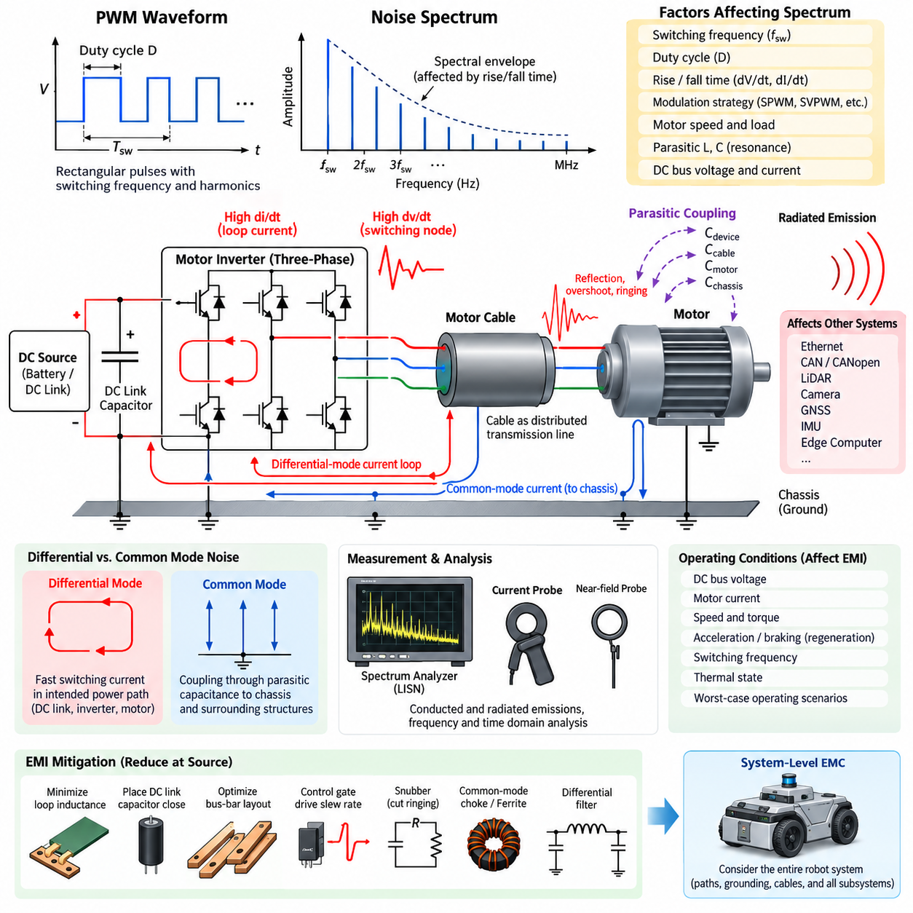
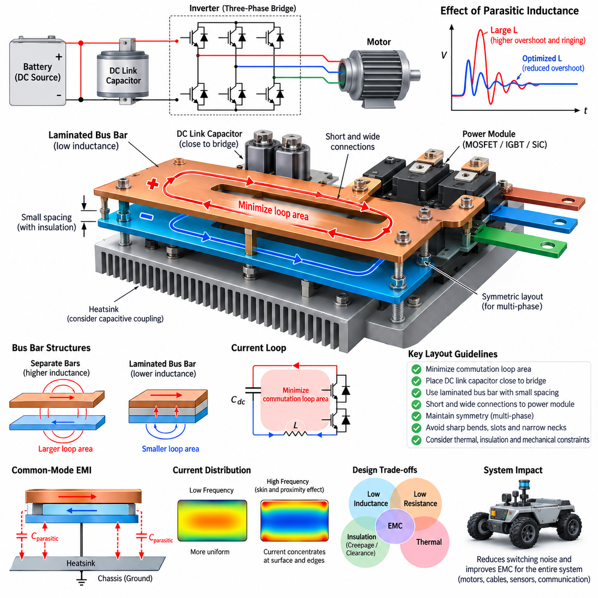
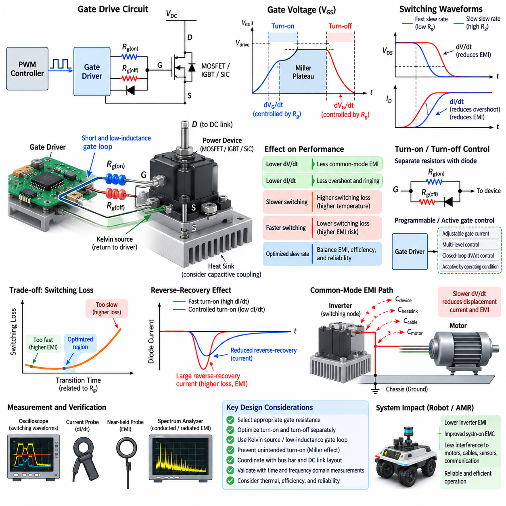
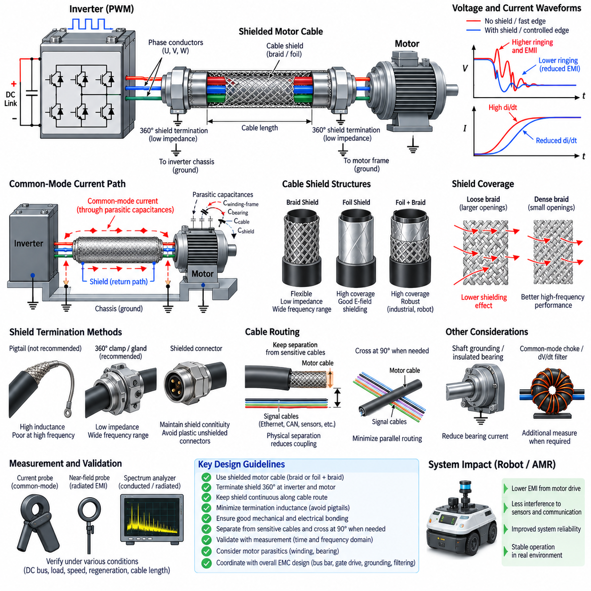
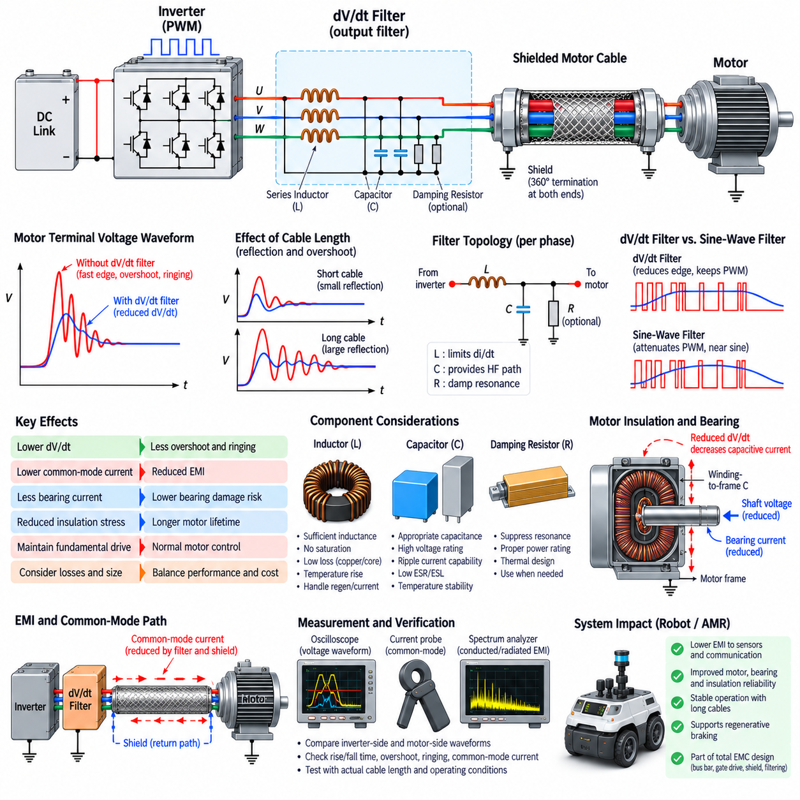

**Volume 05. Grounding and EMC**


# Chapter 06. Motor Driver EMI

##  

## 06.01. PWM Switching Noise Spectrum

{width="7.268055555555556in" height="7.268055555555556in"}

Pulse-width modulation is widely used in motor drives because it provides efficient control of voltage, current, torque, and speed. However, the rapid switching transitions that make PWM efficient also create a broad electromagnetic noise spectrum. A motor inverter therefore behaves not only as a power converter but also as a repetitive high-frequency excitation source whose energy can propagate through power cables, motor windings, chassis structures, and nearby electronic circuits.

An ideal PWM waveform consists of rectangular voltage pulses with a fundamental switching frequency and a series of harmonics extending toward very high frequencies. For a periodic waveform, spectral components appear at integer multiples of the switching frequency, while modulation by the motor electrical frequency produces additional sidebands. The resulting spectrum is therefore more complex than a simple harmonic sequence and varies continuously with duty cycle, modulation strategy, motor speed, and operating load.

The spectral envelope of PWM noise is strongly influenced by pulse rise and fall times. An infinitely fast rectangular edge would theoretically contain frequency components extending without limit, whereas practical semiconductor switching produces finite transition times that gradually reduce high-frequency energy. Faster switching edges increase the frequency range over which significant energy exists. Consequently, EMI behavior depends not only on switching frequency but also on the transition characteristics of MOSFET, IGBT, or SiC switching devices.

Switching frequency determines the basic spacing of prominent spectral components. A motor driver operating at tens of kilohertz produces strong components around its switching frequency and multiples of that frequency, but the electromagnetic disturbance can extend into the megahertz range because individual switching edges are much faster than the PWM period. This distinction is essential in EMC analysis because measuring only the nominal PWM frequency can significantly underestimate the bandwidth of the actual interference source.

Duty-cycle variation changes the relative amplitudes of individual harmonics. At some duty ratios, particular spectral components become strong, while others may be substantially reduced because of the mathematical relationship between pulse width and harmonic amplitude. During normal motor operation, the duty cycle continuously changes as the controller regulates phase current and torque. The measured EMI spectrum therefore becomes a dynamic distribution rather than a fixed set of spectral lines observed under one stationary operating condition.

Three-phase motor inverters create additional spectral complexity because multiple switching nodes operate with controlled phase relationships. Space-vector PWM, sinusoidal PWM, discontinuous PWM, and other modulation strategies distribute switching events differently over each electrical cycle. Their conducted and radiated emission signatures can therefore differ even when the DC-link voltage and average switching frequency are identical. Modulation selection consequently represents both a motor-control decision and an EMC design consideration.

Differential-mode noise is primarily associated with rapidly changing currents flowing through the intended power circuit. The DC-link capacitor, semiconductor bridge, bus structure, motor phases, and associated wiring form high-frequency current loops whose parasitic inductance converts rapid current changes into voltage disturbances. Large loop area increases magnetic-field radiation, while insufficient local decoupling allows switching-current components to propagate toward the battery, DC/DC converter, or upstream power distribution network.

Common-mode noise arises when switching-node voltage transitions couple through parasitic capacitances to the chassis, motor housing, cable shields, heat sink, bearings, and surrounding structures. High dV/dt produces displacement current through these capacitances even when no intentional conductive connection exists. The return path can extend over physically large portions of the robot, making common-mode current particularly important for radiated emissions and for interference coupled into communication or sensor wiring.

Parasitic inductance and capacitance can transform individual switching transitions into damped high-frequency oscillations. Semiconductor package inductance, PCB traces, bus bars, DC-link capacitors, motor cables, motor winding capacitance, and chassis coupling form resonant networks that produce spectral peaks far above the nominal PWM frequency. These resonances often explain unexpected narrowband emission failures and demonstrate why practical EMI diagnosis requires consideration of the complete physical current path rather than only the inverter schematic.

Motor cables significantly influence the observed spectrum because they behave as distributed transmission structures at sufficiently high frequencies. Long cables increase parasitic capacitance and provide larger structures for common-mode current and radiation. Fast voltage edges can also experience reflections when the cable and motor impedances are mismatched, producing overshoot and ringing at the motor terminals. Cable length, routing, shielding, termination, and proximity to chassis surfaces therefore directly affect PWM-related EMC performance.

Spectral analysis should distinguish between conducted emissions measured on power interfaces and radiated emissions detected through electric- or magnetic-field coupling. Current probes, voltage probes, spectrum analyzers, LISNs, and near-field probes reveal different parts of the interference mechanism. Time-domain oscilloscope measurements are equally important because correlation between switching edges, ringing waveforms, and frequency-domain peaks can identify which physical transition is responsible for a particular emission component.

Operating conditions must be controlled during PWM spectrum measurements because inverter emissions change with DC-bus voltage, motor current, rotational speed, torque, regeneration, switching frequency, and thermal state. Testing only an unloaded motor can therefore produce misleading conclusions. Representative worst-case conditions should include high bus voltage, high current, acceleration, braking, low-speed high-torque operation, and other states that maximize switching energy or alter the impedance presented by the motor and power network.

The most effective mitigation begins by reducing noise at its source rather than attempting to suppress it after propagation. Minimizing commutation-loop inductance, placing DC-link capacitors close to switching devices, optimizing bus-bar geometry, and controlling gate-drive slew rate can reduce high-frequency excitation. Snubbers can suppress resonant ringing, while appropriate common-mode chokes, ferrites, and differential filters limit conducted propagation. These measures must be coordinated because improving one frequency region may shift energy into another.

Gate resistance and programmable gate-drive control provide a practical tradeoff between switching loss and EMI. Slowing a semiconductor transition reduces dV/dt and dI/dt and can substantially decrease high-frequency spectral content, but excessive slowing increases switching losses and semiconductor temperature. Conversely, extremely fast SiC or modern MOSFET switching improves converter efficiency while demanding tighter control of parasitic impedance. EMC optimization therefore requires simultaneous electrical, thermal, efficiency, and reliability evaluation.

PWM noise must ultimately be treated as a system-level phenomenon in an AMR or Physical AI robot. Motor-driver emissions can couple into Ethernet, CAN or CANopen networks, LiDAR power lines, camera interfaces, GNSS receivers, IMUs, and edge-computing platforms through shared power, grounding, chassis, and cable paths. Understanding the switching-noise spectrum provides the basis for subsequent bus-bar optimization, gate-drive slew-rate control, motor-cable shielding, and dV/dt filtering, allowing countermeasures to target the actual propagation mechanism rather than symptoms alone.

펄스 폭 변조(Pulse-Width Modulation, PWM)는 전압, 전류, 토크(Torque), 속도를 효율적으로 제어할 수 있기 때문에 모터 드라이브(Motor Drive)에 널리 사용된다. 그러나 PWM의 높은 효율을 가능하게 하는 빠른 스위칭 천이(Switching Transition)는 동시에 광범위한 전자기 노이즈 스펙트럼(Electromagnetic Noise Spectrum)을 발생시킨다. 따라서 모터 인버터(Motor Inverter)는 단순한 전력 변환기(Power Converter)가 아니라 전력 케이블, 모터 권선(Motor Winding), 섀시(Chassis) 구조 및 주변 전자 회로를 통해 에너지를 전달하는 반복적인 고주파 여기원(High-Frequency Excitation Source)으로도 동작한다.

이상적인 PWM 파형(Waveform)은 기본 스위칭 주파수(Switching Frequency)와 매우 높은 주파수까지 확장되는 일련의 고조파(Harmonic)로 구성된 직사각형 전압 펄스(Rectangular Voltage Pulse)로 표현된다. 주기적인 파형에서는 스위칭 주파수의 정수배에 해당하는 스펙트럼 성분(Spectral Component)이 나타나며, 모터 전기 주파수(Electrical Frequency)에 의한 변조(Modulation)는 추가적인 측파대(Sideband)를 형성한다. 따라서 실제 스펙트럼은 단순한 고조파 배열보다 복잡하며 듀티 사이클(Duty Cycle), 변조 방식, 모터 속도 및 운전 부하에 따라 지속적으로 변화한다.

PWM 노이즈의 스펙트럼 포락선(Spectral Envelope)은 펄스의 상승 시간(Rise Time)과 하강 시간(Fall Time)에 크게 영향을 받는다. 무한히 빠른 직사각형 에지(Rectangular Edge)는 이론적으로 무한한 주파수까지 성분을 포함하지만, 실제 반도체 스위칭(Semiconductor Switching)은 유한한 천이 시간을 가지므로 고주파 에너지가 점진적으로 감소한다. 스위칭 에지가 빨라질수록 상당한 에너지가 존재하는 주파수 범위가 넓어진다. 따라서 전자파 간섭(EMI) 특성은 스위칭 주파수뿐 아니라 MOSFET, IGBT 또는 SiC 스위칭 소자(Switching Device)의 천이 특성에도 크게 좌우된다.

스위칭 주파수는 주요 스펙트럼 성분 사이의 기본적인 주파수 간격을 결정한다. 수십 킬로헤르츠(kHz)에서 동작하는 모터 드라이버(Motor Driver)는 스위칭 주파수와 그 정수배 부근에서 강한 성분을 발생시키지만, 각각의 스위칭 에지는 PWM 주기보다 훨씬 빠르기 때문에 전자기 교란(Electromagnetic Disturbance)은 메가헤르츠(MHz) 영역까지 확장될 수 있다. 이러한 차이는 EMC 분석에서 매우 중요하며, 공칭 PWM 주파수만 측정하면 실제 간섭원(Interference Source)의 대역폭(Bandwidth)을 크게 과소평가할 수 있다.

듀티 사이클(Duty Cycle)의 변화는 개별 고조파의 상대적인 진폭(Amplitude)을 변화시킨다. 특정 듀티 비율에서는 일부 스펙트럼 성분이 강해지는 반면 다른 성분은 펄스 폭과 고조파 진폭 사이의 수학적 관계에 따라 크게 감소할 수 있다. 정상적인 모터 운전 중에는 제어기가 상전류(Phase Current)와 토크를 조절하면서 듀티 사이클을 지속적으로 변경한다. 따라서 측정되는 EMI 스펙트럼은 하나의 고정된 운전 조건에서 관찰되는 일정한 스펙트럼 선(Spectral Line)의 집합이 아니라 동적으로 변화하는 분포로 이해해야 한다.

3상 모터 인버터(Three-Phase Motor Inverter)는 여러 스위칭 노드(Switching Node)가 제어된 위상 관계를 가지고 동작하기 때문에 추가적인 스펙트럼 복잡성을 발생시킨다. 공간 벡터 PWM(Space-Vector PWM), 정현파 PWM(Sinusoidal PWM), 불연속 PWM(Discontinuous PWM) 등의 변조 방식은 각각의 전기적 주기 동안 스위칭 이벤트(Switching Event)를 서로 다르게 분포시킨다. 따라서 DC 링크 전압(DC-Link Voltage)과 평균 스위칭 주파수가 동일하더라도 전도성 방출(Conducted Emission)과 복사성 방출(Radiated Emission)의 특성이 달라질 수 있다. 그러므로 변조 방식의 선택은 모터 제어뿐 아니라 EMC 설계 측면에서도 중요한 결정 요소이다.

차동 모드 노이즈(Differential-Mode Noise)는 주로 의도된 전력 회로를 통해 흐르는 빠르게 변화하는 전류와 관련된다. DC 링크 커패시터(DC-Link Capacitor), 반도체 브리지(Semiconductor Bridge), 버스 구조(Bus Structure), 모터 상(Phase) 및 관련 배선은 고주파 전류 루프(High-Frequency Current Loop)를 형성하며, 이 경로의 기생 인덕턴스(Parasitic Inductance)는 급격한 전류 변화를 전압 교란(Voltage Disturbance)으로 변환한다. 루프 면적이 크면 자기장 복사(Magnetic-Field Radiation)가 증가하며, 국부 디커플링(Local Decoupling)이 부족하면 스위칭 전류 성분이 배터리, DC/DC 컨버터 또는 상위 전력 분배 네트워크(Power Distribution Network)로 전파될 수 있다.

공통 모드 노이즈(Common-Mode Noise)는 스위칭 노드의 전압 천이가 기생 커패시턴스(Parasitic Capacitance)를 통해 섀시, 모터 하우징(Motor Housing), 케이블 실드(Cable Shield), 히트 싱크(Heat Sink), 베어링(Bearing) 및 주변 구조물에 결합될 때 발생한다. 높은 전압 변화율(dV/dt)은 의도적인 도전성 연결이 존재하지 않더라도 이러한 커패시턴스를 통해 변위 전류(Displacement Current)를 발생시킨다. 귀환 경로(Return Path)가 로봇의 넓은 물리적 영역에 걸쳐 형성될 수 있으므로 공통 모드 전류(Common-Mode Current)는 복사성 방출과 통신 또는 센서 배선으로 결합되는 간섭에서 특히 중요하다.

기생 인덕턴스와 기생 커패시턴스는 개별 스위칭 천이를 감쇠된 고주파 발진(Damped High-Frequency Oscillation)으로 변화시킬 수 있다. 반도체 패키지 인덕턴스(Package Inductance), PCB 배선, 버스바(Bus Bar), DC 링크 커패시터, 모터 케이블, 모터 권선 커패시턴스(Winding Capacitance) 및 섀시 결합(Chassis Coupling)은 공진 네트워크(Resonant Network)를 형성하여 공칭 PWM 주파수보다 훨씬 높은 영역에서 스펙트럼 피크(Spectral Peak)를 발생시킨다. 이러한 공진은 예상하지 못한 협대역 방출(Narrowband Emission) 시험 실패의 주요 원인이 될 수 있으며, 실제 EMI 진단에서는 인버터 회로도만이 아니라 전체 물리적 전류 경로를 고려해야 한다.

모터 케이블(Motor Cable)은 충분히 높은 주파수에서 분포정수형 전송 구조(Distributed Transmission Structure)처럼 동작하기 때문에 관찰되는 스펙트럼에 상당한 영향을 미친다. 긴 케이블은 기생 커패시턴스를 증가시키며 공통 모드 전류와 전자기 복사를 위한 더 큰 구조를 제공한다. 빠른 전압 에지는 케이블과 모터 사이의 임피던스(Impedance)가 불일치할 경우 반사(Reflection)를 발생시켜 모터 단자에서 오버슈트(Overshoot)와 링잉(Ringing)을 만들 수 있다. 따라서 케이블 길이, 배선 경로(Routing), 실딩(Shielding), 종단(Termination) 및 섀시 표면과의 상대적 위치는 PWM 관련 EMC 성능에 직접적인 영향을 준다.

스펙트럼 분석(Spectral Analysis)에서는 전력 인터페이스를 통해 측정되는 전도성 방출과 전기장(Electric Field) 또는 자기장(Magnetic Field) 결합으로 검출되는 복사성 방출을 구분해야 한다. 전류 프로브(Current Probe), 전압 프로브(Voltage Probe), 스펙트럼 분석기(Spectrum Analyzer), 라인 임피던스 안정화 네트워크(Line Impedance Stabilization Network, LISN), 근접장 프로브(Near-Field Probe)는 각각 서로 다른 간섭 메커니즘을 보여준다. 시간 영역 오실로스코프(Time-Domain Oscilloscope) 측정 역시 중요하며, 스위칭 에지와 링잉 파형 및 주파수 영역 피크 사이의 상관관계를 분석하면 특정 방출 성분을 발생시키는 물리적인 천이를 식별할 수 있다.

인버터 방출은 DC 버스 전압(DC-Bus Voltage), 모터 전류, 회전 속도, 토크, 회생 제동(Regeneration), 스위칭 주파수 및 열 상태(Thermal State)에 따라 달라지므로 PWM 스펙트럼 측정에서는 운전 조건을 엄격하게 관리해야 한다. 무부하 모터(Unloaded Motor)만을 이용한 시험은 실제 시스템의 EMC 특성을 잘못 판단하게 만들 수 있다. 대표적인 최악 조건(Worst-Case Condition)에는 높은 버스 전압, 높은 전류, 가속, 제동, 저속 고토크 운전 및 스위칭 에너지를 최대화하거나 모터와 전력 네트워크의 임피던스를 변화시키는 운전 상태가 포함되어야 한다.

가장 효과적인 EMI 저감(Mitigation)은 노이즈가 전파된 이후 이를 억제하는 것보다 발생원에서 노이즈 자체를 줄이는 것에서 시작한다. 정류 루프 인덕턴스(Commutation-Loop Inductance)를 최소화하고, DC 링크 커패시터를 스위칭 소자 가까이에 배치하며, 버스바 형상(Bus-Bar Geometry)을 최적화하고, 게이트 드라이브 슬루율(Gate-Drive Slew Rate)을 제어하면 고주파 여기를 감소시킬 수 있다. 스너버(Snubber)는 공진 링잉을 억제할 수 있으며, 적절한 공통 모드 초크(Common-Mode Choke), 페라이트(Ferrite), 차동 필터(Differential Filter)는 전도성 노이즈의 전파를 제한한다. 이러한 대책들은 한 주파수 영역의 개선이 다른 영역으로 에너지를 이동시킬 수 있으므로 상호 연계하여 적용해야 한다.

게이트 저항(Gate Resistance)과 프로그래머블 게이트 드라이브 제어(Programmable Gate-Drive Control)는 스위칭 손실(Switching Loss)과 EMI 사이의 실용적인 절충점을 제공한다. 반도체의 천이 속도를 낮추면 dV/dt와 dI/dt가 감소하여 고주파 스펙트럼 성분을 크게 줄일 수 있지만, 지나치게 느린 스위칭은 스위칭 손실과 반도체 온도를 증가시킨다. 반대로 매우 빠른 SiC 또는 최신 MOSFET 스위칭은 컨버터 효율을 높일 수 있지만 기생 임피던스(Parasitic Impedance)를 더욱 엄격하게 관리해야 한다. 따라서 EMC 최적화는 전기적 특성, 열 특성, 효율 및 신뢰성(Reliability)을 동시에 고려하여 수행해야 한다.

PWM 노이즈는 최종적으로 자율이동로봇(Autonomous Mobile Robot, AMR) 또는 피지컬 AI(Physical AI) 로봇의 시스템 수준 현상(System-Level Phenomenon)으로 다루어야 한다. 모터 드라이버에서 발생한 방출은 공유 전원, 접지(Grounding), 섀시 및 케이블 경로를 통해 이더넷(Ethernet), CAN 또는 CANopen 네트워크, 라이다(LiDAR) 전원선, 카메라 인터페이스(Camera Interface), 위성항법시스템(GNSS) 수신기, 관성측정장치(IMU), 엣지 컴퓨팅(Edge Computing) 플랫폼으로 결합될 수 있다. 스위칭 노이즈 스펙트럼을 이해하는 것은 이후의 버스바 레이아웃 최적화(Bus-Bar Layout Optimization), 게이트 드라이브 슬루율 제어, 모터 케이블 실드 설계(Motor Cable Shield Design), 전압 변화율 필터(dV/dt Filter) 설계의 기반이 되며, 단순히 증상을 억제하는 것이 아니라 실제 노이즈 전파 메커니즘을 대상으로 적절한 대책을 적용할 수 있게 한다.

##  

## 06.02. Bus Bar Layout Optimization

{width="7.268055555555556in" height="7.268055555555556in"}

Bus bars are critical conductors in motor-drive power stages because they carry high DC and switching currents between the battery, DC-link capacitors, semiconductor bridge, and associated power components. Their geometry directly influences resistance, parasitic inductance, voltage overshoot, ringing, electromagnetic emission, and semiconductor stress. Bus-bar layout optimization is therefore not simply a packaging task but an essential part of electrical, thermal, and EMC design.

The primary EMC objective of a bus-bar layout is to minimize the area enclosed by high-frequency commutation-current loops. During inverter switching, current transfers rapidly between semiconductor devices and the DC-link capacitor, producing large di/dt. Any inductance within this path generates a transient voltage according to V = L·di/dt. Even a small parasitic inductance can therefore produce substantial voltage spikes when modern MOSFET or SiC devices switch at high speed.

The most important current path is normally the local commutation loop formed by the positive DC-link conductor, switching devices, negative conductor, and DC-link capacitor. These elements should be positioned so that the outgoing and returning currents travel through closely coupled paths. Increasing physical separation enlarges loop area and magnetic flux linkage, increasing both parasitic inductance and radiated magnetic-field energy. Compact current-loop geometry is consequently a fundamental layout principle.

A laminated bus bar is particularly effective because positive and negative conductors can be arranged as broad overlapping planes separated by a thin dielectric layer. Currents flowing in opposite directions create opposing magnetic fields, reducing net magnetic flux and effective loop inductance. Compared with widely separated cables or discrete copper bars, a properly designed laminated structure can provide substantially lower parasitic inductance and more predictable high-frequency electrical behavior.

The spacing between positive and negative bus-bar layers should generally be minimized while maintaining the required insulation voltage, creepage, clearance, manufacturing tolerance, and reliability margin. Reducing layer separation improves magnetic coupling and decreases loop inductance. However, excessive reduction can increase interlayer capacitance and electric-field stress. Optimization must therefore consider inductive and capacitive parasitics together rather than treating minimum physical spacing as an unconditional objective.

DC-link capacitor placement has a decisive influence on bus-bar performance. The high-frequency capacitor should be located electrically and physically close to the switching bridge so that switching current circulates through the smallest possible local loop. Long connections between the capacitor and semiconductor devices add inductance that cannot be eliminated by increasing capacitor value. A large capacitor placed far from the inverter can therefore perform worse at high frequencies than a smaller, low-inductance capacitor positioned directly across the switching bus.

Connections to semiconductor modules require special attention because terminal geometry can dominate the remaining commutation inductance after the main bus structure has been optimized. Wide, short connections are preferable to narrow and elongated conductors. Abrupt changes in current direction, unnecessary bends, long standoffs, and asymmetric terminal paths should be minimized. Where possible, the positive and negative paths should remain geometrically coupled until they reach the power-module terminals.

Symmetry is important in multiphase and parallel power stages. Unequal bus-bar path length, resistance, or inductance can cause uneven current sharing among semiconductor devices or inverter branches. At high switching speeds, apparently small geometric differences can produce different transient voltages and current distributions. A symmetric layout improves electrical balance, simplifies gate-drive optimization, and reduces the probability that one device experiences disproportionately high electrical or thermal stress.

Bus-bar width and thickness must be selected using both low-frequency and high-frequency considerations. Increasing conductor cross-sectional area reduces DC resistance and conduction loss, but high-frequency current distribution is affected by skin effect and proximity effect. Current can concentrate near conductor surfaces or particular edges when neighboring conductors carry opposing currents. Consequently, current density cannot always be estimated accurately by dividing total current by the gross copper cross-sectional area.

Corners, slots, mounting holes, necked regions, and terminal transitions can produce localized current-density concentration. These regions increase resistive heating and may also disturb the magnetic-field distribution around the commutation path. Smooth transitions and adequate conductor width around mechanical features help prevent electrical and thermal hot spots. Mechanical fastening requirements should therefore be incorporated early into electrical layout design rather than added after the current path has already been optimized.

Bus-bar geometry also affects common-mode EMI. Switching nodes with high dV/dt can capacitively couple to the chassis, heat sink, enclosure, motor housing, or nearby conductors. Large switching-node surface area facing grounded structures increases parasitic capacitance and displacement current. The layout should therefore keep high-dV/dt copper regions compact while allowing DC positive and negative conductors, whose opposing currents benefit from close coupling, to use appropriate overlapping geometry.

The relationship between the bus bar and heat sink must be evaluated carefully. A heat sink can act as a significant common-mode coupling structure when semiconductor switching nodes have parasitic capacitance to it. If the heat sink is connected to chassis ground, switching current can flow through this capacitance into the chassis and return through cables or other structures. Physical placement, insulation material, dielectric thickness, and grounding strategy therefore influence both thermal performance and common-mode emissions.

Voltage overshoot and ringing provide useful indicators of inadequate bus-bar layout. When switching current interacts with parasitic inductance and device capacitance, an LC resonant network is formed. The resulting oscillation can increase semiconductor voltage stress and generate narrowband spectral peaks at frequencies far above the PWM switching frequency. Reducing commutation inductance through layout optimization frequently decreases both the amplitude of the transient and the energy available to excite these resonances.

Bus-bar optimization should be validated using both simulation and measurement. Electromagnetic or parasitic-extraction tools can estimate current density, inductance, capacitance, and field distribution before hardware is manufactured. Prototype measurements can then evaluate switching-node overshoot, ringing frequency, current-loop behavior, conducted emissions, and near-field radiation. Correlating simulated parasitic parameters with measured switching waveforms is especially valuable for identifying the physical structure responsible for unexpected EMI.

Measurement technique is important because poor probing can introduce an artificial loop and create misleading high-frequency waveforms. Switching-node voltage should be measured using probes and connections with very small loop area, while current probes and near-field probes can help identify dominant current paths and radiation sources. Measurements should be repeated under representative DC-bus voltage, motor current, torque, acceleration, braking, and regeneration conditions because parasitic effects can become more severe at high switching energy.

Bus-bar layout must also satisfy thermal, mechanical, insulation, serviceability, and manufacturing requirements. Copper thickness and surface area influence temperature rise, while vibration and repeated thermal expansion impose mechanical stress on joints and terminals. Creepage and clearance requirements constrain conductor spacing, and assembly tolerances can alter intended geometry. An electrically excellent layout that cannot maintain insulation integrity or survive robotic vibration is not a practical optimized design.

For AMRs and other Physical AI robotic platforms, bus-bar optimization should be considered part of system-level EMC architecture. A low-inductance inverter power path reduces switching overshoot at its origin and limits the high-frequency energy available to propagate through battery wiring, chassis, motor cables, Ethernet, CAN or CANopen, LiDAR, cameras, GNSS, IMUs, and edge computers. Combined with DC-link optimization, gate-drive slew-rate control, shielding, grounding, and filtering, an optimized bus bar provides one of the most effective foundations for reliable motor-drive EMC performance.

버스바(Bus Bar)는 배터리, DC 링크 커패시터(DC-Link Capacitor), 반도체 브리지(Semiconductor Bridge) 및 관련 전력 부품 사이에서 높은 직류 전류와 스위칭 전류를 전달하기 때문에 모터 드라이브 전력단(Motor-Drive Power Stage)의 핵심 도체이다. 버스바의 형상은 저항, 기생 인덕턴스(Parasitic Inductance), 전압 오버슈트(Voltage Overshoot), 링잉(Ringing), 전자기 방출(Electromagnetic Emission) 및 반도체 스트레스(Semiconductor Stress)에 직접적인 영향을 준다. 따라서 버스바 레이아웃 최적화(Bus-Bar Layout Optimization)는 단순한 패키징 작업이 아니라 전기, 열 및 전자기 적합성(EMC) 설계의 핵심 요소이다.

버스바 레이아웃의 가장 중요한 EMC 목표는 고주파 정류 전류 루프(High-Frequency Commutation-Current Loop)가 형성하는 면적을 최소화하는 것이다. 인버터 스위칭 과정에서 전류는 반도체 소자와 DC 링크 커패시터 사이에서 빠르게 전환되며 큰 전류 변화율(di/dt)을 발생시킨다. 이 경로에 존재하는 인덕턴스는 V = L·di/dt 관계에 따라 과도 전압(Transient Voltage)을 발생시킨다. 따라서 최신 MOSFET 또는 SiC 소자가 고속으로 스위칭할 경우 매우 작은 기생 인덕턴스도 상당한 전압 스파이크(Voltage Spike)를 발생시킬 수 있다.

가장 중요한 전류 경로는 일반적으로 DC 링크 양극 도체(Positive DC-Link Conductor), 스위칭 소자(Switching Device), 음극 도체(Negative Conductor), DC 링크 커패시터로 구성되는 국부 정류 루프(Local Commutation Loop)이다. 이들 요소는 나가는 전류와 돌아오는 전류가 서로 밀접하게 결합된 경로를 통과하도록 배치해야 한다. 물리적인 간격이 증가하면 루프 면적과 자기 선속 쇄교(Magnetic Flux Linkage)가 증가하여 기생 인덕턴스와 복사 자기장 에너지(Radiated Magnetic-Field Energy)가 모두 증가한다. 따라서 소형화된 전류 루프 형상(Compact Current-Loop Geometry)은 기본적인 레이아웃 설계 원칙이다.

적층 버스바(Laminated Bus Bar)는 양극과 음극 도체를 얇은 유전체층(Dielectric Layer)을 사이에 두고 넓게 중첩된 평면 형태로 배치할 수 있기 때문에 특히 효과적이다. 반대 방향으로 흐르는 전류는 서로 반대되는 자기장을 형성하여 순 자기 선속(Net Magnetic Flux)과 유효 루프 인덕턴스(Effective Loop Inductance)를 감소시킨다. 넓게 분리된 케이블이나 개별 구리 바(Copper Bar)와 비교하면 적절하게 설계된 적층 구조는 기생 인덕턴스를 크게 낮추고 보다 예측 가능한 고주파 전기적 특성을 제공할 수 있다.

양극과 음극 버스바 층 사이의 간격은 요구되는 절연 전압(Insulation Voltage), 연면거리(Creepage), 공간거리(Clearance), 제조 공차(Manufacturing Tolerance) 및 신뢰성 여유(Reliability Margin)를 만족하는 범위에서 일반적으로 최소화해야 한다. 층간 간격을 줄이면 자기 결합(Magnetic Coupling)이 향상되고 루프 인덕턴스가 감소한다. 그러나 지나치게 작은 간격은 층간 커패시턴스(Interlayer Capacitance)와 전기장 스트레스(Electric-Field Stress)를 증가시킬 수 있다. 따라서 최적화에서는 물리적 간격을 무조건 최소화하기보다 유도성 및 용량성 기생 성분(Inductive and Capacitive Parasitics)을 함께 고려해야 한다.

DC 링크 커패시터의 배치는 버스바 성능에 결정적인 영향을 미친다. 고주파 커패시터(High-Frequency Capacitor)는 스위칭 전류가 가능한 한 작은 국부 루프를 통해 순환하도록 스위칭 브리지(Switching Bridge)에 전기적·물리적으로 가깝게 배치해야 한다. 커패시터와 반도체 소자 사이의 긴 연결은 커패시터 용량을 증가시키는 것만으로 제거할 수 없는 인덕턴스를 추가한다. 따라서 인버터에서 멀리 배치된 대용량 커패시터보다 스위칭 버스에 직접 연결된 소형 저인덕턴스 커패시터(Low-Inductance Capacitor)가 고주파 영역에서 더 우수한 성능을 제공할 수 있다.

반도체 모듈(Semiconductor Module)과의 연결은 특별한 주의가 필요하다. 주 버스 구조를 최적화한 이후에도 단자 형상(Terminal Geometry)이 잔여 정류 인덕턴스(Commutation Inductance)를 지배할 수 있기 때문이다. 좁고 긴 도체보다 넓고 짧은 연결이 바람직하다. 전류 방향의 급격한 변화, 불필요한 굴곡, 긴 스탠드오프(Standoff), 비대칭 단자 경로는 최소화해야 한다. 가능한 경우 양극과 음극 경로는 전력 모듈 단자(Power-Module Terminal)에 도달할 때까지 기하학적으로 밀접한 결합 상태를 유지해야 한다.

다상 및 병렬 전력단(Multiphase and Parallel Power Stage)에서는 대칭성(Symmetry)이 중요하다. 버스바 경로 길이, 저항 또는 인덕턴스가 서로 다르면 반도체 소자 또는 인버터 분기(Inverter Branch) 사이에서 불균일한 전류 분담(Current Sharing)이 발생할 수 있다. 높은 스위칭 속도에서는 작은 기하학적 차이도 서로 다른 과도 전압과 전류 분포를 발생시킬 수 있다. 대칭적인 레이아웃은 전기적 균형을 개선하고 게이트 드라이브 최적화(Gate-Drive Optimization)를 단순화하며 특정 소자에 과도한 전기적 또는 열적 스트레스가 집중될 가능성을 줄여준다.

버스바의 폭과 두께는 저주파 및 고주파 특성을 모두 고려하여 선정해야 한다. 도체의 단면적을 증가시키면 직류 저항(DC Resistance)과 도통 손실(Conduction Loss)이 감소하지만, 고주파 전류 분포는 표피 효과(Skin Effect)와 근접 효과(Proximity Effect)의 영향을 받는다. 인접한 도체에 반대 방향의 전류가 흐르면 전류가 도체 표면이나 특정 가장자리 부분에 집중될 수 있다. 따라서 전체 전류를 단순히 구리 도체의 전체 단면적으로 나누는 방식만으로는 실제 전류 밀도(Current Density)를 항상 정확하게 평가할 수 없다.

모서리, 슬롯(Slot), 장착 구멍(Mounting Hole), 폭이 좁아지는 영역(Necked Region) 및 단자 전이부(Terminal Transition)는 국부적인 전류 밀도 집중을 발생시킬 수 있다. 이러한 영역은 저항성 발열(Resistive Heating)을 증가시키며 정류 경로 주변의 자기장 분포를 교란할 수도 있다. 완만한 형상 전이와 기계적 구조 주변에서 충분한 도체 폭을 확보하면 전기적·열적 핫스팟(Hot Spot)을 방지하는 데 도움이 된다. 따라서 기계적 체결 요구사항(Mechanical Fastening Requirement)은 전류 경로 최적화 이후에 추가하는 것이 아니라 전기적 레이아웃 설계 초기부터 함께 고려해야 한다.

버스바 형상은 공통 모드 전자파 간섭(Common-Mode EMI)에도 영향을 미친다. 높은 전압 변화율(dV/dt)을 갖는 스위칭 노드는 섀시, 히트 싱크(Heat Sink), 인클로저(Enclosure), 모터 하우징(Motor Housing) 또는 인접 도체와 용량성 결합(Capacitive Coupling)을 형성할 수 있다. 접지 구조를 마주보는 스위칭 노드의 표면적이 넓어질수록 기생 커패시턴스와 변위 전류(Displacement Current)가 증가한다. 따라서 높은 dV/dt가 발생하는 구리 영역은 가능한 한 작게 유지하면서, 서로 반대 방향의 전류가 흐르는 DC 양극과 음극 도체는 적절한 중첩 구조를 통해 밀접하게 결합하도록 설계해야 한다.

버스바와 히트 싱크 사이의 관계도 신중하게 평가해야 한다. 반도체 스위칭 노드가 히트 싱크와 기생 커패시턴스를 형성하면 히트 싱크 자체가 중요한 공통 모드 결합 구조(Common-Mode Coupling Structure)로 동작할 수 있다. 히트 싱크가 섀시 접지(Chassis Ground)에 연결되어 있다면 스위칭 전류가 이 커패시턴스를 통해 섀시로 흐르고 케이블이나 다른 구조물을 통해 귀환할 수 있다. 따라서 물리적 배치, 절연 재료(Insulation Material), 유전체 두께(Dielectric Thickness) 및 접지 전략(Grounding Strategy)은 열 성능과 공통 모드 방출 모두에 영향을 미친다.

전압 오버슈트와 링잉은 부적절한 버스바 레이아웃을 판단하는 유용한 지표가 된다. 스위칭 전류가 기생 인덕턴스 및 소자 커패시턴스(Device Capacitance)와 상호작용하면 LC 공진 네트워크(LC Resonant Network)가 형성된다. 이에 따른 발진은 반도체의 전압 스트레스를 증가시키고 PWM 스위칭 주파수보다 훨씬 높은 영역에서 협대역 스펙트럼 피크(Narrowband Spectral Peak)를 발생시킬 수 있다. 레이아웃 최적화를 통해 정류 인덕턴스를 감소시키면 과도 현상의 진폭과 이러한 공진을 여기하는 에너지를 동시에 줄일 수 있다.

버스바 최적화는 시뮬레이션(Simulation)과 측정(Measurement)을 모두 이용하여 검증해야 한다. 전자기 해석(Electromagnetic Analysis) 또는 기생 성분 추출 도구(Parasitic-Extraction Tool)를 이용하면 하드웨어 제작 전에 전류 밀도, 인덕턴스, 커패시턴스 및 전자기장 분포(Field Distribution)를 예측할 수 있다. 이후 프로토타입 측정을 통해 스위칭 노드 오버슈트, 링잉 주파수, 전류 루프 동작, 전도성 방출 및 근접장 복사(Near-Field Radiation)를 평가할 수 있다. 특히 시뮬레이션으로 추출한 기생 파라미터와 실제 측정된 스위칭 파형을 연계하면 예상하지 못한 EMI를 발생시키는 물리적 구조를 식별하는 데 매우 유용하다.

측정 방법(Measurement Technique) 역시 중요하다. 부적절한 프로빙(Probing)은 인위적인 측정 루프를 추가하여 실제와 다른 고주파 파형을 만들어낼 수 있기 때문이다. 스위칭 노드 전압은 매우 작은 루프 면적을 갖는 프로브와 연결 방법을 사용하여 측정해야 하며, 전류 프로브(Current Probe)와 근접장 프로브(Near-Field Probe)를 이용하면 주요 전류 경로와 복사원을 식별할 수 있다. 기생 효과는 높은 스위칭 에너지 조건에서 더욱 심해질 수 있으므로 실제 DC 버스 전압, 모터 전류, 토크, 가속, 제동 및 회생 제동(Regeneration) 조건에서 측정을 반복해야 한다.

버스바 레이아웃은 열, 기계, 절연, 정비성(Serviceability) 및 제조 요구사항도 만족해야 한다. 구리 두께와 표면적은 온도 상승에 영향을 미치며, 진동과 반복적인 열팽창(Thermal Expansion)은 접합부와 단자에 기계적 스트레스를 가한다. 연면거리와 공간거리 요구사항은 도체 간격을 제한하고 조립 공차(Assembly Tolerance)는 의도한 형상을 변화시킬 수 있다. 전기적으로 매우 우수하더라도 절연 건전성(Insulation Integrity)을 유지하지 못하거나 로봇의 진동 환경을 견딜 수 없는 레이아웃은 실용적인 최적 설계라고 할 수 없다.

자율이동로봇(Autonomous Mobile Robot, AMR) 및 기타 피지컬 AI(Physical AI) 로봇 플랫폼에서는 버스바 최적화를 시스템 수준 EMC 아키텍처(System-Level EMC Architecture)의 일부로 고려해야 한다. 저인덕턴스 인버터 전력 경로(Low-Inductance Inverter Power Path)는 발생원에서 스위칭 오버슈트를 감소시키고 배터리 배선, 섀시, 모터 케이블, 이더넷(Ethernet), CAN 또는 CANopen, 라이다(LiDAR), 카메라, 위성항법시스템(GNSS), 관성측정장치(IMU) 및 엣지 컴퓨터(Edge Computer)로 전파될 수 있는 고주파 에너지를 제한한다. DC 링크 최적화, 게이트 드라이브 슬루율 제어(Gate-Drive Slew-Rate Control), 실딩(Shielding), 접지 및 필터링(Filtering)과 결합된 최적화 버스바는 신뢰성 높은 모터 드라이브 EMC 성능을 확보하기 위한 가장 효과적인 기반 중 하나이다.

##  

## 06.03. Gate Drive Slew Rate Control

{width="7.268055555555556in" height="7.268055555555556in"}

Gate-drive slew-rate control is a fundamental technique for managing the switching behavior of power semiconductors in motor inverters. By controlling how rapidly a MOSFET, IGBT, or SiC device transitions between its ON and OFF states, the designer can influence voltage slew rate, current slew rate, switching loss, overshoot, ringing, and electromagnetic emissions. The objective is not simply to make switching slower, but to achieve an optimized transition for the complete power stage.

During a switching transition, the gate driver must charge or discharge the semiconductor device\'s gate capacitances. The resulting gate current determines how quickly the gate-source voltage changes and therefore influences the device switching trajectory. A higher gate current generally produces faster transitions, while a lower gate current slows them. Gate resistance is consequently one of the simplest and most widely used parameters for controlling switching speed in practical motor-drive circuits.

The relationship between gate resistance and switching behavior becomes especially important during the Miller plateau. In this interval, gate current is largely used to charge or discharge the gate-drain capacitance while the drain-source or collector-emitter voltage changes rapidly. The available gate current therefore has a direct influence on dV/dt. Adjusting external gate resistance allows the designer to control this voltage transition without changing the PWM switching frequency or the commanded motor operating point.

Current slew rate, expressed as dI/dt, is also influenced by gate-drive strength. Rapid turn-on can cause motor-phase or commutation current to transfer quickly between semiconductor devices, generating voltage across parasitic inductance according to V = L·dI/dt. Excessive dI/dt can therefore increase voltage overshoot, ringing, electromagnetic radiation, and stress on semiconductor packages, DC-link connections, and bus bars. Slew-rate control reduces the excitation of these parasitic structures.

Reducing dV/dt is particularly important for common-mode EMI. Fast switching-node voltage transitions couple through parasitic capacitances between the semiconductor, heat sink, motor winding, cable, chassis, and surrounding structures. The resulting displacement current is approximately proportional to capacitance and dV/dt. Slowing the transition can therefore reduce common-mode current at its source, decreasing the high-frequency energy that propagates through the chassis and motor-cable system.

Slower switching, however, is not universally beneficial. During the transition between blocking and conducting states, the semiconductor simultaneously supports significant voltage and current, producing switching energy loss. Increasing transition time generally increases this overlap and raises switching losses. Excessive gate resistance can therefore increase junction temperature, reduce inverter efficiency, and limit achievable switching frequency or output power. EMC improvement must consequently be balanced against thermal and efficiency requirements.

Turn-on and turn-off behavior often require different optimization. A single gate resistor imposes similar constraints on both directions, but separate turn-on and turn-off resistors can provide greater flexibility. Diodes in the gate network can direct charging and discharging currents through different resistance values. This allows turn-on to be slowed for EMI control while maintaining sufficiently fast turn-off, or the opposite, depending on overshoot, reverse-recovery behavior, short-circuit response, and device requirements.

Gate-drive optimization must also consider reverse-recovery effects in complementary switching devices. When one transistor turns on, current may force the opposite freewheeling diode or body diode through reverse recovery. A very high turn-on dI/dt can produce a large reverse-recovery current peak and additional switching loss. This transient can excite bus-bar and package inductances, producing ringing and EMI. Controlled turn-on can reduce the severity of this commutation event and improve waveform stability.

SiC MOSFETs make slew-rate control particularly important because their low switching losses permit extremely fast voltage and current transitions. These fast edges improve converter efficiency but can generate substantial high-frequency spectral energy if the surrounding power loop is not carefully designed. Small parasitic inductances that were relatively insignificant with slower devices can become dominant. Gate-drive design for SiC must therefore be coordinated closely with DC-link capacitor placement and bus-bar layout optimization.

Gate-loop layout is itself an essential part of slew-rate control. The driver, gate resistor, semiconductor gate, and source or emitter return should form a compact low-inductance loop. Excessive common-source inductance can create feedback voltage proportional to dI/dt, modifying the effective gate voltage during switching. Kelvin source or Kelvin emitter connections are therefore valuable because they separate the gate-drive return path from the high-current power path and improve control of the actual switching transition.

Parasitic gate coupling can also cause unintended switching. High dV/dt at the switching node can inject current through the Miller capacitance of a nominally OFF device, increasing its gate voltage. If this voltage exceeds the threshold, transient turn-on or shoot-through may occur. Appropriate turn-off resistance, negative gate bias, Miller clamps, optimized gate-loop inductance, and suitable driver strength can improve immunity against this mechanism while maintaining the desired switching speed.

More advanced gate drivers can control slew rate dynamically rather than relying on a fixed resistor. Programmable gate current, multi-level gate resistance, active gate control, or closed-loop dV/dt control can divide the switching event into several phases. Strong initial drive may move the device rapidly toward the Miller region, reduced drive can control the critical voltage transition, and stronger drive can then complete the switching event. This approach can reduce EMI without unnecessarily increasing total switching loss.

Active gate control is especially useful when inverter operating conditions vary widely. The optimum gate-drive setting at low current may not be optimum at high current, high DC-bus voltage, regenerative braking, or elevated temperature. A programmable driver can select different slew-rate profiles according to operating state. Such adaptation allows the inverter to maintain acceptable overshoot and EMI while avoiding excessive switching losses under conditions where aggressive suppression is unnecessary.

Snubbers and gate slew-rate control should be considered complementary rather than interchangeable techniques. Gate control reduces the energy used to excite parasitic resonances, while an RC or RCD snubber can damp residual oscillation associated with the power-loop inductance and device capacitance. If severe ringing remains after reasonable slew-rate adjustment, the underlying bus-bar, DC-link, or package parasitics should also be investigated rather than relying solely on a very large gate resistance.

Optimization requires simultaneous time-domain and frequency-domain measurement. An oscilloscope can reveal switching-node dV/dt, device dI/dt, gate voltage, overshoot, ringing, and transition duration, while spectrum or near-field measurements show how these changes affect EMI. Gate resistance should therefore not be selected solely from switching-waveform appearance. The preferred value is one that satisfies device stress, thermal performance, efficiency, control stability, and conducted and radiated emission requirements together.

Measurement technique is critical when evaluating fast gate-drive transitions. Long oscilloscope ground leads or large probe loops can introduce inductance and display ringing that does not exist at the semiconductor terminals. High-bandwidth differential probes, short connections, appropriate current probes, and carefully defined reference points are required. Gate-source voltage should ideally be measured directly at the device or Kelvin terminals so that parasitic voltage in the power-current path is not mistaken for gate-drive behavior.

In an AMR or Physical AI robot, gate-drive slew-rate control contributes directly to system-level EMC robustness. Reducing excessive dV/dt and dI/dt at the motor inverter limits high-frequency energy before it couples into motor cables, chassis structures, battery wiring, Ethernet, CAN or CANopen, LiDAR, cameras, GNSS, IMUs, and edge computers. When combined with optimized bus bars, grounding, shielding, filtering, and motor-cable design, controlled switching provides an effective balance between inverter efficiency, semiconductor reliability, and electromagnetic compatibility.

게이트 드라이브 슬루율 제어(Gate-Drive Slew-Rate Control)는 모터 인버터(Motor Inverter)에서 전력 반도체(Power Semiconductor)의 스위칭 동작을 관리하기 위한 핵심적인 기법이다. MOSFET, IGBT 또는 SiC 소자가 온(ON) 상태와 오프(OFF) 상태 사이에서 전환되는 속도를 제어함으로써 전압 슬루율(Voltage Slew Rate), 전류 슬루율(Current Slew Rate), 스위칭 손실(Switching Loss), 오버슈트(Overshoot), 링잉(Ringing) 및 전자기 방출(Electromagnetic Emission)에 영향을 줄 수 있다. 목표는 단순히 스위칭 속도를 낮추는 것이 아니라 전체 전력단(Power Stage)에 최적화된 천이 특성을 구현하는 것이다.

스위칭 천이(Switching Transition)가 발생하는 동안 게이트 드라이버(Gate Driver)는 반도체 소자의 게이트 커패시턴스(Gate Capacitance)를 충전하거나 방전해야 한다. 이 과정에서 발생하는 게이트 전류(Gate Current)는 게이트-소스 전압(Gate-Source Voltage)이 얼마나 빠르게 변화하는지를 결정하며, 이에 따라 소자의 스위칭 궤적(Switching Trajectory)에 영향을 준다. 일반적으로 높은 게이트 전류는 빠른 천이를 발생시키고 낮은 게이트 전류는 천이를 느리게 만든다. 따라서 게이트 저항(Gate Resistance)은 실제 모터 드라이브 회로에서 스위칭 속도를 제어하기 위해 가장 간단하면서도 널리 사용되는 파라미터 중 하나이다.

게이트 저항과 스위칭 동작 사이의 관계는 밀러 평탄 구간(Miller Plateau)에서 특히 중요해진다. 이 구간에서는 드레인-게이트 커패시턴스(Gate-Drain Capacitance)를 충전하거나 방전하는 데 게이트 전류의 상당 부분이 사용되며, 동시에 드레인-소스 전압(Drain-Source Voltage) 또는 컬렉터-이미터 전압(Collector-Emitter Voltage)이 빠르게 변화한다. 따라서 사용 가능한 게이트 전류는 전압 변화율(dV/dt)에 직접적인 영향을 준다. 외부 게이트 저항을 조절하면 PWM 스위칭 주파수나 명령된 모터 운전점을 변경하지 않고도 이러한 전압 천이를 제어할 수 있다.

전류 변화율(Current Slew Rate)을 의미하는 dI/dt 역시 게이트 드라이브 강도(Gate-Drive Strength)의 영향을 받는다. 빠른 턴온(Turn-On)은 모터 상 또는 정류 전류(Commutation Current)를 반도체 소자 사이에서 빠르게 전환시키며, V = L·dI/dt 관계에 따라 기생 인덕턴스(Parasitic Inductance)에 전압을 발생시킨다. 과도한 dI/dt는 전압 오버슈트, 링잉, 전자기 복사(Electromagnetic Radiation)를 증가시키고 반도체 패키지, DC 링크 연결부 및 버스바(Bus Bar)에 스트레스를 가할 수 있다. 슬루율 제어는 이러한 기생 구조가 과도하게 여기되는 것을 감소시킨다.

전압 변화율(dV/dt)의 감소는 특히 공통 모드 전자파 간섭(Common-Mode EMI)을 억제하는 데 중요하다. 빠른 스위칭 노드 전압 천이는 반도체, 히트 싱크(Heat Sink), 모터 권선(Motor Winding), 케이블, 섀시(Chassis) 및 주변 구조 사이에 존재하는 기생 커패시턴스(Parasitic Capacitance)를 통해 결합된다. 이때 발생하는 변위 전류(Displacement Current)는 대략 커패시턴스와 dV/dt에 비례한다. 따라서 천이 속도를 낮추면 발생원에서 공통 모드 전류를 줄일 수 있으며, 섀시와 모터 케이블 시스템을 통해 전파되는 고주파 에너지도 감소시킬 수 있다.

그러나 스위칭 속도를 낮추는 것이 항상 유리한 것은 아니다. 반도체가 차단 상태(Blocking State)와 도통 상태(Conducting State) 사이에서 천이하는 동안 상당한 전압과 전류가 동시에 소자에 인가되어 스위칭 에너지 손실(Switching Energy Loss)이 발생한다. 일반적으로 천이 시간이 증가하면 전압과 전류가 중첩되는 시간이 길어져 스위칭 손실이 증가한다. 따라서 지나치게 큰 게이트 저항은 접합부 온도(Junction Temperature)를 상승시키고 인버터 효율을 감소시키며 구현 가능한 스위칭 주파수 또는 출력 전력을 제한할 수 있다. 그러므로 EMC 개선은 열 및 효율 요구사항과 균형을 이루어야 한다.

턴온과 턴오프(Turn-Off) 동작은 서로 다른 최적화가 필요한 경우가 많다. 하나의 게이트 저항만 사용하면 양방향 천이에 유사한 제약이 적용되지만, 별도의 턴온 저항과 턴오프 저항을 사용하면 더 높은 설계 유연성을 확보할 수 있다. 게이트 네트워크의 다이오드(Diode)를 이용하면 충전 전류와 방전 전류가 서로 다른 저항값을 통과하도록 구성할 수 있다. 이를 통해 EMI 제어를 위해 턴온을 느리게 하면서 충분히 빠른 턴오프를 유지하거나, 오버슈트, 역회복(Reverse Recovery), 단락 응답(Short-Circuit Response) 및 소자 요구사항에 따라 그 반대로 설정할 수 있다.

게이트 드라이브 최적화에서는 상보적으로 동작하는 스위칭 소자의 역회복 효과(Reverse-Recovery Effect)도 고려해야 한다. 하나의 트랜지스터가 턴온되면 전류가 반대편의 프리휠링 다이오드(Freewheeling Diode) 또는 바디 다이오드(Body Diode)에 역회복 동작을 발생시킬 수 있다. 매우 높은 턴온 dI/dt는 큰 역회복 전류 피크(Reverse-Recovery Current Peak)와 추가적인 스위칭 손실을 발생시킬 수 있다. 이러한 과도 현상은 버스바와 패키지 인덕턴스를 여기하여 링잉과 EMI를 발생시킨다. 제어된 턴온은 이러한 정류 현상의 강도를 낮추고 파형 안정성(Waveform Stability)을 향상시킬 수 있다.

SiC MOSFET은 낮은 스위칭 손실을 기반으로 매우 빠른 전압 및 전류 천이를 구현할 수 있기 때문에 슬루율 제어가 특히 중요하다. 빠른 스위칭 에지는 컨버터 효율(Converter Efficiency)을 향상시키지만 주변 전력 루프(Power Loop)가 신중하게 설계되지 않으면 상당한 고주파 스펙트럼 에너지(High-Frequency Spectral Energy)를 발생시킬 수 있다. 느린 소자에서는 상대적으로 중요하지 않았던 작은 기생 인덕턴스도 고속 스위칭 환경에서는 지배적인 영향을 줄 수 있다. 따라서 SiC용 게이트 드라이브 설계는 DC 링크 커패시터 배치 및 버스바 레이아웃 최적화와 긴밀하게 연계되어야 한다.

게이트 루프 레이아웃(Gate-Loop Layout) 자체도 슬루율 제어에서 핵심적인 요소이다. 드라이버, 게이트 저항, 반도체 게이트 및 소스 또는 이미터 귀환 경로(Source or Emitter Return)는 소형의 저인덕턴스 루프(Low-Inductance Loop)를 형성해야 한다. 과도한 공통 소스 인덕턴스(Common-Source Inductance)는 dI/dt에 비례하는 피드백 전압(Feedback Voltage)을 발생시켜 스위칭 중 유효 게이트 전압을 변화시킬 수 있다. 따라서 켈빈 소스(Kelvin Source) 또는 켈빈 이미터(Kelvin Emitter) 연결은 게이트 드라이브 귀환 경로를 대전류 전력 경로와 분리하여 실제 스위칭 천이에 대한 제어 성능을 향상시킨다.

기생 게이트 결합(Parasitic Gate Coupling)은 의도하지 않은 스위칭을 발생시킬 수도 있다. 스위칭 노드에서 높은 dV/dt가 발생하면 밀러 커패시턴스(Miller Capacitance)를 통해 오프 상태에 있는 소자로 전류가 유입되어 게이트 전압이 상승할 수 있다. 이 전압이 문턱 전압(Threshold Voltage)을 초과하면 순간적인 턴온 또는 슛스루(Shoot-Through)가 발생할 수 있다. 적절한 턴오프 저항, 음의 게이트 바이어스(Negative Gate Bias), 밀러 클램프(Miller Clamp), 최적화된 게이트 루프 인덕턴스 및 적절한 드라이버 강도를 적용하면 원하는 스위칭 속도를 유지하면서 이러한 현상에 대한 내성을 향상시킬 수 있다.

보다 발전된 게이트 드라이버는 고정된 저항에만 의존하지 않고 슬루율을 동적으로 제어할 수 있다. 프로그래머블 게이트 전류(Programmable Gate Current), 다단계 게이트 저항(Multi-Level Gate Resistance), 능동 게이트 제어(Active Gate Control) 또는 폐루프 dV/dt 제어(Closed-Loop dV/dt Control)를 이용하면 하나의 스위칭 이벤트를 여러 단계로 나누어 제어할 수 있다. 초기에는 강한 구동으로 소자를 밀러 영역까지 빠르게 이동시키고, 핵심 전압 천이 구간에서는 구동 강도를 낮춘 후 다시 강한 구동을 사용하여 스위칭을 완료할 수 있다. 이러한 방법은 전체 스위칭 손실을 불필요하게 증가시키지 않으면서 EMI를 줄일 수 있다.

능동 게이트 제어는 인버터의 운전 조건이 넓게 변화하는 경우 특히 유용하다. 낮은 전류에서 최적인 게이트 드라이브 설정이 높은 전류, 높은 DC 버스 전압, 회생 제동(Regenerative Braking) 또는 높은 온도 조건에서는 최적이 아닐 수 있다. 프로그래머블 드라이버(Programmable Driver)는 운전 상태에 따라 서로 다른 슬루율 프로파일(Slew-Rate Profile)을 선택할 수 있다. 이러한 적응형 제어(Adaptive Control)를 통해 과도한 억제가 필요하지 않은 조건에서 불필요한 스위칭 손실을 방지하면서 오버슈트와 EMI를 허용 가능한 수준으로 유지할 수 있다.

스너버(Snubber)와 게이트 슬루율 제어는 서로 대체하는 기술이 아니라 상호 보완적인 기술로 고려해야 한다. 게이트 제어는 기생 공진(Parasitic Resonance)을 여기하는 에너지를 감소시키며, RC 또는 RCD 스너버는 전력 루프 인덕턴스와 소자 커패시턴스에 의해 발생하는 잔여 발진을 감쇠시킬 수 있다. 합리적인 수준의 슬루율 조정 이후에도 심한 링잉이 지속된다면 매우 큰 게이트 저항에만 의존하기보다 버스바, DC 링크 또는 패키지 기생 성분의 근본적인 문제를 함께 조사해야 한다.

최적화를 위해서는 시간 영역 측정(Time-Domain Measurement)과 주파수 영역 측정(Frequency-Domain Measurement)을 동시에 수행해야 한다. 오실로스코프(Oscilloscope)를 사용하면 스위칭 노드의 dV/dt, 소자의 dI/dt, 게이트 전압, 오버슈트, 링잉 및 천이 시간을 확인할 수 있으며, 스펙트럼 측정(Spectrum Measurement) 또는 근접장 측정(Near-Field Measurement)을 통해 이러한 변화가 EMI에 어떠한 영향을 주는지 평가할 수 있다. 따라서 게이트 저항은 스위칭 파형의 외관만으로 선정해서는 안 되며, 소자 스트레스, 열 성능, 효율, 제어 안정성 및 전도성·복사성 방출 요구사항을 동시에 만족하는 값을 선택해야 한다.

빠른 게이트 드라이브 천이를 평가할 때는 측정 방법(Measurement Technique)이 매우 중요하다. 긴 오실로스코프 접지 리드(Ground Lead) 또는 큰 프로브 루프(Probe Loop)는 추가적인 인덕턴스를 형성하여 실제 반도체 단자에는 존재하지 않는 링잉을 표시할 수 있다. 따라서 고대역폭 차동 프로브(High-Bandwidth Differential Probe), 짧은 연결, 적절한 전류 프로브(Current Probe) 및 명확하게 정의된 기준점을 사용해야 한다. 게이트-소스 전압은 가능한 경우 소자 또는 켈빈 단자에서 직접 측정하여 전력 전류 경로에서 발생하는 기생 전압을 게이트 드라이브 동작으로 잘못 판단하지 않도록 해야 한다.

자율이동로봇(Autonomous Mobile Robot, AMR) 또는 피지컬 AI(Physical AI) 로봇에서 게이트 드라이브 슬루율 제어는 시스템 수준의 EMC 강건성(System-Level EMC Robustness)에 직접적으로 기여한다. 모터 인버터에서 과도한 dV/dt와 dI/dt를 감소시키면 고주파 에너지가 모터 케이블, 섀시 구조, 배터리 배선, 이더넷(Ethernet), CAN 또는 CANopen, 라이다(LiDAR), 카메라, 위성항법시스템(GNSS), 관성측정장치(IMU) 및 엣지 컴퓨터(Edge Computer)에 결합되기 전에 발생원에서 제한할 수 있다. 최적화된 버스바, 접지(Grounding), 실딩(Shielding), 필터링(Filtering) 및 모터 케이블 설계와 결합된 제어된 스위칭(Controlled Switching)은 인버터 효율, 반도체 신뢰성 및 전자기 적합성 사이에서 효과적인 균형을 제공한다.

##  

## 06.04. Motor Cable Shield Design

{width="7.268055555555556in" height="7.268055555555556in"}

Motor cables are one of the most important electromagnetic coupling paths in PWM-controlled drive systems because they connect a high-dV/dt inverter directly to the motor. Rapid switching transitions generate differential-mode and common-mode currents that can propagate along the cable and radiate into surrounding electronics. Effective motor-cable shield design therefore requires control of both electromagnetic fields and high-frequency return-current paths.

A motor cable normally carries three-phase currents whose fundamental frequencies are relatively low compared with the frequency content generated by inverter switching edges. Although the motor current waveform may appear smooth at the mechanical-system level, each PWM transition contains high-frequency components extending far beyond the switching frequency. The cable must therefore be treated as a high-frequency electromagnetic structure rather than merely as three power conductors sized for RMS current.

Common-mode current is particularly important in shield design. Switching-node voltage changes couple through parasitic capacitances between motor windings, motor frame, cable conductors, shield, inverter enclosure, and chassis. The resulting displacement current seeks a return path toward the inverter. Without a controlled low-impedance path, this current can flow through bearings, structural metal, communication cable shields, sensor grounds, or other unintended paths and create system-level EMI problems.

A cable shield provides a preferential high-frequency return path when it is correctly connected to the inverter enclosure and motor housing. The shield intercepts electric-field coupling from the phase conductors and allows common-mode current to return close to the source rather than spreading through the robot chassis. Its effectiveness therefore depends not only on the shield material itself but also on termination geometry, bonding impedance, coverage, cable length, and installation.

For motor-drive applications, braided copper shields provide good mechanical flexibility and relatively low transfer impedance over a broad frequency range. Foil shields can provide high coverage and good electric-field shielding, but their high-frequency performance may be limited by termination methods and mechanical durability. Combined foil-and-braid constructions are often useful when both high coverage and robust low-impedance bonding are required in electrically noisy robotic environments.

Shield coverage is important because openings in the shield allow electromagnetic fields to couple through the cable structure. A dense braid generally provides better high-frequency performance than a loose braid with large apertures, although braid angle and conductor construction also influence impedance. Shield selection should therefore consider transfer impedance and frequency-dependent performance rather than relying only on a nominal percentage coverage value.

The termination of the cable shield is frequently more important than the shield material itself. A high-quality shield connected through a long drain wire or pigtail can lose much of its effectiveness at high frequencies because the termination adds inductance. Even a short wire can develop significant impedance when switching currents contain megahertz components. The shield should therefore transition to the enclosure through the shortest and widest practical conductive connection.

A 360-degree shield termination is generally preferred at motor-drive interfaces. In this arrangement, the cable shield is bonded around its circumference to a conductive connector shell, gland, clamp, or enclosure surface. The current does not need to converge into a narrow pigtail, so termination inductance is reduced. This provides a more continuous electromagnetic boundary and supports a low-impedance path for common-mode current over a much wider frequency range.

Shield bonding at both ends is commonly appropriate for inverter-fed motor cables because the objective is to control high-frequency common-mode current. The inverter-side shield should bond to the inverter enclosure or designated chassis reference, while the motor-side shield should connect with low impedance to the motor housing. This creates a defined high-frequency return structure surrounding the phase conductors and helps prevent switching current from seeking alternative paths through the robot.

Concerns about low-frequency ground loops should not automatically lead to disconnecting one end of a motor-cable shield. A shield connected at only one end may provide electrostatic shielding at lower frequencies but can perform poorly against high-frequency common-mode currents generated by PWM switching. Grounding architecture should instead distinguish functional low-frequency current paths from high-frequency EMC bonding and provide intentional equipotential connections between inverter, chassis, and motor structures.

Connector design is critical to maintaining shield continuity. A shielded cable connected to an unshielded plastic connector or through a long internal wire can create a discontinuity exactly where high-frequency current must transfer to the enclosure. Conductive connector shells, EMC cable glands, circumferential clamps, and properly prepared shield interfaces help maintain low transfer impedance. Paint, anodizing, corrosion, and loose mechanical joints can significantly increase bonding impedance.

The shield should remain continuous along the cable route whenever possible. Unnecessary interruptions, long unshielded sections, or shield transitions near connectors can become localized radiation sources. Where a cable passes through an enclosure wall, the shield should preferably bond at the penetration rather than extending unbonded deep inside the enclosure. This prevents high-frequency common-mode current from entering the internal electronics compartment before reaching its intended chassis return path.

Motor cable routing must be coordinated with shield design. Even a well-shielded motor cable should be separated from low-level sensor wiring, GNSS antenna cables, camera interfaces, Ethernet, and other noise-sensitive circuits. Parallel routing over long distances increases coupling opportunity, while crossing noisy and sensitive cables approximately perpendicular to each other can reduce interaction. Physical separation remains an effective EMC measure because no practical shield provides infinite attenuation.

The physical relationship between cable shield and chassis can also affect common-mode behavior. A shield routed close to a conductive chassis surface forms distributed capacitance and may alter high-frequency return-current distribution. This can be beneficial when the chassis provides a controlled equipotential reference, but unpredictable bonding points can create multiple resonant paths. Cable installation should therefore be considered part of the electromagnetic design rather than treated solely as a mechanical routing activity.

Motor-side parasitic capacitance is another important factor. High dV/dt applied to the motor windings drives displacement current through winding-to-frame capacitance and potentially through bearing capacitances. Proper bonding between the cable shield and motor housing helps provide a nearby return path for these currents. Additional techniques such as shaft grounding, insulated bearings, common-mode chokes, or dV/dt filters may be required when bearing-current or motor-insulation stress remains significant.

Shield performance should be validated through measurement rather than assumed from cable construction alone. Common-mode current probes can measure high-frequency current on the complete motor cable, while near-field probes can identify radiation around connectors, shield terminations, and enclosure penetrations. Conducted and radiated emission measurements can then determine whether improved bonding or routing actually reduces system-level noise under representative inverter operating conditions.

Testing should include variations in DC-bus voltage, motor current, PWM frequency, torque, speed, acceleration, and regenerative braking because shield current changes with operating condition. Cable length should also be representative of the actual robot configuration, since longer cables alter distributed capacitance, transmission-line behavior, resonance, and reflection. A shield design validated only with a short laboratory cable may therefore perform differently after installation in a full-size AMR.

In an AMR or Physical AI platform, motor-cable shielding forms part of a larger EMC architecture that includes bus-bar optimization, gate-drive slew-rate control, grounding, filtering, enclosure bonding, and dV/dt management. A properly terminated shield confines switching-related electromagnetic energy and provides a controlled common-mode return path, reducing interference with Ethernet, CAN or CANopen, LiDAR, cameras, GNSS, IMUs, and edge computers while improving overall motor-drive reliability.

모터 케이블(Motor Cable)은 높은 전압 변화율(dV/dt)을 갖는 인버터(Inverter)를 모터에 직접 연결하기 때문에 PWM 제어 드라이브 시스템에서 가장 중요한 전자기 결합 경로(Electromagnetic Coupling Path) 중 하나이다. 빠른 스위칭 천이(Switching Transition)는 케이블을 따라 전파되고 주변 전자장치로 복사될 수 있는 차동 모드 전류(Differential-Mode Current)와 공통 모드 전류(Common-Mode Current)를 발생시킨다. 따라서 효과적인 모터 케이블 실드 설계(Motor-Cable Shield Design)를 위해서는 전자기장과 고주파 귀환 전류 경로(High-Frequency Return-Current Path)를 모두 제어해야 한다.

모터 케이블은 일반적으로 3상 전류(Three-Phase Current)를 전달하며, 이 전류의 기본 주파수는 인버터 스위칭 에지에서 발생하는 주파수 성분에 비해 상대적으로 낮다. 기계 시스템 수준에서 모터 전류 파형이 매끄럽게 보일 수 있지만, 각각의 PWM 천이는 스위칭 주파수를 훨씬 넘어서는 고주파 성분을 포함한다. 따라서 모터 케이블은 단순히 실효 전류(RMS Current)를 기준으로 크기를 결정하는 세 개의 전력 도체가 아니라 고주파 전자기 구조(High-Frequency Electromagnetic Structure)로 취급해야 한다.

공통 모드 전류는 실드 설계에서 특히 중요하다. 스위칭 노드 전압의 변화는 모터 권선(Motor Winding), 모터 프레임(Motor Frame), 케이블 도체, 실드(Shield), 인버터 인클로저(Inverter Enclosure) 및 섀시(Chassis) 사이의 기생 커패시턴스(Parasitic Capacitance)를 통해 결합된다. 이로 인해 발생하는 변위 전류(Displacement Current)는 인버터 방향으로 돌아가는 귀환 경로를 찾는다. 제어된 저임피던스 경로(Low-Impedance Path)가 없으면 이 전류는 베어링(Bearing), 구조용 금속, 통신 케이블 실드, 센서 접지 또는 의도하지 않은 다른 경로를 통해 흐르면서 시스템 수준의 EMI 문제를 발생시킬 수 있다.

케이블 실드는 인버터 인클로저와 모터 하우징(Motor Housing)에 올바르게 연결되었을 때 고주파 전류를 위한 우선적인 귀환 경로를 제공한다. 실드는 상 도체(Phase Conductor)에서 발생하는 전기장 결합(Electric-Field Coupling)을 차단하고 공통 모드 전류가 로봇 섀시 전체로 확산되는 대신 발생원 가까이에서 귀환하도록 한다. 따라서 실드의 효과는 실드 재료 자체뿐 아니라 종단 형상(Termination Geometry), 본딩 임피던스(Bonding Impedance), 실드 피복률(Shield Coverage), 케이블 길이 및 설치 방법에도 크게 좌우된다.

모터 드라이브 응용에서는 편조 구리 실드(Braided Copper Shield)가 우수한 기계적 유연성과 넓은 주파수 범위에서 비교적 낮은 전달 임피던스(Transfer Impedance)를 제공한다. 포일 실드(Foil Shield)는 높은 피복률과 우수한 전기장 차폐 성능을 제공할 수 있지만, 고주파 성능은 종단 방법과 기계적 내구성에 의해 제한될 수 있다. 전기적 노이즈가 심한 로봇 환경에서는 높은 피복률과 견고한 저임피던스 본딩이 모두 요구될 경우 포일과 편조를 결합한 복합 실드(Combined Foil-and-Braid Shield)가 효과적일 수 있다.

실드 피복률은 실드의 개구부를 통해 전자기장이 케이블 구조 내부 또는 외부로 결합될 수 있기 때문에 중요하다. 일반적으로 조밀한 편조(Dense Braid)는 큰 개구부를 갖는 느슨한 편조(Loose Braid)보다 우수한 고주파 성능을 제공하지만, 편조 각도(Braid Angle)와 도체 구조 역시 임피던스에 영향을 준다. 따라서 실드를 선정할 때는 단순히 명목상의 피복률 백분율만 고려하기보다 전달 임피던스와 주파수에 따른 차폐 성능(Frequency-Dependent Shielding Performance)을 함께 평가해야 한다.

케이블 실드의 종단(Termination)은 실드 재료 자체보다 더 중요한 경우가 많다. 우수한 실드를 사용하더라도 긴 드레인 와이어(Drain Wire) 또는 피그테일(Pigtail)을 통해 연결하면 종단부에 인덕턴스가 추가되어 고주파 영역에서 차폐 효과가 크게 감소할 수 있다. 스위칭 전류가 메가헤르츠(MHz) 영역의 성분을 포함하는 경우 짧은 전선조차 상당한 임피던스를 가질 수 있다. 따라서 실드는 가능한 한 짧고 넓은 도전성 연결을 통해 인클로저로 직접 연결되어야 한다.

모터 드라이브 인터페이스에서는 일반적으로 360도 실드 종단(360-Degree Shield Termination)이 권장된다. 이 방식에서는 케이블 실드의 전체 원주가 도전성 커넥터 셸(Conductive Connector Shell), 글랜드(Gland), 클램프(Clamp) 또는 인클로저 표면에 본딩된다. 전류가 좁은 피그테일로 집중될 필요가 없기 때문에 종단 인덕턴스(Termination Inductance)가 감소한다. 이를 통해 보다 연속적인 전자기 경계(Electromagnetic Boundary)가 형성되며 훨씬 넓은 주파수 범위에서 공통 모드 전류를 위한 저임피던스 경로를 제공할 수 있다.

인버터로 구동되는 모터 케이블에서는 고주파 공통 모드 전류를 제어하는 것이 주요 목적이므로 일반적으로 실드의 양단 본딩(Both-End Shield Bonding)이 적합하다. 인버터 측 실드는 인버터 인클로저 또는 지정된 섀시 기준점(Chassis Reference)에 연결하고, 모터 측 실드는 모터 하우징에 낮은 임피던스로 연결해야 한다. 이를 통해 상 도체를 둘러싸는 명확한 고주파 귀환 구조가 형성되고 스위칭 전류가 로봇의 다른 경로를 통해 귀환하는 것을 방지할 수 있다.

저주파 접지 루프(Ground Loop)에 대한 우려 때문에 모터 케이블 실드의 한쪽 끝을 무조건 분리해서는 안 된다. 한쪽 끝만 연결된 실드는 낮은 주파수에서 정전기 차폐(Electrostatic Shielding)를 제공할 수 있지만 PWM 스위칭으로 발생하는 고주파 공통 모드 전류에 대해서는 성능이 저하될 수 있다. 대신 접지 아키텍처(Grounding Architecture)는 기능적인 저주파 전류 경로와 고주파 EMC 본딩(High-Frequency EMC Bonding)을 구분하고 인버터, 섀시 및 모터 구조 사이에 의도적인 등전위 연결(Equipotential Connection)을 제공해야 한다.

커넥터 설계(Connector Design)는 실드의 연속성(Shield Continuity)을 유지하는 데 매우 중요하다. 실드 케이블을 비차폐 플라스틱 커넥터(Unshielded Plastic Connector)에 연결하거나 긴 내부 배선을 통해 연결하면 고주파 전류가 인클로저로 전달되어야 하는 바로 그 지점에서 불연속이 발생한다. 도전성 커넥터 셸, EMC 케이블 글랜드(EMC Cable Gland), 원주형 클램프(Circumferential Clamp) 및 적절하게 처리된 실드 접속부를 사용하면 낮은 전달 임피던스를 유지할 수 있다. 도장(Paint), 양극산화(Anodizing), 부식(Corrosion) 및 느슨한 기계적 접합부는 본딩 임피던스를 크게 증가시킬 수 있다.

실드는 가능한 한 전체 케이블 경로를 따라 연속적으로 유지해야 한다. 불필요한 실드 단절, 긴 비차폐 구간 또는 커넥터 주변의 실드 전이부(Shield Transition)는 국부적인 전자기 복사원(Radiation Source)이 될 수 있다. 케이블이 인클로저 벽을 통과하는 경우 실드를 본딩하지 않은 상태로 인클로저 내부 깊숙이 연장하기보다 관통 지점(Penetration Point)에서 실드를 본딩하는 것이 바람직하다. 이를 통해 고주파 공통 모드 전류가 의도된 섀시 귀환 경로에 도달하기 전에 내부 전자장치 영역으로 유입되는 것을 방지할 수 있다.

모터 케이블 배선 경로(Routing)는 실드 설계와 함께 고려해야 한다. 충분히 차폐된 모터 케이블이라도 저레벨 센서 배선(Low-Level Sensor Wiring), 위성항법시스템(GNSS) 안테나 케이블, 카메라 인터페이스(Camera Interface), 이더넷(Ethernet) 및 기타 노이즈 민감 회로와 분리하여 배치해야 한다. 장거리 병렬 배선은 결합 가능성을 증가시키며, 노이즈 케이블과 민감한 케이블을 가능한 한 직각에 가깝게 교차시키면 상호 간섭을 줄일 수 있다. 실제 실드는 무한한 차폐 감쇠(Shielding Attenuation)를 제공할 수 없으므로 물리적 이격(Physical Separation)은 여전히 효과적인 EMC 대책이다.

케이블 실드와 섀시 사이의 물리적 관계도 공통 모드 동작에 영향을 줄 수 있다. 도전성 섀시 표면 가까이에 배치된 실드는 분포 커패시턴스(Distributed Capacitance)를 형성하며 고주파 귀환 전류의 분포를 변화시킬 수 있다. 섀시가 제어된 등전위 기준(Equipotential Reference)을 제공한다면 이러한 특성이 유리하게 작용할 수 있지만, 예측되지 않은 본딩 지점은 여러 개의 공진 경로(Resonant Path)를 형성할 수 있다. 따라서 케이블 설치는 단순한 기계적 배선 작업이 아니라 전자기 설계(Electromagnetic Design)의 일부로 고려해야 한다.

모터 측 기생 커패시턴스 역시 중요한 요소이다. 모터 권선에 높은 dV/dt가 인가되면 권선-프레임 커패시턴스(Winding-to-Frame Capacitance)를 통해 변위 전류가 흐르며 경우에 따라 베어링 커패시턴스(Bearing Capacitance)를 통해서도 전류가 흐를 수 있다. 케이블 실드와 모터 하우징 사이를 적절하게 본딩하면 이러한 전류를 위한 가까운 귀환 경로를 제공할 수 있다. 베어링 전류(Bearing Current) 또는 모터 절연 스트레스(Motor-Insulation Stress)가 여전히 심각한 경우에는 샤프트 접지(Shaft Grounding), 절연 베어링(Insulated Bearing), 공통 모드 초크(Common-Mode Choke) 또는 dV/dt 필터(dV/dt Filter) 등의 추가 대책이 필요할 수 있다.

실드 성능은 케이블 구조만을 기준으로 가정하지 말고 실제 측정을 통해 검증해야 한다. 공통 모드 전류 프로브(Common-Mode Current Probe)를 사용하면 전체 모터 케이블에 흐르는 고주파 전류를 측정할 수 있으며, 근접장 프로브(Near-Field Probe)를 이용하면 커넥터, 실드 종단부 및 인클로저 관통부 주변의 전자기 복사를 식별할 수 있다. 이후 전도성 방출(Conducted Emission) 및 복사성 방출(Radiated Emission) 측정을 통해 개선된 본딩이나 배선 경로가 실제 운전 조건에서 시스템 수준 노이즈를 감소시키는지 확인할 수 있다.

실드 전류는 운전 조건에 따라 변화하므로 시험에는 DC 버스 전압(DC-Bus Voltage), 모터 전류, PWM 주파수, 토크, 속도, 가속 및 회생 제동(Regenerative Braking)의 변화를 포함해야 한다. 케이블 길이 역시 실제 로봇 구성과 유사해야 한다. 긴 케이블은 분포 커패시턴스, 전송선 동작(Transmission-Line Behavior), 공진 및 반사(Reflection)를 변화시키기 때문이다. 따라서 짧은 실험실용 케이블만으로 검증된 실드 설계는 실제 크기의 자율이동로봇(AMR)에 설치된 이후 다른 성능을 나타낼 수 있다.

자율이동로봇(Autonomous Mobile Robot, AMR) 또는 피지컬 AI(Physical AI) 플랫폼에서 모터 케이블 실딩(Motor-Cable Shielding)은 버스바 최적화(Bus-Bar Optimization), 게이트 드라이브 슬루율 제어(Gate-Drive Slew-Rate Control), 접지(Grounding), 필터링(Filtering), 인클로저 본딩(Enclosure Bonding) 및 dV/dt 관리(dV/dt Management)를 포함하는 더 큰 EMC 아키텍처의 일부를 구성한다. 적절하게 종단된 실드는 스위칭으로 발생하는 전자기 에너지를 제한하고 제어된 공통 모드 귀환 경로를 제공함으로써 이더넷, CAN 또는 CANopen, 라이다(LiDAR), 카메라, 위성항법시스템(GNSS), 관성측정장치(IMU) 및 엣지 컴퓨터(Edge Computer)에 대한 간섭을 감소시키고 전체 모터 드라이브의 신뢰성을 향상시킨다.

##  

## 06.05. dV/dt Filter Design

{width="7.268055555555556in" height="7.268055555555556in"}

A dV/dt filter is an output-side network used with PWM motor drives to limit the rate of voltage change applied to motor terminals. Modern MOSFET, IGBT, and especially SiC inverters can generate extremely fast switching edges that improve converter efficiency but increase cable reflections, motor insulation stress, common-mode current, bearing current, and electromagnetic interference. The filter modifies these edges before they reach the motor while preserving the fundamental drive waveform.

The need for dV/dt filtering arises because a motor cable behaves increasingly like a transmission line as switching-edge rise time becomes short relative to cable propagation delay. A voltage pulse launched by the inverter travels toward the motor and encounters an impedance discontinuity at the winding terminals. Part of the wave can then be reflected toward the inverter, producing voltage superposition, overshoot, and ringing that may substantially exceed the nominal DC-link-related phase voltage.

Cable length strongly influences this phenomenon because longer cables increase propagation delay, distributed capacitance, and opportunities for reflected waves to interact with subsequent transitions. A drive that operates correctly with a short laboratory cable may therefore produce severe terminal overshoot after installation in a large AMR or industrial robot. Filter design should consequently use the actual cable type, length, routing, motor impedance, and switching characteristics rather than considering only inverter power rating.

A dV/dt filter is commonly implemented using inductive and capacitive elements arranged to slow the voltage transition and attenuate high-frequency switching components. Series inductance opposes rapid changes in current, while capacitive elements provide controlled high-frequency current paths. Damping resistance may be introduced to suppress resonance. The resulting network reduces the slope and peak magnitude of voltage reaching the motor without attempting to reconstruct a nearly sinusoidal output waveform.

This distinction separates a dV/dt filter from a sine-wave filter. A dV/dt filter primarily controls switching-edge steepness, overshoot, and high-frequency ringing while allowing substantial PWM content to remain at the motor terminals. A sine-wave filter provides much stronger attenuation of the PWM carrier and attempts to deliver a waveform dominated by the motor fundamental frequency. The sine-wave approach therefore generally requires larger components and introduces different loss and control considerations.

Filter inductance must be large enough to influence the high-frequency switching transient but not so large that it produces excessive fundamental-frequency voltage drop, current distortion, or dynamic limitations. Motor current passes continuously through the series element, making saturation current, copper loss, core loss, temperature rise, and mechanical size important design parameters. The magnetic component must also withstand acceleration, braking, overload, and regenerative operating conditions without losing its intended filtering characteristics.

Capacitance selection requires similar care. Increasing capacitance can improve attenuation of fast voltage components, but excessive capacitance increases reactive current and switching-related current demand on the inverter. Capacitors also interact with filter inductance, motor inductance, cable capacitance, and parasitic elements to create resonant networks. Voltage rating, ripple-current capability, dielectric behavior, temperature stability, and high-frequency equivalent series resistance and inductance must therefore be evaluated together.

An undamped LC network can produce a resonant peak rather than simply reducing high-frequency energy. If the switching spectrum or cable resonance excites this natural frequency, the filter may create new ringing or even increase voltage stress at particular frequencies. Damping is therefore an important part of practical design. Resistors, lossy magnetic elements, or appropriately selected network topology can dissipate resonant energy and produce a controlled transient response rather than an oscillatory one.

Filter placement is normally close to the inverter output because the objective is to reduce the steep voltage edge before it propagates along the motor cable. If a long unfiltered conductor exists between the inverter and filter, that section can still radiate and participate in high-frequency resonance. Compact placement also reduces parasitic inductance between the switching bridge and filter. Mechanical packaging should therefore treat the inverter and output filter as a coordinated high-frequency power assembly.

The filter affects differential-mode and common-mode behavior differently. Phase-to-phase filtering primarily controls differential switching voltage delivered to the motor, whereas common-mode current depends strongly on capacitances from switching nodes to chassis, motor frame, cable shield, and other structures. Some filter arrangements can reduce both mechanisms, but additional common-mode chokes, shield bonding, grounding, or common-mode filtering may still be required. The two noise mechanisms should therefore be evaluated separately.

Reducing motor-terminal dV/dt can significantly decrease displacement current through winding-to-frame capacitance. Because capacitive current approximately follows i = C·dV/dt, reducing voltage slew rate directly lowers the current driven through parasitic motor capacitances. This can reduce current flowing into the motor housing, cable shield, chassis, and bearings. Consequently, a dV/dt filter can contribute not only to insulation protection but also to reduced common-mode EMI and bearing-related electrical stress.

Motor insulation is an important design consideration because repeated high-voltage edges can stress turn-to-turn, phase-to-phase, and phase-to-frame insulation. Reflected-wave overshoot becomes particularly significant with long cables and high DC-bus voltages. Although each individual pulse may be extremely short, a motor drive can apply millions of switching transitions during operation. Reducing edge steepness and peak terminal voltage therefore contributes to long-term winding insulation reliability.

Bearing currents can also be influenced by inverter switching. High-frequency common-mode voltage can couple through motor parasitic capacitances and establish voltage across bearing lubrication films. When this voltage becomes sufficiently large, discharge events can occur through the bearings and gradually damage race surfaces. A dV/dt filter alone does not eliminate every bearing-current mechanism, but reducing high-frequency motor voltage excitation can complement shaft grounding, insulated bearings, cable shielding, and common-mode filtering.

The filter must be designed for bidirectional energy flow when the robotic drive supports regenerative braking. During regeneration, power flows from the motor toward the DC link, but the filter remains part of the electrical path and continues to experience PWM-related voltage and current stress. Component current ratings, magnetic saturation, capacitor stress, damping losses, and thermal behavior must therefore be verified for both motoring and regenerative operating conditions.

Filter design should be coordinated with gate-drive slew-rate control rather than considered independently. Slowing semiconductor transitions at the gate reduces high-frequency excitation before it reaches the output filter, potentially allowing smaller filtering components. Excessive gate slowing, however, increases semiconductor switching loss. Conversely, relying entirely on a large output filter may increase size, cost, and thermal loss. A balanced design distributes EMI mitigation between semiconductor switching control and passive filtering.

Motor-cable shielding remains necessary even when a dV/dt filter is installed. The filter reduces the magnitude and frequency content of switching excitation, while a properly terminated shield provides a controlled return path for remaining common-mode current and limits electromagnetic radiation. Bus-bar optimization, DC-link placement, gate-drive control, 360-degree shield termination, grounding, and output filtering therefore operate as complementary layers rather than isolated solutions.

Validation should compare inverter-side and motor-side waveforms using measurement methods suitable for fast high-voltage transients. Important quantities include voltage rise and fall time, peak overshoot, ringing frequency, motor-terminal voltage, phase current, common-mode current, and filter temperature. Conducted-emission, near-field, and radiated-emission measurements can then determine whether reduced electrical stress also produces the intended system-level EMC improvement.

Testing should cover representative worst-case operating conditions, including maximum DC-bus voltage, high motor current, low-speed high-torque operation, acceleration, regenerative braking, different PWM frequencies, and realistic cable lengths. Thermal equilibrium is also important because magnetic permeability, winding resistance, capacitor characteristics, and damping losses can change with temperature. Verification should confirm both transient suppression and continuous operating capability rather than evaluating only a few switching pulses.

In an AMR or Physical AI platform, dV/dt filter design completes a coordinated motor-driver EMI strategy that begins with controlling noise at the inverter and continues through the entire power path. Optimized bus bars reduce parasitic inductance, gate-drive control limits switching excitation, shielded motor cables contain residual high-frequency energy, and dV/dt filtering protects the motor interface. Together these measures reduce interference with Ethernet, CAN or CANopen, LiDAR, cameras, GNSS, IMUs, and edge computers while improving motor, bearing, and insulation reliability.

전압 변화율 필터(dV/dt Filter)는 PWM 모터 드라이브(PWM Motor Drive)의 출력단에 설치되어 모터 단자에 인가되는 전압 변화율을 제한하는 네트워크이다. 최신 MOSFET, IGBT, 특히 SiC 기반 인버터는 매우 빠른 스위칭 에지를 생성하여 컨버터 효율을 높이지만, 케이블 반사(Cable Reflection), 모터 절연 스트레스(Motor Insulation Stress), 공통 모드 전류(Common-Mode Current), 베어링 전류(Bearing Current) 및 전자파 간섭(EMI)을 증가시킬 수 있다. 이 필터는 모터 기본 구동 파형은 유지하면서 빠른 스위칭 에지가 모터에 도달하기 전에 이를 완화한다.

dV/dt 필터가 필요한 이유는 스위칭 에지의 상승 시간(Rise Time)이 케이블 전파 지연(Cable Propagation Delay)에 비해 짧아질수록 모터 케이블이 점차 전송선(Transmission Line)처럼 동작하기 때문이다. 인버터에서 발생한 전압 펄스는 모터 방향으로 진행하고 권선 단자에서 임피던스 불연속(Impedance Discontinuity)을 만나게 된다. 이때 파형의 일부가 인버터 방향으로 반사되어 전압 중첩(Voltage Superposition), 오버슈트(Overshoot) 및 링잉(Ringing)을 발생시키며, 그 결과 모터 단자 전압이 공칭 DC 링크 관련 상전압보다 상당히 높아질 수 있다.

케이블 길이는 전파 지연, 분포 커패시턴스(Distributed Capacitance), 그리고 반사파가 이후의 천이와 상호작용할 가능성을 증가시키기 때문에 이러한 현상에 큰 영향을 미친다. 짧은 실험실 케이블에서는 정상적으로 동작하던 드라이브도 대형 자율이동로봇(AMR)이나 산업용 로봇에 설치한 후 심각한 단자 오버슈트를 발생시킬 수 있다. 따라서 필터 설계에서는 단순히 인버터 정격 출력만 고려하지 말고 실제 케이블 종류, 길이, 배선 경로(Routing), 모터 임피던스 및 스위칭 특성을 함께 고려해야 한다.

dV/dt 필터는 일반적으로 전압 천이를 느리게 하고 고주파 스위칭 성분을 감쇠시키도록 구성된 유도성 소자(Inductive Element)와 용량성 소자(Capacitive Element)를 이용하여 구현한다. 직렬 인덕턴스(Series Inductance)는 급격한 전류 변화에 저항하고, 커패시터는 제어된 고주파 전류 경로를 제공한다. 공진을 억제하기 위해 감쇠 저항(Damping Resistance)을 추가할 수도 있다. 이러한 네트워크는 모터 기본 파형을 거의 정현파로 복원하려는 것이 아니라 모터에 전달되는 전압의 기울기와 최대 크기를 줄이는 역할을 한다.

이러한 특성은 dV/dt 필터와 정현파 필터(Sine-Wave Filter)를 구분하는 중요한 차이점이다. dV/dt 필터는 주로 스위칭 에지의 급격한 변화, 오버슈트 및 고주파 링잉을 제어하면서 상당한 PWM 성분이 모터 단자에 남도록 한다. 반면 정현파 필터는 PWM 반송파(PWM Carrier)를 훨씬 강하게 감쇠시키고 모터 기본 주파수(Fundamental Frequency)가 지배적인 파형을 제공하는 것을 목표로 한다. 따라서 정현파 필터는 일반적으로 더 큰 부품이 필요하며 손실 및 제어 측면에서도 서로 다른 설계 고려사항을 가진다.

필터 인덕턴스(Filter Inductance)는 고주파 스위칭 과도 현상에 영향을 줄 만큼 충분히 커야 하지만 기본 주파수에서 과도한 전압 강하, 전류 왜곡(Current Distortion) 또는 동적 성능 제한을 발생시킬 정도로 커서는 안 된다. 모터 전류는 직렬 소자를 지속적으로 통과하므로 포화 전류(Saturation Current), 구리 손실(Copper Loss), 코어 손실(Core Loss), 온도 상승 및 기계적 크기가 중요한 설계 파라미터가 된다. 자기 소자(Magnetic Component)는 가속, 제동, 과부하 및 회생 운전(Regenerative Operation) 조건에서도 의도한 필터링 특성을 유지하면서 동작해야 한다.

커패시턴스(Capacitance)의 선정 역시 신중하게 이루어져야 한다. 커패시턴스를 증가시키면 빠른 전압 성분의 감쇠 성능을 개선할 수 있지만, 지나치게 큰 커패시턴스는 무효 전류(Reactive Current)와 인버터가 부담해야 하는 스위칭 관련 전류를 증가시킨다. 또한 커패시터는 필터 인덕턴스, 모터 인덕턴스, 케이블 커패시턴스 및 기생 성분과 상호작용하여 공진 네트워크(Resonant Network)를 형성한다. 따라서 정격 전압, 리플 전류 허용 능력(Ripple-Current Capability), 유전체 특성(Dielectric Behavior), 온도 안정성 및 고주파 등가 직렬 저항과 인덕턴스(ESR and ESL)를 함께 평가해야 한다.

감쇠되지 않은 LC 네트워크(Undamped LC Network)는 단순히 고주파 에너지를 감소시키는 대신 특정 주파수에서 공진 피크(Resonant Peak)를 발생시킬 수 있다. 스위칭 스펙트럼 또는 케이블 공진이 이러한 고유 주파수(Natural Frequency)를 여기하면 필터 자체가 새로운 링잉을 만들거나 특정 주파수에서 오히려 전압 스트레스를 증가시킬 수 있다. 따라서 실제 설계에서는 감쇠(Damping)가 중요하다. 저항, 손실을 갖는 자기 소자 또는 적절하게 선정된 네트워크 토폴로지(Network Topology)를 사용하여 공진 에너지를 소산시키고 발진성 응답 대신 제어된 과도 응답을 구현해야 한다.

필터는 일반적으로 인버터 출력 가까이에 배치해야 한다. 그 목적이 급격한 전압 에지가 모터 케이블을 따라 전파되기 전에 이를 감소시키는 것이기 때문이다. 인버터와 필터 사이에 긴 비필터링 도체(Unfiltered Conductor)가 존재하면 해당 구간에서도 전자기 복사가 발생하고 고주파 공진에 참여할 수 있다. 또한 필터를 인버터에 가깝게 배치하면 스위칭 브리지와 필터 사이의 기생 인덕턴스를 감소시킬 수 있다. 따라서 기계적 패키징(Mechanical Packaging)에서도 인버터와 출력 필터를 하나의 통합된 고주파 전력 어셈블리(High-Frequency Power Assembly)로 고려해야 한다.

필터는 차동 모드(Differential Mode)와 공통 모드(Common Mode)에 서로 다른 영향을 준다. 상간 필터링(Phase-to-Phase Filtering)은 주로 모터에 전달되는 차동 스위칭 전압을 제어하지만, 공통 모드 전류는 스위칭 노드에서 섀시, 모터 프레임, 케이블 실드 및 기타 구조물로 형성되는 커패시턴스에 크게 좌우된다. 일부 필터 구성은 두 메커니즘을 모두 감소시킬 수 있지만 추가적인 공통 모드 초크(Common-Mode Choke), 실드 본딩(Shield Bonding), 접지(Grounding) 또는 공통 모드 필터링이 여전히 필요할 수 있다. 따라서 두 가지 노이즈 메커니즘을 별도로 평가해야 한다.

모터 단자의 dV/dt를 감소시키면 권선-프레임 커패시턴스(Winding-to-Frame Capacitance)를 통해 흐르는 변위 전류를 크게 감소시킬 수 있다. 용량성 전류(Capacitive Current)는 대략 i = C·dV/dt 관계를 따르므로 전압 슬루율(Voltage Slew Rate)을 감소시키면 모터의 기생 커패시턴스를 통해 흐르는 전류가 직접적으로 감소한다. 이는 모터 하우징, 케이블 실드, 섀시 및 베어링으로 흐르는 전류를 감소시킬 수 있다. 따라서 dV/dt 필터는 절연 보호뿐 아니라 공통 모드 EMI와 베어링 관련 전기적 스트레스를 줄이는 데에도 기여할 수 있다.

모터 절연(Motor Insulation)은 중요한 설계 고려사항이다. 반복되는 고전압 에지는 턴간(Turn-to-Turn), 상간(Phase-to-Phase) 및 상-프레임(Phase-to-Frame) 절연에 스트레스를 가할 수 있다. 반사파에 의한 오버슈트는 특히 긴 케이블과 높은 DC 버스 전압에서 중요해진다. 각각의 펄스는 매우 짧을 수 있지만 모터 드라이브는 운전 중 수백만 번의 스위칭 천이를 반복적으로 인가할 수 있다. 따라서 에지의 급격한 변화와 최대 단자 전압을 감소시키는 것은 장기적인 권선 절연 신뢰성(Winding Insulation Reliability) 향상에 기여한다.

베어링 전류 역시 인버터 스위칭의 영향을 받을 수 있다. 고주파 공통 모드 전압(Common-Mode Voltage)은 모터의 기생 커패시턴스를 통해 결합되어 베어링 윤활막(Bearing Lubrication Film) 양단에 전압을 형성할 수 있다. 이 전압이 충분히 높아지면 베어링을 통한 방전 현상(Discharge Event)이 발생하여 점진적으로 레이스 표면(Race Surface)을 손상시킬 수 있다. dV/dt 필터만으로 모든 베어링 전류 메커니즘을 제거할 수는 없지만 고주파 모터 전압 여기를 감소시켜 샤프트 접지(Shaft Grounding), 절연 베어링(Insulated Bearing), 케이블 실딩(Cable Shielding) 및 공통 모드 필터링과 상호 보완적으로 작용할 수 있다.

로봇 드라이브가 회생 제동(Regenerative Braking)을 지원하는 경우 필터는 양방향 에너지 흐름(Bidirectional Energy Flow)을 고려하여 설계해야 한다. 회생 과정에서는 전력이 모터에서 DC 링크 방향으로 흐르지만 필터는 계속 전기적 경로에 존재하며 PWM 관련 전압 및 전류 스트레스를 받는다. 따라서 부품의 전류 정격, 자기 포화(Magnetic Saturation), 커패시터 스트레스, 감쇠 손실(Damping Loss) 및 열적 거동(Thermal Behavior)은 모터 구동과 회생 운전 조건 모두에서 검증해야 한다.

필터 설계는 게이트 드라이브 슬루율 제어(Gate-Drive Slew-Rate Control)와 독립적으로 고려하기보다 서로 연계하여 설계해야 한다. 게이트에서 반도체 천이를 느리게 하면 고주파 여기가 출력 필터에 도달하기 전에 감소하므로 필터 부품의 크기를 줄일 가능성이 있다. 그러나 지나치게 느린 게이트 스위칭은 반도체 스위칭 손실을 증가시킨다. 반대로 대형 출력 필터에만 의존하면 크기, 비용 및 열 손실이 증가할 수 있다. 따라서 균형 잡힌 설계에서는 반도체 스위칭 제어와 수동 필터링(Passive Filtering) 사이에 EMI 저감 기능을 적절하게 분배해야 한다.

dV/dt 필터가 설치되어 있더라도 모터 케이블 실딩(Motor-Cable Shielding)은 여전히 필요하다. 필터는 스위칭 여기의 크기와 주파수 성분을 감소시키는 반면, 적절하게 종단된 실드는 잔여 공통 모드 전류를 위한 제어된 귀환 경로를 제공하고 전자기 복사를 제한한다. 따라서 버스바 최적화(Bus-Bar Optimization), DC 링크 배치(DC-Link Placement), 게이트 드라이브 제어, 360도 실드 종단(360-Degree Shield Termination), 접지 및 출력 필터링은 서로 분리된 해결책이 아니라 상호 보완적인 계층으로 작동한다.

검증 과정에서는 빠른 고전압 과도 현상에 적합한 측정 방법을 사용하여 인버터 측 파형과 모터 측 파형을 비교해야 한다. 주요 측정 항목에는 전압 상승 및 하강 시간(Rise and Fall Time), 최대 오버슈트, 링잉 주파수(Ringing Frequency), 모터 단자 전압, 상전류(Phase Current), 공통 모드 전류 및 필터 온도가 포함된다. 이후 전도성 방출(Conducted Emission), 근접장(Near-Field) 및 복사성 방출(Radiated Emission)을 측정하여 전기적 스트레스의 감소가 의도한 시스템 수준 EMC 개선으로 실제 연결되는지를 확인할 수 있다.

시험은 최대 DC 버스 전압, 높은 모터 전류, 저속 고토크 운전, 가속, 회생 제동, 다양한 PWM 주파수 및 실제와 유사한 케이블 길이를 포함하는 대표적인 최악 조건(Worst-Case Operating Condition)을 대상으로 수행해야 한다. 열평형(Thermal Equilibrium) 상태도 중요하다. 온도 변화에 따라 자기 투자율(Magnetic Permeability), 권선 저항(Winding Resistance), 커패시터 특성 및 감쇠 손실이 달라질 수 있기 때문이다. 따라서 검증에서는 몇 번의 스위칭 펄스만 평가하는 것이 아니라 과도 현상 억제 성능과 연속 운전 능력을 모두 확인해야 한다.

자율이동로봇(Autonomous Mobile Robot, AMR) 또는 피지컬 AI(Physical AI) 플랫폼에서 dV/dt 필터 설계는 인버터에서 노이즈 발생을 제어하는 것에서 시작하여 전체 전력 경로로 이어지는 통합 모터 드라이버 EMI 전략(Coordinated Motor-Driver EMI Strategy)을 완성한다. 최적화된 버스바는 기생 인덕턴스를 감소시키고, 게이트 드라이브 제어는 스위칭 여기를 제한하며, 실드 모터 케이블은 잔여 고주파 에너지를 억제하고, dV/dt 필터링은 모터 인터페이스를 보호한다. 이러한 대책을 함께 적용하면 이더넷(Ethernet), CAN 또는 CANopen, 라이다(LiDAR), 카메라, 위성항법시스템(GNSS), 관성측정장치(IMU) 및 엣지 컴퓨터(Edge Computer)에 대한 간섭을 감소시키면서 모터, 베어링 및 절연 시스템의 신뢰성을 향상시킬 수 있다.
