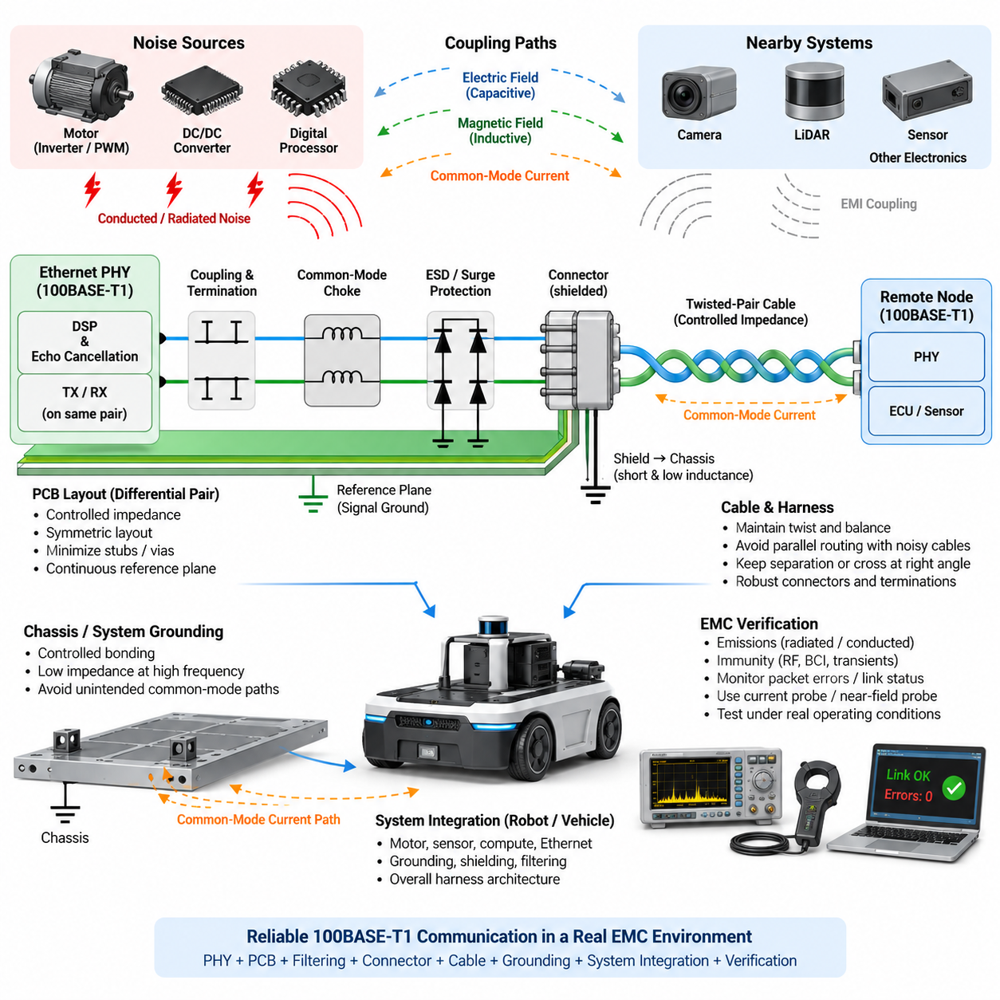
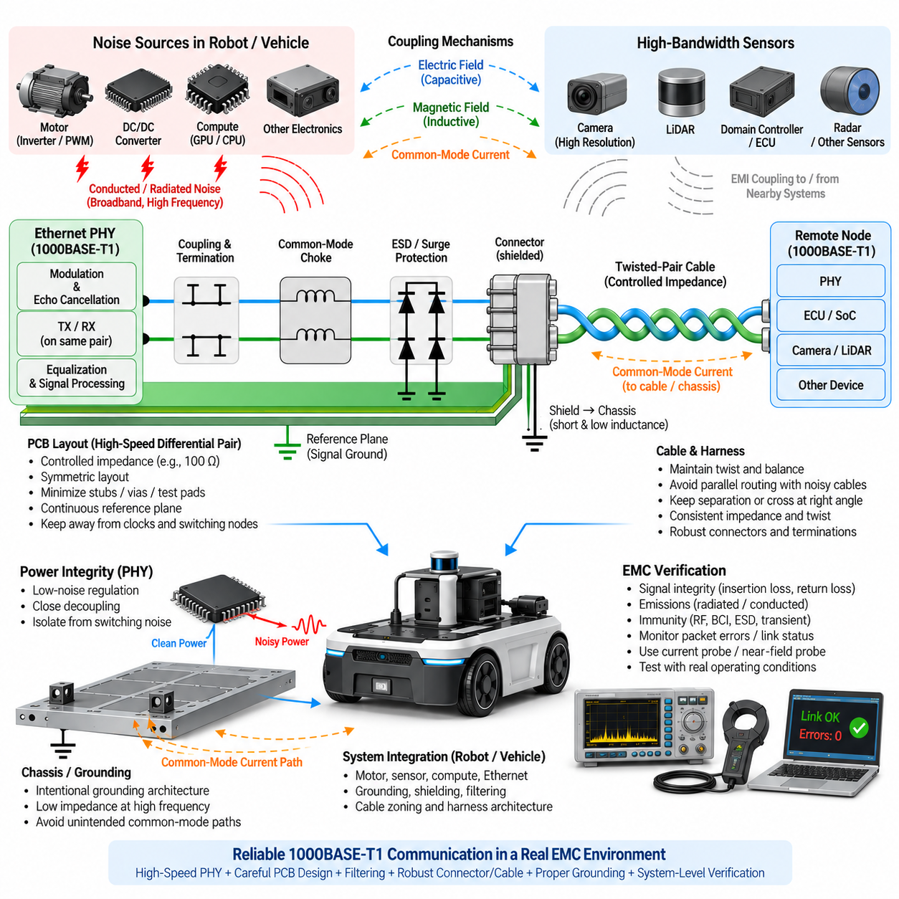
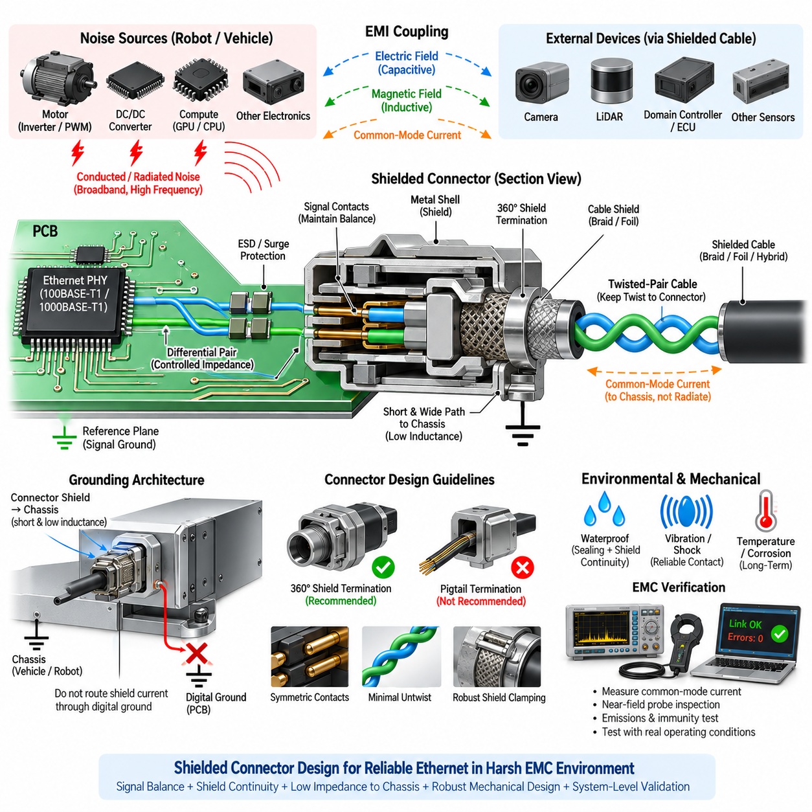
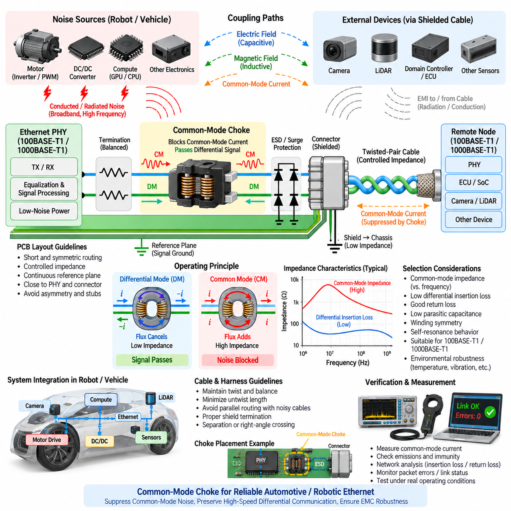
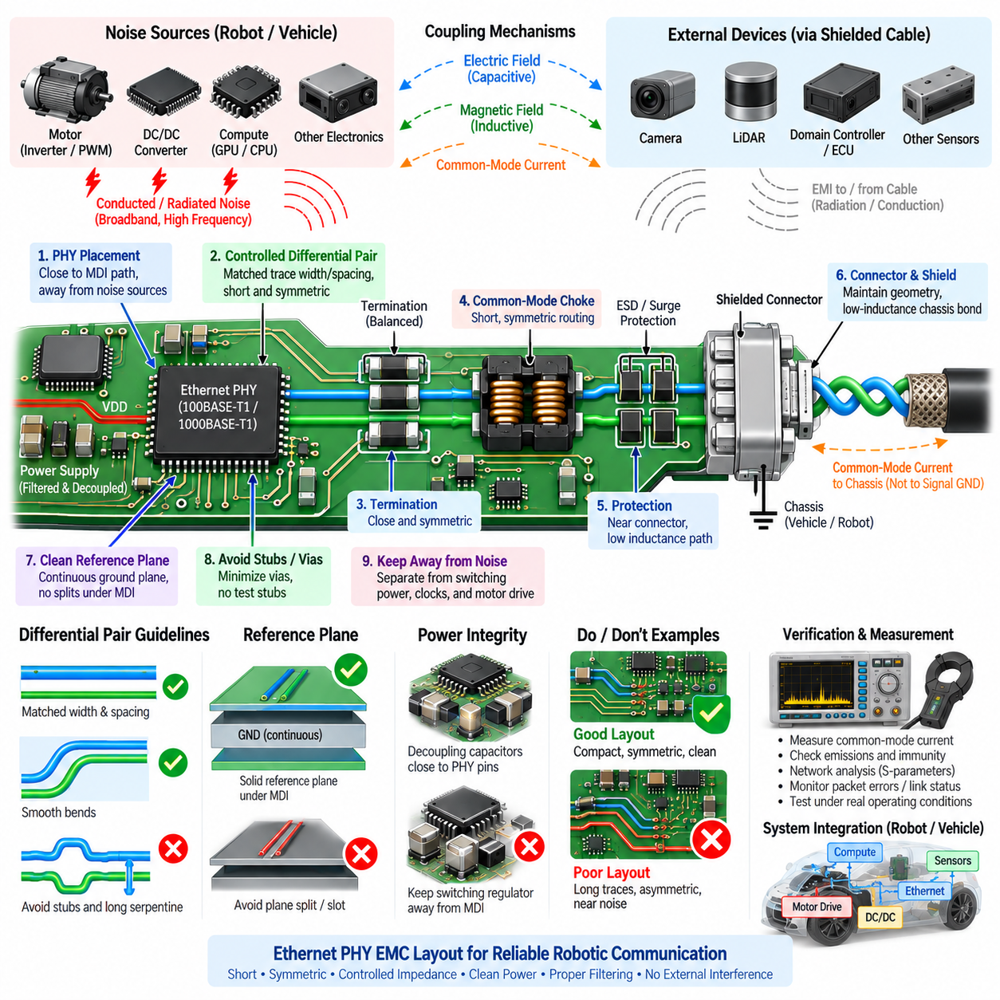

**Volume 05. Grounding and EMC**

# Chapter 07. Ethernet EMI

## 07.01. 100BASE-T1 EMC Design

{width="7.268055555555556in" height="7.268055555555556in"}

100BASE-T1은 하나의 균형 트위스트 페어(Balanced Twisted Pair)를 통해 100 Mbit/s 통신을 수행하도록 설계된 단일 페어 이더넷(Single-Pair Ethernet) 기술로, 케이블 중량과 패키징이 중요한 로봇(Robot), 차량(Vehicle), 분산 센서 시스템(Distributed Sensor System)에 적합하다. 전자파 적합성 설계(EMC Design)는 링크(Link)의 차동 특성(Differential Nature)을 유지하면서 공통 모드 에너지(Common-Mode Energy)가 케이블, 섀시(Chassis), 커넥터(Connector), 주변 전자 시스템으로 결합되는 것을 방지해야 한다.

기존의 다중 페어 이더넷(Multi-Pair Ethernet)과 달리 100BASE-T1은 하나의 양방향 트위스트 페어(Bidirectional Twisted Pair)를 이용하여 송신과 수신 통신을 동시에 수행한다. 물리 계층(PHY)은 신호 처리(Signal Processing)와 에코 제거(Echo Cancellation)를 사용하여 자체 송신 신호와 수신 정보를 분리한다. 양방향 신호가 동일한 물리적 도체를 공유하기 때문에 임피던스 불연속(Impedance Discontinuity), 불균형(Imbalance), 기생 커패시턴스(Parasitic Capacitance), 커넥터 비대칭, PCB 레이아웃 오류는 신호 무결성(Signal Integrity)과 전자파 적합성(EMC)을 동시에 저하시킬 수 있다.

전자파 적합성(EMC)의 기본적인 설계 목표는 물리 계층(PHY) 핀에서 PCB 트레이스(PCB Trace), 결합 네트워크(Coupling Network), 커넥터(Connector), 트위스트 페어 케이블(Twisted-Pair Cable), 원격 노드(Remote Node)에 이르는 전체 경로에서 전기적 대칭성(Electrical Symmetry)을 유지하는 것이다. 이상적으로 크기가 같고 방향이 반대인 차동 전류(Differential Current)가 만드는 전자기장은 대부분 상쇄된다. 그러나 비대칭이 발생하면 차동 신호의 일부가 공통 모드 전압 또는 전류(Common-Mode Voltage or Current)로 변환되어 케이블 방사와 외부 전자기장에 대한 감수성(Susceptibility)을 증가시킨다.

따라서 차동 임피던스 제어(Differential Impedance Control)는 핵심 설계 요구사항이다. 매체 종속 인터페이스(MDI)와 연결되는 PCB 트레이스는 일정한 형상, 간격, 기준 환경(Reference Environment), 전기적 길이(Electrical Length)를 유지하는 밀접하게 결합된 차동 페어(Differential Pair)로 배선해야 한다. 스텁(Stub), 불필요한 비아(Via), 급격한 레이어 전환(Layer Transition), 테스트 패드(Test Pad), 비대칭 부품 배치는 반사(Reflection) 또는 차동-공통 모드 변환(Differential-to-Common-Mode Conversion)을 발생시켜 방사 노이즈를 증가시킬 수 있으므로 최소화해야 한다.

이더넷 신호 경로 아래의 기준면(Reference Plane)은 선택된 물리 계층(PHY)과 보드 아키텍처(Board Architecture)가 허용하는 범위에서 연속성을 유지해야 한다. 플레인 분할(Plane Split), 섀시 경계(Chassis Boundary), 불연속 영역을 가로지르는 배선은 귀환 전류(Return Current)의 구조를 변화시키고 모드 변환(Mode Conversion)을 증가시킬 수 있다. 이더넷 페어가 차동 신호를 전달하더라도 고주파 기생 전류(High-Frequency Parasitic Current)는 주변 기준 구조와 상호작용하므로, 페어를 독립적인 두 개의 도선으로만 취급하지 않고 전체 전자기적 귀환 경로(Electromagnetic Return Path)를 고려해야 한다.

선택된 100BASE-T1 물리 계층(PHY)에 권장되는 결합 및 종단 네트워크(Coupling and Termination Network)는 높은 대칭성을 유지하도록 구현해야 한다. 양쪽 도체의 부품값, 패키지 크기, 트레이스 길이, 기생 특성(Parasitic Characteristics)은 가능한 한 일치해야 한다. 양극과 음극 경로 사이의 작은 차이도 공통 모드 제거 성능(Common-Mode Rejection)을 저하시킬 수 있다. 따라서 부품은 단순히 배선 편의성을 기준으로 분산시키기보다 작고 대칭적인 구조로 배치해야 한다.

물리 계층(PHY) 기준 설계와 전자파 적합성 목표(EMC Target)에 따라 공통 모드 초크(Common-Mode Choke)를 적용할 수 있다. 공통 모드 초크의 목적은 공통 모드 전류(Common-Mode Current)에 상대적으로 높은 임피던스를 제공하면서 필요한 차동 이더넷 신호가 최소한의 왜곡으로 통과하도록 하는 것이다. 초크 선택 시 공통 모드 임피던스(Common-Mode Impedance), 차동 삽입 손실(Differential Insertion Loss), 기생 커패시턴스, 전류 용량, 주파수 특성, 특정 PHY와의 호환성을 함께 고려해야 하며 단순히 가장 높은 임피던스 정격의 부품을 선택해서는 안 된다.

공통 모드 초크(Common-Mode Choke)의 배치 역시 중요하다. 일반적으로 해당 부품은 물리 계층(PHY) 제조사가 권장하는 토폴로지(Topology)에 따라 케이블 인터페이스 근처의 작고 제어된 매체 종속 인터페이스(MDI) 경로에 배치할 때 효과적이다. 보호 회로, 초크, 종단 회로, 커넥터 사이의 긴 트레이스는 추가적인 결합 구조(Coupling Structure)를 형성할 수 있다. 따라서 실제 물리적 구현 자체를 필터(Filter)의 일부로 간주해야 하며 회로도(Schematic)만으로 EMC 성능이 결정된다고 가정해서는 안 된다.

커넥터 설계(Connector Design)는 전체 링크의 전자파 적합성(EMC) 특성에 큰 영향을 준다. 두 신호 접점(Signal Contact)은 PCB에서 케이블로 전환되는 구간에서도 대칭성을 유지하고 불필요한 도체 간격 증가를 최소화해야 한다. 차폐 커넥터(Shielded Connector) 또는 차폐 케이블(Shielded Cable) 구조를 사용하는 경우 차폐 종단(Shield Termination)은 의도된 섀시 기준(Chassis Reference)에 짧고 낮은 인덕턴스(Low-Inductance)의 고주파 연결을 제공해야 한다. 긴 피그테일(Pigtail) 연결은 고주파에서 차폐 효과를 크게 저하시킬 수 있다.

케이블은 요구되는 하니스(Harness) 길이 전체에서 제어된 차동 임피던스(Controlled Differential Impedance)와 높은 종방향 균형(Longitudinal Balance)을 유지할 수 있도록 선택해야 한다. 꼬임의 일관성(Twist Consistency), 도체 형상, 절연체, 커넥터 종단, 제조 공차는 모두 모드 변환에 영향을 준다. 모터 상 케이블(Motor Phase Cable), 인버터 출력(Inverter Output), DC/DC 컨버터 스위칭 노드(Switching Node), 컨택터 배선(Contact Wiring) 및 기타 높은 dV/dt 또는 dI/dt 도체와 장거리 병렬 배선하는 것은 공통 모드 외란(Common-Mode Disturbance)을 이더넷 채널에 유입시킬 수 있으므로 피해야 한다.

케이블 분리(Cable Separation)는 이더넷 배선이 제한된 하니스 공간에서 배터리, 모터, 브레이크, 액추에이터(Actuator), 센서 회로와 함께 배치되는 이동 로봇(Mobile Robot)에서 특히 중요하다. 물리적 거리를 증가시키면 일반적으로 용량성 및 유도성 결합(Capacitive and Inductive Coupling)을 줄일 수 있다. 노이즈가 큰 하니스와 민감한 하니스가 교차해야 하는 경우 장거리 병렬 배선보다 가능한 한 직각에 가까운 교차가 바람직하다. 따라서 하니스 아키텍처(Harness Architecture)에서는 이더넷을 노이즈 민감 통신 경로(Noise-Sensitive Communication Path)로 분류하고 적절한 배선 영역(Routing Zone)을 정의해야 한다.

정전기 방전(ESD)과 전기적 과도현상(Electrical Transient)에 대한 보호는 이더넷 인터페이스의 균형을 손상시키지 않도록 구현해야 한다. 두 매체 종속 인터페이스(MDI) 도체에 연결되는 보호 소자는 서로 유사한 커패시턴스와 동적 특성(Dynamic Characteristics)을 가져야 한다. 과도하거나 비대칭적인 기생 커패시턴스는 차동 삽입 손실을 증가시키고 공통 모드 변환을 유발할 수 있다. 따라서 일반적인 보호 부품보다 고속 차동 통신 인터페이스용으로 특성이 규정된 보호 소자를 사용하는 것이 바람직하다.

신호 접지(Signal Ground)와 섀시 접지(Chassis Ground)의 관계에는 의도적인 고주파 설계가 필요하다. 디지털 접지(Digital Ground), PHY 회로, 커넥터 차폐, 섀시, 외부 케이블 사이에서 제어되지 않는 용량성 결합은 의도하지 않은 공통 모드 전류 경로(Common-Mode Current Path)를 형성할 수 있다. 반대로 기생 결합을 고려하지 않고 이러한 구조를 지나치게 절연하면 높은 무선주파수 임피던스(RF Impedance)가 발생할 수 있다. 따라서 EMC 성능은 모든 연결을 제거하는 것이 아니라 고주파 전류가 어디로 흐르는지를 제어하는 데 달려 있다.

이더넷 물리 계층(PHY) 주변의 전원 무결성(Power Integrity) 역시 방사 및 내성 특성에 영향을 준다. 스위칭 레귤레이터 리플(Switching Regulator Ripple), 디지털 프로세서 노이즈, 모터 관련 외란이 PHY 전원으로 유입되면 송신기를 변조하거나 수신기의 임계값(Receiver Threshold)을 교란할 수 있다. 로컬 디커플링(Local Decoupling), 적절한 전원 필터링(Power Filtering), 짧은 전류 루프(Current Loop), 고전류 스위칭 회로와의 분리를 통해 PHY의 안정성을 유지해야 한다. 따라서 이더넷 EMC 분석에는 MDI 페어뿐만 아니라 전력 분배 네트워크(Power-Distribution Network)도 포함해야 한다.

PCB 배치는 물리 계층(PHY), 인터페이스 부품, 보호 소자, 커넥터 사이에 명확한 기능적 흐름을 형성해야 한다. 매체 종속 인터페이스(MDI) 트레이스는 짧게 유지하고 클록(Clock), 스위칭 노드, 고전류 게이트 드라이브 루프(Gate-Drive Loop), 메모리 버스(Memory Bus) 및 기타 강한 노이즈원으로부터 격리해야 한다. 단순히 부품 배치를 쉽게 하기 위해 이더넷 페어를 PCB 가장자리로 우회시키거나 복잡한 디지털 회로 영역을 통과시키는 것은 결합을 증가시킬 수 있으므로 보다 직접적인 인터페이스 경로가 가능하다면 피해야 한다.

로봇 플랫폼(Robotic Platform)은 모터 드라이브(Motor Drive)의 펄스 폭 변조 스위칭(PWM Switching)으로 인해 광대역 전도 및 방사 간섭(Broadband Conducted and Radiated Interference)이 발생할 수 있다는 추가적인 어려움이 있다. 빠른 인버터 에지(Inverter Edge)는 전기장, 자기장, 공통 섀시 임피던스, 공유 전원 배선을 통해 이더넷 케이블에 결합될 수 있다. 따라서 우수한 100BASE-T1 성능을 확보하려면 이더넷 PCB뿐 아니라 모터 케이블 차폐, 인버터 레이아웃, 섀시 본딩(Chassis Bonding), 접지, 필터링 및 전체 하니스 분리까지 함께 설계해야 한다.

전자파 적합성 검증(EMC Verification)에서는 통신 성능(Communication Performance)과 전자기적 성능(Electromagnetic Performance)을 구분하여 평가해야 한다. 실험실 벤치에서 패킷(Packet)을 정상적으로 전송하는 링크라도 과도한 방사 노이즈를 발생시키거나 무선주파수 전자기장(RF Field), 벌크 전류 주입(Bulk Current Injection), 과도 외란, 모터 스위칭 환경에서 실패할 수 있다. 따라서 단순한 링크 연결 여부뿐 아니라 패킷 오류, 링크 중단, PHY 진단 정보, 방사 특성, 내성 특성을 대표적인 운전 조건에서 함께 관찰해야 한다.

디버깅(Debugging)은 공통 모드 동작(Common-Mode Behavior)을 직접 측정할 때 가장 효과적이다. 전류 프로브(Current Probe), 근접장 프로브(Near-Field Probe), 오실로스코프(Oscilloscope), 스펙트럼 분석기(Spectrum Analyzer), 네트워크 분석 기법(Network-Analysis Technique)을 사용하면 원하지 않는 결합과 관련된 주파수와 물리적 위치를 식별할 수 있다. 케이블 배선, 초크 구성, 차폐 종단, 접지 또는 부품 배치를 변경하기 전후의 측정 결과를 비교하면 실제 결합 메커니즘과 단순히 증상만 변화시키는 수정안을 구분할 수 있다.

사전 적합성 시험(Pre-Compliance Testing)은 실제를 대표하는 케이블 길이, 커넥터, 인클로저(Enclosure) 구조, 접지 구성, 모터 동작, DC/DC 컨버터, 컴퓨팅 부하(Computational Load)를 포함하여 수행해야 한다. 개방된 개발 보드에 짧은 실험용 케이블을 연결한 조건은 금속 로봇 섀시 내부를 통과하는 양산 하니스와 매우 다른 특성을 보일 수 있다. 케이블 자체가 효과적인 안테나(Antenna)로 동작할 수 있으므로 의미 있는 EMC 평가를 위해서는 시스템 수준의 실제 구성이 필수적이다.

설계 마진(Design Margin)은 양산 편차(Production Variation)를 고려해야 한다. 케이블 균형, 커넥터 접점 형상, 초크 특성, 보호 소자의 커패시턴스, PCB 제조 공차, 섀시 본딩 임피던스는 제품마다 달라질 수 있다. 특정 시제품 구성에서만 EMC 시험을 통과하는 인터페이스는 양산 편차가 발생하면 실패할 가능성이 있다. 따라서 견고한 설계(Robust Design)를 위해 대칭성, 제어된 배선, 예측 가능한 접지, 충분히 특성화된 인터페이스 부품을 통해 적절한 설계 마진을 확보해야 한다.

자율이동로봇(AMR) 또는 피지컬 AI 플랫폼(Physical AI Platform)에서 100BASE-T1 전자파 적합성(EMC)은 궁극적으로 물리 계층(PHY)만의 문제가 아니라 시스템 아키텍처(System Architecture)의 문제로 다루어야 한다. 신뢰성 높은 통신은 PHY 선정, 균형 잡힌 PCB 레이아웃, 제어 임피던스, 적절한 필터링, 커넥터 설계, 케이블 배선, 섀시 본딩, 전원 무결성, 모터 운전 조건에서의 검증이 통합될 때 확보된다. 이러한 시스템 수준 접근 방식은 이더넷 전자파 간섭 설계(Ethernet EMI Design)를 접지(Grounding), 차폐(Shielding), 필터링(Filtering), 모터 드라이버 EMC라는 보다 광범위한 설계 체계와 연결한다.

## 07.02. 1000BASE-T1 EMC Design

{width="7.268055555555556in" height="7.268055555555556in"}

1000BASE-T1은 하나의 균형 트위스트 페어(Balanced Twisted Pair)를 통해 단일 페어 이더넷(Single-Pair Ethernet)을 1 Gbit/s 통신으로 확장한 기술로, 고해상도 카메라(High-Resolution Camera), 라이다(LiDAR), 도메인 컨트롤러(Domain Controller), 엣지 컴퓨터(Edge Computer), 첨단 로봇 센서(Advanced Robotic Sensor)에 필요한 대역폭을 제공한다. 이 볼륨의 이더넷 전자파 간섭(Ethernet EMI) 구조에서 1000BASE-T1의 전자파 적합성 설계(EMC Design)는 100BASE-T1과 동일한 시스템 수준의 원칙을 따르지만, 더 높은 신호 대역폭으로 인해 불균형, 불연속, 기생 결합에 더욱 민감하므로 보다 엄격한 제어가 필요하다.

물리적 인터페이스(Physical Interface)는 동일한 페어를 통해 양방향 통신(Bidirectional Communication)을 동시에 지원하므로 물리 계층(PHY)은 정교한 변조(Modulation), 에코 제거(Echo Cancellation), 등화(Equalization), 신호 처리(Signal Processing)를 이용하여 송신 중에도 수신 정보를 복원한다. 따라서 PHY와 원격 노드(Remote Node) 사이의 어느 지점에서든 유입되는 노이즈는 수신 여유도(Receiver Margin)에 영향을 줄 수 있다. 그러므로 EMC 엔지니어링은 신호 무결성(Signal Integrity), 공통 모드 동작(Common-Mode Behavior), 전원 무결성(Power Integrity), 케이블 특성, 전자기 결합(Electromagnetic Coupling)을 상호 연결된 설계 문제로 고려해야 한다.

전기적 균형(Electrical Balance)은 낮은 방사 노이즈를 갖는 1000BASE-T1 동작을 위한 가장 중요한 조건 중 하나이다. 이상적인 경우 두 도체를 흐르는 전류는 크기가 같고 방향이 반대이므로 전자기장이 서로 상쇄된다. 그러나 PCB 비대칭, 서로 다른 부품의 기생 특성, 커넥터 형상, 케이블 불균형 또는 기준면 불연속(Reference-Plane Discontinuity)은 차동 에너지(Differential Energy)를 공통 모드 에너지(Common-Mode Energy)로 변환하여 연결된 케이블이 효율적인 방사 구조(Radiating Structure)로 동작하게 할 수 있다.

제어된 차동 임피던스(Controlled Differential Impedance)는 PHY 인터페이스에서 매체 종속 인터페이스(MDI) 배선과 커넥터 전환부(Connector Transition)에 이르기까지 유지되어야 한다. 트레이스 폭, 간격, 유전체 형상, 기준면과의 거리, 비아(Via), 부품 패드, 커넥터 풋프린트(Connector Footprint)는 모두 임피던스 프로파일(Impedance Profile)에 영향을 준다. 급격한 불연속은 반사(Reflection)와 모드 변환(Mode Conversion)을 발생시키므로 배선은 짧고 대칭적이며 기하학적으로 일정하게 유지하고 불필요한 스텁(Stub), 테스트 패드, 비아, 레이어 변경은 최소화해야 한다.

1000BASE-T1은 100BASE-T1보다 상당히 높은 신호 대역폭(Signal Bandwidth)에서 동작하기 때문에 외관상 작은 PCB 구조도 전자기적으로 중요한 영향을 줄 수 있다. 짧은 스텁, 불일치 패드(Mismatched Pad), 비대칭 비아 전환(Asymmetric Via Transition), 부적절한 위치의 보호 소자는 측정 가능한 삽입 손실(Insertion Loss)이나 모드 변환을 발생시킬 수 있다. 따라서 레이아웃 검토(Layout Review)는 공칭 트레이스 임피던스만 확인하거나 차동 페어의 길이가 대략 동일한지만 검사하는 것이 아니라 전체 고주파 전송 경로(High-Frequency Transmission Path)를 평가해야 한다.

매체 종속 인터페이스(MDI) 트레이스 주변에는 연속적이고 예측 가능한 기준 환경(Reference Environment)을 유지해야 한다. 기준면 분할(Reference-Plane Split), 보드 절개부(Board Cutout), 커넥터 접지 불연속, 결합이 불충분한 기준 구조 사이의 전환부를 가로질러 차동 페어를 배선하면 기생 커패시턴스와 공통 모드 전류 분포가 변할 수 있다. 차동 신호 방식이 주변 도체와의 상호작용을 제거하는 것은 아니며, 고주파에서는 전체 전자기장의 형상과 귀환 경로(Return Path)가 신호 무결성과 EMC 동작에 큰 영향을 준다.

종단 및 결합 부품(Termination and Coupling Component)은 선택된 PHY 제조사의 기준 아키텍처(Reference Architecture)에 따라 배치하고 높은 대칭성을 유지하도록 구현해야 한다. 저항값만 일치시키는 것으로는 충분하지 않으며 패키지 기생 성분(Package Parasitics), 패드 형상, 트레이스 길이, 주변 구리 패턴도 균형에 영향을 준다. 차동 경로의 양쪽은 거의 동일한 전기적 환경을 가져야 하며, 이를 통해 인터페이스가 전체 동작 주파수 범위에서 높은 공통 모드 제거 성능(Common-Mode Rejection)을 유지할 수 있다.

공통 모드 초크(Common-Mode Choke)는 외부 케이블 방향으로 흐르는 불필요한 공통 모드 전류(Common-Mode Current)를 억제할 수 있지만 고속 차량용 이더넷(High-Speed Automotive Ethernet)에 적합하도록 선정해야 한다. 높은 공통 모드 임피던스만으로 우수한 성능이 보장되는 것은 아니다. 차동 삽입 손실, 반사 손실(Return Loss), 기생 커패시턴스, 모드 변환, 공진 특성(Resonance Behavior), PHY 호환성도 고려해야 하며, 부적절한 초크는 특정 주파수의 방사 노이즈를 개선하면서 다른 영역의 통신 여유도를 저하시킬 수 있다.

공통 모드 초크와 관련 인터페이스 부품의 배치는 제어되지 않은 무선주파수 전류(RF Current)가 순환할 수 있는 물리적 영역을 최소화해야 한다. PHY 측 네트워크, 초크, 정전기 방전 보호(ESD Protection), 커넥터 사이의 긴 트레이스는 기생 인덕턴스와 커패시턴스를 증가시키고 의도하지 않은 공진 구조(Resonant Structure)를 형성할 수 있다. 따라서 인터페이스는 편리한 PCB 배선으로 연결된 여러 개의 독립적인 회로 블록이 아니라 하나의 소형 고주파 네트워크(Compact High-Frequency Network)로 설계해야 한다.

과도현상 및 정전기 방전 보호(Transient and ESD Protection)는 보호 소자가 고속 통신 경로에 직접 커패시턴스를 추가하기 때문에 설계가 까다롭다. 보호 소자는 충분한 내성을 제공하면서 두 도체에 대해 낮고 잘 정합된 커패시턴스(Low and Matched Capacitance)를 유지해야 한다. 비대칭 보호 레이아웃은 차동 신호를 공통 모드 성분으로 변환할 수 있다. 따라서 보호 소자의 배치, 접지 경로, 패드 형상, 소자 특성을 함께 평가해야 하며 ESD 보호를 독립적인 신뢰성 기능으로만 취급해서는 안 된다.

커넥터 전환부(Connector Transition)는 PCB에서 형성된 대칭성을 유지해야 한다. 서로 다른 핀 길이, 과도한 페어 간격, 비대칭 차폐 형상, PCB 트레이스와 트위스트 페어 도체 사이의 부적절한 전환은 국부적인 임피던스 불연속(Local Impedance Discontinuity)을 발생시킬 수 있다. 차폐 커넥터(Shielded Connector)를 사용하는 경우 차폐부는 일반적으로 짧고 넓으며 낮은 인덕턴스의 연결을 통해 의도된 섀시 구조(Chassis Structure)로 전환되어야 하며, 민감한 디지털 접지 경로를 통하지 않고 고주파 공통 모드 전류를 전달할 수 있어야 한다.

케이블 구조(Cable Construction)는 또 다른 주요 EMC 변수이다. 트위스트 페어는 전체 길이에 걸쳐 일정한 형상, 임피던스, 꼬임 특성(Twist Characteristics), 종방향 균형(Longitudinal Balance)을 유지해야 한다. 기계적 변형, 커넥터 부근의 과도한 꼬임 해제(Untwisting), 불균일한 종단, 하니스 제조 편차는 균형을 저하시킬 수 있다. 따라서 기가비트 전송 속도에서는 커넥터와 케이블 품질을 단순히 패키징과 내구성 요구사항에 따라 선택하는 수동적인 기계 부품이 아니라 전기적 채널(Electrical Channel)의 일부로 고려해야 한다.

하니스 배선(Harness Routing)은 1000BASE-T1 케이블을 인버터 출력, 모터 상 도체(Motor Phase Conductor), 고전류 배터리 경로, 스위칭 전원 컨버터, 컨택터(Contactors), PWM 제어 액추에이터와 같은 강한 전자기 노이즈원으로부터 분리해야 한다. 장거리 병렬 배선은 용량성 및 유도성 결합(Capacitive and Inductive Coupling)을 증가시킨다. 분리 거리가 제한되는 경우 노이즈가 큰 도체와 이더넷 케이블을 가능한 한 직각으로 교차시키고 물리적 거리를 유지하면 통신 채널로 누적되는 결합을 크게 감소시킬 수 있다.

로봇 플랫폼(Robotic Platform)은 이더넷 통신이 모터 드라이브, 고성능 GPU 컴퓨터, DC/DC 컨버터, 라이다, 카메라, 다수의 스위칭 레귤레이터와 인접하여 동작할 수 있기 때문에 특히 까다로운 환경을 형성한다. 이러한 하위 시스템은 서로 다른 스펙트럼 성분(Spectral Component)과 결합 메커니즘을 생성한다. 따라서 성공적인 이더넷 EMC 설계를 위해서는 모든 간섭 문제를 이더넷 커넥터에서 해결하려 하기보다 케이블 영역 분리(Cable Zoning), 접지, 차폐, 필터링, 인클로저 본딩(Enclosure Bonding), 전력 분배 설계를 통합적으로 수행해야 한다.

PHY 전원은 저노이즈 로컬 전원 조정(Low-Noise Local Regulation)과 효과적인 디커플링(Decoupling)이 필요하다. 전원 외란은 송신 품질, 클록 동작, 수신 감도, 내부 아날로그 회로에 영향을 줄 수 있기 때문이다. 디커플링 커패시터는 관련 전원 핀 가까이에 배치하여 전류 루프를 짧게 유지해야 한다. 노이즈가 큰 스위칭 레귤레이터는 스위칭 전류가 이더넷 PHY의 민감한 귀환 경로를 공유하거나 광대역 외란을 통신 인터페이스로 주입하지 않도록 배치하고 필터링해야 한다.

PHY 주변의 클록 및 디지털 회로도 중요한 방사 노이즈원이 될 수 있다. 고주파 클록, 메모리 인터페이스, 프로세서 버스, 스위칭 노드는 매체 종속 인터페이스(MDI) 페어나 커넥터 영역 가까이에 배선하지 않아야 한다. 내부 디지털 동작에서 이더넷 페어로 결합된 노이즈는 이후 공통 모드 케이블 전류(Common-Mode Cable Current)로 변환될 수 있다. 따라서 PCB 기능 분할(Functional Partitioning)을 통해 PHY와 외부 커넥터 사이에 상대적으로 조용한 이더넷 인터페이스 영역(Quiet Ethernet Interface Zone)을 구성해야 한다.

접지 및 섀시 아키텍처(Ground and Chassis Architecture)는 의도적인 고주파 전류 경로를 제공해야 한다. 커넥터 차폐, 인클로저 금속 구조, PCB 기준면, 신호 접지를 임의로 연결해서는 안 된다. 고주파 본딩(High-Frequency Bonding)은 인덕턴스를 최소화하는 동시에 노이즈가 포함된 섀시 전류가 민감한 회로 기준을 통해 흐르지 않도록 해야 한다. 설계 목표는 단순히 접지를 연결하거나 절연하는 것이 아니라 공통 모드 에너지가 발생원으로 되돌아가는 임피던스와 물리적 경로를 제어하는 것이다.

차폐 결정(Shielding Decision)은 전체 설치 환경을 기준으로 이루어져야 한다. 차폐 케이블(Shielded Cable)은 전자기장 결합을 줄일 수 있지만 그 효과는 양 끝단의 종단 품질과 섀시 통합 방식에 크게 좌우된다. 긴 배선이나 피그테일(Pigtail)을 통해 연결된 차폐부는 고주파에서 상당한 인덕턴스를 나타낸다. 차폐가 필요한 경우 관련 EMC 주파수 범위에서 차폐 효과를 유지하기 위해 기계적으로 짧고 원주 방향(Circumferential) 또는 이와 유사한 낮은 인덕턴스의 종단 구조를 사용하는 것이 바람직하다.

신호 무결성 측정(Signal-Integrity Measurement)과 EMC 측정은 함께 해석해야 한다. 과도한 삽입 손실, 반사 손실, 모드 변환 또는 채널 불균형은 먼저 통신 여유도 감소로 나타난 후 EMC 문제로 이어질 수 있다. 반대로 링크가 정상적으로 동작하면서도 허용할 수 없는 방사 노이즈를 발생시킬 수도 있다. 따라서 검증 과정에서는 채널 특성 평가(Channel Characterization), PHY 진단, 패킷 오류 모니터링(Packet-Error Monitoring), 방사 측정, 내성 시험을 결합하여 통신 견고성과 전자기적 동작을 함께 이해해야 한다.

외부 무선주파수 에너지(RF Energy)가 공통 모드 전압으로 케이블에 결합된 후 채널의 비대칭 지점에서 차동 외란(Differential Disturbance)으로 변환될 수 있으므로 내성 시험(Immunity Testing)은 특히 중요하다. 벌크 전류 주입(Bulk-Current Injection), 방사 내성(Radiated Immunity), 정전기 방전, 과도현상 시험 및 실제 시스템을 대표하는 외란 시험은 일반적인 패킷 전송 시험에서 발견하기 어려운 취약점을 드러낼 수 있다. 일시적인 통신 중단이 자율 시스템에서 시스템 수준의 문제를 일으킬 수 있으므로 링크 복구 동작(Link Recovery Behavior)도 평가해야 한다.

사전 적합성 시험(Pre-Compliance Testing)은 실제 양산 구성을 가능한 한 정확하게 재현해야 하며 대표적인 케이블 길이, 커넥터, 섀시 구조, 모터 동작, 스위칭 컨버터, 센서 동작, 프로세서 부하, 접지 조건을 포함해야 한다. 독립적인 평가 보드(Evaluation Board)만 시험하면 실제 설치 후 발생하는 결합 메커니즘을 발견하지 못할 수 있다. 로봇과 자율주행 차량에서는 구동 모터, 컴퓨팅 시스템, 센서, 통신 네트워크가 동시에 활성화되는 조건이 EMC 관점에서 최악 조건(Worst-Case Operating State)이 되는 경우가 많다.

디버깅(Debugging)은 실제 결합 경로(Coupling Path)를 식별하는 데 초점을 맞추어야 한다. 전류 프로브(Current Probe)는 공통 모드 케이블 전류를 확인할 수 있으며 근접장 프로브(Near-Field Probe)는 PCB 또는 인클로저의 강한 방사 영역을 찾는 데 사용할 수 있다. 스펙트럼 분석(Spectrum Analysis)을 이용하면 이더넷 관련 주파수 성분을 모터 PWM, 컨버터 스위칭, 프로세서 클록 또는 PHY 동작과 연관시킬 수 있다. 이후 케이블 위치, 차폐 종단, 초크 선정, 접지, 전원 필터링을 제어하여 변경함으로써 주요 결합 메커니즘이 전도성, 방사성, 용량성, 유도성 또는 공통 모드 결합 중 무엇인지 판단할 수 있다.

양산 견고성(Production Robustness)을 확보하려면 부품 및 제조 편차를 고려한 충분한 설계 여유가 필요하다. 공통 모드 초크 특성, 보호 소자의 커패시턴스, 저항 허용오차, PCB 형상, 커넥터 구조, 케이블 균형, 차폐 접촉 저항, 섀시 본딩 특성은 제품마다 달라질 수 있다. 따라서 정교하게 조립된 하나의 시제품이 간신히 시험을 통과하는 수준으로는 충분하지 않다. EMC 성능은 현실적인 제조 공차, 온도 조건, 케이블 구성, 예상되는 사용 수명에 따른 열화(Service-Life Degradation)에서도 안정적으로 유지되어야 한다.

자율이동로봇(AMR)과 피지컬 AI 시스템(Physical AI System)에서 1000BASE-T1 전자파 적합성 설계(EMC Design)는 궁극적으로 상호 조정된 시스템 엔지니어링(System Engineering) 활동이다. PHY 레이아웃, 제어 임피던스, 균형 종단(Balanced Termination), 공통 모드 필터링, 과도현상 보호, 커넥터 설계, 케이블 배선, 차폐, 섀시 본딩, 전원 무결성, 검증이 하나의 아키텍처로 함께 동작해야 한다. 이러한 접근 방식은 1000BASE-T1을 접지(Grounding)와 차폐(Shielding)에서 시작하여 노이즈 분석(Noise Analysis), 필터링(Filtering), 모터 드라이버 전자파 간섭(Motor-Driver EMI), 이더넷 전용 EMC 엔지니어링으로 이어지는 이 볼륨의 전체 구조 안에 자연스럽게 통합한다.

## 07.03. Shielded Connector Design

{width="7.268055555555556in" height="7.268055555555556in"}

차폐 커넥터 설계(Shielded Connector Design)는 커넥터가 PCB, 인클로저(Enclosure), 케이블 차폐(Cable Shield), 외부 배선 환경 사이의 전자기적 전환부(Electromagnetic Transition)를 형성하기 때문에 이더넷 전자파 적합성 엔지니어링(Ethernet EMC Engineering)의 핵심 요소이다. 100BASE-T1 및 1000BASE-T1 네트워크에서 적절하게 설계된 커넥터는 차동 신호 균형(Differential Signal Balance)을 유지하면서 불필요한 고주파 공통 모드 전류(High-Frequency Common-Mode Current)가 흐를 수 있는 제어된 저임피던스 경로(Low-Impedance Path)를 제공해야 한다.

차폐 커넥터(Shielded Connector)의 주요 EMC 기능은 단순히 신호 접점(Signal Contact)을 전도성 재료로 둘러싸는 것이 아니다. 케이블 차폐와 장비 섀시(Equipment Chassis) 사이의 차폐 연속성(Shielding Continuity)을 유지하면서 외부 전자기장이 민감한 이더넷 도체에 결합되는 것을 방지해야 한다. 동시에 내부에서 발생한 공통 모드 에너지(Common-Mode Energy)는 케이블을 따라 전파되어 주변으로 방사되지 않도록 섀시 방향으로 유도되어야 한다.

고주파 차폐 전류(High-Frequency Shield Current)는 주파수가 증가할수록 연결 인덕턴스(Connection Inductance)의 영향이 커지기 때문에 저주파 전류와 다르게 동작한다. 직류(DC)에서는 전기적으로 충분해 보이는 차폐 연결도 무선주파수(RF) 영역에서는 상당한 임피던스를 나타낼 수 있다. 따라서 커넥터 차폐는 가능한 한 가장 짧고 넓은 전도 경로를 통해 섀시에 본딩(Bonding)하여 커넥터 셸(Connector Shell)과 섀시 구조 사이의 루프 면적과 연결 인덕턴스를 최소화해야 한다.

원주 방향 또는 360도 차폐 종단(Circumferential or 360-Degree Shield Termination)은 일반적으로 긴 피그테일 연결(Pigtail Connection)보다 효과적이다. 피그테일은 직렬 인덕턴스(Series Inductance)를 발생시키고 좁은 도체를 통해 차폐 전류를 집중시켜 높은 주파수에서 차폐 효과를 감소시킨다. 케이블 차폐 둘레에 넓은 금속 접촉을 제공하는 커넥터는 RF 전류를 더 넓은 표면으로 분산시키고 케이블과 인클로저 사이에 보다 연속적인 전자기적 경계(Electromagnetic Boundary)를 형성한다.

차폐 종단(Shield Termination)은 케이블 인입부(Cable Entry Point)에서 커넥터 셸을 거쳐 섀시까지 이어지는 전체 경로를 고려해야 한다. 이 경로의 불연속은 국부적인 전위차를 발생시켜 공통 모드 전류가 의도하지 않은 구조로 흐르게 할 수 있다. 도장(Paint), 양극 산화 표면(Anodized Surface), 코팅, 부식, 기계적 틈새 또는 불충분한 접촉 압력은 본딩 임피던스(Bonding Impedance)를 증가시킬 수 있다. 따라서 기계적 커넥터 설계는 EMC 성능과 분리될 수 없으며 제품 수명 전체에서 안정적으로 유지되어야 한다.

커넥터 내부의 신호 접점은 이더넷 차동 페어(Ethernet Differential Pair)의 전기적 대칭성을 유지해야 한다. 과도한 도체 간격, 서로 다른 접점 길이, 비대칭 핀 형상 또는 커넥터 셸에 대한 서로 다른 기생 커패시턴스(Parasitic Capacitance)는 차동 에너지를 공통 모드 에너지로 변환할 수 있다. 따라서 고속 이더넷에서는 커넥터를 PCB 트레이스와 케이블 도체 사이를 단순히 연결하는 기계적 인터페이스가 아니라 전송 채널(Transmission Channel)의 일부로 취급해야 한다.

커넥터 전환부(Connector Transition)의 임피던스 연속성(Impedance Continuity)은 높은 신호 대역폭으로 인해 기하학적 불연속에 더욱 민감한 1000BASE-T1에서 특히 중요하다. PCB 풋프린트(PCB Footprint), 커넥터 핀, 단자 구조(Terminal Structure), 케이블 종단, 초기 비꼬임 구간(Untwisted Section)이 함께 국부적인 임피던스 프로파일(Local Impedance Profile)을 결정한다. 공칭 케이블 임피던스가 정확하더라도 과도한 불연속은 반사, 삽입 손실(Insertion Loss), 반사 손실(Return Loss), 모드 변환(Mode Conversion)을 증가시킬 수 있다.

트위스트 페어(Twisted Pair)는 가능한 한 커넥터 종단부 가까이까지 꼬임 상태를 유지해야 한다. 과도한 꼬임 해제(Untwisting)는 루프 면적을 증가시키고 도체 사이의 상호 결합(Mutual Coupling)을 변화시켜 종방향 균형(Longitudinal Balance)을 저하시키며 전자기장에 대한 감수성(Susceptibility)을 증가시킨다. 따라서 하니스 제조 사양(Harness Manufacturing Specification)에는 허용 가능한 꼬임 해제 길이와 종단 형상을 정의하여 시제품에서 확보한 EMC 성능이 양산에서도 일관되게 유지되도록 해야 한다.

커넥터 차폐(Connector Shield)와 신호 접지(Signal Ground)를 자동적으로 동일한 전기적 노드로 취급해서는 안 된다. 차폐는 주로 고주파 전자기적 경계와 공통 모드 귀환 경로(Common-Mode Return Path)를 제공하는 반면 신호 접지는 내부 회로의 동작 기준을 제공한다. 차폐 전류를 PCB 디지털 접지(Digital Ground)를 통해 직접 흐르게 하면 외부 노이즈가 민감한 전자회로로 유입될 수 있다. 따라서 커넥터 셸, 섀시, 신호 접지, PCB 기준면(Reference Plane) 사이의 관계를 명확하게 정의해야 한다.

커넥터가 금속 인클로저(Metallic Enclosure)에 직접 장착되는 경우 전도성 장착면, 스프링 핑거(Spring Finger), 전도성 가스켓(Conductive Gasket) 또는 전용 셸 접점(Shell Contact)을 통해 낮은 인덕턴스의 섀시 본딩을 구현할 수 있다. 설계에서는 충분한 접촉 면적과 안정적인 기계적 압력을 확보해야 한다. 작은 접촉점이나 커넥터 차폐와 섀시 사이의 긴 PCB 트레이스는 충분히 차폐된 케이블의 효과를 저하시킬 정도의 인덕턴스를 발생시킬 수 있다.

커넥터가 비전도성 인클로저(Nonconductive Enclosure) 내부의 PCB에 장착되는 경우 케이블 인입부에 자연스러운 섀시 종단이 존재하지 않을 수 있으므로 차폐 전류 관리(Shield-Current Management)가 더욱 어려워진다. 설계자는 의도적으로 RF 기준 구조(RF Reference Structure) 또는 사용 가능한 섀시나 인클로저 접지로 연결되는 제어된 경로를 제공해야 한다. 차폐 전류가 귀환 경로에 도달하기 전에 PCB 깊숙이 흐르도록 하면 방사 노이즈가 증가하고 내부 회로가 공통 모드 외란에 노출될 수 있다.

케이블 양 끝단의 차폐 종단 아키텍처(Shield Termination Architecture)는 하나의 시스템으로 고려해야 한다. 한쪽 끝만 연결하면 일부 저주파 접지 전류 문제를 줄이는 데 도움이 될 수 있지만 고주파 차폐 효과는 감소할 수 있다. 양쪽 끝을 연결하면 일반적으로 더 우수한 RF 경로를 제공하지만 섀시 전위가 서로 다르면 저주파 전류가 흐를 수 있다. 적절한 방식은 시스템 접지, 케이블 길이, 운용 환경, 문제가 되는 주파수 범위에 따라 결정해야 한다.

차폐와 회로 기준(Circuit Reference) 사이의 용량성 결합(Capacitive Coupling)은 저주파 전류를 제한하면서 고주파 귀환 경로를 제공하기 위해 의도적으로 사용되기도 한다. 이러한 구성은 커패시터 값, 정격 전압, 기생 인덕턴스, 배치가 RF 동작을 결정하므로 신중한 부품 선정과 레이아웃이 필요하다. 전체 공통 모드 전류 경로를 이해하지 않은 상태에서 이를 접지 루프(Ground Loop)를 해결하기 위한 보편적인 방법으로 적용해서는 안 된다.

커넥터 근처의 보호 소자(Protection Device)도 이더넷 인터페이스의 대칭성을 유지해야 한다. 정전기 방전(ESD)과 과도 전류(Transient Current)는 PHY 영역으로 전파되기 전에 짧고 낮은 인덕턴스의 경로를 통해 견고한 기준 구조로 우회시켜야 한다. 기생 커패시턴스가 서로 다른 보호 부품은 차동 균형을 방해할 수 있으므로 전기적 특성과 물리적 배치를 커넥터 및 차폐 설계와 함께 고려해야 한다.

가능한 경우 커넥터 영역은 내부의 노이즈가 큰 회로와 분리해야 한다. 스위칭 레귤레이터(Switching Regulator), 모터 제어 회로, 고전류 트레이스, 프로세서 클록, 메모리 버스, 게이트 드라이브 루프(Gate-Drive Loop)는 이더넷 케이블 인입부 바로 옆에 배치하지 않는 것이 바람직하다. 강한 전자기장이 차폐 경계를 통과한 이후 신호 접점이나 매체 종속 인터페이스(MDI) 트레이스에 직접 결합된다면 커넥터 차폐만으로는 잘못된 내부 PCB 기능 분할을 보완할 수 없다.

진동, 충격, 반복적인 체결(Mating), 오염, 습기, 부식이 시간이 지나면서 차폐 접촉 성능을 저하시킬 수 있으므로 이동 로봇(Mobile Robot)에서는 기계적 견고성(Mechanical Robustness)이 특히 중요하다. 초기 EMC 시험에서 우수한 성능을 나타낸 커넥터라도 장기간 현장 운용 후에는 접촉 임피던스(Contact Impedance)가 증가할 수 있다. 따라서 차폐 접점 재료, 도금(Plating), 고정 메커니즘(Retention Mechanism), 환경 밀봉(Environmental Sealing), 체결 수명(Mating-Cycle Capability)을 EMC 신뢰성 관점에서 함께 고려해야 한다.

방수(Waterproofing)와 차폐 요구사항도 서로 조정되어야 한다. 실(Seal), 가스켓(Gasket), 플라스틱 인서트(Plastic Insert), 환경 차단 구조(Environmental Barrier)를 차폐 연속성을 고려하지 않고 추가하면 전도 경로가 단절될 수 있다. 실외 자율이동로봇(Outdoor AMR), 산업용 로봇, 자율주행 차량에서는 커넥터가 환경 보호와 안정적인 RF 본딩을 동시에 제공해야 한다. 따라서 기계적 밀봉 구조는 방진·방수 성능(Ingress Protection)을 저하시키지 않으면서 전도성 셸 접촉을 유지하도록 설계해야 한다.

케이블 차폐 구조(Cable Shield Construction)는 커넥터의 종단 방식과 호환되어야 한다. 편조 차폐(Braided Shield)는 일반적으로 우수한 기계적 내구성과 유용한 고주파 성능을 제공하며, 포일 차폐(Foil Shield)는 뛰어난 차폐 범위를 제공할 수 있지만 적절한 드레인 또는 종단 구조가 필요하다. 편조와 포일을 결합한 하이브리드 구조(Hybrid Braid-and-Foil Construction)는 두 방식의 장점을 결합할 수 있다. 차폐 유형과 관계없이 커넥터는 차폐를 균일하게 포착하고 차폐 종단과 신호 접점 사이의 노출 길이를 최소화해야 한다.

인클로저에서 커넥터의 물리적 위치도 EMC 성능에 영향을 준다. 커넥터를 적절한 섀시 본딩 지점 가까이에 배치하면 차폐 전류 경로의 길이를 최소화할 수 있다. 커넥터가 긴 브래킷, 배선 또는 PCB 경로를 통해 섀시 금속과 연결되면 RF 임피던스가 크게 증가할 수 있다. 따라서 케이블 인입 위치, 커넥터 배치, 섀시 구조, PCB 위치를 기계 및 전기 아키텍처 개발 단계에서 함께 계획해야 한다.

하나의 로봇에 설치된 여러 차폐 커넥터는 섀시를 통해 서로 영향을 줄 수 있다. 이더넷, 카메라, 라이다, 모터, 전원 케이블의 차폐가 모두 공통 금속 구조로 공통 모드 전류를 주입할 수 있다. 본딩 상태가 좋지 않으면 커넥터 위치 사이에 전위차가 발생하여 전류가 예상하지 못한 케이블을 통해 재분배될 수 있다. 따라서 섀시 본딩은 플랫폼 전체에 걸쳐 충분히 낮고 예측 가능한 고주파 임피던스를 제공해야 한다.

차폐 효과(Shield Effectiveness)는 커넥터 사양만으로 판단하지 말고 실제를 대표하는 케이블 및 인클로저 구성에서 검증해야 한다. 전류 프로브(Current Probe)를 사용하면 공통 모드 케이블 전류를 측정할 수 있으며 근접장 프로브(Near-Field Probe)를 이용하면 커넥터 전환부 주변의 누설을 확인할 수 있다. 방사 방출 시험(Radiated-Emission Testing)은 차폐 본딩 변경이 케이블의 안테나와 같은 동작을 감소시키는지 확인할 수 있으며, 내성 시험(Immunity Testing)은 외부 전자기장이 커넥터 또는 다른 결합 경로를 통해 유입되는지 판단하는 데 도움이 된다.

시험에는 커넥터 체결 공차, 차폐 접촉 압력, 케이블 방향, 하니스 움직임, 인클로저 조립 편차와 같이 양산 과정에서 발생할 수 있는 기계적 변화를 포함해야 한다. 또한 모터 동작, DC/DC 컨버터 스위칭, 프로세서 부하 및 기타 실제적인 노이즈원을 함께 고려하여 측정해야 한다. 전자회로가 조용한 상태에서만 수행한 EMC 적합성 시험(EMC Qualification)은 실제 로봇 운전 중 나타나는 커넥터 차폐 아키텍처의 취약점을 발견하지 못할 수 있다.

따라서 자율이동로봇(AMR)과 피지컬 AI 플랫폼(Physical AI Platform)에서 차폐 커넥터 설계는 독립적인 부품 선정 작업으로 취급해서는 안 되며 접지(Grounding), 차폐(Shielding), 필터링(Filtering), 케이블 배선(Cable Routing), 섀시 본딩(Chassis Bonding), 이더넷 PHY 레이아웃(Ethernet PHY Layout)과 통합하여 설계해야 한다. 커넥터는 내부 전자회로와 외부 하니스 사이의 제어된 전자기적 경계가 되어 차동 통신 신호가 인클로저 경계를 통과하도록 하는 동시에 공통 모드 노이즈를 의도적으로 설계된 저임피던스 섀시 경로를 통해 귀환시키는 역할을 수행한다.

## 07.04. Common Mode Choke for Ethernet

{width="7.268055555555556in" height="7.268055555555556in"}

공통 모드 초크(Common-Mode Choke)는 의도하지 않은 공통 모드 전류(Common-Mode Current)를 억제하면서 필요한 차동 통신 신호(Differential Communication Signal)는 최소한의 영향으로 통과시키기 때문에 이더넷 인터페이스(Ethernet Interface)의 중요한 전자파 적합성(EMC) 부품이다. 100BASE-T1 및 1000BASE-T1 시스템에서 초크는 일반적으로 이더넷 물리 계층(Ethernet PHY)과 케이블 사이의 매체 종속 인터페이스(Media-Dependent Interface)에 배치되며, 고주파 노이즈가 PCB와 외부 하니스(External Harness) 사이로 전파되는 것을 억제한다.

동작 원리(Operating Principle)는 하나의 공통 자기 코어(Shared Magnetic Core)에 배치된 두 권선(Winding) 사이의 자기적 관계를 기반으로 한다. 정상적인 차동 신호 전달(Differential Signaling)에서는 두 도체의 전류가 서로 반대 방향으로 흐르므로 코어 내부에서 발생하는 자속(Magnetic Flux)이 대부분 상쇄된다. 따라서 차동 임피던스(Differential Impedance)는 상대적으로 낮게 유지되며, 초크가 올바르게 설계된 경우 이더넷 파형은 과도한 감쇠나 왜곡 없이 통과할 수 있다.

공통 모드 전류는 두 도체에서 거의 동일한 전류가 같은 방향으로 흐르기 때문에 다르게 동작한다. 이 경우 두 권선에서 발생하는 자속은 서로 상쇄되지 않고 코어 내부에서 합쳐지므로 훨씬 큰 유도성 임피던스(Inductive Impedance)가 형성된다. 따라서 초크는 공통 모드 전류에는 높은 저항 특성을 나타내면서 차동 전류에는 상대적으로 투명하게 동작하여 균형 이더넷 통신 경로(Balanced Ethernet Communication Path)를 의도적으로 차단하지 않고 주파수 선택적인 억제 효과를 제공한다.

이러한 특성으로 인해 공통 모드 초크는 케이블 방사(Cable Radiation)를 감소시키는 데 특히 유용하다. 균형 이더넷 페어(Balanced Ethernet Pair)는 본래 상당한 전자기장 상쇄 효과를 제공하지만 PCB 비대칭, 커넥터 불연속, 기생 커패시턴스, 케이블 불균형 또는 외부 결합으로 인해 공통 모드 에너지가 발생할 수 있다. 이 에너지가 긴 케이블에 도달하면 케이블이 안테나(Antenna)처럼 동작할 수 있다. 초크는 이러한 불필요한 전류 경로의 임피던스를 증가시켜 하니스로 유입되는 무선주파수 에너지(RF Energy)를 감소시킬 수 있다.

따라서 공통 모드 임피던스(Common-Mode Impedance)는 중요한 선정 파라미터이지만 가장 높은 임피던스를 가진 부품이 항상 최선의 선택인 것은 아니다. 초크 임피던스는 권선 인덕턴스, 코어 재료(Core Material), 기생 커패시턴스, 내부 공진(Internal Resonance)에 의해 결정되므로 주파수에 따라 크게 달라진다. 유효한 억제 주파수 범위는 하나의 시험 주파수에서 규정된 임피던스 값만을 기준으로 판단하기보다 실제 EMC 문제를 발생시키는 주파수 영역과 일치해야 한다.

의도된 이더넷 신호 역시 동일한 부품을 통과하므로 차동 삽입 손실(Differential Insertion Loss)을 동시에 평가해야 한다. 부적절한 초크는 통신 스펙트럼의 일부를 감쇠시키거나 왜곡하여 방사 특성을 개선하면서도 수신 여유도(Receiver Margin)를 감소시킬 수 있다. 이러한 상충 관계는 높은 신호 대역폭으로 인해 기생 특성과 고주파 차동 동작의 영향이 저속 인터페이스보다 커지는 1000BASE-T1에서 더욱 중요하다.

초크가 발생시키는 임피던스 불연속(Impedance Discontinuity)이 신호 반사(Signal Reflection)를 일으킬 수 있으므로 반사 손실(Return Loss)도 중요한 고려사항이다. 패키지 형상, 권선 구조, PCB 패드, 트레이스 전환부, 주변 구리 패턴은 모두 차동 신호에서 보이는 유효 임피던스에 영향을 준다. 따라서 초크 선정과 풋프린트 설계(Footprint Design)는 공통 모드 임피던스 곡선만을 기준으로 평가하지 않고 전체 이더넷 채널과 함께 고려해야 한다.

초크 권선 사이의 기생 커패시턴스(Parasitic Capacitance)는 의도된 인덕턴스를 우회하는 별도의 경로를 형성하여 고주파 공통 모드 임피던스를 감소시킨다. 따라서 충분한 저주파 인덕턴스를 가지고 있더라도 특정 고주파 영역에서는 초크의 효과가 감소할 수 있다. 예상되는 노이즈 스펙트럼(Noise Spectrum)이 실질적인 공통 모드 감쇠를 제공하는 영역에 포함되는지 확인할 수 있도록 부품의 자기 공진 특성(Self-Resonant Behavior)을 검토해야 한다.

초크 내부의 불균형이 차동 에너지를 공통 모드 에너지로 변환할 수 있으므로 권선 대칭성(Winding Symmetry)은 특히 중요하다. 누설 인덕턴스(Leakage Inductance), 권선 커패시턴스, 도체 형상 또는 단자 구조의 차이는 종방향 균형(Longitudinal Balance)을 저하시킬 수 있다. 따라서 고속 이더넷에서는 유사한 공칭 인덕턴스를 가진 일반 전력선용 공통 모드 초크를 대체 적용하기보다 해당 이더넷 기술에 적합하도록 특성이 검증된 부품을 선정해야 한다.

초크는 선택된 물리 계층(PHY)과 인터페이스 아키텍처(Interface Architecture)의 전기적 조건도 견딜 수 있어야 한다. 이더넷 신호 전류는 전력 회로에 비해 상대적으로 작지만 코어 특성, 바이어스 영향(Bias Effect), 온도, 제조 공차에 따라 임피던스가 변할 수 있다. 차량 및 로봇 애플리케이션에서는 진동, 온도 사이클(Temperature Cycling), 습도, 기계적 충격, 장기간 운용에 적합한 환경 정격(Environmental Rating)도 요구된다.

공통 모드 초크의 배치는 실제 EMC 성능에 큰 영향을 준다. 일반적으로 PHY 제조사가 권장하는 토폴로지(Topology)에 따라 제어된 매체 종속 인터페이스(MDI) 경로에 배치하고 인접 부품과의 연결을 짧고 대칭적으로 구성해야 한다. 초크, 종단 네트워크(Termination Network), 정전기 방전 보호(ESD Protection), 커넥터 사이의 긴 트레이스는 기생 인덕턴스와 커패시턴스를 증가시키며 초크를 우회하여 노이즈를 방사하거나 결합시키는 구조를 형성할 수 있다.

초크를 통과하는 PCB 배선은 차동 대칭성(Differential Symmetry)을 유지해야 한다. 두 도체의 트레이스 폭, 간격, 비아 사용, 패드 전환부, 전기적 환경은 가능한 한 동일해야 한다. 완벽하게 선정된 초크도 심각하게 비대칭적인 레이아웃을 보상할 수 없다. 오히려 부품 주변의 잘못된 배선은 추가적인 차동-공통 모드 변환(Differential-to-Common-Mode Conversion)을 발생시켜 초크가 제공하려는 억제 효과를 부분적으로 무력화할 수 있다.

초크 영역 아래와 주변의 기준면 형상(Reference-Plane Geometry)도 의도적으로 설계해야 한다. 각 도체에서 PCB 기준 구조로 형성되는 기생 커패시턴스가 제어되지 않은 상태로 달라지면 불균형이 발생할 수 있다. 따라서 플레인 분할(Plane Split), 큰 구리 공백 영역(Copper Void), 비대칭 접지 구조, 주변의 노이즈가 큰 트레이스는 일반적인 접지 채움 규칙을 기계적으로 적용하기보다 PHY 기준 설계와 의도된 EMC 아키텍처를 기준으로 평가해야 한다.

공통 모드 초크와 정전기 방전 보호(ESD Protection)의 관계도 신중하게 조정해야 한다. 과도현상 보호 소자(Transient Protection Device)는 차동 페어에 과도하거나 비대칭적인 커패시턴스를 추가하지 않으면서 높은 에너지의 외란을 짧고 견고한 경로를 통해 우회시켜야 한다. PHY 기준 토폴로지에 따라 초크, 보호 회로, 종단 회로, 커넥터의 물리적 배치 순서는 검증된 권장 사항을 따라야 하며, 이들의 순서를 변경하면 EMC 및 과도 전류 동작이 모두 달라질 수 있다.

차폐 커넥터(Shielded Connector)와 공통 모드 초크는 서로를 대체하는 것이 아니라 상호 보완적인 기능을 수행한다. 초크는 신호 도체를 통해 전파되는 공통 모드 전류를 제한하며, 케이블 차폐와 커넥터 셸(Connector Shell)은 전자기적 경계(Electromagnetic Boundary)와 차폐 전류가 흐르는 저임피던스 섀시 경로를 제공한다. 효과적인 이더넷 EMC 설계를 위해서는 두 메커니즘을 섀시 본딩(Chassis Bonding), 케이블 구조, PCB 접지와 함께 조정해야 한다.

로봇 또는 자율주행 차량(Autonomous Vehicle)에서 공통 모드 외란은 모터 인버터, DC/DC 컨버터, 스위칭 레귤레이터, 프로세서, 고속 클록 및 기타 전자 모듈에서 발생할 수 있다. 노이즈는 공유 전원 네트워크, 전기장, 자기장, 섀시 임피던스 또는 케이블 근접 배치를 통해 이더넷으로 결합될 수 있다. 초크는 자신이 위치한 지점에 존재하는 공통 모드 성분만을 처리하므로 시스템 수준의 노이즈원 저감과 하니스 분리(Harness Segregation)는 여전히 필수적이다.

모터 드라이브 환경(Motor-Drive Environment)은 빠른 펄스 폭 변조 스위칭(PWM Switching)이 광대역 스펙트럼 에너지(Broadband Spectral Energy)를 생성하기 때문에 특히 까다롭다. 높은 dV/dt 전환은 섀시와 통신 배선에 용량성으로 결합될 수 있으며 높은 dI/dt 루프는 주변 도체에 유도성으로 결합되는 자기장을 형성한다. 공통 모드 초크는 이러한 외란에 대한 이더넷 내성을 향상시킬 수 있지만 부적절하게 차폐된 모터 케이블, 과도한 병렬 배선 또는 제어되지 않은 섀시 전류 경로를 보상할 수는 없다.

초크는 ECU 또는 로봇 컨트롤러 내부에서 발생한 노이즈가 이더넷 케이블을 통해 외부로 방출되는 것도 억제할 수 있다. 프로세서 클록, 스위칭 전원 공급 장치, PHY 관련 동작에서 발생한 노이즈가 공통 모드 전압으로 매체 종속 인터페이스(MDI)에 결합될 수 있다. 충분한 억제가 없으면 외부 케이블은 상대적으로 작은 내부 노이즈를 상당한 방사 방출(Radiated Emission)로 변환할 수 있다. 따라서 노이즈가 장비 내부와 외부 양방향으로 전달될 수 있다는 양방향 EMC 동작(Bidirectional EMC Behavior)을 고려해야 한다.

공통 모드 초크의 효과는 회로도 검토만으로 신뢰성 있게 판단할 수 없으므로 실제 측정(Measurement)이 필요하다. 공통 모드 전류 프로브(Common-Mode Current Probe)를 사용하여 이더넷 케이블의 RF 전류를 측정할 수 있으며 스펙트럼 분석기(Spectrum Analyzer)를 통해 문제가 되는 주파수를 식별할 수 있다. 서로 다른 초크 구성을 비교하면 해당 부품이 주요 노이즈 메커니즘을 실제로 억제하는지 또는 단순히 공진을 다른 주파수 영역으로 이동시키는지를 판단할 수 있다.

네트워크 분석(Network Analysis)을 이용하면 인터페이스의 삽입 손실, 반사 손실 및 모드 변환 특성에 대한 추가적인 정보를 얻을 수 있다. 특히 차동-공통 모드 변환(Differential-to-Common-Mode Conversion)과 공통 모드-차동 변환(Common-Mode-to-Differential Conversion)은 불완전한 구조가 하나의 전파 모드를 다른 모드로 어떻게 변환하는지를 보여주기 때문에 중요하다. 이러한 측정은 통신 시험은 통과하지만 예상하지 못한 방사 방출이나 내성 문제를 보이는 설계를 분석할 때 유용하다.

EMC 평가 중에는 PHY 진단(PHY Diagnostics)과 패킷 오류 측정(Packet-Error Measurement)도 함께 모니터링해야 한다. 방사 방출을 감소시키면서 통신 여유도를 크게 저하시키는 초크는 성공적인 해결책이 아니다. 링크 안정성(Link Stability), 패킷 오류, 신호 품질 지표(Signal-Quality Indicator), 초기 연결 동작, 외란 이후 복구 특성을 방출 및 내성 시험 결과와 함께 평가하여 EMC 개선이 기능적 통신 성능을 손상시키지 않는지 확인해야 한다.

사전 적합성 시험(Pre-Compliance Testing)은 실제를 대표하는 케이블, 커넥터, 인클로저 구조, 접지, 모터 동작, 컨버터 부하, 프로세서 동작을 포함해야 한다. 짧은 실험실 케이블이 연결된 평가 보드(Evaluation Board)에서 최적이었던 초크가 완성된 자율이동로봇(AMR)에 장착된 이후에도 최적이라고 보장할 수 없다. 케이블 길이, 섀시 공진(Chassis Resonance), 차폐 종단, 하니스 배선, 주변 전자장치가 모두 공통 모드 전류의 주파수 분포를 변화시킬 수 있다.

양산 적용 전에 부품 편차(Component Variation)도 고려해야 한다. 코어 투자율(Core Permeability), 권선 형상, 기생 커패시턴스, 온도 특성, 제조 공차는 초크의 특성에 영향을 준다. 선정된 부품은 하나의 시제품에서만 문제를 해결하는 것이 아니라 예상되는 운용 조건과 양산 조건 전체에서 충분한 EMC 여유도(EMC Margin)를 제공해야 한다. 신뢰성 요구조건에 따라 실제적인 환경 및 전기적 편차를 포함한 검증도 수행해야 한다.

따라서 자율이동로봇(AMR)과 피지컬 AI 플랫폼(Physical AI Platform)에서 이더넷 공통 모드 초크(Ethernet Common-Mode Choke)는 모든 노이즈를 해결하는 범용 필터가 아니라 통합 EMC 아키텍처(Integrated EMC Architecture)의 하나의 요소로 취급해야 한다. 그 효과는 균형 잡힌 PHY 레이아웃, 제어 임피던스, 적절한 보호 회로, 커넥터 설계, 케이블 구조, 차폐, 섀시 본딩, 전원 무결성(Power Integrity), 하니스 배선에 의해 결정된다. 적절하게 통합된 공통 모드 초크는 로봇의 신뢰성 높은 고속 이더넷 통신에 필요한 차동 채널을 유지하면서 불필요한 공통 모드 전파를 효과적으로 억제한다.

## 07.05. Ethernet PHY EMC Layout

{width="7.268055555555556in" height="7.268055555555556in"}

이더넷 PHY 전자파 적합성 레이아웃(Ethernet PHY EMC Layout)은 이론적으로 요구사항을 충족하는 이더넷 회로가 PCB에 실제 배치된 이후에도 전기적 균형(Electrical Balance)과 전자기적 견고성(Electromagnetic Robustness)을 유지할 수 있는지를 결정하는 물리적 구현 기술이다. 100BASE-T1 및 1000BASE-T1 인터페이스에서는 PHY, 매체 종속 인터페이스(MDI) 트레이스, 종단 네트워크(Termination Network), 공통 모드 초크(Common-Mode Choke), 보호 소자, 커넥터, 기준면(Reference Plane), 전원 네트워크를 독립적인 회로 블록이 아니라 하나의 고주파 구조(High-Frequency Structure)로 취급해야 한다.

PHY 배치는 트랜시버(Transceiver)와 외부 이더넷 커넥터 사이에 가능한 한 짧은 경로를 형성하면서 종단, 필터링, 과도현상 보호(Transient Protection)를 위한 충분한 공간을 확보해야 한다. 긴 MDI 배선은 결합(Coupling), 임피던스 불연속(Impedance Discontinuity), 차동-공통 모드 변환(Differential-to-Common-Mode Conversion)이 발생할 가능성을 증가시킨다. 따라서 PHY는 프로세서나 디지털 네트워크 컨트롤러와의 배치 편의성만을 기준으로 결정하지 않고 전체 인터페이스 신호 흐름을 고려하여 배치해야 한다.

MDI 차동 페어(Differential Pair)는 PHY 주변에서 EMC에 가장 민감한 배선 구조이다. 두 도체는 거의 동일한 트레이스 형상, 기준 환경, 부품 전환 구조, 기생 부하(Parasitic Loading)를 가져야 한다. 트레이스 폭과 간격은 목표 차동 임피던스(Target Differential Impedance)를 만족하는 PCB 적층 구조(Stack-Up)를 기준으로 결정해야 한다. 비대칭은 의도된 차동 신호의 일부를 외부 케이블로 전달될 수 있는 공통 모드 에너지(Common-Mode Energy)로 변환하여 방사 노이즈를 증가시키므로 대칭성이 매우 중요하다.

차동 트레이스는 밀접한 결합 상태를 유지해야 하며 부품을 통과하거나 방향을 변경할 때 불필요하게 서로 멀어져서는 안 된다. 큰 간격 변화는 도체 사이의 전자기 결합을 변화시키고 차동 임피던스를 변경한다. 코너는 일정한 형상을 유지하면서 부드럽게 배선해야 하며 불필요한 서펜타인 길이 보정(Serpentine Length Matching)은 피해야 한다. 과도한 길이 보정 구조는 보정하려는 작은 길이 차이보다 더 큰 불연속과 결합 문제를 발생시킬 수 있다.

각 비아(Via)는 추가적인 인덕턴스, 커패시턴스, 기하학적 불연속을 발생시키므로 MDI 경로에서 비아 사용을 최소화해야 한다. 레이어 전환(Layer Transition)이 필요한 경우 두 도체가 대칭적인 비아 형상을 이용하여 함께 전환되어야 한다. 서로 다른 비아 개수 또는 크게 다른 비아 주변 환경은 불균형을 발생시킬 수 있다. 주변 기준 구조 역시 예측 가능한 고주파 전자기장 전환을 지원하여 차동 페어가 급격한 전자기적 불연속을 경험하지 않도록 해야 한다.

스텁(Stub)과 테스트 포인트(Test Point)는 특히 주의해야 한다. 측정이나 제조 시험을 위해 추가된 분기 배선은 주파수에 따라 공진 구조(Resonant Structure)로 동작하여 반사 손실(Return Loss)이나 모드 변환을 악화시킬 수 있다. 큰 테스트 패드 역시 불균일한 기생 커패시턴스를 추가할 수 있다. 따라서 고속 이더넷 디버깅 접근부는 양산 MDI 트레이스에 긴 분기선을 추가하기보다 작고 대칭적인 구조 또는 전용 측정 픽스처(Measurement Fixture)를 이용하도록 계획해야 한다.

이더넷이 차동 신호 방식을 사용하더라도 기준면 연속성(Reference-Plane Continuity)은 중요하다. 전기장과 자기장은 두 신호 트레이스의 범위를 넘어 주변 도체와 상호작용한다. MDI 페어를 플레인 분할(Plane Split), 보드 슬롯(Board Slot), 큰 구리 공백 영역(Copper Void), 급격한 기준 형상 변화 위로 배선하면 기생 결합과 공통 모드 동작이 변할 수 있다. 따라서 고주파 신호 경로 전체에서 선택된 PHY 아키텍처에 맞는 연속적이고 대칭적인 기준 환경을 유지해야 한다.

추가적인 접지는 항상 EMC를 개선한다는 가정으로 인터페이스 주변을 제어되지 않은 접지 구리(Ground Copper)로 채워서는 안 된다. 한쪽 도체 가까이에 비대칭적으로 배치된 구리는 커패시턴스를 변화시키고 균형을 방해할 수 있다. 따라서 접지 채움(Ground Fill), 스티칭 비아(Stitching Via), 섀시 구조, 차폐용 구리는 의도적으로 배치해야 한다. 이들의 형상은 차동 페어의 양극 및 음극 도체에 불균일한 결합을 발생시키지 않으면서 정의된 전자기적 귀환 경로(Electromagnetic Return Path)를 지원해야 한다.

종단 및 결합 부품(Termination and Coupling Component)은 PHY 제조사가 권장하는 위치 가까이에 배치해야 한다. 차동 경로의 양쪽은 동일한 패키지 크기, 패드 형상, 트레이스 길이를 사용해야 한다. 저항과 커패시터의 전기적 값이 동일하더라도 비대칭적인 배치는 서로 다른 고주파 기생 특성을 발생시킬 수 있다. 작고 거울 대칭적인 구현(Compact and Mirrored Implementation)은 종방향 균형(Longitudinal Balance)을 유지하고 의도하지 않은 모드 변환을 줄이는 데 도움이 된다.

공통 모드 초크(Common-Mode Choke)는 짧고 대칭적인 트레이스를 사용하여 MDI 경로에 통합해야 한다. 초크 풋프린트가 차동 페어를 과도하게 분리하거나 복잡한 배선을 강제해서는 안 된다. 누설 인덕턴스(Leakage Inductance), 기생 커패시턴스, 권선 균형, 자기 공진(Self-Resonance)은 EMC와 신호 무결성 모두에 영향을 주므로 초크는 전체 채널의 일부로 선정하고 배치해야 한다. 우수한 초크라도 주변 레이아웃이 부적절하면 기대되는 효과의 상당 부분이 사라질 수 있다.

정전기 방전 및 과도현상 보호(ESD and Transient Protection)는 일반적으로 외부 인터페이스 가까이에 배치하여 외란 전류가 PCB 내부 깊숙이 전파되기 전에 우회되도록 해야 한다. 보호 소자에서 의도된 기준 구조까지의 전류 경로는 짧고 낮은 인덕턴스를 가져야 한다. 보호 부품은 두 MDI 도체에 거의 동일한 기생 커패시턴스를 제공해야 하며, 불균일한 부하는 과도현상 보호 기능 자체를 차동 불균형(Differential Imbalance)의 원인으로 만들 수 있다.

커넥터 전환부(Connector Transition)는 PCB에서 형성된 형상과 대칭성을 유지해야 한다. 보호 회로와 커넥터 사이의 긴 트레이스는 유효 필터링 영역 외부에서 안테나 구조처럼 동작할 수 있다. 차폐 커넥터(Shielded Connector)를 사용하는 경우 커넥터 셸은 섀시까지 의도적으로 설계된 낮은 인덕턴스 경로(Low-Inductance Path)를 가져야 한다. 차폐 전류가 고주파 귀환 구조에 도달하기 전에 긴 PCB 트레이스나 민감한 디지털 접지를 통과하도록 해서는 안 된다.

효과적인 레이아웃 아키텍처(Layout Architecture)는 PHY에서 종단 및 결합 회로, 공통 모드 억제, 보호 회로, 커넥터, 케이블로 이어지는 명확한 물리적 순서를 형성한다. 부품을 보드 전체에 분산시키고 긴 트레이스로 연결해서는 안 된다. 소형화된 인터페이스는 루프 면적과 기생 구조를 줄이는 동시에 전자기적 전류 경로를 쉽게 이해할 수 있게 한다. 정확한 부품 배치 순서는 선택된 PHY의 검증된 기준 설계(Validated Reference Design)를 따라야 한다.

PHY 전원 레이아웃(Power Layout)도 매우 중요하다. 트랜시버 전원으로 유입되는 외란은 아날로그 프런트엔드(Analog Front-End), 송신 품질, 수신 감도, 클록 동작에 영향을 줄 수 있다. 디커플링 커패시터(Decoupling Capacitor)는 관련 전원 핀 가까이에 배치하고 적절한 기준면까지 짧게 연결해야 한다. PHY 전원 핀과 로컬 디커플링 커패시터 사이의 고주파 전류 루프를 최소화해야 하며 멀리 떨어진 벌크 커패시턴스(Bulk Capacitance)에만 의존해서는 안 된다.

PHY의 서로 다른 전원 도메인(Power Domain)은 제조사의 권장사항에 따라 별도의 필터링 또는 디커플링 전략이 필요할 수 있다. 아날로그, 디지털 및 내부 레귤레이터 전원을 긴 공통 트레이스를 통해 임의로 연결해서는 안 된다. 페라이트 비드(Ferrite Bead) 또는 필터가 지정된 경우 노이즈 전류가 국부적으로 제한되도록 배치해야 한다. 필터 부품만으로 잘못 설계된 접지 경로를 보상할 수 없으므로 전원 필터링은 귀환 전류 형상(Return-Current Geometry)과 함께 설계해야 한다.

PHY에 전원을 공급하는 스위칭 레귤레이터(Switching Regulator)는 MDI 영역과 물리적으로 분리해야 한다. 스위치 노드(Switch Node), 인덕터, 정류 루프(Rectifier Loop), 높은 dI/dt 전력 경로는 강한 전기장과 자기장을 생성한다. 이더넷 페어를 이러한 구조 옆이나 아래로 배선하면 광대역 노이즈가 인터페이스에 직접 유입될 수 있다. 보드 면적이 제한되는 경우 부품 방향과 레이어 배치를 이용하여 스위칭 전원 회로와 민감한 이더넷 회로 사이의 전자기적 분리를 최대화해야 한다.

PHY의 디지털 측(Digital Side)도 신중한 기능 분할(Partitioning)이 필요하다. 프로세서 버스, 메모리 인터페이스, 고주파 클록 및 기타 고속 디지털 트레이스가 인접하게 배선되면 아날로그 MDI 영역으로 노이즈가 결합될 수 있다. PHY는 노이즈가 많은 디지털 환경과 외부로 연결되는 케이블 사이의 경계를 형성한다. 따라서 내부 디지털 에너지가 MDI에 도달하여 이더넷 하니스를 의도하지 않은 방사 안테나(Radiating Antenna)로 이용하지 못하도록 레이아웃을 구성해야 한다.

반복적인 클록 고조파(Clock Harmonics)는 방사 방출 시험(Radiated-Emission Testing)에서 명확하게 나타나는 경우가 많으므로 클록 회로(Clock Circuitry)는 특별한 주의가 필요하다. 크리스털 또는 오실레이터 트레이스는 PHY 주변에서 짧고 국부적으로 배선하여 귀환 경로를 작은 영역 안에 제한해야 한다. 클록 트레이스를 MDI 페어와 평행하게 배선하거나 커넥터 영역 가까이 접근시켜서는 안 된다. 클록 루프 면적을 줄이고 외부 배선으로의 결합을 방지하면 시스템 수준의 방사 성능을 크게 개선할 수 있다.

섀시 접지(Chassis Ground)와 신호 접지(Signal Ground)는 이더넷 인터페이스 주변에서 의도적으로 정의된 역할을 가져야 한다. 커넥터 차폐와 외부 케이블 차폐에는 민감한 회로 기준이 아니라 섀시를 통해 귀환해야 하는 고주파 공통 모드 전류가 흐를 수 있다. 따라서 섀시와 PCB 접지 사이의 모든 결합은 시스템 접지 전략(System Grounding Strategy)에 따라 구현해야 하며 단순한 직류 연속성만이 아니라 주파수에 따른 임피던스를 고려해야 한다.

물리적 기능 분할(Physical Partitioning)을 적용하면 의도된 EMC 아키텍처를 PCB 레이아웃에서 직접 확인할 수 있다. 외부 인터페이스 영역, PHY 아날로그 영역, 디지털 처리 영역, 스위칭 전원 영역은 이해하기 쉬운 경계와 제어된 상호 연결을 가져야 한다. 이러한 방식은 측정된 방사 또는 내성 실패를 특정 결합 경로와 연관시킬 수 있어 디버깅을 단순화하며, 모든 하위 시스템이 예측하기 어렵게 상호작용하는 혼합형 보드 구조를 방지한다.

로봇 컨트롤러(Robotic Controller)에서는 모터 드라이버 회로와의 추가적인 분리가 필요하다. 게이트 드라이브 루프, 인버터 스위치 노드, 상 출력(Phase Output), 제동 회로, 고전류 버스 경로는 일반적인 디지털 회로보다 훨씬 강한 외란을 발생시킬 수 있다. 이더넷 PHY와 MDI 배선은 이러한 구조에서 멀리 배치해야 하며 PCB 수준에서도 이더넷 하니스와 모터 케이블 사이의 시스템 수준 분리 원칙을 지원하여 서로 다른 노이즈 등급의 회로가 동일한 보드 인터페이스 영역에 집중되지 않도록 해야 한다.

PHY의 전기적 특성과 수동 부품의 동작은 온도에 따라 변하므로 열 레이아웃(Thermal Layout)도 무시해서는 안 된다. 프로세서, 레귤레이터, 모터 드라이버 또는 전력 소자에서 발생한 열은 트랜시버 주변의 국부 온도를 상승시켜 동작 여유도(Operating Margin)를 변화시킬 수 있다. 열 비아(Thermal Via)와 구리 열 확산 구조(Copper Spreading)가 필요할 수 있지만 이들의 배치가 민감한 MDI 형상을 방해해서는 안 된다. 따라서 열 요구사항과 EMC 요구사항은 독립적으로 최적화하지 않고 함께 해결해야 한다.

레이아웃 검증(Layout Verification)은 일반적인 설계 규칙 검사(Design-Rule Checking) 이상의 내용을 포함해야 한다. 차동 임피던스, 트레이스 대칭성, 기준면 연속성, 비아 전환, 부품 배치, 전원 전류 루프, 섀시 경로를 명시적으로 검토해야 한다. 기가비트 인터페이스에서는 채널 시뮬레이션(Channel Simulation) 또는 측정을 통해 삽입 손실, 반사 손실, 모드 변환을 평가할 수 있다. 많은 구조적 문제는 제작 이후 부품 변경만으로 수정하기 어렵기 때문에 EMC 중심의 레이아웃 검토는 PCB 제작 전에 수행해야 한다.

시제품 평가(Prototype Evaluation)는 PHY 진단과 전자기 측정을 함께 수행해야 한다. 전류 프로브(Current Probe)를 이용하면 이더넷 케이블에 흐르는 공통 모드 전류를 식별할 수 있으며 근접장 프로브(Near-Field Probe)를 사용하면 PHY, 클록, 전원 공급 장치, 초크 또는 커넥터 주변의 결합 위치를 찾을 수 있다. 스펙트럼 측정(Spectrum Measurement)은 패킷 오류와 링크 상태(Link Status)와 연관하여 분석해야 한다. 이를 통해 신호 무결성 한계와 공통 모드 변환 또는 내부 노이즈 결합에 의해 발생하는 방사 문제를 구분할 수 있다.

시험은 모터 PWM 동작, DC/DC 컨버터 부하, GPU 또는 프로세서 연산, 센서 동작, 실제적인 케이블 구성을 포함한 대표적인 로봇 운전 조건에서 반복해야 한다. 조용한 실험실 환경의 보드에서 우수한 성능을 보인 PHY 레이아웃도 고전력 전자장치 옆에 설치되면 다르게 동작할 수 있다. 따라서 완전한 전자기 환경 내에서도 PCB 구현이 견고성을 유지하는지 확인하기 위해 시스템 수준의 EMC 검증(System-Level EMC Verification)이 필요하다.

자율이동로봇(AMR)과 피지컬 AI 시스템(Physical AI System)에서 이더넷 PHY 전자파 적합성 레이아웃(Ethernet PHY EMC Layout)은 궁극적으로 회로 설계와 시스템 EMC 아키텍처(System EMC Architecture)를 연결한다. 신뢰성 높은 통신을 위해서는 제어된 차동 배선, 대칭적인 부품 배치, 연속적인 기준 형상, 소형화된 필터링, 낮은 인덕턴스의 보호 경로, 체계적인 전원 무결성(Power Integrity), 섀시를 고려한 차폐, 모터 및 컴퓨팅 노이즈원과의 분리가 함께 적용되어야 한다. 이러한 원칙을 통합하면 PCB가 균형 잡힌 이더넷 채널을 유지하면서 외부 하니스가 전도성 또는 방사성 간섭의 주요 전달 경로로 동작하는 것을 방지할 수 있다.
