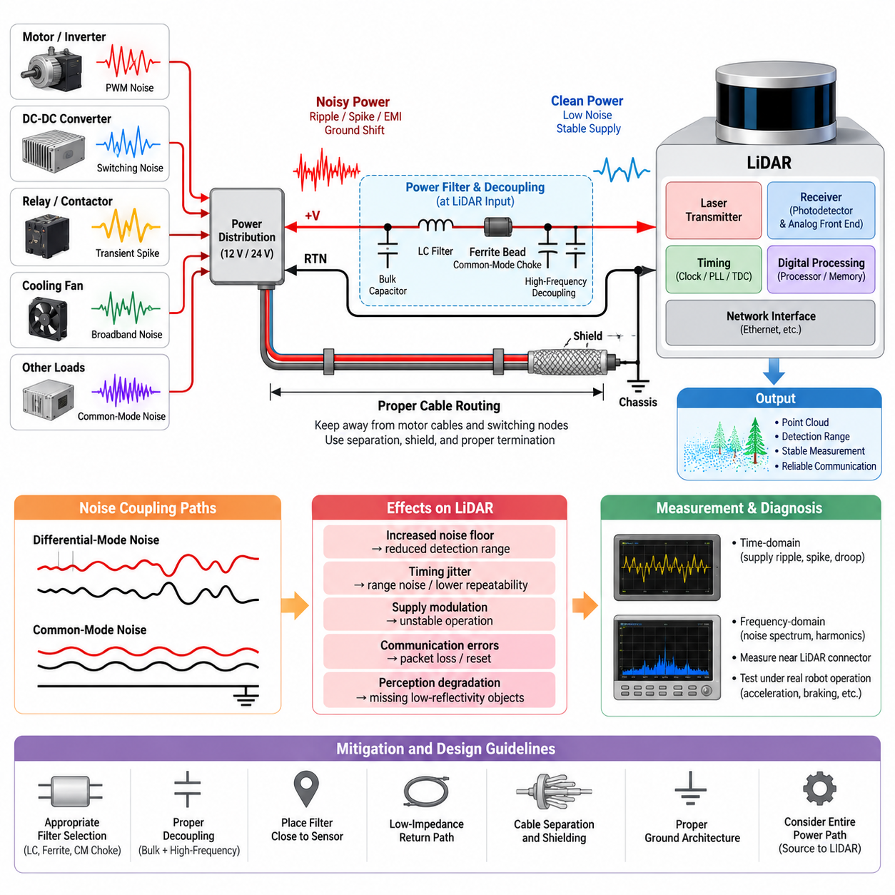
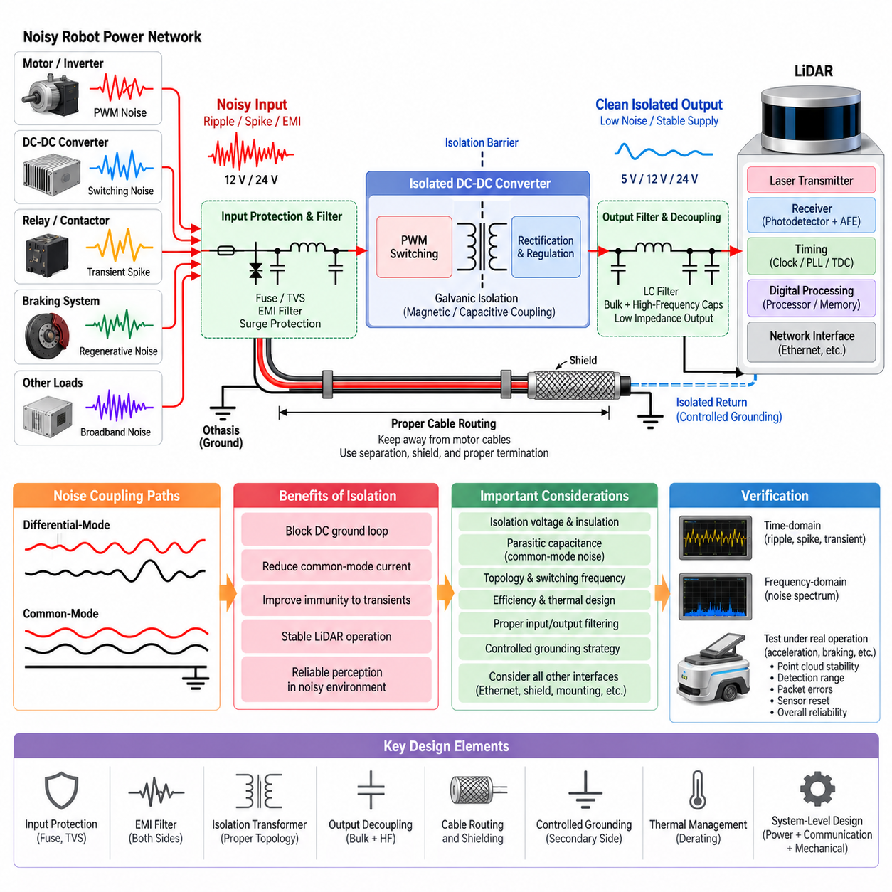
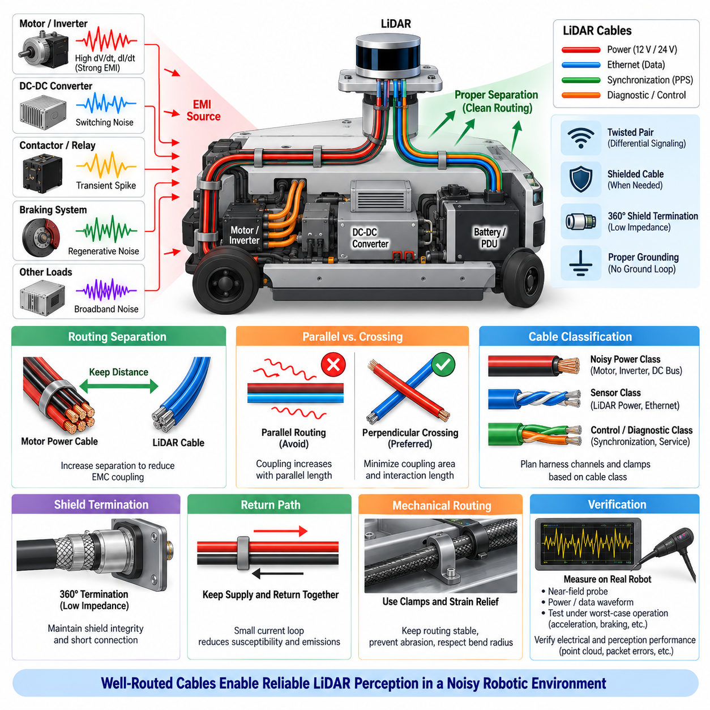
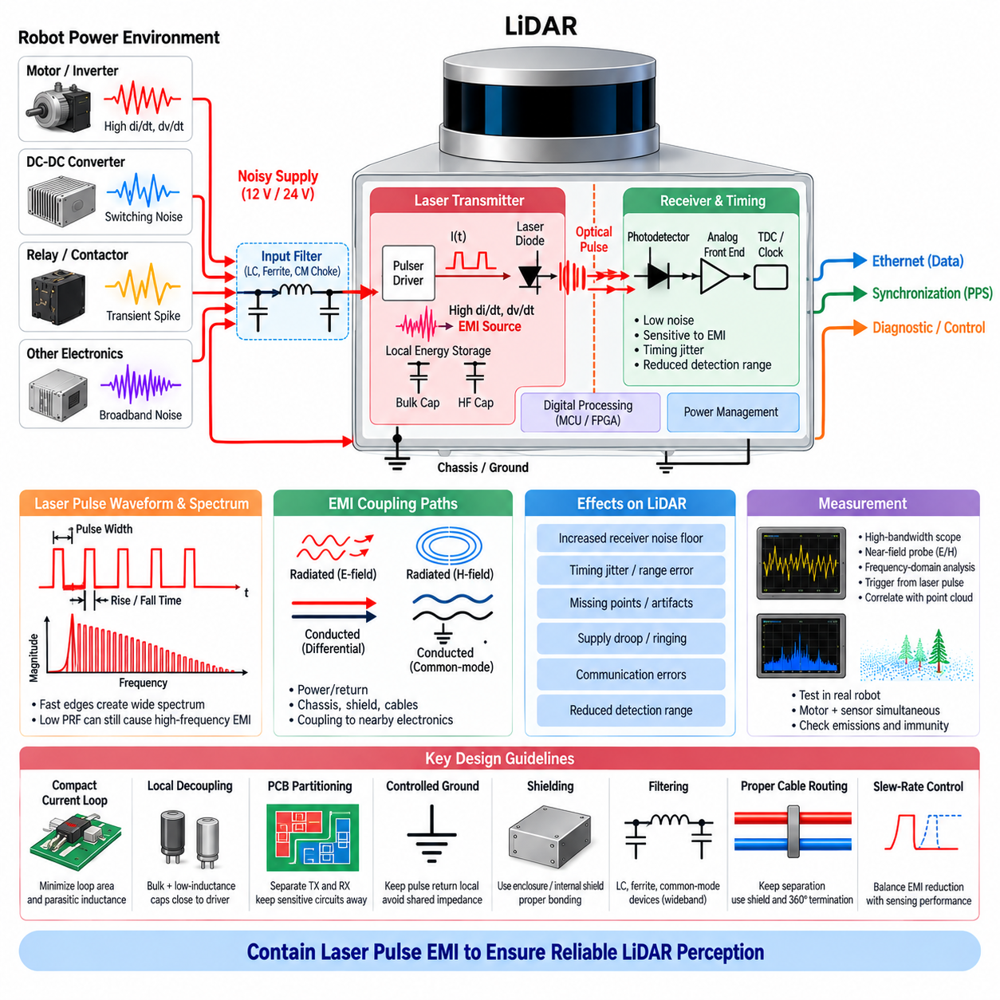
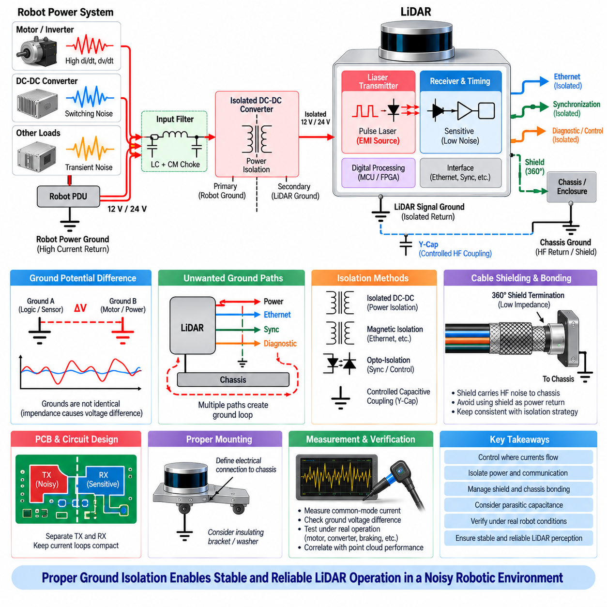

**Volume 05. Grounding and EMC**

# Chapter 08. LiDAR EMI

## 08.01. LiDAR Power Noise Sensitivity

{width="7.268055555555556in" height="7.268055555555556in"}

라이다(LiDAR) 시스템은 정밀 아날로그 센싱(Precision Analog Sensing), 고속 디지털 처리(High-Speed Digital Processing), 레이저 펄스 생성(Laser Pulse Generation), 타이밍 회로(Timing Circuit), 네트워크 인터페이스(Network Interface)를 하나의 소형 하우징 내부에 통합한다. 이러한 구조로 인해 센서는 외부 전자기 간섭(Electromagnetic Interference)뿐만 아니라 전원 공급 경로를 통해 유입되는 교란에도 민감하다. 전원 노이즈(Power Noise)는 수신기 임계값, 타이밍 기준, 내부 클록 안정성, 신호 처리 동작을 변화시킬 수 있으며, 그 결과 전기적 문제가 인지 문제(Perception Problem)처럼 나타날 수 있다.

따라서 라이다(LiDAR)의 전원 입력은 단순한 직류 전원 연결(DC Supply Connection)이 아니라 전자기 적합성 인터페이스(EMC Interface)로 취급해야 한다. 공칭 12 V, 24 V 또는 기타 전원 레일에는 로봇의 다른 장치에서 발생한 스위칭 리플(Switching Ripple), 과도 스파이크(Transient Spike), 공통 모드 교란(Common-Mode Disturbance), 접지 변동(Ground Shift), 광대역 노이즈(Broadband Noise)가 포함될 수 있다. 모터 인버터, DC-DC 컨버터, 릴레이, 컨택터, 냉각 팬 및 대전류 부하는 이러한 교란을 공용 전력 분배망에 주입하여 센서까지 전달할 수 있다.

전도성 노이즈(Conducted Noise)는 주로 양극 전원 도체와 리턴 경로(Return Path)를 통해 라이다(LiDAR)에 도달한다. 차동 모드 노이즈(Differential-Mode Noise)는 전원선과 리턴선 사이의 전압 교란으로 나타나는 반면, 공통 모드 노이즈(Common-Mode Noise)는 두 도체가 섀시(Chassis) 또는 주변 구조물에 대해 함께 변동하는 형태로 나타난다. 두 메커니즘은 서로 다른 완화 방법이 필요하며, 차동 리플을 효과적으로 감쇠하는 필터라도 케이블 커패시턴스, 섀시 결합 또는 커넥터 구조를 통해 흐르는 공통 모드 전류를 충분히 억제하지 못할 수 있다.

라이다(LiDAR) 수신기는 대상 물체의 거리, 반사율, 입사각, 기상 조건 및 주변 조명에 따라 크게 변화하는 광학 반사 신호(Optical Return)를 검출해야 한다. 약한 반사 신호는 광검출기(Photodetector)와 아날로그 프런트엔드(Analog Front End)의 감도 한계에 가까워질 수 있다. 전원 노이즈가 증폭 회로, 임계값, 바이어스 또는 변환 회로에 결합되면 실질적인 노이즈 플로어(Noise Floor)가 증가하며, 그 결과 신호 대 잡음비(Signal-to-Noise Ratio)가 저하되어 검출 거리 감소, 측정 분산 증가 또는 낮은 반사율 물체의 간헐적인 검출 실패가 발생할 수 있다.

라이다(LiDAR)의 거리 측정은 정밀한 광학 전파 시간 또는 관련 위상과 주파수 정보의 추정에 의존하므로 타이밍 안정성(Timing Stability) 역시 중요하다. 발진기(Oscillator), 위상 고정 루프(Phase-Locked Loop), 클록 분배 회로(Clock Distribution), 시간-디지털 변환기(Time-to-Digital Converter) 또는 기준 전압에 영향을 주는 노이즈는 타이밍 불확실성을 증가시킬 수 있다. 이러한 교란이 센서를 리셋시키거나 명확한 고장을 발생시키지 않더라도 타이밍 지터(Timing Jitter)의 증가는 거리 노이즈, 불안정한 포인트 위치 또는 포인트 클라우드(Point Cloud)의 반복 정밀도 저하로 나타날 수 있다.

전원 교란(Power Disturbance)은 레이저 송신부(Laser Transmitter Section)에도 영향을 줄 수 있다. 펄스 방식 라이다(Pulsed LiDAR)는 레이저 광원에 제어된 에너지를 빠르게 공급해야 하므로 센서 내부에서 순간적으로 큰 전류 변화가 발생한다. 외부 전원 임피던스가 지나치게 높거나 로컬 에너지 저장(Local Energy Storage)이 충분하지 않으면 이러한 전류 펄스가 내부 공급 전압을 변조할 수 있다. 따라서 라이다는 전자기 간섭의 피해 장치(EMI Victim)이면서 동시에 내부에서 발생한 펄스 전류를 로봇 전력망으로 전달하는 전자기 간섭 발생원(EMI Source)이 될 수 있다.

이러한 양방향 특성으로 인해 소스 임피던스(Source Impedance)는 중요한 설계 파라미터가 된다. 짧은 케이블을 사용하는 실험실 전원에서는 우수한 성능을 보이는 라이다(LiDAR)라도 자율이동로봇(AMR)에 설치하면 수 미터의 하네스 임피던스, 커넥터 저항, 퓨즈 저항, 전력 분배 장치(PDU) 경로 및 공용 리턴 도체의 영향을 받을 수 있다. 직류 전압이 규격 범위 안에 있더라도 고주파 임피던스(High-Frequency Impedance)는 허용하기 어려운 수준일 수 있으므로 전자기 적합성(EMC) 평가는 실제 설치된 전체 전원 경로의 주파수 의존 임피던스를 고려해야 한다.

모터로 구동되는 로봇은 펄스 폭 변조(PWM) 스위칭이 빠른 전압 및 전류 변화와 넓은 주파수 스펙트럼을 발생시키기 때문에 특히 가혹한 전기적 환경을 형성한다. 모터 상 케이블(Motor Phase Cable), 인버터 직류 버스, 제동 회로 및 DC-DC 컨버터는 전도성 또는 방사성 결합을 통해 라이다 배선에 노이즈를 전달할 수 있다. 라이다 전원이 이러한 부하와 동일한 분배 분기 또는 리턴 경로를 공유하면 스위칭 전류가 국부적인 접지 바운스(Ground Bounce)와 공급 전압 변조를 발생시킬 수 있으며, 증상은 가속, 조향, 제동 또는 특정 모터 운전 조건과 연관되어 나타날 수 있다.

따라서 라이다(LiDAR) 전원 배선의 물리적 라우팅(Physical Routing)은 노이즈 제어 전략의 일부로 다루어야 한다. 전원 및 신호 케이블은 가능한 경우 인버터 출력, 모터 상 도체, 스위칭 노드 및 기타 높은 전압 변화율(High-dV/dt)이나 높은 전류 변화율(High-dI/dt)을 갖는 구조물에서 충분히 이격해야 한다. 장거리 평행 배선은 결합 가능성을 증가시키는 반면, 물리적 분리와 적절하게 제어된 교차 배선은 이를 감소시킨다. 차폐(Shielding)를 추가하면 결합을 더욱 줄일 수 있지만 그 효과는 종단 처리(Termination) 품질과 섀시 통합 방식에 크게 좌우된다.

라이다(LiDAR) 전원 인터페이스의 필터링(Filtering)은 필터를 무조건 추가하는 방식이 아니라 실제 측정된 교란 메커니즘에 따라 선택해야 한다. 입력 커패시터(Input Capacitor)는 국부적인 고주파 에너지 저장 기능을 제공하며, LC 필터 또는 다단 필터 네트워크(Multi-Stage Filter Network)는 차동 교란을 감쇠할 수 있다. 페라이트 부품(Ferrite Component)은 고주파 손실을 증가시키는 데 활용할 수 있으며, 공통 모드 구조(Common-Mode Structure)는 일반적인 차동 필터로 억제하기 어려운 전류를 감소시킬 수 있다. 이때 부품의 임피던스, 공진, 포화, 직류 저항 및 센서의 전류 요구량을 종합적으로 고려해야 한다.

필터 배치(Filter Placement)는 필터 선택만큼 중요하다. 라이다(LiDAR)에서 멀리 떨어진 위치에 억제 네트워크를 배치하면 필터와 센서 사이의 케이블 구간이 노이즈에 그대로 노출되어 이미 필터링된 도체에 노이즈가 다시 결합될 수 있다. 최종 필터링 단계를 센서 전원 입력부 가까이에 배치하면 일반적으로 이러한 취약한 루프를 최소화할 수 있다. 또한 물리적 레이아웃에서는 필터의 노이즈 측(Noisy Side)과 클린 측(Clean Side)을 분리하여 용량성 또는 자기적 결합이 의도된 감쇠 경로를 우회하지 않도록 해야 한다.

디커플링(Decoupling)은 하나의 커패시터가 전체 교란 주파수 범위에서 이상적으로 동작하지 않기 때문에 여러 주파수 영역을 포괄하도록 설계해야 한다. 벌크 커패시턴스(Bulk Capacitance)는 상대적으로 느린 부하 변화와 레이저 관련 에너지 요구에 대응하고, 더 작은 저인덕턴스 커패시터(Low-Inductance Capacitor)는 빠른 주파수 성분에 대응한다. 커패시터 리드, PCB 패턴, 커넥터 핀 및 하네스 구간의 기생 인덕턴스(Parasitic Inductance)는 고주파 효과를 제한하므로 이론적으로 충분한 커패시턴스라도 전류가 큰 물리적 루프를 통과해야 한다면 실제 성능은 크게 저하될 수 있다.

접지 아키텍처(Ground Architecture)에도 동일한 수준의 주의가 필요하다. 라이다(LiDAR)의 리턴을 노이즈가 많은 모터 리턴 경로에 직접 연결하면 공용 임피던스(Shared Impedance)를 통해 부하 전류가 센서의 접지 교란으로 변환될 수 있다. 반대로 제어되지 않은 다중 접지점은 공통 모드 전류 경로와 접지 루프(Ground Loop)를 형성할 수 있다. 적절한 구조는 센서 구성, 섀시 본딩(Chassis Bonding), 통신 인터페이스, 차폐 및 전원 토폴로지에 따라 달라지므로 라이다 전원 리턴은 로봇 전체의 접지 및 전자기 적합성(EMC) 구조와 함께 고려해야 한다.

통신 오류(Communication Error)는 때때로 전원 무결성 문제(Power Integrity Problem)의 2차적인 증상으로 나타날 수 있다. 이더넷 물리 계층(Ethernet PHY), 직렬화 장치(Serializer), 프로세서 및 내부 스위칭 레귤레이터는 라이다 입력 전원에서 생성된 전원 레일을 사용한다. 따라서 전원 인터페이스를 통해 유입된 과도 교란은 패킷 전송, 클록 복구, 프로세서 실행 또는 내부 리셋 로직을 방해할 수 있다. 관찰된 패킷 손실을 통신 케이블 문제로 단정해서는 안 되며, 전원 레일 교란과의 상관관계를 분석하면 공통적인 전기적 원인을 발견할 수 있다.

진단(Diagnosis)에는 시간 영역 측정(Time-Domain Measurement)과 주파수 영역 측정(Frequency-Domain Measurement)을 함께 적용해야 한다. 오실로스코프(Oscilloscope)는 공급 전압 강하, 과도 스파이크, 주기적인 리플 및 모터 스위칭이나 레이저 동작과 동기화된 교란을 포착할 수 있다. 스펙트럼 분석기(Spectrum Analyzer) 또는 적절한 전자기 간섭 측정 시스템은 주요 주파수 성분과 고조파를 식별하는 데 사용할 수 있다. 배터리나 전력 분배 장치에서만 측정하면 로컬 하네스 임피던스와 공용 리턴 경로에서 발생하는 전압 교란을 놓칠 수 있으므로 측정은 라이다 커넥터 근처에서도 수행해야 한다.

시험(Testing)은 정지 상태에서 라이다(LiDAR)만 평가하는 것이 아니라 실제 로봇의 운전 상태를 재현해야 한다. 모터 가속, 회생 제동(Regenerative Braking), 조향 작동, 페이로드 변화, DC-DC 컨버터의 동작 전환, 네트워크 활동 및 여러 센서의 동시 동작은 벤치 시험에서는 나타나지 않는 복합적인 교란을 발생시킬 수 있다. 따라서 포인트 클라우드 품질, 검출 거리, 패킷 통계, 센서 진단 정보 및 전원 파형을 함께 기록하여 전기적 이벤트와 인지 성능 저하 사이의 상관관계를 분석해야 한다.

견고한 라이다(LiDAR) 설치 설계는 궁극적으로 노이즈 발생원(Source)에서 피해 장치(Victim)까지 이어지는 전체 노이즈 경로를 제어하는 데 달려 있다. 깨끗한 전력 분배, 낮은 임피던스의 리턴 경로, 적절한 필터링, 로컬 디커플링, 케이블 이격, 차폐, 섀시 본딩 및 체계적인 커넥터 설계가 하나의 통합 시스템으로 작동해야 한다. 설계 초기 단계에서 전원 노이즈 민감도(Power-Noise Sensitivity)를 고려하면 간헐적인 포인트 클라우드 오류가 해결하기 어려운 현장 문제로 발전하는 것을 방지하고, 자율이동로봇(AMR)과 기타 피지컬 AI(Physical AI) 플랫폼에서 신뢰성 높은 인지 기능을 위한 안정적인 전기적 기반을 확보할 수 있다.

## 08.02. Isolated Power Supply Design

{width="7.268055555555556in" height="7.268055555555556in"}

라이다(LiDAR) 전원 공급 장치에서 전기적 절연(Electrical Isolation)은 센서와 로봇의 노이즈가 많은 전력 네트워크 사이에 형성될 수 있는 원치 않는 전도 경로(Conductive Path)를 차단하기 위해 사용된다. 자율이동로봇(AMR)에서 라이다는 모터 인버터, DC-DC 컨버터, 제동 회로, 컨택터 및 대전류 액추에이터와 동일한 시스템에 설치될 수 있다. 절연 전원(Isolated Supply)은 절연 경계(Isolation Barrier)를 통한 직접적인 직류 전류의 흐름을 차단하면서 자기적 또는 용량성 결합을 통해 필요한 전력을 전달하는 갈바닉 절연(Galvanic Isolation)을 형성한다.

절연(Isolation)의 주요 목적은 단순히 깨끗한 출력 전압을 생성하는 것만이 아니다. 공통 모드 전류(Common-Mode Current), 접지 전위차(Ground Potential Difference), 과도 교란(Transient Disturbance)이 민감한 라이다(LiDAR) 전자 회로에 도달하는 경로를 제어하는 것이 핵심이다. 일반적인 비절연 컨버터(Non-Isolated Converter)는 입력 접지와 출력 접지가 직접적인 전기적 관계를 유지하지만, 절연형 DC-DC 컨버터(Isolated DC-DC Converter)는 제어된 조건에서 센서 측 리턴을 노이즈가 많은 전원 측 리턴으로부터 전기적으로 분리할 수 있다.

이러한 분리는 라이다(LiDAR)가 중앙 전력 분배 장치(Power Distribution Unit)에서 멀리 떨어져 장착될 때 특히 유용하다. 긴 하네스(Harness)는 저항, 인덕턴스, 기생 커패시턴스(Parasitic Capacitance)를 증가시키고 주변 케이블이나 금속 구조물과의 결합을 발생시킨다. 공용 도체를 통해 흐르는 모터 전류는 서로 떨어진 접지점 사이에 전압 차이를 만들 수 있으며, 절연이 없다면 이러한 전위차가 라이다 전원 리턴, 통신 차폐, 섀시 연결 또는 다른 전도 경로를 통해 원치 않는 전류를 흐르게 할 수 있다.

절연 전원 아키텍처(Isolated Power Architecture)는 일반적으로 입력 보호 및 필터링 단계(Input Protection and Filtering Stage), 절연형 DC-DC 변환 단계, 2차 측 정류 또는 레귤레이션(Secondary-Side Rectification or Regulation), 라이다(LiDAR) 근처의 로컬 출력 필터링(Local Output Filtering)으로 구성된다. 입력 단계는 로봇 전원 버스에서 유입되는 교란을 제한하며, 절연 변압기(Isolation Transformer)는 갈바닉 분리를 제공한다. 이후 2차 측에서는 센서의 전류 요구량과 노이즈 민감도에 맞춰 필터링 및 디커플링할 수 있는 로컬 기준 전원을 형성한다.

절연형 컨버터(Isolated Converter)를 선정할 때는 단순히 공칭 입력 및 출력 전압만 일치시키는 것으로 충분하지 않다. 연속 전력 정격, 피크 전류, 변환 효율, 허용 입력 범위, 출력 리플, 과도 응답, 절연 전압, 절연 구조, 스위칭 주파수, 열적 특성 및 전자기 방출을 고려해야 한다. 라이다(LiDAR)의 소비 전류 역시 레이저 동작, 내부 처리, 히터, 네트워크 활동 또는 기동 시퀀스에 따라 변할 수 있으므로 충분한 과도 부하 여유(Transient Margin)를 확보하는 것이 중요하다.

모든 실제 절연 장벽(Isolation Barrier)에는 기생 커패시턴스(Parasitic Capacitance)가 존재하기 때문에 절연만으로 고주파 노이즈가 자동으로 제거되는 것은 아니다. 컨버터 내부의 빠른 스위칭 전압 변화는 변압기의 권선 간 커패시턴스(Interwinding Capacitance)와 기타 기생 경로를 통해 변위 전류(Displacement Current)를 발생시킬 수 있다. 이 전류는 절연된 출력 측에서 공통 모드 노이즈로 나타날 수 있으므로, 높은 절연 전압 정격을 가진 컨버터라도 공통 모드 결합 특성이 라이다 설치 환경에 적합하지 않으면 전자기 적합성(EMC) 성능이 저하될 수 있다.

따라서 변압기 설계(Transformer Design)와 스위칭 토폴로지(Switching Topology)는 전력 변환 성능뿐만 아니라 전자기 적합성(EMC)에도 영향을 미친다. 플라이백(Flyback), 포워드(Forward), 푸시풀(Push-Pull), 하프브리지(Half-Bridge) 및 기타 절연형 컨버터 구조는 서로 다른 스위칭 파형, 전류 루프, 부품 스트레스 및 노이즈 스펙트럼을 형성한다. 라이다 전원에서 적합한 토폴로지는 효율만으로 결정할 수 없으며, 스위칭 에지 크기, 변압기의 기생 커패시턴스, 물리적 레이아웃, 동작 주파수 및 필요한 필터링을 함께 평가해야 한다.

1차 측 스위칭 루프(Primary-Side Switching Loop)는 높은 전류 변화율(High-dI/dt)을 갖는 전류 루프가 자기장과 전도성 교란을 발생시키므로 물리적으로 작게 구성해야 한다. 마찬가지로 높은 전압 변화율(High-dV/dt)을 갖는 스위칭 노드는 용량성 결합을 줄이기 위해 최소한의 구리 면적을 사용해야 한다. 절연 변압기는 노이즈가 많은 1차 측 구조가 절연 장벽을 우회하여 깨끗한 2차 측 회로에 용량성으로 결합되지 않도록 배치해야 하므로, PCB 레이아웃은 단순한 패키징 요소가 아니라 절연 성능을 결정하는 핵심 설계 요소이다.

필터링(Filtering)은 측정된 노이즈 경로에 따라 일반적으로 절연 단계의 양쪽에 적용해야 한다. 1차 측 입력 필터는 컨버터의 스위칭 노이즈가 로봇 전원 버스로 역전파되는 것을 방지하고 다른 부하에서 유입되는 교란을 감쇠한다. 2차 측 필터링은 라이다(LiDAR)에 도달하기 전에 잔류 차동 리플과 스위칭 성분을 감소시킨다. 필터 구간에서는 노이즈 측 도체와 클린 측 도체가 서로 가까이 배치되어 의도된 감쇠 경로를 우회하지 않도록 물리적으로 분리해야 한다.

절연형 컨버터(Isolated Converter)를 사용하더라도 라이다(LiDAR) 근처의 로컬 디커플링(Local Decoupling)은 여전히 필요하다. 벌크 커패시턴스(Bulk Capacitance)는 비교적 느린 부하 변화에 필요한 에너지를 공급하고, 작은 저인덕턴스 커패시터(Low-Inductance Capacitor)는 높은 주파수에서 낮은 임피던스를 제공한다. 절연 전원과 센서 사이의 배선은 적절하게 짧고 낮은 임피던스로 구성해야 하며, 2차 측 하네스가 지나치게 길어지면 절연과 필터링 이후에도 결합 노이즈 및 전압 과도 현상에 대한 민감성이 다시 증가할 수 있다.

절연 출력 리턴(Isolated Output Return)의 처리 방법도 의도적으로 결정해야 한다. 2차 측을 완전히 부유(Floating) 상태로 유지하면 특정 접지 루프 전류를 감소시킬 수 있지만, 제어되지 않은 부유 네트워크는 기생 커패시턴스를 통해 예측하기 어려운 공통 모드 전압을 형성할 수 있다. 다른 시스템에서는 제어된 고주파 경로나 별도의 정의된 네트워크를 통해 2차 측을 섀시에 기준화할 수 있다. 올바른 방법은 라이다 하우징, 커넥터 구조, 통신 인터페이스, 케이블 차폐 및 로봇 전체의 접지 아키텍처(Grounding Architecture)에 따라 결정된다.

전원 절연(Power Isolation)은 통신 인터페이스(Communication Interface)와 함께 고려해야 한다. 전기적으로 절연되었다고 설계된 라이다(LiDAR)라도 이더넷 회로, 케이블 차폐, 장착 하드웨어, 진단 인터페이스 또는 섀시 접촉을 통해 로봇 접지와 의도하지 않게 다시 연결될 수 있기 때문이다. 다른 낮은 임피던스의 전도 경로가 절연 경계를 통과하면 예상했던 절연 효과가 감소하거나 사라질 수 있다. 따라서 시스템 수준 절연(System-Level Isolation)을 위해서는 센서와 로봇의 나머지 시스템 사이에 존재하는 모든 전기적 및 기계적 연결을 식별해야 한다.

차폐 종단(Shield Termination)은 특히 주의해서 설계해야 한다. 케이블 차폐(Cable Shield)는 정상적인 전원 리턴 도체 역할이 아니라 전자기장과 공통 모드 전류를 제어하는 것을 주요 목적으로 한다. 아키텍처에 따라 차폐는 커넥터 근처에서 낮은 인덕턴스의 연결을 사용하여 섀시에 본딩할 수 있으며, 절연된 전원 리턴은 이와 분리하여 유지할 수 있다. 불량한 종단, 긴 피그테일(Pigtail) 또는 의도하지 않은 차폐-신호 접지 연결은 설계된 절연 전략을 우회하는 고주파 전류 경로를 형성할 수 있다.

절연(Isolation)은 컨택터, 릴레이, 회생 제동(Regenerative Braking) 및 급격하게 변화하는 모터 부하에서 발생하는 과도 현상에 대한 내성을 향상시킬 수도 있다. 그러나 절연형 컨버터 자체도 로봇 전원 버스에서 예상되는 입력 교란을 견딜 수 있어야 한다. 따라서 절연 단계 앞에는 역극성 보호(Reverse Polarity Protection), 서지 억제(Surge Suppression), 과도 전압 억제(Transient Voltage Suppression), 전류 제한 및 적절한 입력 커패시턴스가 필요할 수 있다. 절연은 입력 보호를 대체하는 것이 아니라 이를 보완하는 수단으로 사용해야 한다.

절연형 전력 변환(Isolated Power Conversion)은 스위칭 소자, 자기 부품, 정류기 및 제어 회로에서 추가적인 손실을 발생시키므로 열 설계(Thermal Design) 역시 중요하다. 밀폐된 센서 하우징이나 소형 전장 박스 내부에 설치된 컨버터는 실험실 시험보다 훨씬 높은 온도에서 동작할 수 있다. 따라서 실제 입력 전압, 라이다 부하, 주변 온도 및 공기 흐름 조건에서 효율을 평가하고, 요구되는 환경 범위 전체에서 신뢰성 있는 동작을 유지할 수 있도록 충분한 디레이팅(Derating)을 적용해야 한다.

검증(Verification)에서는 전기적 무결성(Electrical Integrity)과 라이다(LiDAR)의 실제 성능을 함께 측정해야 한다. 로봇이 모터 및 주요 부하를 동작시키는 동안 입력 및 출력 리플, 기동 동작, 부하 스텝 응답(Load-Step Response), 공통 모드 전압, 과도 현상 내성 및 전도성 방출을 평가해야 한다. 긴 프로브 접지선은 고주파 노이즈를 실제보다 크게 측정할 수 있으므로 오실로스코프 측정에는 적절한 프로빙 기법(Probing Technique)을 사용해야 하며, 컨버터 근처와 라이다 커넥터에서 직접 수행한 측정 결과를 함께 비교하는 것이 중요하다.

최종 검증(Final Validation)에서는 전기적 측정 결과와 인지 동작(Perception Behavior)의 상관관계를 확인해야 한다. 가속, 제동, 조향, 컨버터 부하 변화 및 기타 최악 조건의 운전 상태를 재현하면서 포인트 클라우드(Point Cloud) 안정성, 검출 거리, 측정 분산, 패킷 오류, 센서 리셋, 진단 이벤트 및 기동 신뢰성을 관찰해야 한다. 이러한 방법을 통해 단순화된 벤치 시험에서 적절한 전압 파형을 얻는 것에 그치지 않고 절연이 실제 센서 시스템의 성능을 향상시키는지 확인할 수 있다.

성공적인 라이다(LiDAR) 절연 전원 설계는 갈바닉 절연(Galvanic Isolation)을 제어된 접지, 필터링, 디커플링, 케이블 라우팅, 차폐, 과도 현상 보호, 열 관리 및 신중한 PCB 레이아웃과 결합해야 한다. 절연은 전체 노이즈 발생원-경로-피해 장치(Source-Path-Victim) 전자기 적합성 아키텍처의 일부로 다룰 때 가장 효과적이다. 절연 경계를 통과하는 모든 경로를 의도적으로 제어하면 라이다는 자율이동로봇(AMR)이나 기타 피지컬 AI(Physical AI) 플랫폼의 전기적으로 열악한 환경에서도 안정적인 전원과 신뢰성 높은 인지 성능을 유지할 수 있다.

## 08.03. LiDAR Cable Routing

{width="7.268055555555556in" height="7.268055555555556in"}

라이다(LiDAR) 케이블 라우팅(Cable Routing)은 케이블 하네스가 간섭을 전달하는 전도 경로(Conductive Path)이면서 동시에 전자기 에너지를 수신하거나 방사할 수 있는 안테나 구조로 작용하기 때문에 전자기 적합성(EMC)의 중요한 요소이다. 라이다 설치에는 전원, 이더넷(Ethernet), 동기화(Synchronization), 진단 연결 등이 포함될 수 있으며 각각 서로 다른 노이즈 민감도 특성을 갖는다. 따라서 케이블 라우팅은 단순한 기계적 패키징 작업이 아니라 전체 센서 전기 아키텍처의 일부로 설계해야 한다.

자율이동로봇(AMR)에서 가장 중요한 라우팅 고려 사항은 라이다(LiDAR) 케이블과 고에너지 스위칭 회로(High-Energy Switching Circuit) 사이의 이격이다. 모터 상 도체(Motor Phase Conductor), 인버터 출력, 제동 회로, 컨택터 배선 및 대전류 직류 버스는 빠르게 변화하는 전기장과 자기장을 발생시킨다. 라이다 배선이 이러한 도체와 평행하게 배치되면 용량성 및 유도성 결합을 통해 스위칭 노이즈가 센서 전원이나 통신 회로로 전달되어 포인트 클라우드(Point Cloud) 안정성 또는 네트워크 신뢰성을 저하시킬 수 있다.

물리적 이격(Physical Separation)은 가장 단순하면서도 효과적인 대응 방법 중 하나이다. 민감한 라이다(LiDAR) 배선과 노이즈가 많은 전력 케이블 사이의 거리를 증가시키면 전기장 결합과 자기장 결합을 모두 감소시킬 수 있다. 필요한 이격 거리는 전류 크기, 스위칭 변화율(Switching Slew Rate), 케이블 구조, 차폐, 평행 배선 길이 및 설치 형상에 따라 달라진다. 따라서 특정한 하나의 이격 거리만을 보편적인 전자기 적합성(EMC) 해결책으로 간주해서는 안 되며 전체 결합 환경을 평가해야 한다.

평행 라우팅(Parallel Routing)은 공유되는 배선 길이에 따라 전자기 결합이 누적되므로 최소화해야 한다. 라이다(LiDAR) 케이블이 모터 케이블이나 다른 노이즈 하네스를 반드시 교차해야 한다면 긴 평행 경로보다는 가능한 한 직각에 가까운 교차가 일반적으로 유리하다. 목적은 유효 결합 면적과 상호작용 길이를 최소화하는 것이다. 짧고 불가피한 교차는 민감한 케이블과 노이즈 케이블을 동일한 채널에서 긴 거리 동안 함께 배치하는 것보다 일반적으로 간섭이 적다.

케이블 분류(Cable Classification)는 로봇 개발 전체 과정에서 일관된 라우팅 원칙을 유지하는 데 도움이 된다. 대전류 모터 및 인버터 배선은 노이즈 전력 클래스(Noisy Power Class)로 분류할 수 있고, 라이다(LiDAR) 전원 및 통신 배선은 보다 민감한 센서 클래스(Sensor Class)로 분류할 수 있다. 이후 하네스 채널, 클램프, 전선관 및 커넥터 위치를 이러한 분류에 따라 계획하면 이후의 기계 설계 변경으로 민감한 센서 케이블이 강한 전자기 간섭(EMI) 발생원 옆에 의도치 않게 배치되는 것을 방지할 수 있다.

라이다(LiDAR)의 전원 케이블과 통신 케이블 사이의 관계도 고려해야 한다. 노이즈가 많은 전원 도체를 차폐되지 않은 통신 페어(Communication Pair) 바로 옆에 배치하면 데이터 인터페이스에 교란이 유입될 수 있다. 가능한 경우 전원 배선은 제어된 리턴 구조(Controlled Return Geometry)를 가져야 하며, 이더넷(Ethernet) 또는 기타 차동 통신 링크는 규정된 페어 구조와 임피던스를 유지해야 한다. 트위스팅(Twisting)과 차동 신호(Differential Signaling)는 루프 면적을 최소화하고 두 도체에 유사하게 결합된 노이즈를 제거함으로써 간섭 민감도를 낮춘다.

전류는 항상 완전한 루프를 통해 흐르므로 리턴 경로(Return Path) 역시 중요하다. 양극 전원 도체만 주의 깊게 라우팅하고 리턴 도체가 멀리 떨어진 경로나 공용 경로를 사용하도록 하면 큰 루프 면적이 형성되어 자기적 결합이 증가할 수 있다. 따라서 라이다(LiDAR)의 전원 도체와 리턴 도체는 전체 라우팅 경로를 따라 물리적으로 서로 가깝게 유지해야 한다. 작은 전류 루프는 외부 자기장에 대한 민감도와 센서의 전류 변화로 발생하는 전자기 방출을 동시에 감소시킨다.

차폐 케이블(Shielded Cable)은 라우팅 이격만으로 충분하지 않은 환경에서 추가적인 보호 기능을 제공할 수 있다. 차폐는 전기장 결합을 차단하고 고주파 공통 모드 전류(Common-Mode Current)에 대해 제어된 경로를 제공한다. 그러나 실제 효과는 차폐 범위(Shield Coverage), 전달 임피던스(Transfer Impedance), 커넥터 구조 및 종단 방식에 크게 좌우된다. 고품질 차폐 케이블이라도 긴 피그테일(Pigtail)을 통해 연결하면 추가 인덕턴스로 인해 고주파에서 차폐 임피던스가 증가하여 성능이 크게 저하될 수 있다.

이러한 이유로 커넥터와 시스템 아키텍처가 지원하는 경우 전자기 적합성(EMC)이 중요한 커넥터 인터페이스에서는 일반적으로 360도 차폐 종단(360-Degree Shield Termination)이 선호된다. 케이블 차폐는 가능한 한 불연속 구간 없이 커넥터 셸(Connector Shell)로 연결되어야 하며, 커넥터 셸은 적절한 섀시 또는 인클로저 구조와 낮은 임피던스로 연결되어야 한다. 이를 통해 보다 연속적인 전자기 경계(Electromagnetic Boundary)를 형성하고 고주파 공통 모드 전류가 센서 내부 전자 회로로 유입되는 현상을 줄일 수 있다.

그러나 차폐 전략(Shielding Strategy)은 반드시 접지 아키텍처(Grounding Architecture)와 일관성을 유지해야 한다. 명확한 계획 없이 차폐, 신호 리턴, 전원 리턴 및 섀시를 서로 연결하면 원치 않는 전류 경로나 접지 루프(Ground Loop)가 형성될 수 있다. 반대로 부적절한 위치에서 차폐를 부유(Floating) 상태로 두면 고주파 차폐 효과가 저하될 수 있다. 따라서 라이다(LiDAR) 케이블 라우팅은 독립적인 전자기 적합성 대책이 아니라 섀시 본딩, 전원 절연, 커넥터 종단 및 통신 인터페이스 요구 사항과 함께 설계해야 한다.

기계 구조물(Mechanical Structure)도 케이블의 전자기 적합성(EMC) 특성에 영향을 줄 수 있다. 적절하게 본딩된 금속 섀시 가까이에 케이블을 배치하면 보다 제어된 전자기 환경을 형성하고 루프 면적을 감소시킬 수 있지만, 개구부나 절연된 패널 또는 본딩 상태가 불량한 구조물을 가로질러 배선하면 공통 모드 특성이 달라질 수 있다. 금속 전선관이나 케이블 트레이는 적절히 본딩하면 유용한 차폐를 제공할 수 있지만 구간 사이에 불연속성이 존재하면 효과가 감소하고 예상하지 못한 전류 집중 지점이 형성될 수 있다.

스위칭 전원 컨버터(Switching Power Converter) 주변의 라우팅은 특별한 주의가 필요하다. DC-DC 컨버터에는 높은 전압 변화율(High-dV/dt)을 갖는 스위칭 노드, 자기 부품 및 높은 전류 변화율(High-dI/dt)을 갖는 루프가 존재하여 국부적인 전자기장을 발생시킬 수 있다. 일반적인 전도성 방출 기준을 만족하는 컨버터라도 라이다(LiDAR) 케이블이 해당 회로 바로 위나 옆으로 지나가면 노이즈가 유입될 수 있다. 따라서 민감한 하네스는 컨버터의 스위칭 영역과 빠른 펄스 전류가 흐르는 케이블에서 충분히 이격해야 한다.

커넥터 배치(Connector Placement)는 의도된 케이블 라우팅 전략을 지원하도록 설계해야 한다. 라이다(LiDAR) 커넥터를 노이즈가 많은 모터 하네스 방향으로 배치하면 민감한 배선을 충분히 이격하기 전에 불리한 영역을 통과시켜야 할 수 있다. 따라서 전기 설계자와 기계 설계자는 개발 초기부터 센서 방향, 커넥터 방향, 브래킷 설계 및 하네스 인입 위치를 함께 조정해야 한다. 적절한 커넥터 배치는 케이블 길이를 줄이고 불필요한 교차를 제거하며 차폐와 접지 요구 사항을 보다 쉽게 구현할 수 있도록 한다.

불필요하게 긴 케이블(Excess Cable Length)도 피해야 한다. 큰 서비스 루프(Service Loop)와 느슨하게 묶인 잉여 배선은 루프 면적을 증가시키며 특정 주파수에서 효율적인 수신 또는 방사 안테나처럼 동작하는 공진 구조를 형성할 수 있다. 정비성을 위해 추가 길이가 필요한 경우에도 큰 개방형 루프가 형성되지 않도록 케이블을 제어된 방식으로 관리해야 한다. 특히 인버터나 모터 컨트롤러 옆에 남는 센서 케이블을 코일 형태로 감아 두면 잘 설계된 전자기 적합성(EMC) 구조의 성능을 크게 저하시킬 수 있다.

케이블 고정(Cable Fixation)은 로봇 운전 중에도 설계된 라우팅 형상이 유지되어야 하므로 중요하다. 진동, 조향 움직임, 서스펜션 작동, 회전식 라이다 장치, 유지보수 및 반복적인 정비 작업으로 인해 케이블이 노이즈 발생원에 가까워지거나 차폐 연결이 손상될 수 있다. 클램프와 스트레인 릴리프(Strain Relief)는 케이블의 최소 굽힘 반경을 준수하면서 의도된 이격을 유지해야 한다. 또한 차폐 손상은 즉각적인 단선 없이도 점진적으로 전자기 적합성 특성을 변화시킬 수 있으므로 기계적 마모를 방지해야 한다.

움직이는 로봇 플랫폼에서는 케이블이 관절, 가동 구조물 또는 움직이는 센서 마운트를 통과할 때 추가적인 문제가 발생한다. 유연 케이블 구간은 반복적인 굽힘 사이클에서도 도체 형상과 차폐 연속성(Shield Continuity)을 유지해야 한다. 라우팅은 커넥터에 인장 하중이 가해지지 않도록 하고 반복적인 움직임으로 민감한 케이블과 모터 도체 사이의 거리가 크게 변하는 위치를 피해야 한다. 따라서 전자기 적합성(EMC) 성능은 하나의 정적인 위치가 아니라 전체 기계적 작동 범위에서 유지되어야 한다.

가능한 경우 검증(Verification)은 실제 설치된 하네스를 대상으로 수행해야 한다. 근접장 프로브(Near-Field Probe)를 사용하면 모터, 컨버터 및 케이블 번들 주변의 강한 전자기 영역을 식별할 수 있으며, 오실로스코프 측정을 통해 라이다(LiDAR) 전원 또는 통신 인터페이스에 나타나는 교란을 확인할 수 있다. 모터를 정지시킨 상태와 동작시킨 상태에서 센서 동작을 비교하거나 의심되는 케이블을 임시로 다른 경로로 배치하여 비교하면 특정 라우팅 경로가 간섭 문제의 원인인지 판단하는 데 유용한 근거를 얻을 수 있다.

시험(Testing)은 최대 가속, 조향 작동, 회생 제동(Regenerative Braking), 높은 네트워크 트래픽, 여러 센서의 동시 동작 및 높은 전기적 부하와 같은 대표적인 최악 조건의 로봇 운전 상태를 포함해야 한다. 케이블과 관련된 교란을 측정하는 동안 포인트 클라우드(Point Cloud) 안정성, 검출 거리, 패킷 오류, 센서 리셋 및 진단 정보를 함께 모니터링해야 한다. 유휴 상태에서 정상적으로 동작하는 라우팅 설계라도 인버터 전류와 스위칭 동작이 최대 수준에 도달하면 문제가 발생할 수 있다.

효과적인 라이다(LiDAR) 케이블 라우팅은 궁극적으로 전자기 적합성 공학의 노이즈 발생원-경로-피해 장치(Source-Path-Victim) 원칙을 따른다. 노이즈 발생원은 민감한 배선에서 물리적으로 분리하고, 작은 리턴 구조, 제어된 교차, 차폐 및 적절한 종단을 통해 결합 경로를 최소화하며, 라이다 커넥터에는 깨끗한 전원과 통신 신호가 전달되도록 해야 한다. 라우팅, 접지, 차폐, 필터링 및 기계적 패키징을 하나의 통합 설계로 개발하면 자율이동로봇(AMR) 또는 기타 피지컬 AI(Physical AI) 시스템의 전기적으로 가혹한 환경에서도 신뢰성 높은 라이다 인지 성능을 유지할 수 있다.

## 08.04. Laser Pulse EMI

{width="7.268055555555556in" height="7.268055555555556in"}

펄스 방식 라이다(Pulsed LiDAR)는 레이저 다이오드(Laser Diode) 또는 레이저 드라이버 회로(Laser-Driver Circuit)를 통해 상당한 크기의 전류를 매우 빠르게 스위칭하여 극히 짧은 광학 펄스(Optical Pulse)를 생성한다. 방출되는 광학 에너지가 의도된 출력이지만, 이에 수반되는 전기적 전류 변화에는 매우 높은 주파수 성분이 포함된다. 빠른 펄스 에지는 높은 전류 변화율(dI/dt)과 전압 변화율(dV/dt)을 발생시키므로 송신부는 라이다 내부뿐만 아니라 로봇 전체 전기 시스템에 영향을 줄 수 있는 중요한 국부 전자기 간섭(EMI) 발생원이 된다.

레이저 펄스(Laser Pulse)가 생성하는 전자기 스펙트럼(Electromagnetic Spectrum)은 펄스 반복 주파수(Pulse Repetition Frequency)뿐만 아니라 상승 시간, 하강 시간, 펄스 폭, 드라이버 토폴로지(Driver Topology), 전류 루프 형상(Current-Loop Geometry)에 의해 결정된다. 전기적 에지가 매우 빠르면 비교적 낮은 펄스 반복 주파수에서도 상당한 고주파 에너지가 발생할 수 있다. 따라서 전자기 적합성(EMC) 분석에서는 공칭 레이저 발사 주파수나 스캐닝 속도만 고려하지 말고 전체 과도 파형(Transient Waveform)을 분석해야 한다.

레이저 드라이버 전류 루프(Laser-Driver Current Loop)는 펄스 방식 라이다(Pulsed LiDAR)에서 가장 중요한 전자기 간섭(EMI) 구조 중 하나이다. 에너지 저장 커패시터, 스위칭 소자, 레이저 다이오드 및 리턴 도체가 각 펄스 동안 빠르게 변화하는 전류 경로를 형성한다. 이 루프의 기생 인덕턴스(Parasitic Inductance)는 전류 변화율에 따라 전압 오버슈트와 링잉(Ringing)을 발생시킨다. 루프를 물리적으로 작게 구성하면 자기장 방사, 스위칭 노드 전압 변동 및 인접한 민감 회로로의 결합을 줄일 수 있다.

높은 전압 변화율(High-dV/dt)을 갖는 스위칭 노드는 이와 상호 보완적인 전기장 결합(Electric-Field Coupling) 메커니즘을 형성한다. 빠른 전압 변화는 PCB 패턴, 부품 패키지, 방열판, 인클로저, 케이블 및 기생 커패시턴스를 통해 용량성으로 결합될 수 있다. 이러한 변위 전류(Displacement Current)는 수신기 접지, 통신 인터페이스, 섀시 구조 또는 외부 배선으로 유입될 수 있다. 따라서 스위칭 노드 면적을 최소화하고 송신기 스위칭 회로와 민감한 수신기 전자 회로 사이에 충분한 물리적 이격을 확보하는 것이 기본적인 레이아웃 원칙이다.

레이저 펄스 생성(Laser Pulse Generation)은 송신기가 짧은 시간 동안 집중적으로 에너지를 요구하기 때문에 라이다(LiDAR) 자체의 전원 레일에도 교란을 발생시킬 수 있다. 로컬 에너지 저장 네트워크(Local Energy-Storage Network)가 충분하지 않으면 펄스 전류가 외부 전원 하네스를 통해 직접 공급되어 라이다 커넥터에 반복적인 전압 교란을 만들 수 있다. 하네스 인덕턴스는 이러한 현상을 증폭하여 공급 전압 강하, 오버슈트 또는 링잉을 발생시키고, 이러한 교란이 로봇의 전력 분배 장치(PDU)와 다른 전자 모듈로 전파될 수 있다.

따라서 레이저 드라이버 근처에 펄스 에너지를 제한하기 위해 로컬 디커플링(Local Decoupling)이 필수적이다. 벌크 커패시터(Bulk Capacitor)는 낮은 주파수의 에너지 변화에 대응하고, 스위칭 단계 가까이에 배치된 저인덕턴스 커패시터(Low-Inductance Capacitor)는 가장 빠른 전류 변화에 필요한 에너지를 공급한다. 이러한 부품의 효과는 배치와 연결 임피던스에 크게 좌우된다. 충분한 공칭 커패시턴스를 갖는 커패시터라도 긴 PCB 패턴이나 비아가 과도한 기생 인덕턴스를 발생시키면 고주파 영역에서 실질적인 효과가 크게 감소할 수 있다.

펄스와 관련된 전도성 방출(Conducted Emission)은 전원 도체와 리턴 도체 모두를 따라 전파될 수 있다. 차동 모드 전류(Differential-Mode Current)는 라이다 전원과 리턴 사이에서 나타나는 반면, 공통 모드 전류(Common-Mode Current)는 섀시 커패시턴스, 케이블 차폐, 장착 구조 또는 통신 인터페이스를 통해 흐를 수 있다. 진단 과정에서는 두 메커니즘을 구분해야 한다. 차동 입력 필터가 공통 모드 전류를 반드시 억제하는 것은 아니며, 공통 모드 대책 역시 로컬 전원 루프에 제한된 교란에는 효과가 적을 수 있기 때문이다.

라이다(LiDAR) 수신기는 강력한 레이저 펄스를 송신한 직후 매우 약한 광학 반사 신호를 검출해야 하므로 특히 취약하다. 송신기에서 결합된 전기적 간섭은 일시적으로 수신기 노이즈 플로어(Noise Floor)를 증가시키거나 광검출기 바이어스, 아날로그 프런트엔드(Analog Front End), 임계값 동작에 영향을 줄 수 있다. 이러한 내부 결합은 약한 대상에 대한 감도를 저하시킬 수 있으며, 포인트 누락, 불안정한 거리 측정, 검출 거리 감소 또는 레이저 발사와 동기화된 인공적인 측정 오류로 나타날 수 있다.

타이밍 전자 회로(Timing Electronics)는 또 다른 민감한 피해 장치이다. 비행시간 방식 라이다(Time-of-Flight LiDAR)는 송신 및 수신 광학 이벤트 사이의 정밀한 타이밍에 의존하므로 클록, 위상 고정 루프(PLL), 시간-디지털 변환기(Time-to-Digital Converter), 비교기 또는 기준 전압에 영향을 주는 간섭은 거리 정확도에 직접적인 영향을 줄 수 있다. 펄스와 동기화된 접지 바운스(Ground Bounce)나 전원 변조는 센서가 정상적으로 동작하는 상황에서도 타이밍 지터(Timing Jitter)를 발생시켜 명확한 전자적 고장 대신 거리 측정 분산 증가로 나타날 수 있다.

PCB 기능 분할(PCB Partitioning)은 고에너지 송신 영역과 민감한 수신 및 타이밍 회로를 분리함으로써 이러한 상호작용을 제어하는 데 도움이 된다. 레이저 드라이버, 스위칭 소자, 펄스 커패시터 및 관련 리턴 경로는 작고 집중된 기능 영역을 형성해야 한다. 수신기 아날로그 회로는 강한 전자기장을 발생시키는 스위칭 구조에서 이격하고, 디지털 처리 및 통신 인터페이스는 송신기 리턴 전류가 해당 회로의 기준 경로를 통과하지 않도록 배치해야 한다.

접지 설계(Ground Design)는 연속된 접지면이라도 펄스에 의해 상당한 전압 구배가 발생할 수 있기 때문에 특히 중요하다. 레이저 전류와 수신기 전류가 동일한 고주파 리턴 임피던스를 공유하면 송신기 펄스가 수신기의 기준 전위를 변조할 수 있다. 설계 목적은 모든 접지면을 무조건 분리하는 것이 아니라 전류 흐름을 제어하여 고에너지 펄스 리턴 전류를 국부적인 영역에 제한하고 민감한 아날로그, 타이밍 또는 통신 기준 영역을 통과하지 않도록 하는 것이다.

레이아웃만으로 발생원 억제(Source Containment)가 충분하지 않을 경우 차폐(Shielding)를 통해 방사성 결합을 감소시킬 수 있다. 도전성 인클로저, 내부 차폐 구조 및 적절하게 본딩된 섀시는 전기장을 차단하고 고주파 전류에 대해 제어된 경로를 제공할 수 있다. 차폐 효과는 연속성, 개구부 크기, 본딩 임피던스 및 주파수에 따라 달라진다. 작은 틈, 불량하게 본딩된 커버, 긴 접지 스트랩 및 커넥터 불연속부는 금속 인클로저에서도 고주파 전자기장이 외부로 누설되도록 만들 수 있다.

펄스에 의해 생성된 공통 모드 전류(Common-Mode Current)가 센서 커넥터까지 도달하면 외부 라이다(LiDAR) 케이블이 2차적인 방사원(Secondary Radiator)이 될 수 있다. 수 미터 길이의 케이블은 소형 내부 레이저 드라이버 루프보다 훨씬 효율적으로 전자기 에너지를 방사할 수 있다. 따라서 공통 모드 전류가 외부 배선까지 도달하지 못하도록 하는 것이 이후 전체 케이블을 차폐하는 것보다 효과적일 수 있다. 커넥터 본딩, 공통 모드 필터링, 제어된 접지 및 적절한 케이블 차폐를 통해 이러한 전류를 억제할 수 있다.

케이블 라우팅(Cable Routing) 역시 중요하다. 펄스에서 발생한 전자기 방출은 주변의 카메라, 이더넷(Ethernet), 위성항법시스템(GNSS), 관성측정장치(IMU) 또는 기타 센서 배선에 결합될 수 있다. 가능한 경우 라이다(LiDAR) 케이블은 특히 센서와 전원 인터페이스 주변에서 민감한 하네스와 이격해야 한다. 필요하면 차폐 케이블과 360도 차폐 종단(360-Degree Shield Termination)을 통해 추가적인 고주파 제어가 가능하지만, 차폐 방식은 로봇 전체의 섀시 및 접지 아키텍처와 일관성을 유지해야 한다.

필터링(Filtering)은 빠른 레이저 펄스가 생성하는 광범위한 주파수 스펙트럼을 고려해야 한다. 입력 커패시터, LC 네트워크, 페라이트 부품 및 공통 모드 억제 소자를 식별된 노이즈 메커니즘에 따라 조합할 수 있다. 필터 부품은 공칭 값만을 기준으로 평가하지 말고 관련 주파수 범위에서의 실제 임피던스를 기준으로 평가해야 한다. 그렇지 않으면 기생 공진(Parasitic Resonance)에 의해 이론적으로 유용한 필터가 특정 주파수에서 교란을 감쇠하는 대신 오히려 증폭시킬 수 있다.

에지 속도(Edge Speed)를 낮추면 전류 및 전압 변화에 포함되는 고주파 에너지가 감소하므로 경우에 따라 전자기 간섭(EMI)을 줄일 수 있다. 그러나 레이저 펄스 형상은 광학 성능, 타이밍 분해능, 측정 거리 및 송신기 효율과 밀접하게 연관되어 있다. 따라서 슬루율 제어(Slew-Rate Control)를 무조건 적용해서는 안 된다. 레이저 드라이버의 스위칭 동작을 변경할 경우 전자기 적합성 개선 효과와 라이다 센싱 성능에 미치는 영향을 함께 평가해야 한다.

레이저 펄스 전자기 간섭(Laser Pulse EMI)을 측정하려면 빠른 과도 현상을 관찰할 수 있는 계측 장비가 필요하다. 적절한 프로브를 갖춘 고대역폭 오실로스코프(High-Bandwidth Oscilloscope)를 사용하면 스위칭 노드 전압, 펄스 전류, 전원 교란 및 접지 바운스를 측정할 수 있다. 근접장 전기 및 자기 프로브(Near-Field Electric and Magnetic Probe)를 사용하면 PCB 또는 인클로저에서 강한 방출 영역을 찾을 수 있으며, 이후 주파수 영역 측정을 통해 주요 스펙트럼 성분과 외부 전원 또는 통신 케이블로 결합되는 에너지를 확인할 수 있다.

레이저 펄스 또는 관련 동기화 신호를 기준으로 측정을 트리거(Trigger)하는 방법은 특히 유용하다. 펄스 동기 평균화(Pulse-Synchronous Averaging)와 시간 상관 분석(Time Correlation)을 사용하면 레이저에서 발생한 간섭을 모터 PWM 노이즈, 컨버터 스위칭, 네트워크 활동 또는 기타 배경 교란과 구분할 수 있다. 전기적 측정 결과를 포인트 클라우드(Point Cloud) 이상, 거리 분산, 패킷 오류 또는 수신기 진단 정보와 연관시키면 관찰된 인지 성능 저하가 송신기 동작과 직접적으로 관련되어 있는지 확인할 수 있다.

최종 검증(Validation)은 라이다(LiDAR)를 완전한 로봇 시스템에 통합한 상태에서 수행해야 한다. 장착 구조, 케이블 길이, 섀시 본딩, 전력 분배 및 주변 전자 장치는 전자기 간섭(EMI) 특성을 크게 변화시킬 수 있기 때문이다. 시험에서는 모터, DC-DC 컨버터, 카메라, 통신 네트워크 및 기타 센서를 동시에 동작시켜야 한다. 대표 운전 조건과 최악 조건에서 라이다 자체의 방출뿐만 아니라 주변 장치의 내성(Immunity)도 함께 평가해야 한다.

효과적인 레이저 펄스 전자기 간섭(Laser Pulse EMI) 제어는 궁극적으로 고주파 에너지를 발생원 가까이에 제한하는 것에 달려 있다. 작은 레이저 전류 루프, 저인덕턴스 디커플링, 제어된 리턴 경로, 최소화된 스위칭 노드 면적, 기능별 PCB 분할, 차폐, 필터링, 커넥터 본딩 및 체계적인 케이블 라우팅이 함께 작용하여 펄스 에너지가 로봇 전체로 확산되는 것을 방지해야 한다. 이러한 원칙을 적용하면 라이다는 정밀한 거리 측정 성능을 유지하면서 자율이동로봇(AMR) 또는 기타 피지컬 AI(Physical AI) 플랫폼의 고밀도 전자 시스템과 안정적으로 공존할 수 있다.

## 08.05. LiDAR Ground Isolation

{width="7.268055555555556in" height="7.268055555555556in"}

라이다(LiDAR) 설치에서 접지 절연(Ground Isolation)은 센서, 전력 분배 시스템, 통신 인터페이스, 섀시 및 기타 전자 모듈 사이에서 발생하는 원치 않는 전류 흐름을 제어하기 위한 것이다. 로봇에는 일반적으로 접지라고 부르는 여러 전기적 기준 구조가 존재할 수 있지만, 모든 주파수에서 이들이 전기적으로 동일한 것은 아니다. 모터 전류, 컨버터 스위칭, 케이블 임피던스 및 과도 현상은 이러한 기준점 사이에 전압 차이를 발생시켜 민감한 라이다 전자 회로를 교란할 수 있다.

따라서 접지 연결(Ground Connection)은 이상적인 0 V 노드가 아니라 임피던스(Impedance)로 이해해야 한다. 모든 전선, PCB 패턴, 커넥터 접점, 섀시 접합부 및 본딩 스트랩(Bonding Strap)에는 저항과 인덕턴스가 존재한다. 빠르게 변화하는 전류가 이러한 임피던스를 통과하면 서로 다른 접지 위치 사이에 전압이 발생한다. 모터 인버터 전류나 빠른 스위칭 과도 현상에 큰 전류 변화율(dI/dt) 성분이 포함되면 매우 작은 임피던스에서도 상당한 교란이 발생할 수 있다.

라이다(LiDAR)의 접지 문제는 센서 리턴 전류가 대전류 부하와 동일한 도체를 공유할 때 흔히 발생한다. 모터, 액추에이터, 히터 또는 컨버터 전류가 라이다가 사용하는 리턴 경로의 일부를 함께 통과하면 그에 따른 전압 강하가 센서 기준 전위를 변조한다. 이러한 공용 임피던스 결합(Shared-Impedance Coupling)은 명확한 배선 고장을 발생시키지 않으면서도 라이다 전원 입력, 아날로그 수신기, 타이밍 회로, 이더넷(Ethernet) 인터페이스 또는 내부 레귤레이터에 영향을 줄 수 있다.

접지 절연(Ground Isolation)은 선택된 전도 경로를 차단하여 원치 않는 전류가 민감한 센서 회로를 통해 순환하지 못하도록 한다. 절연형 DC-DC 컨버터(Isolated DC-DC Converter)는 라이다 전원 리턴을 로봇의 1차 전원 리턴에서 분리할 수 있으며, 변압기 절연 통신 인터페이스(Transformer-Isolated Communication Interface)는 데이터 연결이 직접적인 접지 경로를 다시 형성하는 것을 방지할 수 있다. 목적은 모든 전기적 기준을 제거하는 것이 아니라 저주파 및 고주파 전류가 흐를 수 있는 위치를 의도적으로 정의하는 것이다.

완전히 부유된 라이다 전원(Floating LiDAR Supply)은 이상적인 절연을 제공하는 것처럼 보일 수 있지만, 실제 시스템에는 절연 회로, 케이블 차폐, 인클로저, 장착 구조 및 섀시 사이에 항상 기생 커패시턴스(Parasitic Capacitance)가 존재한다. 고주파에서는 직접적인 직류 연결이 없더라도 변위 전류(Displacement Current)가 이러한 커패시턴스를 통과할 수 있다. 따라서 접지 절연 설계에서는 저항 측정만으로 절연을 평가하지 말고 갈바닉 경로(Galvanic Path)와 주파수 의존적인 기생 경로를 모두 고려해야 한다.

공통 모드 노이즈(Common-Mode Noise)는 라이다(LiDAR) 전체 전기 시스템을 로봇 섀시에 대해 변동시킬 수 있으므로 특히 중요하다. 모터 인버터와 DC-DC 컨버터에서 발생하는 빠른 스위칭 에지는 기생 커패시턴스를 통해 결합되어 센서 인클로저, 케이블 차폐, 통신 케이블 또는 장착 하드웨어를 통해 공통 모드 전류가 흐르게 할 수 있다. 이 전류가 섀시에 도달하기 전에 내부 신호 접지로 유입되면 수신기, 타이밍 및 디지털 회로를 교란할 수 있다.

따라서 라이다(LiDAR)의 기계적 장착(Mechanical Mounting)도 전기적 접지 모델에 포함해야 한다. 금속 센서 인클로저를 도전성 로봇 프레임에 직접 장착하면 전원이 절연되어 있더라도 섀시 연결이 형성될 수 있다. 도장면, 양극 산화 처리된 브래킷, 절연 와셔, 베어링 및 장착 패스너는 불확실하거나 주파수 의존적인 연결을 추가로 형성할 수 있다. 인클로저, 신호 접지, 절연 리턴 및 섀시 사이의 의도된 관계를 명확하게 정의해야 한다.

섀시 접지(Chassis Ground)와 신호 접지(Signal Ground)는 서로 다른 목적을 가지므로 동일한 도체처럼 취급해서는 안 된다. 섀시 구조는 고주파 공통 모드 전류와 차폐 전류에 대해 낮은 임피던스 경로를 제공할 수 있으며, 신호 접지는 내부 전자 회로에 필요한 전기적 기준을 제공한다. 큰 차폐 전류나 섀시 전류가 신호 접지 도체를 통해 흐르게 하면 공통 모드 간섭이 민감한 회로에 직접 영향을 미치는 차동 교란(Differential Disturbance)으로 변환될 수 있다.

케이블 차폐(Cable Shield)는 절연 영역과 비절연 영역의 경계를 통과하는 경우가 많으므로 특별한 주의가 필요하다. 차폐는 정상적인 라이다 전원 리턴으로 동작하기보다 고주파 간섭 전류를 섀시 방향으로 전달하는 역할을 해야 한다. 적절한 경우 커넥터에서 360도 차폐 종단(360-Degree Shield Termination)을 사용하면 긴 피그테일(Pigtail)보다 훨씬 낮은 고주파 임피던스를 제공할 수 있다. 그러나 차폐 종단 방식은 전체 절연 및 섀시 본딩 전략과 일관성을 유지해야 한다.

통신 인터페이스(Communication Interface)는 의도하지 않게 전원 접지 절연을 무력화할 수 있다. 절연형 DC-DC 컨버터로 전원을 공급받는 라이다(LiDAR)라도 이더넷 회로, 동기화 배선, USB 진단, 직렬 인터페이스 또는 다른 센서 연결을 통해 다시 로봇과 갈바닉 연결될 수 있다. 따라서 절연 경계를 통과하는 각 인터페이스를 독립적으로 검토해야 한다. 시스템 절연(System Isolation)의 효과는 두 기준 영역을 연결하는 가장 낮은 임피던스의 의도하지 않은 경로에 의해 제한된다.

이더넷(Ethernet)은 물리 인터페이스에 적절한 변압기 결합(Transformer Coupling)을 사용하면 유용한 전기적 분리를 제공할 수 있지만, 케이블 차폐와 커넥터 셸(Connector Shell)은 여전히 신중하게 처리해야 한다. 데이터 페어가 갈바닉 절연되어 있더라도 고주파 공통 모드 전류는 차폐 구조를 통해 흐를 수 있다. 커넥터 셸 본딩은 간섭 전류가 PCB 신호 접지를 통과한 후 인클로저나 로봇 구조물로 흐르는 대신 섀시로 직접 이동할 수 있는 제어된 경로를 제공해야 한다.

초당 펄스(Pulse-Per-Second, PPS) 또는 외부 트리거(External Trigger)와 같은 동기화 신호도 평가해야 한다. 단일 종단 동기화 라인(Single-Ended Synchronization Line)은 기준 도체를 통해 절연된 접지 영역을 다시 연결하여 새로운 접지 루프(Ground Loop)를 형성할 수 있다. 상당한 접지 전위차가 존재하는 환경에서는 차동 신호(Differential Signaling), 갈바닉 절연 인터페이스 또는 신중하게 제어된 기준 연결이 더 적합할 수 있다. 절연 부품을 추가할 경우 필요한 타이밍 정확도와 인터페이스 지연도 함께 고려해야 한다.

접지 루프(Ground Loop)는 여러 개의 전도성 연결이 폐쇄된 경로를 형성하여 의도하지 않은 전류가 순환할 때 발생한다. 라이다(LiDAR)는 전원 리턴, 케이블 차폐, 이더넷 커넥터, 장착 브래킷 및 진단 장비를 통해 동시에 로봇과 연결될 수 있다. 전위차 또는 전자기 유도에 의해 이러한 루프를 따라 전류가 흐를 수 있다. 선택된 경로를 차단하거나 제어하면 간섭을 줄일 수 있지만, 접지를 무분별하게 분리하면 새로운 전자기 적합성(EMC) 또는 전기 안전 문제가 발생할 수 있다.

고주파 접지(High-Frequency Grounding)는 주파수가 증가할수록 도체 임피던스에서 인덕턴스의 영향이 커지므로 저주파 접지와 다르게 동작한다. 멀티미터로 측정했을 때 적절해 보이는 긴 접지선도 빠른 레이저 펄스 또는 인버터 스위칭 성분에 대해서는 상당한 임피던스로 작용할 수 있다. 짧고 넓은 본딩 구조와 직접적인 섀시 연결은 일반적으로 고주파 전류에 더 효과적이다. 따라서 접지 절연을 구현할 때는 직류 저항만큼 물리적 형상도 중요하다.

제어된 용량성 결합(Controlled Capacitive Coupling)은 경우에 따라 직류 절연을 유지하면서 절연 경계를 가로지르는 명확한 고주파 리턴 경로를 제공하기 위해 사용할 수 있다. 적절한 커패시터는 절연 영역이 고주파에서 예측할 수 없는 전위로 부유하는 것을 방지하고 공통 모드 전류를 민감한 회로에서 다른 경로로 유도할 수 있다. 그러나 커패시턴스, 정격 전압, 안전 요구 사항, 누설 전류, 공진 및 연결 위치는 전체 시스템 아키텍처에 따라 선정해야 한다.

필터링(Filtering)과 접지 절연(Ground Isolation)은 필터 커패시터가 고주파 전류의 리턴 위치를 결정하므로 함께 설계해야 한다. 라이다(LiDAR) 전원에서 부적절한 접지로 연결된 커패시터는 의도하지 않게 절연 경계를 연결하거나 신호 접지에 노이즈를 주입할 수 있다. 공통 모드 필터(Common-Mode Filter) 역시 케이블 도체, 차폐 및 섀시 사이의 제어된 관계에 의존한다. 따라서 필터 회로도는 PCB와 하네스가 형성하는 실제 물리적 전류 경로와 함께 평가해야 한다.

검증(Verification)은 라이다(LiDAR)와 로봇의 접지 영역 사이에 존재할 수 있는 모든 연결을 식별하는 것에서 시작해야 한다. 저항 측정을 통해 의도하지 않은 직류 경로를 발견할 수 있으며, 임피던스 및 오실로스코프 측정을 통해 동적 특성을 확인할 수 있다. 공통 모드 전압과 전류는 로봇이 전기적으로 유휴 상태일 때만 측정하는 것이 아니라 모터 가속, 인버터 스위칭, 회생 제동(Regenerative Braking), 컨버터 동작 및 기타 높은 노이즈 조건에서 관찰해야 한다.

전류 프로브(Current Probe)와 차동 전압 프로브(Differential Voltage Probe)는 접지 절연 진단에 특히 유용하다. 라이다(LiDAR) 케이블 번들이나 차폐 주변에 전류 프로브를 설치하면 예상하지 못한 공통 모드 전류를 확인할 수 있으며, 차동 프로브를 사용하면 두 노드를 강제로 연결하지 않고 절연된 센서 기준과 섀시 사이의 전압을 측정할 수 있다. 측정 장비 자체도 신중하게 연결해야 하는데, 오실로스코프의 보호 접지(Protective Earth) 연결이 조사하려는 접지 경로를 의도하지 않게 새로 형성할 수 있기 때문이다.

최종 평가에서는 접지 동작과 실제 인지 성능(Perception Performance)의 상관관계를 확인해야 한다. 포인트 클라우드(Point Cloud) 불안정, 검출 누락, 거리 변화, 패킷 오류, 센서 리셋 및 동기화 오류를 모니터링하면서 접지 전류와 기준 전압을 함께 측정해야 한다. 제어된 시험에서 의심되는 본딩 또는 절연 경로를 일시적으로 변경하면 주요 결합 메커니즘을 식별하는 데 도움이 될 수 있지만, 최종 구성은 전자기 적합성, 전기 안전, 기계 및 정비 요구 사항을 모두 만족해야 한다.

효과적인 라이다 접지 절연(LiDAR Ground Isolation)은 단순히 센서 접지를 섀시에서 분리하는 것과 동일하지 않다. 이는 전원 리턴, 신호 기준, 통신 절연, 케이블 차폐, 인클로저 본딩, 장착 경로, 기생 커패시턴스 및 고주파 전류 흐름을 의도적으로 제어하는 시스템 수준 전략(System-Level Strategy)이다. 이러한 요소를 통합하여 설계하면 접지와 관련된 간섭을 억제하면서 자율이동로봇(AMR) 또는 기타 피지컬 AI(Physical AI) 플랫폼에서 안정적인 전원, 신뢰성 높은 통신, 정확한 타이밍 및 신뢰할 수 있는 라이다 인지 성능을 유지할 수 있다.
