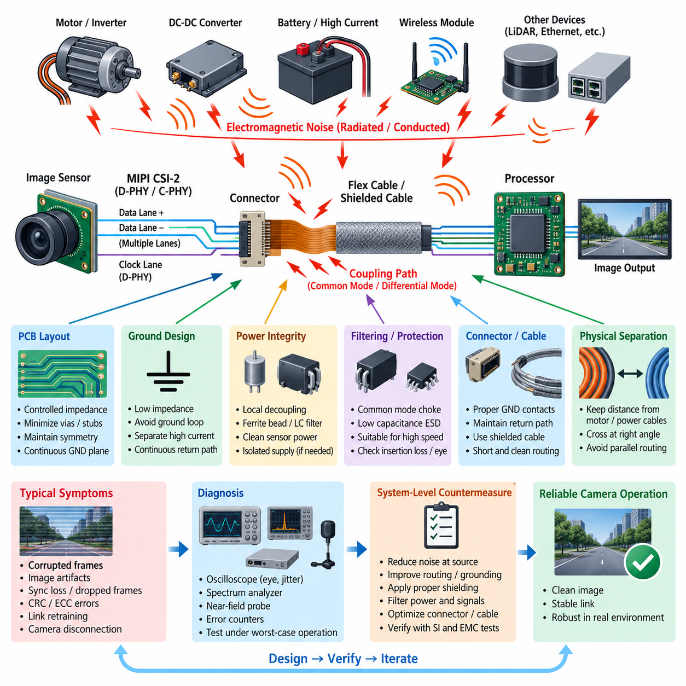
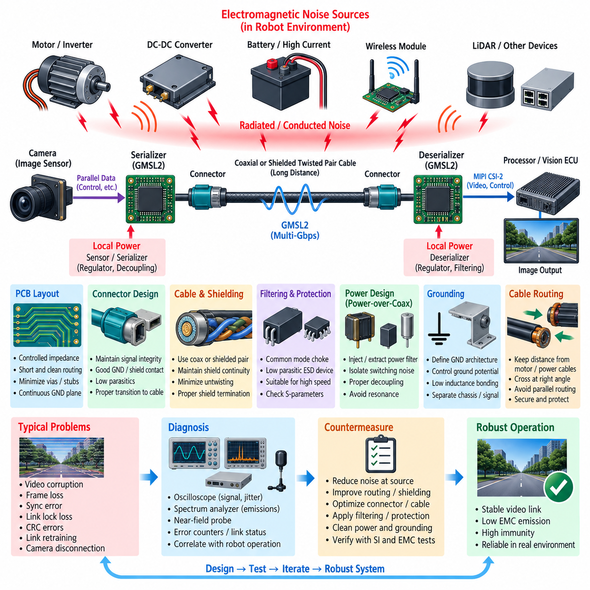
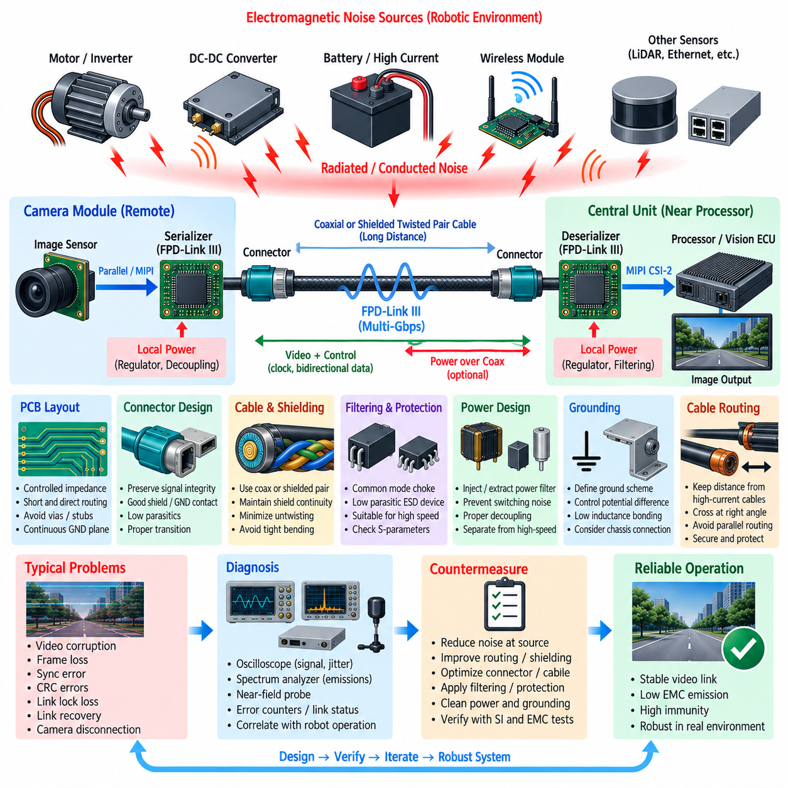
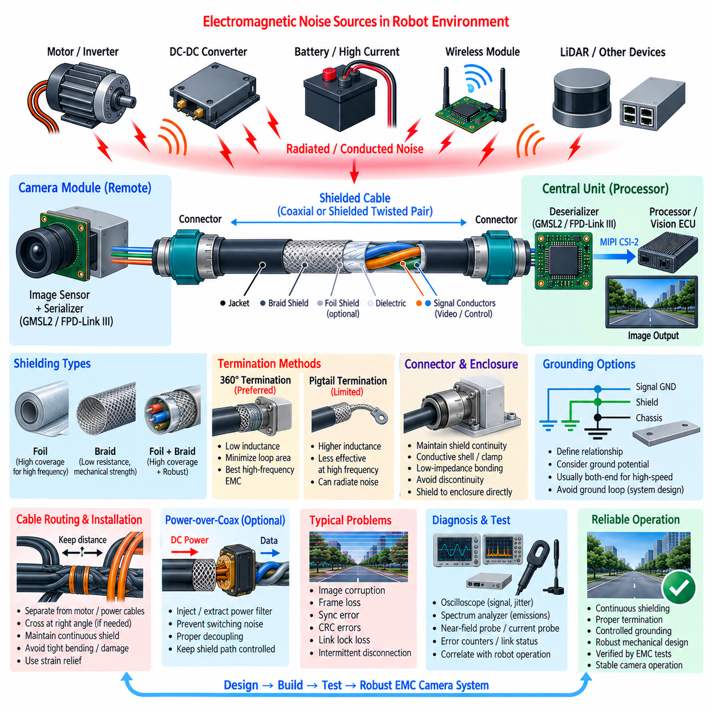
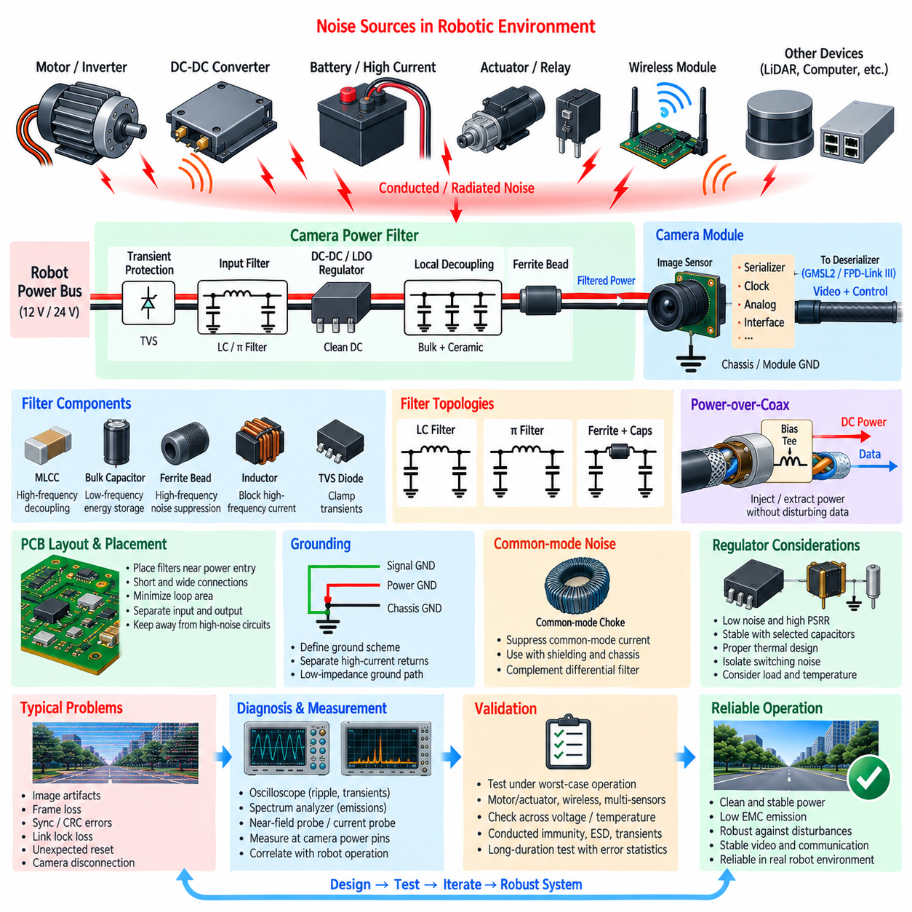

**Volume 05. Grounding and EMC**

# Chapter 09. Camera EMI

## 09.01. MIPI CSI-2 Noise Countermeasure

{width="7.268055555555556in" height="7.268055555555556in"}

MIPI CSI-2 is widely used to connect image sensors to processors because it provides high data throughput with low pin count and power consumption. In robotics, however, the interface often operates close to motors, DC-DC converters, switching regulators, high-current battery wiring, and wireless modules. These sources can couple electromagnetic noise into the camera interface and degrade image reliability even when the nominal digital link appears electrically functional.

A typical MIPI CSI-2 camera path consists of an image sensor, a D-PHY or C-PHY physical interface, differential data lanes, a clock lane in D-PHY systems, connectors or flex cables, and the receiving processor. Because lane rates can reach several gigabits per second, signal edges contain substantial high-frequency energy. The interface must therefore be treated as a controlled high-speed transmission structure rather than ordinary low-voltage digital wiring.

Noise problems occur through both emission and susceptibility mechanisms. Fast MIPI transitions can radiate or couple energy into nearby circuits, while external electromagnetic fields can disturb the differential lanes. Motor inverter switching, PWM edges, DC-DC converter switching nodes, and high-current commutation are especially important in robotic platforms because their harmonics can extend far beyond the fundamental switching frequency and interact with high-speed camera circuitry.

Differential signaling provides strong rejection of noise that couples equally onto both conductors, but this benefit depends on maintaining symmetry. Differences in trace geometry, connector parasitics, vias, reference planes, or cable construction convert part of the differential signal into common-mode energy. This mode conversion increases radiated emissions and simultaneously reduces immunity, making differential-pair balance one of the fundamental MIPI CSI-2 EMC design requirements.

PCB routing should maintain the differential impedance specified by the selected MIPI physical-layer implementation throughout the channel. Pair spacing, trace width, dielectric thickness, and reference-plane distance should remain controlled. Abrupt geometry changes, unnecessary vias, long stubs, test pads, and discontinuities should be minimized because they introduce impedance disturbances that produce reflections, jitter, and differential-to-common-mode conversion.

Continuous return-current paths are equally important. High-frequency return currents follow the path of minimum impedance close to the signal conductors, rather than simply following the shortest geometric route to ground. Routing a MIPI pair across a split reference plane, chassis gap, poorly connected ground region, or large PCB cutout forces the return current to detour and enlarges the electromagnetic loop. Differential lanes should therefore remain referenced to a continuous ground structure.

Lane-to-lane skew and intra-pair skew should be controlled without excessive serpentine compensation. Large or tightly coupled meanders can introduce additional discontinuities and unwanted coupling even when they improve nominal length matching. Routing should prioritize electrical symmetry and clean geometry rather than pursuing unnecessary geometric equality. The final acceptance criterion is adequate timing and signal-integrity margin at the actual operating data rate.

Connectors and flexible printed circuits frequently become dominant noise-sensitive regions because their geometry is less ideal than that of controlled PCB traces. Ground contacts should be distributed appropriately around high-speed signals, and transitions between PCB, connector, and flex cable should preserve the return path. Long unshielded flex sections should be kept away from motors, inductors, switching nodes, antenna feeds, and high-current harnesses whenever packaging permits.

Physical separation is often more effective than adding filtering after an EMC problem appears. Camera cables should not be routed parallel to motor phase cables, inverter output wiring, or high-current battery conductors over long distances. When crossing cannot be avoided, approximately perpendicular crossings generally reduce coupling. Maintaining distance from switching power components and placing sensitive camera electronics in electromagnetically quiet regions greatly improves system robustness.

Camera power integrity is closely related to MIPI reliability because noise entering sensor power rails can modulate internal PLLs, clocks, serializers, analog circuitry, or pixel readout circuits. Local decoupling capacitors should be placed close to the relevant sensor supply pins with short current loops. Power distribution should provide low impedance over the required frequency range, while noisy system rails may require ferrite beads, LC filtering, or dedicated regulators.

Ground design must prevent high-current actuator return currents from sharing sensitive camera return paths. A camera ground should provide a low-impedance connection to the processor-side reference while avoiding layouts in which motor, inverter, or converter currents flow through the same narrow PCB or harness path. At high frequencies, connection inductance and physical geometry are often more significant than the DC resistance measured with a multimeter.

Filtering MIPI lanes requires caution because conventional capacitive EMI filters can severely distort multi-gigabit signals. Any common-mode filtering or ESD protection device placed on the high-speed lanes must have sufficiently low parasitic capacitance and suitable bandwidth. Components should be selected using channel insertion loss, return loss, mode conversion, and eye-quality considerations rather than solely from their nominal EMI attenuation specification.

Common-mode chokes can sometimes suppress unwanted common-mode current while allowing differential data to pass, but they are not universal fixes. Their parasitic capacitance, differential insertion loss, resonance behavior, and impedance characteristics must match the MIPI data rate and channel design. Poorly selected components can close the eye diagram or increase jitter, producing communication errors even while reducing emissions at selected frequencies.

ESD protection introduces another important tradeoff. Protection devices located near exposed connectors help divert transient current before it reaches the image sensor or processor, but excessive capacitance or asymmetric device layout can degrade differential balance. Low-capacitance protection components, short discharge paths, symmetric routing, and an effective connection to the intended transient-current reference are necessary for both signal integrity and immunity.

Shielding becomes increasingly important when camera modules are separated from the processor by significant distance. Conductive enclosures, shielded flex structures, or shielded cables can reduce electric-field coupling, but the shield termination determines effectiveness. Long shield pigtails add inductance and become ineffective at high frequency. Where the mechanical architecture permits, low-inductance circumferential or broad-area shield termination provides better high-frequency performance.

Robotic systems require special attention because cameras coexist with multiple dynamic noise sources. Wheel motors, servo drives, manipulators, LiDAR electronics, Ethernet interfaces, battery converters, and computing platforms can change operating state continuously. A camera may operate correctly while the robot is stationary yet experience frame corruption when motors accelerate, regenerative braking occurs, or a manipulator performs rapid high-current movements.

Symptoms of MIPI CSI-2 interference may include corrupted frames, horizontal or vertical artifacts, intermittent synchronization loss, dropped frames, receiver CRC or ECC errors, link retraining, or complete camera disconnection. Because these symptoms can resemble software or driver failures, diagnosis should correlate camera errors with motor PWM activity, converter load, processor workload, cable position, and robot operating state before assigning the problem to software.

Oscilloscope measurements, near-field probes, spectrum analyzers, and receiver error counters provide complementary diagnostic information. Differential probing can reveal eye degradation and excessive jitter, while near-field scanning can identify coupling around connectors, flex cables, switching regulators, and processor interfaces. Testing should reproduce worst-case robot conditions rather than evaluating the camera only on a quiet laboratory bench with external supplies.

A useful countermeasure process begins at the noise source and follows the coupling path toward the victim. Reducing inverter edge rate, minimizing switching loops, improving motor-cable shielding, or correcting converter layout may provide greater improvement than modifying the MIPI interface itself. After source suppression, routing, grounding, shielding, power filtering, connector design, and carefully selected high-speed protection components can reduce remaining susceptibility.

Validation should combine signal-integrity testing with EMC testing because passing either discipline independently does not guarantee a robust camera system. Eye margin, lane error statistics, frame integrity, radiated emissions, conducted disturbances, immunity, ESD behavior, and transient operation should be evaluated together. Tests should include maximum camera resolution and frame rate, peak processor activity, motor acceleration, braking, and simultaneous operation of major robot subsystems.

The most reliable MIPI CSI-2 noise countermeasure is therefore a system-level design rather than a single filter component. Controlled differential geometry, continuous return paths, minimized mode conversion, clean sensor power, disciplined grounding, careful cable routing, effective shielding, and suppression of motor and converter noise must work together. When these principles are incorporated early, camera reliability can be maintained even within electromagnetically harsh robotic platforms.

## 09.02. GMSL2 EMC Design

{width="7.268055555555556in" height="7.268055555555556in"}

GMSL2, or Gigabit Multimedia Serial Link 2, is widely used in robotic and automotive camera systems to transport high-resolution video, control information, and related data over relatively long cable distances. Unlike short-range MIPI CSI-2 connections inside an electronic assembly, GMSL2 extends the camera interface through coaxial or shielded twisted-pair cabling, making electromagnetic compatibility a system-level concern involving the serializer, cable, connector, deserializer, power network, and grounding architecture.

A typical GMSL2 camera link places a serializer close to the image sensor and a deserializer near the central processor or vision ECU. The serializer converts camera data into a high-speed serial stream suitable for transmission across the vehicle or robot. At the receiving side, the deserializer reconstructs the data and commonly provides a MIPI CSI-2 interface toward the processor, allowing remote cameras to be integrated into centralized perception architectures while reducing the number of long high-speed signal conductors.

GMSL2 operates at multi-gigabit-per-second data rates, so the interconnect contains substantial high-frequency spectral energy even when the transmitted information is digital. Cable discontinuities, connector transitions, poor PCB routing, and imperfect termination can convert part of this energy into common-mode current. Once common-mode current reaches a cable or enclosure structure, the interconnect can behave as an efficient antenna and become a significant source of radiated electromagnetic emissions.

The primary EMC objective is therefore not simply to maintain nominal communication but to preserve transmission-line balance and control high-frequency return currents throughout the complete channel. The serializer output, PCB traces, connector, cable, receiving connector, and deserializer input should behave as one controlled transmission path. Impedance discontinuities should be minimized because reflections can degrade signal integrity while simultaneously increasing mode conversion and electromagnetic radiation.

PCB routing around the serializer and deserializer requires particular attention because these devices form the electrical transition between local digital circuitry and the external high-speed cable. High-speed traces should be short, geometrically consistent, and referenced to continuous ground planes. Unnecessary vias, stubs, test pads, sharp geometry transitions, and routing across reference-plane gaps should be avoided because each discontinuity can alter impedance and disturb the high-frequency return-current path.

Connector selection and connector-to-PCB transition design strongly influence EMC performance. A connector that performs adequately at low frequency may introduce significant parasitic inductance, capacitance, or imbalance at GMSL2 frequencies. Ground and shield connections should provide low-inductance paths around the signal transition, while the mechanical pin arrangement should maintain the intended transmission geometry as closely as possible from the PCB into the cable assembly.

Coaxial cable provides strong electromagnetic containment because the outer conductor surrounds the signal path and naturally forms a closely coupled return path. Its EMC effectiveness, however, depends on maintaining shield continuity through connectors and module interfaces. Poor shield termination, long pigtails, incomplete connector bonding, or unintended gaps can increase high-frequency impedance and allow common-mode current to flow through chassis or harness structures instead of remaining confined to the intended cable path.

Shielded twisted-pair implementations depend strongly on conductor symmetry and shield construction. Twisting helps equalize electromagnetic coupling to the two conductors, while the surrounding shield reduces external field interaction. Pair untwisting near connectors should be minimized, and asymmetric routing between the connector and serializer or deserializer should be avoided. Cable bends, mechanical deformation, and inconsistent termination can also change local impedance and reduce the EMC margin of an otherwise compliant link.

Shield termination should be designed as a high-frequency connection rather than treated only as a DC grounding problem. A connection that measures nearly zero resistance with a multimeter may still exhibit substantial inductive impedance at hundreds of megahertz or several gigahertz. Broad-area or circumferential shield bonding generally provides better high-frequency performance than a long wire connection because it minimizes loop area and connection inductance.

Common-mode filtering may be used when additional suppression is required, but any filter inserted into a GMSL2 channel must be compatible with the signal bandwidth. A common-mode choke can attenuate unwanted common-mode current while allowing the intended signal to propagate, yet excessive parasitic capacitance, differential insertion loss, or resonance can degrade link quality. Filter selection should therefore consider S-parameters, insertion loss, return loss, mode conversion, and the operating data rate.

ESD protection is also necessary for camera links that extend through exposed connectors and long external harnesses. Protection devices should be placed so that transient current is diverted before entering sensitive serializer or deserializer circuitry. At the same time, the selected device must have sufficiently low parasitic loading for multi-gigabit operation. Symmetrical layout, short discharge paths, and a low-inductance connection to the intended transient-current reference are critical to successful protection.

Many remote GMSL2 camera architectures deliver power through the same cable using power-over-coax or related power-over-data arrangements. This simplifies the harness but creates additional EMC interaction because high-speed communication and DC power share the transmission structure. Power injection and extraction networks must prevent switching noise from entering the communication path while ensuring that high-frequency data energy does not propagate into the wider power distribution system.

Power filtering near both ends of the link should therefore be designed with the complete frequency behavior in mind. Ferrite beads, inductors, capacitors, and bias-network components should provide appropriate isolation without introducing harmful resonances. Local regulators for the image sensor and serializer require effective decoupling, and switching regulators should be physically separated from high-speed link circuitry. Small switching-current loops and carefully controlled grounding reduce both conducted and radiated coupling.

Ground architecture becomes particularly important when the remote camera and central computing unit are mounted on different metallic structures. Differences in ground potential can drive unwanted current through cable shields or signal return structures. The design should define deliberately how camera ground, electronic ground, cable shield, and chassis ground interact rather than allowing mechanical mounting points and incidental connections to determine the current path.

Cable routing is another powerful EMC countermeasure in robotic platforms. GMSL2 cables should be separated from motor phase wiring, inverter outputs, high-current battery conductors, DC-DC switching nodes, and other strong electromagnetic sources. Long parallel runs should be avoided where possible, and unavoidable crossings should preferably occur at approximately right angles. Separation distance often provides broadband improvement without introducing the signal-integrity penalties associated with additional filtering components.

Robots create particularly demanding conditions because electromagnetic noise changes dynamically with operating state. Wheel motors, steering actuators, manipulators, pumps, fans, LiDAR units, Ethernet networks, wireless radios, and high-performance computing systems may operate simultaneously. A GMSL2 camera link that functions correctly during stationary testing may exhibit intermittent errors during acceleration, regenerative braking, rapid manipulator motion, or peak computing and communication activity.

Typical link problems include intermittent video corruption, frame loss, synchronization errors, serializer or deserializer lock loss, CRC-related errors, link retraining, and complete camera interruption. These failures should not immediately be classified as software problems. Their occurrence should be correlated with motor PWM activity, converter operation, harness position, mechanical movement, processor load, and other system events to determine whether electromagnetic coupling or signal-integrity degradation is involved.

EMC diagnosis should combine communication statistics with electrical and electromagnetic measurements. Oscilloscopes and suitable high-bandwidth probes can examine signal quality and jitter, while spectrum analyzers and near-field probes can identify emissions around serializers, deserializers, connectors, power circuits, and cable transitions. Error counters and link-lock status provide valuable digital evidence that can be correlated with measured disturbances and specific robot operating conditions.

Effective corrective action should begin by reducing noise at its source whenever possible. Motor inverter switching loops, converter hot loops, poorly terminated shields, and excessive switching edge rates should be addressed before adding components to the GMSL2 channel. The coupling path should then be improved through routing, shielding, grounding, connector optimization, power filtering, and carefully selected common-mode or transient-protection components.

Final validation should evaluate both EMC and communication robustness under realistic worst-case conditions. Testing should include maximum camera bandwidth, simultaneous operation of multiple cameras, peak processor workload, motor acceleration and braking, high-current actuator operation, wireless transmission, and power-system transients. Radiated emissions, conducted disturbances, immunity, ESD, link error statistics, video integrity, and recovery behavior should be evaluated as related aspects of the same system.

Robust GMSL2 EMC design is ultimately achieved by controlling the entire signal and return-current path rather than relying on a single suppression component. Controlled impedance, continuous shielding, low-inductance termination, clean power delivery, deliberate grounding, appropriate cable routing, minimized common-mode conversion, and suppression of major robot noise sources must operate together. This system-level approach allows remote high-bandwidth cameras to remain stable in the electrically harsh environment of modern robotic platforms.

## 09.03. FPD-Link III EMC

{width="7.268055555555556in" height="7.268055555555556in"}

FPD-Link III is a high-speed SerDes communication technology designed to transport video, control, clock-related information, and bidirectional communication between remote cameras and centralized processing units. In robotic systems, it enables high-resolution cameras to be positioned far from the main processor while using compact coaxial or shielded twisted-pair cabling. This reduces harness complexity but introduces EMC challenges associated with multi-gigabit signaling, long cables, remote power delivery, and electrically noisy operating environments.

A typical FPD-Link III camera architecture consists of an image sensor connected to a serializer, a high-speed cable and connector system, and a deserializer located near the processor or vision ECU. The serializer converts parallel or MIPI-based camera information into a serial stream suitable for long-distance transmission. The deserializer reconstructs the information and forwards it to the processor, commonly through MIPI CSI-2, while bidirectional channels can support camera configuration, diagnostics, and control.

Because FPD-Link III operates with very fast signal transitions, its electromagnetic behavior cannot be evaluated only from the nominal data rate. Fast edges contain harmonics extending into much higher frequency regions, where PCB traces, connectors, cable shields, and enclosure structures can become effective coupling paths or antennas. Consequently, small discontinuities that appear insignificant at low frequency can produce reflections, common-mode conversion, increased emissions, or reduced immunity in the actual camera system.

The most important EMC principle is maintaining a controlled transmission path from serializer to deserializer. Characteristic impedance should remain consistent through PCB routing, connector transitions, cable assemblies, and receiving circuitry. Impedance discontinuities cause reflections that reduce signal margin and can convert intended transmission energy into unwanted common-mode current. The complete link should therefore be designed as one interconnected high-frequency structure rather than as independent PCB, connector, and cable components.

Serializer and deserializer PCB layouts should use short, direct high-speed routing with continuous reference planes. Traces should not cross ground splits, large voids, or poorly connected reference regions because high-frequency return currents require a low-impedance path close to the signal. Unnecessary vias, test pads, stubs, abrupt width changes, and asymmetric transitions should be minimized. Maintaining predictable geometry reduces reflections and helps prevent differential or single-ended signal energy from becoming common-mode radiation.

Coaxial cable is particularly useful for FPD-Link III because its outer conductor provides both electromagnetic shielding and a closely coupled return-current path. However, the benefit depends strongly on shield continuity. The shield should remain electrically effective through the connector, cable, camera enclosure, and receiving module. Long pigtails or narrow shield connections introduce inductance, increasing high-frequency impedance and allowing unwanted currents to spread through chassis, PCB ground, or nearby harness structures.

Shielded twisted-pair implementations require careful control of pair symmetry and shield termination. Twisting reduces susceptibility by exposing both conductors to approximately similar electromagnetic fields, while the shield limits coupling with surrounding circuits. Excessive untwisting near connectors, unequal trace lengths, asymmetric vias, or poorly balanced connector geometry can create mode conversion. Mechanical cable deformation and tight bending should also be controlled because they can locally change impedance and degrade link performance.

Connector design is frequently one of the weakest EMC points in an FPD-Link III channel. The connector must preserve the intended high-frequency geometry while providing reliable shield and ground continuity. Parasitic capacitance and inductance introduced by pins, shells, mounting structures, and PCB transitions should be minimized. Shield bonding should use short, broad, low-inductance connections, especially where the cable enters a metallic camera housing or central computing enclosure.

Remote camera systems often combine data communication and power delivery over the same cable through power-over-coax or related arrangements. This significantly simplifies robotic harnesses, but the power network can become a coupling path between noisy vehicle or robot power rails and sensitive high-speed communication circuitry. Power injection and extraction networks must separate the high-frequency communication signal from DC power while preventing switching-regulator noise and system transients from entering the FPD-Link III channel.

Power filtering should be considered at both the camera and processor ends of the link. Local decoupling capacitors, ferrite components, inductors, and appropriate filter networks can prevent conducted disturbances from reaching the serializer, deserializer, image sensor, or shared cable. Component placement is critical because a theoretically correct filter becomes ineffective when connected through long traces with excessive parasitic inductance. Switching regulators should also be physically separated from sensitive high-speed circuitry whenever possible.

Common-mode chokes can provide additional suppression when common-mode current is identified as a dominant emission or immunity problem. However, a choke must support the required FPD-Link III bandwidth without excessive insertion loss, parasitic capacitance, or undesirable resonance. Component selection should therefore consider high-frequency S-parameters and actual link performance rather than only impedance values specified at a single frequency. An inappropriate choke can reduce EMC emissions while simultaneously degrading communication margin.

ESD and transient protection are important because remote cameras are frequently connected through externally routed harnesses that may experience electrostatic discharge or electrical transients during assembly and operation. Protection devices should be positioned near the interface where disturbances enter the module. They must provide a short discharge path to the intended reference while presenting sufficiently low parasitic capacitance to the high-speed channel so that normal signal integrity is not compromised.

Grounding should deliberately define the relationship among camera electronics ground, processor ground, cable shield, and chassis. Remote camera modules may be mounted to conductive robot frames at locations with different ground potentials, creating unintended current paths through the cable shield or signal network. A connection that appears satisfactory at DC may have substantial impedance at high frequency, so grounding and bonding decisions should account for inductance, geometry, mounting structure, and current-return paths.

Cable routing is one of the most practical FPD-Link III EMC countermeasures in mobile robots. Camera cables should be separated from motor phase wiring, inverter outputs, high-current battery cables, switching converters, and actuator harnesses. Long parallel routing increases inductive and capacitive coupling, whereas greater separation reduces both. Where camera and power cables must cross, approximately perpendicular routing generally provides less coupling than long parallel runs.

The robotic operating environment makes EMC verification particularly demanding because interference varies with operating condition. Traction motors, steering systems, servo drives, manipulators, DC-DC converters, LiDAR, Ethernet equipment, wireless radios, and GPU computers can generate simultaneous disturbances. A camera link that performs normally while the robot is stationary may become unstable during motor acceleration, regenerative braking, manipulator motion, peak computing load, or simultaneous sensor operation.

Typical interference symptoms include corrupted video, intermittent frame loss, synchronization errors, CRC-related errors, serializer or deserializer lock loss, repeated link recovery, and complete camera disconnection. Such symptoms may resemble software, driver, or camera configuration failures. Diagnosis should therefore correlate communication errors with robot operating events, motor PWM conditions, converter load, harness movement, temperature, and processor activity before the failure is classified as a software issue.

Measurement should combine signal-integrity and EMC techniques. High-bandwidth oscilloscopes can evaluate waveform quality and jitter, while spectrum analyzers and near-field probes can locate emissions around serializers, deserializers, connectors, power injection networks, and cable transitions. Link status, error counters, CRC statistics, and frame-drop information provide digital evidence that can be correlated with measured electromagnetic activity and specific robot operating conditions.

Corrective action should preferably begin with the dominant noise source. Reducing motor inverter loop area, improving converter layout, controlling switching edge rates, correcting cable-shield termination, and eliminating high-frequency ground discontinuities can provide larger improvements than adding filters directly to the FPD-Link III signal. After source suppression, the coupling path can be improved through routing, shielding, bonding, filtering, connector optimization, and power-network refinement.

System validation should reproduce realistic worst-case combinations rather than testing the camera link in isolation. Maximum resolution and frame rate, multiple simultaneous cameras, peak GPU processing, motor acceleration and braking, actuator operation, wireless transmission, battery transients, and DC-DC converter loading should be included. Radiated emissions, conducted disturbances, immunity, ESD, communication errors, video integrity, link recovery, and long-duration stability should be evaluated together.

Reliable FPD-Link III EMC performance ultimately depends on controlling the complete electromagnetic path from the image sensor and serializer through the cable to the deserializer and processor. Controlled impedance, continuous shielding, low-inductance bonding, clean power, deliberate grounding, appropriate filtering, careful cable routing, and suppression of major robot noise sources must operate together. This system-level approach provides the margin required for stable high-bandwidth vision in electrically harsh robotic environments.

## 09.04. Shield Cable and Termination

{width="7.268055555555556in" height="7.268055555555556in"}

Shielded cables are essential in robotic camera systems because high-speed video interfaces operate in environments containing motors, inverters, DC-DC converters, high-current battery wiring, wireless transmitters, and other electromagnetic noise sources. The shield provides a controlled path for unwanted high-frequency current and reduces coupling between the internal signal conductors and external electromagnetic fields, but its effectiveness depends strongly on cable construction and termination quality.

A cable shield should not be considered simply as an additional ground conductor. At high frequencies, its primary purpose is to control electromagnetic fields and provide a low-impedance path for common-mode currents. The shield surrounds the signal conductors and reduces electric-field coupling while limiting radiation generated by currents inside the cable. Poor termination can compromise this function even when the shield has excellent nominal coverage.

Common shielding structures include foil shields, braided shields, and combinations of both. Foil provides high coverage and is effective against electric-field coupling at higher frequencies, while braid offers lower resistance, mechanical durability, and effective performance over a broad frequency range. Hybrid foil-and-braid constructions are frequently advantageous for robotic camera cables because they combine high coverage with robust low-impedance shielding and improved mechanical reliability.

The effectiveness of a shield depends on its transfer impedance, coverage, conductivity, geometry, and frequency-dependent behavior. A shield that performs well at relatively low frequencies may become less effective as inductance, apertures, connector discontinuities, and termination geometry dominate at higher frequencies. Since camera interfaces such as GMSL2 and FPD-Link III operate with multi-gigabit signals, shield performance must be evaluated across a much wider frequency range than the nominal data rate alone might suggest.

Shield termination is often more important than the cable shield itself. A high-quality shield connected through a long wire or pigtail can lose much of its effectiveness because the termination introduces inductance. As frequency increases, even a short conductor can develop significant impedance. High-frequency camera links therefore benefit from broad, short, low-inductance connections between the cable shield, connector shell, module enclosure, or designated chassis reference.

A 360-degree shield termination surrounds the cable circumference and connects the shield directly to the connector shell or conductive enclosure. This arrangement minimizes loop area and termination inductance while preserving electromagnetic continuity through the interface. Compared with a narrow pigtail connection, circumferential termination generally provides substantially better high-frequency EMC performance and is preferred for high-speed camera links whenever mechanical packaging permits.

Pigtail termination may still appear in low-cost or mechanically constrained systems, but its limitations should be understood. The exposed shield extension and connecting wire create an inductive path that becomes progressively less effective as frequency rises. The resulting voltage across the termination can drive common-mode current onto nearby structures, PCB ground, or internal wiring, allowing the cable to radiate even though the main cable section is fully shielded.

Connector design must preserve shield continuity between the cable and electronic module. Conductive connector shells, properly designed shield clamps, and low-impedance enclosure bonding help prevent electromagnetic leakage at the cable entry point. If the shield stops before reaching the connector or is connected through a narrow PCB trace, the resulting discontinuity can become a dominant emission point and can also provide a path for external interference to enter sensitive camera electronics.

The relationship between cable shield, signal ground, and chassis ground should be intentionally defined. These conductors perform different functions even when they are connected at selected locations. Signal ground provides an electrical reference for circuitry, while the shield primarily controls electromagnetic fields and common-mode current. Chassis provides a large conductive reference structure that can be useful for high-frequency current return when connections are short, broad, and appropriately positioned.

Whether a shield should be terminated at one end or both ends depends strongly on frequency, system architecture, and ground-potential conditions. Single-end termination can prevent low-frequency ground-loop current in some applications, but it generally provides weaker high-frequency shielding because one end remains electrically open. High-speed digital camera interfaces usually require careful high-frequency bonding at both ends, while low-frequency isolation concerns must be addressed through the overall grounding architecture rather than by assuming one termination rule fits every system.

Both-end shield termination can provide an effective high-frequency return path and reduce cable radiation, but differences in chassis potential may cause low-frequency current to flow through the shield. This is especially relevant when remote cameras and processors are mounted on different sections of a large robot. The design must therefore consider DC potential differences, low-frequency current, high-frequency EMC behavior, mechanical bonding, and the intended chassis architecture simultaneously.

Camera cables should maintain shield coverage as continuously as possible along the complete route. Long exposed conductor sections, shield interruptions, improperly assembled connectors, damaged braid, or excessive removal of foil near termination points can create electromagnetic leakage regions. Cable assembly procedures should specify how much jacket and shield may be removed and how the shield is captured mechanically so that manufacturing variation does not undermine the intended EMC design.

Cable routing works together with shielding rather than replacing it. Even a well-shielded camera cable should be separated from motor phase cables, inverter outputs, high-current battery conductors, switching inductors, and other strong noise sources. Long parallel routing increases electromagnetic coupling, whereas greater physical separation reduces it. Where crossing is unavoidable, approximately perpendicular routing generally minimizes the length over which strong fields interact with the camera cable.

Mechanical installation can significantly change shield performance. Tight bends, crushing, repeated flexing, abrasion, and excessive tensile force can damage braid, foil, dielectric geometry, or connector termination. Mobile robots and manipulators may expose camera cables to continuous vibration and motion, making strain relief and controlled bend radius important EMC considerations as well as reliability requirements. Shield integrity should therefore be maintained throughout the expected mechanical life of the robot.

The camera enclosure can form part of the shielding system when a conductive housing is used. Ideally, the cable shield transitions directly into the conductive enclosure through a low-inductance connector or clamp, creating electromagnetic continuity around the sensitive electronics. If the shield is routed deep inside the enclosure before termination, unwanted high-frequency current can enter the module and couple into image-sensor, serializer, power, or processor circuitry before reaching its intended return path.

Plastic camera housings require additional consideration because they cannot directly provide the same electromagnetic boundary as conductive enclosures. Internal conductive coatings, localized metal brackets, shield plates, or dedicated bonding structures may be required to establish an effective high-frequency reference. The cable shield termination should connect to this structure through the shortest practical path rather than relying on a long PCB trace that introduces additional inductance.

Power-over-coax and similar camera architectures require particular attention because power and high-speed communication share the same cable structure. Shield currents, power-return currents, and high-frequency communication currents must follow controlled paths without allowing switching noise to contaminate the data channel. Proper power injection and extraction filtering, connector bonding, local decoupling, and shield termination should therefore be designed as parts of one integrated EMC structure.

Shielding problems often appear as intermittent rather than permanent camera failures. Symptoms can include image corruption, frame loss, synchronization errors, CRC errors, serializer or deserializer lock loss, or temporary camera disconnection. If these events correlate with motor acceleration, regenerative braking, actuator movement, converter switching, or cable motion, the shield path and termination should be investigated together with signal integrity and power quality.

Diagnosis can use near-field probes to identify leakage around connectors and cable entries, current probes to detect common-mode cable current, and spectrum analyzers to determine dominant emission frequencies. Oscilloscopes and communication error counters can then correlate electromagnetic activity with link degradation. Moving or temporarily bonding a shield during controlled testing can also reveal whether termination impedance or cable routing contributes significantly to the observed failure.

Validation should reproduce the mechanical and electrical conditions expected in the complete robot. Shield continuity and bonding should be verified after cable installation, vibration, repeated bending, connector mating cycles, and representative environmental exposure. EMC testing should include motor operation, converter loading, maximum camera bandwidth, multiple simultaneous sensors, wireless communication, and other worst-case combinations rather than evaluating the cable independently on a laboratory bench.

Effective shield cable and termination design is therefore achieved by treating the cable, connector, enclosure, chassis, grounding network, and routing path as one electromagnetic structure. High shield coverage alone cannot compensate for poor termination, and excellent termination cannot fully overcome inappropriate routing or damaged cable construction. Continuous shielding, low-inductance bonding, controlled grounding, robust mechanical installation, and system-level EMC validation together provide reliable camera operation in electrically harsh robotic environments.

## 09.05. Camera Power Filter Design

Sㄴ{width="7.268055555555556in" height="7.268055555555556in"}

Camera power integrity is a fundamental part of EMC design because image sensors, serializers, deserializers, clock circuits, and high-speed interfaces can be sensitive to disturbances on their supply rails. In robotic systems, camera power is often derived from batteries or shared DC buses that also supply motors, actuators, computers, and converters. A dedicated power-filter strategy is therefore required to prevent conducted noise and transient disturbances from degrading image quality or communication reliability.

Camera power disturbances can originate from motor PWM switching, inverter commutation, DC-DC converters, regenerative braking, relays, solenoids, and high-current load changes. These disturbances may propagate through common supply wiring and ground paths before reaching the camera module. Because switching edges contain broadband frequency components, power filtering must address both relatively low-frequency bus disturbances and high-frequency conducted noise rather than targeting only the fundamental switching frequency.

A useful camera power architecture separates the noisy system supply from the sensitive camera electronics through staged filtering and local regulation. The system input may first pass through transient protection and bulk energy storage, followed by an EMI filter and a dedicated regulator. Additional local filtering can then supply the image sensor, serializer, analog circuitry, and clock-related loads. This staged approach prevents one filter component from being responsible for the complete disturbance spectrum.

Input capacitors provide local energy during rapid load changes and reduce the impedance of the camera power input over an appropriate frequency range. Large bulk capacitors are effective at lower frequencies, while smaller ceramic capacitors provide lower impedance at higher frequencies. Their actual effectiveness depends on equivalent series resistance, equivalent series inductance, package size, placement, and PCB geometry, so capacitance value alone is not sufficient for selecting a robust decoupling network.

Ceramic capacitors should be placed close to the power entry point and sensitive device supply pins with short connections to power and ground. Long traces add parasitic inductance and can make a high-value capacitor ineffective at high frequency. Multiple capacitor values are often used to provide useful impedance characteristics across a wider frequency range, but excessive combinations can create anti-resonance peaks. Power-distribution impedance should therefore be considered instead of assuming that more capacitance always improves EMC.

Ferrite beads are frequently used to isolate sensitive camera circuits from high-frequency noise on shared supply rails. Their impedance increases over a useful frequency region and dissipative characteristics can suppress high-frequency energy without the large DC voltage drop associated with a resistor. Selection should consider impedance-versus-frequency behavior, rated current, DC resistance, saturation effects, temperature, and the actual noise spectrum rather than relying only on a nominal impedance value.

A ferrite bead combined with input and output capacitors can form an effective high-frequency filter, but the resulting network must remain electrically stable. Low-loss ceramic capacitors and reactive components may produce resonant peaks that amplify particular frequencies instead of attenuating them. Damping from component losses or deliberately introduced resistance may therefore be necessary. Filter performance should be verified by measurement under realistic source and load impedances.

LC filters provide stronger attenuation when the camera supply is exposed to substantial conducted noise. The inductor resists rapid current changes while capacitors provide a low-impedance path for unwanted AC components. The cutoff frequency should be selected sufficiently below the dominant disturbance range while maintaining acceptable transient response. Inductor saturation current, DC resistance, capacitor bias characteristics, and resonance must be evaluated under maximum camera load and minimum input voltage.

A π filter can provide additional attenuation by using a capacitor-inductor-capacitor structure, but its effectiveness depends strongly on physical placement. The first capacitor should provide a short high-frequency return path on the noisy side, the series element should isolate the sensitive side, and the final capacitor should support the camera load locally. If PCB traces create large loops around these components, parasitic inductance can bypass the intended high-frequency filtering behavior.

Common-mode disturbances require a different approach from differential-mode power noise. Differential noise appears between supply and return conductors, while common-mode noise drives both conductors relative to chassis or another reference structure. Differential LC filtering alone may therefore be insufficient when common-mode current is dominant. Common-mode chokes, controlled chassis coupling, cable shielding, and appropriate grounding may be required as part of the complete camera power interface.

The ground path must be designed together with the positive supply path because every camera current requires a return path. A well-filtered positive rail provides little benefit if motor or converter current flows through the same high-impedance ground conductor as the camera. Camera return currents should have a controlled low-impedance path to the intended reference, and high-current actuator returns should be separated so that voltage disturbances do not modulate sensitive camera electronics.

Local regulation provides another isolation stage between the system power bus and camera circuitry. A switching regulator can efficiently generate intermediate voltages, while low-dropout regulators may be used for particularly noise-sensitive analog, PLL, or sensor rails when power dissipation permits. Regulator power-supply rejection ratio, switching frequency, transient response, output noise, efficiency, thermal behavior, and stability with the selected capacitors should all be considered.

Switching regulators used near cameras require careful PCB layout because their switching node and high-di/dt current loops can become local EMI sources. The input capacitor, switching device, inductor, and output capacitor should be arranged to minimize loop area. The switching node copper area should be kept only as large as necessary, and sensitive image-sensor, clock, serializer, and high-speed signal traces should be physically separated from the regulator's noisy regions.

Remote cameras supplied through long harnesses require additional attention because cable inductance prevents the central power source from responding instantly to rapid load changes. Local bulk capacitance near the camera helps maintain voltage during transient current demand, while input filtering prevents cable-borne noise from entering the module. The design must also consider voltage drop, connector resistance, cable temperature, startup current, and the interaction between harness impedance and the local input filter.

Power-over-coax systems used with GMSL2 or FPD-Link III require filters that separate DC power from high-frequency communication signals. Bias networks inject power onto the cable and extract it at the remote camera while allowing the communication spectrum to pass with minimal distortion. Inductors, capacitors, and related components must therefore satisfy both power-current requirements and high-frequency signal constraints, making EMC and signal-integrity verification inseparable.

Transient protection should be placed near the camera power entry where disturbances can be diverted before propagating into sensitive electronics. TVS devices and other protection components can clamp electrical transients, but their voltage rating, clamping behavior, pulse capability, leakage, capacitance, and connection inductance must match the system. Protection current should follow a short and deliberate path rather than flowing through sensitive camera ground or signal-reference regions.

Filter placement is as important as filter selection. Components should be positioned near the boundary between the noisy power domain and the sensitive camera domain so that noise cannot couple around the filter through PCB traces, ground structures, or adjacent wiring. The input and output sides of the filter should remain physically separated where practical. Otherwise, capacitive or magnetic coupling can bypass a theoretically well-designed filter and substantially reduce its real EMC performance.

Camera power problems can appear as image artifacts, frame corruption, synchronization loss, CRC errors, serializer or deserializer lock loss, unexpected resets, or complete camera disconnection. These symptoms may occur only during motor acceleration, regenerative braking, actuator movement, or high computing load. Correlating camera errors with supply voltage, ground disturbance, converter switching, and robot operating state helps distinguish power-integrity failures from software or communication problems.

Diagnosis should combine time-domain and frequency-domain measurements. An oscilloscope can capture supply ripple, voltage droop, startup behavior, transients, and high-frequency disturbances, while a spectrum analyzer or near-field probe can identify dominant switching components and local coupling sources. Measurements should be performed at the actual camera power pins or filter output whenever possible because measurements taken only at the central power supply may hide disturbances created by the harness and local circuitry.

Validation should reproduce worst-case robot operation, including maximum camera resolution and frame rate, simultaneous sensors, motor acceleration and braking, actuator operation, wireless transmission, and peak computing load. Filter performance should be checked across battery voltage, temperature, camera load, and component tolerance. Conducted immunity, transient events, ESD, startup, shutdown, and long-duration operation should be evaluated together with video and communication error statistics.

A reliable camera power filter is therefore not simply an LC network placed in series with the supply. It is an integrated power-integrity and EMC structure combining transient protection, bulk energy storage, high-frequency filtering, local regulation, controlled grounding, careful PCB layout, and appropriate harness design. When these elements are coordinated with the camera communication interface, stable image acquisition can be maintained even in electrically harsh robotic environments.
