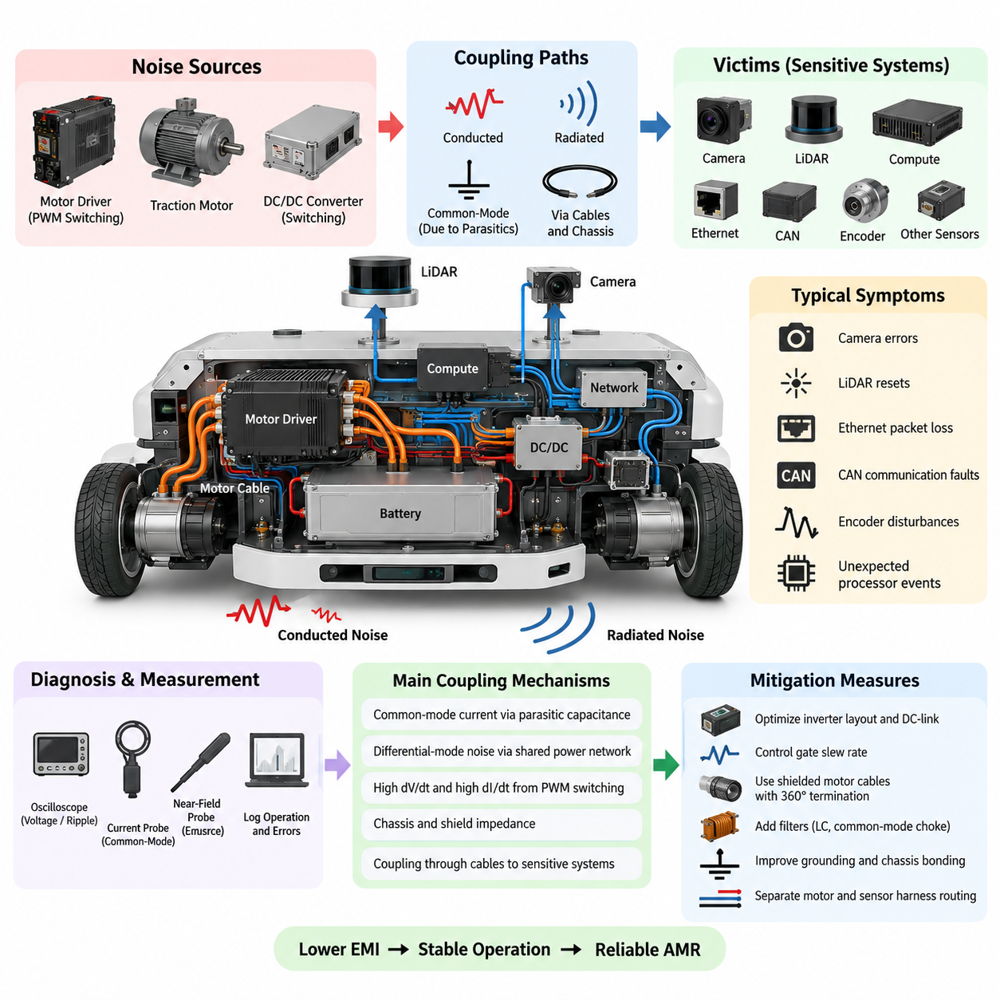
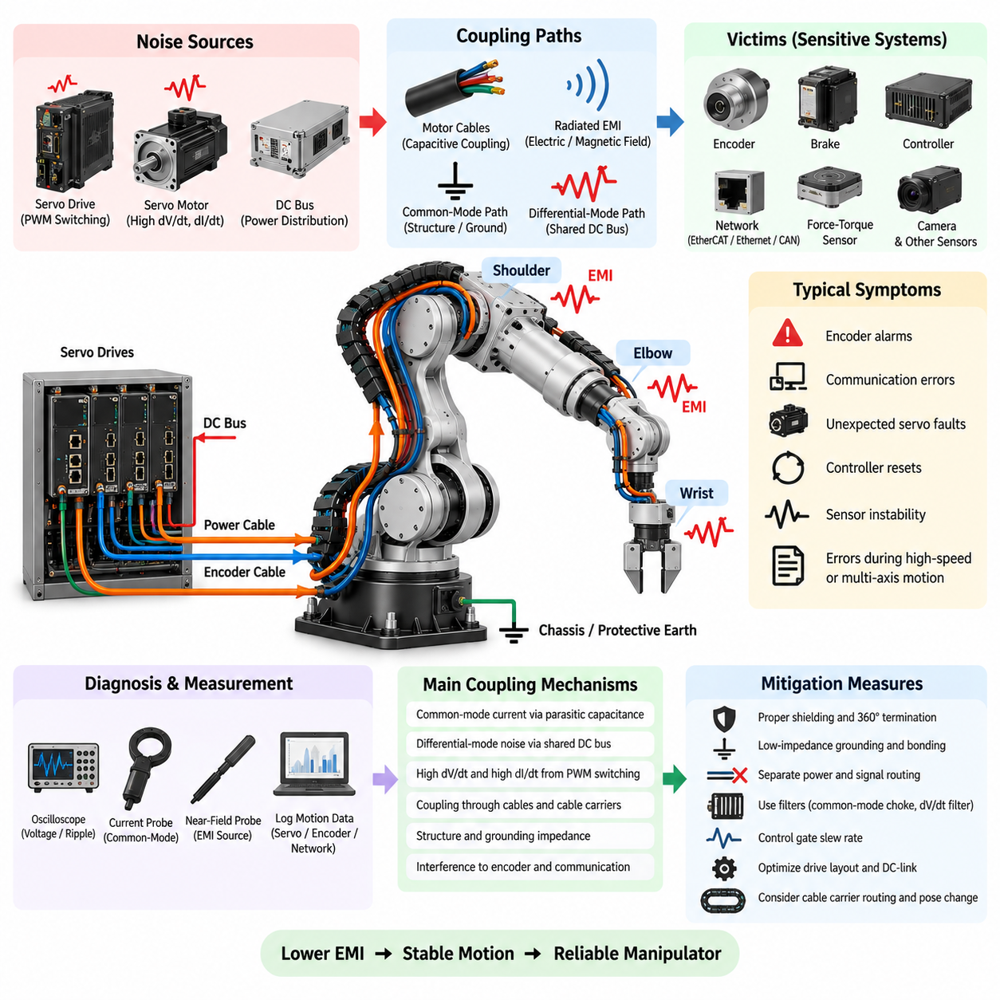
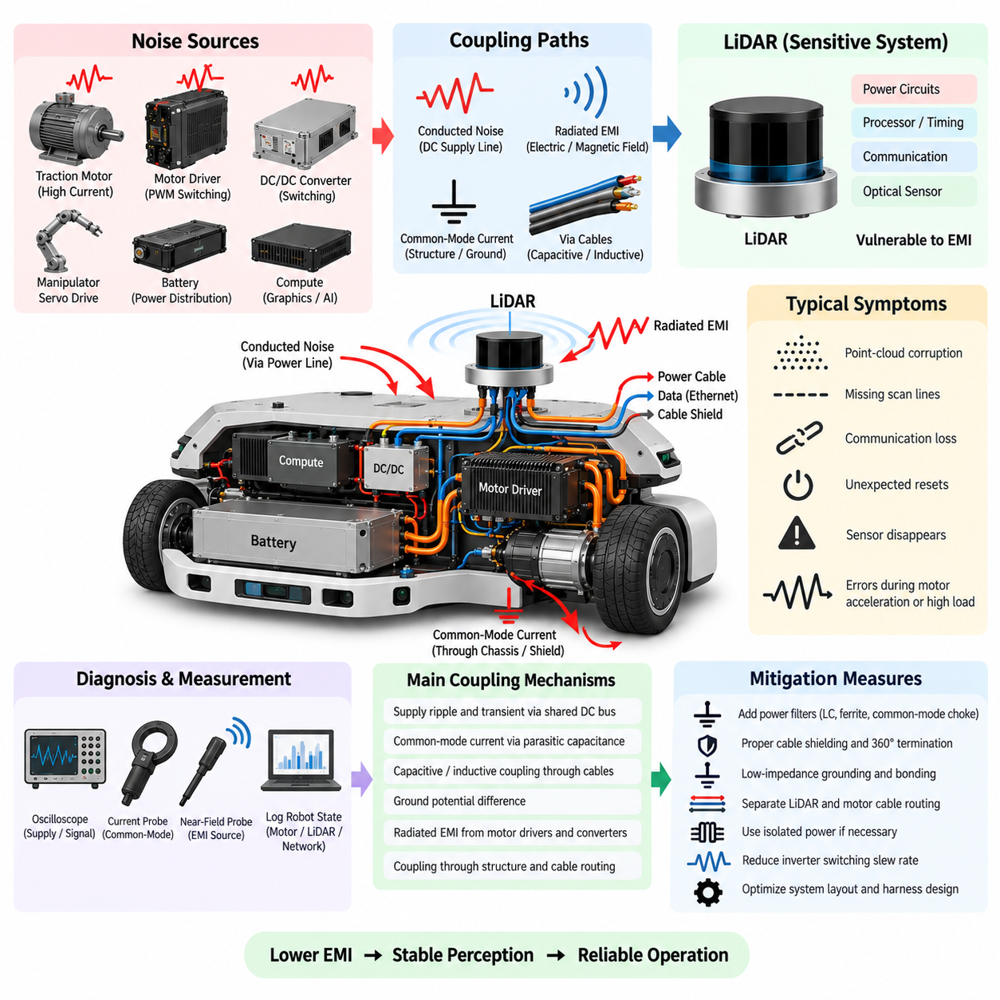
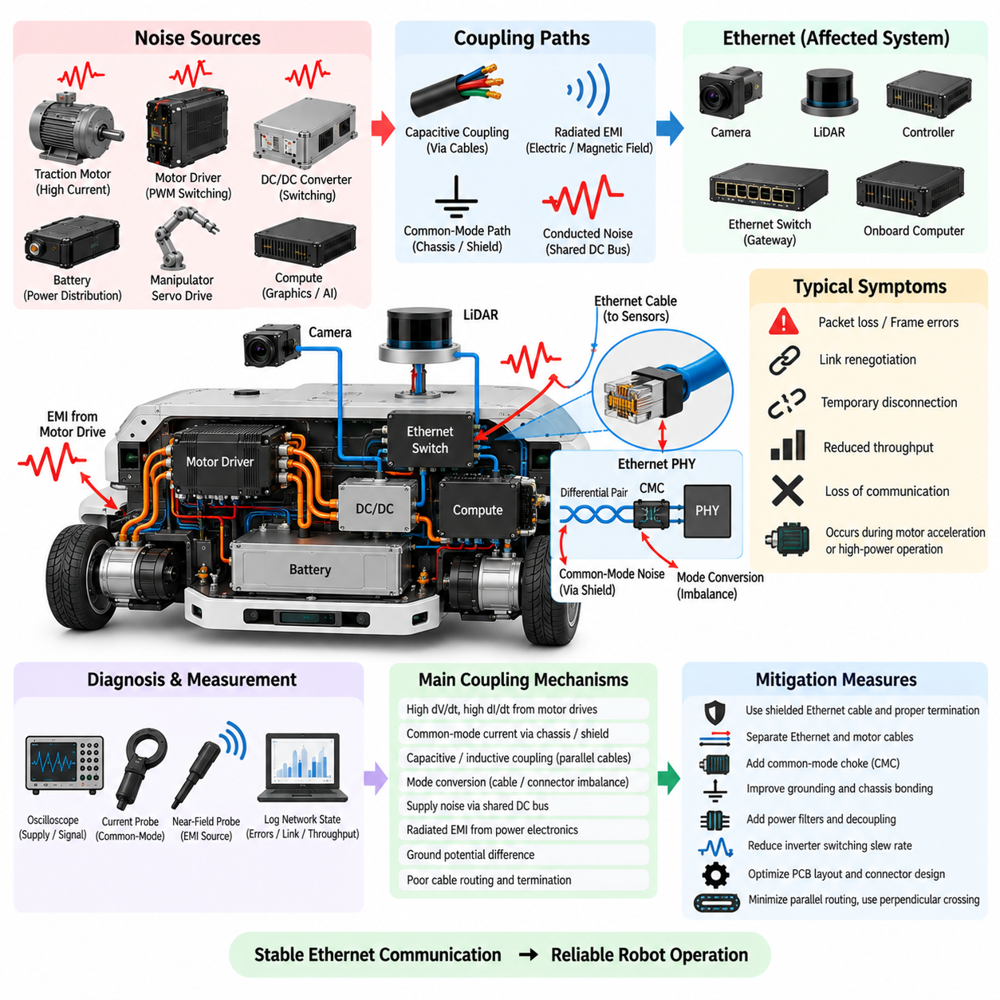
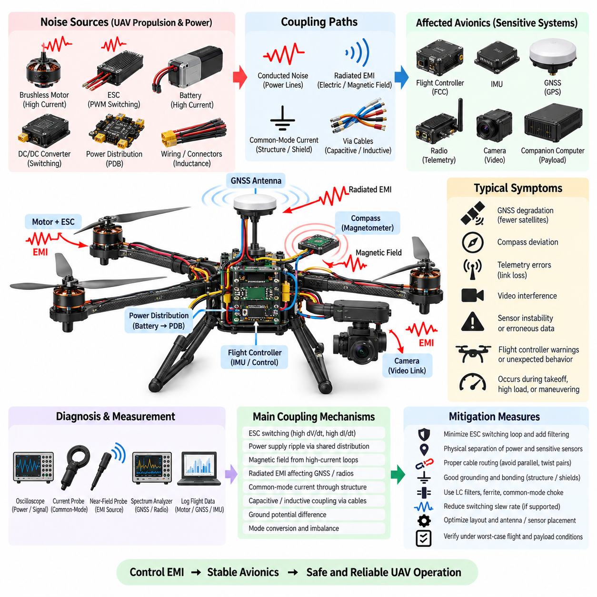

**Volume 05. Grounding and EMC**

# Chapter 10. Robot EMC Case Studies

## 10.01. AMR Motor Noise Case

{width="7.268055555555556in" height="7.268055555555556in"}

자율이동로봇(Autonomous Mobile Robot, AMR)은 일반적으로 고전류 구동 모터(traction motor), PWM 모터 드라이버(PWM motor driver), 스위칭 전력 변환기(switching power converter), 민감한 인지 센서(perception sensor), 통신 네트워크(communication network), 고성능 컴퓨팅(high-performance computing)을 제한된 기계 구조 안에 통합한다. 이러한 높은 집적도 때문에 모터 관련 전자기 노이즈(electromagnetic noise)는 가장 흔한 시스템 수준 EMC 문제 중 하나가 된다. 모터 자체와 인버터 스위칭(inverter switching), 긴 모터 케이블(motor cable), 섀시 결합(chassis coupling)은 함께 작용하여 구동 시스템과 전기적으로 무관해 보이는 전자장치까지 교란할 수 있다.

대표적인 AMR 노이즈 사례는 구동 모터 드라이버(traction motor driver)가 MOSFET을 이용하여 배터리 전압을 높은 PWM 주파수(PWM frequency)로 스위칭할 때 시작된다. 기본 PWM 주파수는 수 kHz 또는 수십 kHz에 불과할 수 있지만, 빠른 스위칭 에지(switching edge)는 MHz 영역까지 확장되는 고조파 에너지(harmonic energy)를 포함한다. 높은 dV/dt는 용량성 변위 전류(capacitive displacement current)를 발생시키며, 높은 dI/dt는 DC 버스(DC bus), 모터 상(motor phase), 커넥터, 케이블 및 접지 구조의 기생 인덕턴스(parasitic inductance)에 자기장과 전압 과도현상(voltage transient)을 발생시킨다.

첫 번째 증상은 모터 컨트롤러(motor controller) 자체에서 나타나지 않을 수도 있다. 가속, 회생 제동(regenerative braking), 급격한 방향 전환 또는 높은 부하 조건에서 AMR은 간헐적인 카메라 오류, 라이다(LiDAR) 재시작, 이더넷(Ethernet) 패킷 손실, CAN 통신 오류, 엔코더(encoder) 교란 또는 예상하지 못한 프로세서 이벤트(processor event)를 경험할 수 있다. 이러한 고장이 영구적인 전기 결함이 아니라 모터 동작과 연관되어 발생한다면, 엔지니어는 우선 구동 전력 시스템에서 발생하는 전도성 또는 방사성 결합(conducted or radiated coupling)을 의심해야 한다.

진단은 제어된 운전 조건에서 고장을 재현하는 것부터 시작해야 한다. 모터 속도, 토크 명령(torque command), 가속 프로파일(acceleration profile), PWM 상태, 배터리 전압 및 페이로드(payload)를 통신 오류와 센서 고장 정보와 함께 기록해야 한다. 바퀴 무부하 상태, 부하 상태 및 기계적으로 구속된 상태에서의 동작을 비교하면 스위칭 관련 간섭(switching-related interference)을 진동 또는 기계적 영향과 구분하는 데 도움이 된다. 오실로스코프(oscilloscope)를 이용하여 DC 버스 리플(DC-bus ripple), 모터 상 전압 전이(motor phase transition), 접지 전위차(ground potential difference), 영향을 받는 장치 주변의 전원 레일(power rail)을 측정해야 한다.

근접장 프로빙(near-field probing)은 주요 방출 영역(emission region)을 찾는 또 다른 유용한 방법이다. 강한 전자기장은 일반적으로 인버터 스위칭 노드(inverter switching node), DC 링크 커패시터(DC-link capacitor), 모터 상 단자(phase terminal), 모터 케이블 및 부적절하게 종단된 실드 연결부(shield connection) 주변에서 검출된다. 전력 또는 신호 케이블 주변에 전류 프로브(current probe)를 사용하면 일반적인 전압 측정에서는 명확하게 나타나지 않았던 공통 모드 전류(common-mode current)를 확인할 수 있다. 목적은 단순히 가장 큰 파형을 찾는 것이 아니라 모터 노이즈 소스(noise source)와 민감한 서브시스템(susceptible subsystem)을 연결하는 결합 경로(coupling path)를 식별하는 것이다.

AMR에서 흔히 발생하는 고장 메커니즘 중 하나는 모터 권선(motor winding), 모터 하우징(motor housing), 섀시(chassis), 인버터 히트싱크(inverter heat sink), 전기 접지(electrical ground) 사이의 기생 커패시턴스(parasitic capacitance)를 통해 흐르는 공통 모드 전류(common-mode current)이다. 의도된 모터 전류 경로가 올바르게 배선되어 있더라도 빠른 상 전압 전이(phase-voltage transition)는 이러한 전류를 발생시킨다. 섀시 연결부의 임피던스가 지나치게 높거나 모터 케이블 실드가 긴 피그테일(pigtail)로 종단되면, 고주파 전류는 센서 실드, 통신 케이블 또는 컴퓨팅 장비를 통해 다른 귀환 경로(return path)를 찾을 수 있다.

차동 모드 노이즈(differential-mode noise)는 이와 다른 경로를 형성한다. 모터 전류의 급격한 변화는 배터리 하네스(battery harness)와 공유 전력 분배 네트워크(shared power-distribution network)의 임피던스를 통해 전압 교란(voltage disturbance)을 발생시킨다. 모터 드라이버와 민감한 전자장치가 충분한 필터링이나 물리적 분리 없이 공통 전원 분기(common branch)를 사용하면 이러한 교란이 DC/DC 컨버터(DC/DC converter)와 센서 전원으로 전파될 수 있다. 따라서 시스템의 공칭 전압(nominal voltage)이 정상이어도 짧은 고주파 과도현상(high-frequency transient)이 디지털 전자장치나 통신 인터페이스를 교란할 수 있다.

개선 조치는 먼저 노이즈 발생원(source)에서 노이즈를 감소시키는 방향으로 이루어져야 한다. 인버터 DC 링크 커패시터(inverter DC-link capacitor)는 스위칭 전력단(switching power stage) 가까이에 배치하여 고주파 전류 루프(high-frequency current loop)를 물리적으로 작게 유지해야 한다. 버스바(bus bar)와 PCB 레이아웃은 루프 인덕턴스(loop inductance)를 최소화해야 하며, 게이트 구동 저항(gate-drive resistance) 또는 프로그래밍 가능한 슬루율 제어(programmable slew-rate control)를 사용하여 과도하게 빠른 스위칭 에지 속도를 낮출 수 있다. 그러나 전환 속도를 낮추면 일반적으로 EMI는 감소하지만 스위칭 손실(switching loss)과 반도체 발열이 증가하므로 열 및 효율 검증이 필요하다.

모터 케이블 처리 역시 중요하다. 실드 모터 케이블(shielded motor cable)은 낮은 임피던스의 고주파 차폐 경로를 제공해야 하며, 실드는 긴 드레인 와이어(drain wire) 연결이 아니라 짧고 넓으며 가능하면 360도 실드 종단(360-degree shield termination) 방식으로 본딩(bonding)해야 한다. 실드 연결은 도전성 인클로저(conductive enclosure) 또는 섀시 구조로 자연스럽게 이어져야 한다. 또한 모터 상 케이블은 카메라, LiDAR, Ethernet, 엔코더, GNSS 및 기타 저레벨 신호 하네스(low-level signal harness)와 멀리 떨어져 배선해야 하며, 특히 장거리 병렬 배선(long parallel routing)을 피해야 한다.

주요 노이즈 모드(noise mode)가 식별된 이후에는 필터링(filtering)을 적용할 수 있다. 차동 모드 교란(differential-mode disturbance)은 적절한 LC 필터링(LC filtering), 로컬 디커플링(local decoupling), 개선된 DC 링크 커패시턴스(DC-link capacitance)를 통해 감소시킬 수 있다. 공통 모드 전류는 공통 모드 초크(common-mode choke), 페라이트 부품(ferrite component), 개선된 섀시 본딩(chassis bonding) 또는 인버터 출력단의 dV/dt 필터(dV/dt filter)가 필요할 수 있다. 필터 부품은 실제 간섭 스펙트럼(interference spectrum)을 기준으로 선택해야 하며, 특정 주파수 영역에서 효과적인 부품이 다른 주파수 영역에서는 거의 효과가 없을 수도 있다.

접지 개선(grounding improvement)은 최종적인 AMR 해결책의 강건성(robustness)을 결정하는 경우가 많다. 모터 드라이버 전력 귀환(motor-driver power return), 민감한 전자장치 접지(sensitive electronic ground), 케이블 실드 및 섀시 연결을 서로 동일한 도체처럼 취급해서는 안 된다. 고전류 스위칭 귀환 경로(high-current switching return path)가 센서 및 통신 귀환 경로와 불필요한 공통 임피던스(shared impedance)를 형성하지 않도록 해야 한다. 고주파에서는 연결 인덕턴스(connection inductance)가 매우 중요하므로 DC 저항 측정값이 거의 동일하더라도 짧고 넓은 섀시 본드(chassis bond)가 긴 전선보다 일반적으로 우수하다.

예를 들어 AMR의 두 구동 모터가 빠르게 가속할 때마다 LiDAR 재시작과 Ethernet 패킷 오류가 발생한다고 가정할 수 있다. 측정 결과 모터 케이블에서 큰 공통 모드 전류(common-mode current)가 확인되고, 모터 드라이버 인클로저와 섀시 사이에서 높은 고주파 전압(high-frequency voltage)이 측정될 수 있다. 임시 피그테일 실드 연결을 360도 실드 종단으로 교체하고, 인클로저 본딩(enclosure bonding)을 개선하며, 모터와 센서 하네스 배선을 분리하고, 인버터 슬루율(inverter slew rate)을 제어하면 로봇의 기능 아키텍처(functional architecture)를 변경하지 않고도 결합된 교란을 크게 감소시킬 수 있다.

두 번째 검증에서는 최초에 고장을 발생시켰던 운전 조건을 정확하게 반복해야 한다. 일정한 저속 조건에서만 시험하는 것은 충분하지 않다. 최악 조건의 EMI는 시동, 최대 토크(maximum torque), 회생 제동, 빠른 PWM 전이(PWM transition), 또는 여러 모터의 동시 동작 과정에서 발생할 수 있기 때문이다. 따라서 대표적인 배터리 충전 상태(battery state), 페이로드, 속도, 가속 명령, 조향 조건 및 충전 또는 보조 전원 구성(auxiliary-power configuration) 전반에서 AMR을 운전하면서 센서와 통신 상태를 지속적으로 감시해야 한다.

엔지니어링 검증(engineering validation)은 단순한 증상 제거와 실제 EMC 마진(EMC margin) 확보를 구분해야 한다. 특정 케이블의 위치를 이동한 후 로봇의 재시작 현상이 사라졌다고 해도 제조 편차(manufacturing variation), 케이블 교체, 페이로드 변경 또는 추가 센서 설치 이후 다시 문제가 발생할 수 있는 한계적인 아키텍처(marginal architecture)일 수 있다. 전도성 교란(conducted disturbance), 방사 방출(radiated emission), 공통 모드 전류, 전원 무결성(power integrity), 통신 오류율(communication error rate)을 측정하면 개선 조치가 단순히 증상의 형태만 변경한 것이 아니라 근본적인 결합 메커니즘(coupling mechanism)을 감소시켰다는 정량적 근거를 확보할 수 있다.

이 사례는 AMR 모터 노이즈를 발생원(source), 결합 경로(coupling path), 피해 장치(victim) 사이의 시스템 수준 상호작용으로 다루어야 하는 이유를 보여준다. PWM 스위칭은 노이즈 발생원을 형성하고, 기생 커패시턴스, 공통 임피던스, 케이블 및 섀시는 결합 경로를 만들며, 센서 또는 통신 전자장치는 피해 장치가 된다. 따라서 효과적인 문제 해결은 부품을 무작위로 교체하는 대신 이러한 연쇄 관계를 따라 진행해야 하며, 각각의 대응책을 측정 가능한 물리적 메커니즘 및 검증 가능한 개선 효과와 연결해야 한다.

성숙한 AMR EMC 설계는 이러한 교훈을 시제품 시험 이전부터 반영한다. 모터 드라이버 레이아웃, 게이트 슬루율(gate slew rate), DC 링크 설계, 케이블 차폐(cable shielding), 360도 실드 종단, 섀시 본딩, 하네스 분리, 필터링 및 센서 전원 분배(sensor power distribution)를 전기 아키텍처 개발 단계에서 통합적으로 고려해야 한다. 이러한 대책을 고장이 발생한 이후 추가하는 것이 아니라 플랫폼 설계 단계부터 반영하면, 로봇이 더 높은 출력과 더 복잡한 센서 구성으로 발전하더라도 모터 유발 간섭(motor-induced interference)을 훨씬 효과적으로 제어할 수 있다.

## 10.02. Manipulator Servo EMI Case

{width="7.268055555555556in" height="7.268055555555556in"}

산업용 매니퓰레이터(industrial manipulator)는 여러 개의 고출력 서보 드라이브(servo drive), 모터, 엔코더(encoder), 브레이크(brake), 통신 인터페이스(communication interface), 제어 전자장치(control electronics)를 기계적으로 제한된 구조 안에 집적한다. 각 관절은 반복적으로 가속과 감속을 수행하며, 이 과정에서 서보 인버터(servo inverter)는 고주파 PWM 스위칭(PWM switching)을 발생시킨다. 그 결과 한 관절에서 발생한 노이즈가 전력 케이블, 모터 프레임, 실드(shield), 접지 도체(grounding conductor), 로봇 구조물을 통해 전파되는 복잡한 전자기 환경(electromagnetic environment)이 형성될 수 있다.

일반적인 서보 EMI 사례는 정지 상태보다 빠른 다축 동작(multi-axis motion) 중에 나타나는 경우가 많다. 매니퓰레이터는 저속에서는 정상적으로 동작하지만 여러 관절이 동시에 가속하면 엔코더 경보, 통신 오류, 예상하지 못한 서보 고장, 센서 불안정 또는 컨트롤러 재시작이 발생할 수 있다. 이러한 증상은 높은 토크 동작, 급격한 방향 전환, 회생 제동(regenerative braking), 또는 서보 전류가 빠르게 변화하는 기계적 동작 한계 부근에서 더욱 빈번하게 발생할 수 있다.

주요 EMI 발생원은 일반적으로 DC 버스(DC bus)를 고속 반도체 소자를 통해 스위칭하는 서보 인버터이다. PWM 전압 전이(PWM voltage transition)는 모터 단자에서 높은 dV/dt를 발생시키며, 빠르게 변화하는 상 전류(phase current)는 높은 dI/dt를 발생시킨다. 명령된 기계적 운동은 비교적 낮은 주파수에서 이루어지지만 스위칭 에지(switching edge)는 훨씬 높은 주파수 영역까지 확장되는 고조파 성분(harmonic component)을 포함한다. 이러한 성분은 엔코더, 브레이크, 통신, 힘-토크 센서(force-torque sensor), 보조 신호 회로에 결합될 수 있다.

서보 모터 케이블(servo motor cable)은 상당한 모터 전류와 빠르게 변화하는 PWM 전압을 동시에 전달하기 때문에 중요한 전파 경로가 된다. 상 도체(phase conductor), 실드, 모터 하우징 및 주변 구조물 사이의 케이블 커패시턴스(cable capacitance)는 각 스위칭 전이마다 공통 모드 전류(common-mode current)가 흐르도록 한다. 특히 케이블이 베이스(base), 숄더(shoulder), 암(arm), 손목(wrist), 이동식 케이블 캐리어(cable carrier)를 통과하여 각각의 서보 모터까지 연결되는 긴 매니퓰레이터 배선에서는 이러한 영향이 더욱 증가할 수 있다.

공통 모드 간섭(common-mode interference)은 서보 모터 프레임, 드라이브 인클로저(drive enclosure), 케이블 실드, 로봇 본체 및 보호 접지(protective earth)가 충분히 낮은 임피던스의 고주파 귀환 구조(high-frequency return structure)를 형성하지 못할 때 특히 중요하다. 빠른 변위 전류(displacement current)는 엔코더 실드, 통신 케이블 실드, 베어링, 센서 접지 또는 기계 관절을 통해 의도하지 않은 경로를 찾을 수 있다. DC 저항계로 측정했을 때 양호해 보이는 접지 연결도 도체 인덕턴스(conductor inductance) 때문에 고주파에서는 상당한 임피던스를 가질 수 있다.

차동 모드 간섭(differential-mode interference)은 동시에 서보 전력 분배 네트워크(servo power distribution network)를 통해 전파될 수 있다. 모터 전류의 급격한 변화는 DC 버스 도체, 커넥터 및 공유 전력 경로(shared power path)의 저항과 인덕턴스에 걸쳐 전압 교란(voltage disturbance)을 발생시킨다. 여러 서보 드라이브가 공통 DC 전원(common DC source)을 사용하는 경우 한 축에서 발생한 교란이 다른 축에 영향을 줄 수 있다. 회생 에너지(regenerative energy)와 급격한 전류 변화는 버스 전압을 추가로 변화시켜 스위칭 노이즈와 전원 무결성(power integrity) 문제가 동시에 나타나는 조건을 만들 수 있다.

엔코더 회로(encoder circuit)는 정밀한 서보 제어가 신뢰할 수 있는 위치 및 속도 피드백에 직접 의존하기 때문에 특히 중요한 피해 장치(victim)가 된다. 증분형 엔코더(incremental encoder), 절대형 엔코더(absolute encoder), 직렬 엔코더 인터페이스(serial encoder interface), 리졸버 관련 전자장치(resolver-related electronics)는 동일한 이동 구조 안에서 고출력 모터 도체 가까이에 배치될 수 있다. 엔코더 신호에 결합된 노이즈는 위치 오류, 유효하지 않은 프레임(invalid frame), 체크섬 오류(checksum fault), 동기화 손실(loss-of-synchronization)을 발생시킬 수 있으며, 서보 컨트롤러는 이를 실제 모션 제어 고장으로 판단할 수 있다.

통신 네트워크(communication network)는 또 다른 결합 경로이면서 동시에 눈에 보이는 고장 증상이 될 수 있다. EtherCAT, 산업용 이더넷(industrial Ethernet), CAN 기반 네트워크 또는 독자적인 서보 링크(proprietary servo link)는 로봇 베이스와 케이블 캐리어 내부에서 모터 케이블 가까이를 지나갈 수 있다. 불충분한 분리, 부적절한 차폐, 잘못된 커넥터 종단(connector termination), 과도한 공통 모드 전압(common-mode voltage)은 통신 마진(communication margin)을 감소시킬 수 있다. 따라서 간헐적인 패킷 또는 프레임 오류가 특정 관절 동작에서만 발생하여 실제 근본 원인은 전자기적인 문제임에도 소프트웨어 문제처럼 보일 수 있다.

효과적인 진단을 위해서는 전자기적 이벤트(electromagnetic event)와 매니퓰레이터 운전 상태 사이의 상관관계를 분석해야 한다. 가능한 경우 관절 위치, 속도, 가속도, 토크 명령, 모터 전류, DC 버스 전압, 서보 경보, 엔코더 오류 및 네트워크 통계를 동시에 기록해야 한다. 동일한 궤적(trajectory)을 서로 다른 속도와 부하에서 반복하면 교란이 스위칭 동작, 모터 전류, 케이블 방향, 기계적 자세 또는 여러 축의 동시 동작 중 무엇과 관련되어 있는지 판단하는 데 도움이 된다.

오실로스코프(oscilloscope) 측정을 통해 DC 버스 교란, 모터 상 스위칭(motor phase switching), 엔코더 전원 레일(encoder power rail), 신호 무결성(signal integrity), 서보 드라이브 접지와 로봇 섀시 사이의 전압 차이를 조사할 수 있다. 전류 프로브(current probe)는 모터 케이블, 실드 및 접지 도체를 따라 흐르는 공통 모드 전류를 식별하는 데 유용하다. 근접장 프로브(near-field probe)는 서보 드라이브, 커넥터, 케이블 전환부 및 제어 전자장치 주변의 강한 전기장 또는 자기장을 찾아내어 의심되는 부품을 무작위로 교체하는 대신 실제 간섭 경로(interference path)를 추적할 수 있도록 한다.

매니퓰레이터 하네스(harness)의 형상은 관절 위치에 따라 변하기 때문에 케이블 배선(cable routing)을 주의 깊게 조사해야 한다. 특정 자세에서는 충분히 분리되어 있는 모터 케이블과 엔코더 케이블이 다른 자세에서는 서로 가까워지거나 케이블 캐리어 내부에서 평행하게 배치될 수 있다. 따라서 가능한 경우 고출력 서보 케이블은 엔코더, 통신, 힘-토크 센서, 카메라 및 기타 민감한 신호 배선과 분리해야 한다. 물리적 분리를 유지하기 어려운 경우에는 긴 평행 배선보다 교차 배선(crossing)이 일반적으로 더 바람직하다.

실드 종단(shield termination)은 고주파 성능에 큰 영향을 미친다. 서보 모터 케이블 실드는 일반적으로 낮은 임피던스 연결을 이용하여 적절한 도전성 인클로저 또는 섀시에 연결해야 하며, 긴 피그테일 와이어(pigtail wire)보다 넓은 360도 종단(360-degree termination)을 사용하는 것이 바람직하다. 커넥터 백셸(connector backshell), 케이블 글랜드(cable gland), 서보 드라이브 인클로저, 모터 하우징 및 로봇 구조 부재는 제어된 고주파 귀환 경로를 제공해야 한다. 이러한 요소 사이에 불연속이 존재하면 실드가 효과적인 차폐 구조가 아니라 오히려 결합 문제의 일부가 될 수 있다.

서보 드라이브 자체에서의 노이즈 감소는 DC 링크 레이아웃(DC-link layout) 최적화, 스위칭 루프 인덕턴스(switching-loop inductance) 감소, 게이트 구동 슬루율(gate-drive slew rate) 제어 및 적절한 필터링을 포함할 수 있다. 지나치게 빠른 스위칭 에지를 늦추면 dV/dt와 이에 따른 공통 모드 전류를 줄일 수 있지만, 증가하는 스위칭 손실과 반도체 온도를 함께 평가해야 한다. 측정된 스펙트럼과 결합 메커니즘에 따라 공통 모드 초크(common-mode choke), 페라이트(ferrite), 라인 필터(line filter), 출력 리액터(output reactor), dV/dt 필터(dV/dt filter)를 적용하여 추가적인 감쇠 효과를 얻을 수 있다.

예를 들어 숄더와 엘보 축(shoulder and elbow axes)이 동시에 가속할 때마다 손목 관절에서 엔코더 통신 오류가 반복적으로 발생하는 매니퓰레이터를 생각할 수 있다. 측정 결과 대형 서보 드라이브에서 발생한 공통 모드 전류가 로봇 구조물과 케이블 실드를 따라 흐르고, 손목 엔코더 케이블이 케이블 캐리어의 일부 구간에서 모터 케이블과 평행하게 배치되어 있음을 확인할 수 있다. 따라서 눈에 보이는 피해 장치는 손목 축이지만 지배적인 노이즈 발생원은 매니퓰레이터의 다른 위치에 존재하는 것이다.

이러한 사례에서는 모터 실드 종단 개선, 더 낮은 임피던스의 섀시 본딩(chassis bonding), 모터와 엔코더 배선 사이의 간격 확대, 서보 드라이브 스위칭 특성 조정을 결합하여 적용할 수 있다. 로컬 필터링(local filtering) 또는 개선된 엔코더 전원 디커플링(encoder power decoupling)은 피해 장치의 내성을 높일 수 있지만, 노이즈 발생원과 결합 경로 개선을 우선해야 한다. 고장이 발생하는 엔코더에만 필터를 적용하면 하나의 증상은 억제할 수 있지만 과도한 전자기 에너지가 전체 로봇 구조를 따라 순환하는 근본적인 문제는 그대로 남을 수 있다.

검증에서는 최초의 최악 조건 궤적(worst-case trajectory)을 재현한 후 시험 범위를 그 이상으로 확장해야 한다. 여러 축을 대표적인 페이로드, 속도, 가속, 제동 및 회생 조건에서 동시에 동작시켜야 한다. 또한 관절 위치에 따라 하네스 형상과 구조적 전류 경로가 달라지므로 서로 다른 자세에서 로봇을 시험해야 한다. 단순히 명령된 동작이 성공적으로 완료되었는지만 확인하는 것이 아니라 엔코더 오류 카운터, 통신 통계, 서보 경보, 컨트롤러 상태 및 센서 동작을 지속적으로 감시해야 한다.

강건한 해결책(robust solution)은 단순히 고장 현상이 사라지는 것이 아니라 측정 가능한 EMC 마진(EMC margin)을 확보해야 한다. 제조 편차, 교체 케이블, 서로 다른 페이로드, 추가 엔드 이펙터(end-effector), 더 긴 하네스 또는 향후 센서 업그레이드는 결합 조건을 변화시킬 수 있다. 공통 모드 전류, 과도 전압(transient voltage), 신호 품질(signal quality), 전원 무결성 및 통신 오류율을 측정하면 실제 제품 편차와 장기 운용 환경에서도 충분하도록 근본적인 간섭 메커니즘이 감소했음을 입증할 수 있다.

매니퓰레이터 서보 EMI 사례는 로봇 EMC 엔지니어링(robot EMC engineering) 전반에서 나타나는 기본적인 발생원-경로-피해 장치(source-path-victim) 관계를 보여준다. 서보 인버터와 모터는 전자기 에너지를 발생시키고, 케이블과 구조 부재는 결합 경로를 제공하며, 엔코더, 네트워크, 센서 및 컨트롤러는 잠재적인 피해 장치가 된다. 따라서 안정적이고 반복 가능한 로봇 동작을 확보하기 위해서는 서보 전력 분배, 접지, 차폐, 케이블 배선, 필터링 및 통신 아키텍처를 하나의 통합된 EMC 시스템으로 설계하는 것이 필수적이다.

## 10.03. LiDAR Interference Case

{width="7.268055555555556in" height="7.268055555555556in"}

자율이동로봇(Autonomous Mobile Robot, AMR)에 설치된 라이다(LiDAR)는 구동 모터(traction motor), 모터 드라이버(motor driver), DC/DC 컨버터(DC/DC converter), 컴퓨팅 장치(computing device), 통신 네트워크(communication network), 카메라 및 기타 센서가 밀접하게 통합된 전기 시스템의 일부로 동작한다. LiDAR는 정밀한 광학 거리 측정(optical ranging)을 위해 설계되지만, 내부의 전원, 처리, 타이밍 및 통신 전자회로는 여전히 전자기 간섭(electromagnetic interference)에 취약하다. 따라서 로봇의 다른 부분에서 발생한 교란이 명확한 전기적 문제 대신 인지 시스템 고장(perception failure)의 형태로 나타날 수 있다.

일반적인 LiDAR 간섭 사례는 간헐적인 포인트 클라우드 손상(point-cloud corruption), 스캔 라인 누락(missing scan line), 통신 손실, 예상하지 못한 재시작 또는 인지 시스템에서 센서가 일시적으로 사라지는 현상으로 처음 나타날 수 있다. 이러한 문제는 구동 모터가 가속하거나 매니퓰레이터(manipulator)가 움직이거나 고출력 컨버터가 동작 상태를 변경하거나 다른 전기 부하가 스위칭될 때만 발생할 수 있다. 이와 같은 상관관계가 확인되면 LiDAR 자체의 결함만을 의심하기보다 시스템 수준 EMC 문제(system-level EMC problem)로 조사해야 한다.

중요한 결합 경로(coupling path) 중 하나는 LiDAR 전원 공급부(power supply)이다. 모터 드라이버 또는 DC/DC 컨버터에서 발생한 스위칭 노이즈(switching noise)는 공유 DC 전력 분배 네트워크(shared DC distribution network)를 통해 전파되어 LiDAR 입력에 도달할 수 있다. 평균 공급 전압이 규격 범위 내에 있더라도 고주파 리플(high-frequency ripple)과 짧은 전압 과도현상(voltage transient)은 배선 임피던스와 불충분한 필터링을 통해 전달될 수 있다. 이로 인해 민감한 내부 레귤레이터(regulator), 프로세서, 타이밍 회로 또는 통신 트랜시버(transceiver)가 장시간의 명확한 전원 전압 이상 없이도 불안정해질 수 있다.

공통 모드 전류(common-mode current)는 또 다른 간섭 메커니즘(interference mechanism)을 형성할 수 있다. 빠른 인버터 스위칭(inverter switching)은 높은 dV/dt를 발생시키고, 전력 전자장치, 모터 권선, 섀시, 케이블 실드 및 구조 부품 사이의 기생 커패시턴스(parasitic capacitance)를 통해 변위 전류(displacement current)를 흐르게 한다. 로봇이 제어된 낮은 임피던스의 고주파 귀환 경로(low-impedance high-frequency return path)를 제공하지 못하면 이러한 전류의 일부가 LiDAR 케이블 실드, 센서 하우징, 통신 연결 또는 로컬 접지(local ground)를 통해 흘러 센서가 사용하는 전기적 기준 전위(electrical reference)를 교란할 수 있다.

케이블 배선(cable routing)은 문제의 심각도에 큰 영향을 줄 수 있다. LiDAR 전원 또는 통신 케이블이 모터 상 케이블(motor phase cable), 인버터 출력 케이블 또는 고전류 배터리 도체와 평행하게 배치되면 용량성 및 유도성 결합(capacitive and inductive coupling)의 영향을 받을 수 있다. 특히 긴 평행 배선(long parallel run)은 유효 결합 영역을 증가시키므로 바람직하지 않다. 따라서 노이즈가 큰 전력 배선과 민감한 LiDAR 배선 사이에 물리적인 거리를 확보하고 공유 배선 구간을 최소화하면 센서 자체를 변경하지 않고도 상당한 개선 효과를 얻을 수 있다.

LiDAR 접지 연결(ground connection)도 주의 깊게 조사해야 한다. 센서는 전원 귀환(power return), 통신 인터페이스, 케이블 실드 및 도전성 장착 구조(conductive mounting structure)를 통해 동시에 연결될 수 있다. 이러한 다중 연결은 의도하지 않은 고주파 전류 경로나 접지 전위차(ground-potential difference)를 형성할 수 있다. 일부 아키텍처에서는 의도적인 접지 절연(ground isolation) 또는 절연 전원(isolated power)을 사용하여 모터 관련 전류가 센서 영역으로 유입되는 것을 방지할 수 있지만, 절연은 개별적으로 적용하기보다 전체 신호, 실드 및 섀시 전략의 일부로 설계해야 한다.

진단은 제어된 로봇 운전 조건에서 간섭을 재현하는 것부터 시작해야 한다. 엔지니어는 LiDAR 상태, 패킷 손실(packet loss), 포인트 클라우드 유효성(point-cloud validity), 센서 재시작, 모터 전류, 인버터 동작, DC 버스 전압(DC-bus voltage), 로봇 운전 상태를 가능한 한 동시에 기록해야 한다. 정지 상태를 가속, 일정 속도 주행, 회생 제동(regenerative braking), 최대 부하 운전과 비교하면 교란이 모터 스위칭, 전류 크기, 기계적 움직임 또는 다른 전기적 이벤트 중 무엇을 따라 발생하는지 식별하는 데 도움이 된다.

오실로스코프(oscilloscope)를 사용하여 고장 발생 중 LiDAR 입력 전원, 로컬 접지, 섀시 전위(chassis potential), 통신 신호를 조사할 수 있다. 측정에서는 저주파 전압 변화뿐만 아니라 센서 오류와 동시에 발생할 수 있는 짧은 고주파 과도현상(high-frequency transient)에도 주의를 기울여야 한다. LiDAR 케이블 또는 실드 주변에 전류 프로브(current probe)를 설치하면 예상하지 못한 공통 모드 전류를 확인할 수 있으며, 근접장 프로브(near-field probe)를 사용하면 모터 드라이버, 컨버터, 케이블 번들 및 커넥터 주변의 강한 전자기장을 식별할 수 있다.

유용한 절연 시험(isolation test) 방법은 필요한 통신 경로를 유지하면서 LiDAR를 일시적으로 더 깨끗한 전원 또는 절연 전원으로 동작시키는 것이다. 이 상태에서 간섭이 사라지면 전원 또는 접지 경로를 주요 원인으로 의심할 수 있다. 반대로 문제가 계속된다면 케이블 결합, 실드 전류(shield current), 통신 내성(communication susceptibility), 방사 간섭(radiated interference)을 더욱 집중적으로 조사해야 한다. 이러한 제어된 대체 시험을 통해 무작위로 부품을 교체하지 않고 발생원(source), 결합 경로, 피해 장치(victim)를 분리하여 분석할 수 있다.

전도성 노이즈(conducted noise)가 주요 원인으로 확인되면 전원 필터링(power filtering)을 LiDAR 가까이에 배치해야 한다. 적절한 커패시터, 페라이트 부품(ferrite component), LC 필터 또는 공통 모드 초크(common-mode choke)를 조합하면 교란이 센서 내부로 유입되기 전에 감쇠시킬 수 있다. 필터를 선택할 때는 측정된 노이즈 스펙트럼(noise spectrum), LiDAR 소비 전류, 기동 특성(startup behavior), 케이블 임피던스 및 잠재적인 공진(resonance)을 고려해야 한다. 단순히 정격 전류만을 기준으로 선택한 필터는 실제 고장을 일으키는 주파수에서 충분한 감쇠 효과를 제공하지 못할 수 있다.

케이블 차폐(cable shielding)와 종단(termination) 역시 고주파 간섭 제어에서 중요하다. 실드는 불필요한 전자기 전류를 위한 낮은 임피던스 경로를 제공해야 하며, 의도된 EMC 아키텍처에 따라 적절하게 종단되어야 한다. 긴 피그테일 연결(pigtail connection)은 상당한 인덕턴스를 발생시켜 고주파에서 차폐 효과를 감소시킬 수 있다. 필요한 경우 짧고 넓은 연결 또는 360도 실드 종단(360-degree shield termination)을 사용하면 고주파 특성을 개선하고 실드가 의도하지 않은 안테나 또는 결합 도체로 동작하는 것을 방지할 수 있다.

예를 들어 AMR이 최대 가속할 때마다 전방 LiDAR가 간헐적으로 재시작하는 사례를 생각할 수 있다. 측정 결과 모터 케이블에서 높은 고주파 공통 모드 전류가 확인되고, 동시에 LiDAR 전원 귀환 경로에서 과도현상이 측정될 수 있다. 또한 LiDAR 케이블이 모터 배선과 긴 구간 동안 동일한 하네스 경로를 공유하고 있을 수 있다. 이 경우 눈에 보이는 고장은 LiDAR에서 발생하지만 근본 원인은 인버터 스위칭, 섀시 전류(chassis current), 공유 전원 임피던스(shared power impedance), 케이블 배선 사이의 상호작용이다.

개선 조치는 모터 케이블 차폐 개선, 낮은 임피던스의 섀시 본딩(chassis bonding), LiDAR와 모터 하네스의 분리, LiDAR 전원 입력 근처의 추가 필터링을 함께 적용할 수 있다. 필요한 경우 바람직하지 않은 전도 경로를 차단하기 위해 절연 전원을 고려할 수도 있다. 지나치게 빠른 인버터 스위칭 슬루율(inverter switching slew rate)을 낮추면 발생하는 공통 모드 에너지를 추가로 감소시킬 수 있다. 가장 효과적인 해결책은 일반적으로 LiDAR 자체의 내성만 높이는 것보다 노이즈 발생원과 결합 경로를 우선적으로 개선하는 것이다.

LiDAR 간섭은 광학 간섭(optical interference)과도 구분해야 한다. 전자기 교란(electromagnetic disturbance)은 전원, 접지, 통신 또는 내부 전자회로에 영향을 미치는 반면, 광학 간섭은 원하지 않는 빛이나 레이저 에너지가 센싱 과정에 유입되면서 발생한다. 두 현상 모두 비정상적인 포인트 클라우드 동작을 발생시킬 수 있지만 대응 방법은 근본적으로 다르다. 오류와 전기적 스위칭 사이의 상관관계를 분석하고 전도성 또는 방사성 교란을 측정하면 EMC 문제를 광학 센싱 문제로 잘못 진단하는 것을 방지할 수 있다.

최종 검증(final verification)에서는 최초의 최악 조건(worst-case condition)을 반복하고 시험 범위를 대표적인 로봇 운전 상태 전반으로 확장해야 한다. 서로 다른 모터 속도, 가속 수준, 페이로드(payload), 배터리 상태, 조향 명령, 컨버터 부하 및 여러 센서의 동시 동작 조건을 포함해야 한다. LiDAR 패킷 통계, 재시작 카운터(reset counter), 포인트 클라우드 품질, 통신 상태 및 전원 무결성(power integrity)을 지속적으로 감시하여 짧은 시간 동안 정상적으로 동작했다는 판단이 아니라 정량적으로 개선 효과를 입증해야 한다.

강건한 설계(robust design)는 생산 편차와 향후 시스템 변경을 고려한 충분한 EMC 마진(EMC margin)을 확보해야 한다. 케이블 길이, 커넥터 상태, 센서 장착 방식, 교체 부품, 추가 컴퓨팅 장비 또는 더 높은 출력의 모터는 전자기 결합 조건을 변화시킬 수 있다. 공통 모드 전류, 전원 과도현상(supply transient), 통신 품질 및 LiDAR 오류율을 측정하면 근본적인 간섭 메커니즘이 실제로 감소했으며 단순히 시험에 포함되지 않은 다른 운전 조건으로 문제가 이동한 것이 아님을 확인할 수 있다.

LiDAR 간섭 사례는 인지 신뢰성(perception reliability)이 센싱 알고리즘뿐만 아니라 전기 아키텍처(electrical architecture)에도 의존한다는 사실을 보여준다. 모터와 컨버터의 스위칭은 잠재적인 노이즈 발생원을 형성하고, 전력 네트워크, 접지, 섀시, 실드 및 케이블은 결합 경로를 형성하며, LiDAR 전자회로는 피해 장치가 된다. 따라서 전기적으로 복잡한 로봇 플랫폼에서 안정적인 LiDAR 동작을 유지하려면 전원 필터링, 절연, 접지, 케이블 배선, 차폐 및 발생원 억제(source suppression)를 통합적으로 설계하는 것이 필수적이다.

## 10.04. Ethernet Noise Case

{width="7.268055555555556in" height="7.268055555555556in"}

자율이동로봇(Autonomous Mobile Robot, AMR)의 이더넷 통신(Ethernet communication)은 고성능 컴퓨터, 라이다(LiDAR), 카메라, 게이트웨이(gateway), 컨트롤러 및 기타 지능형 장치를 연결하며, 동시에 모터, 인버터(inverter), DC/DC 컨버터(DC/DC converter), 고전류 전력 배선과 매우 가까운 환경에서 동작한다. 이러한 조합은 매우 까다로운 전자기 환경(electromagnetic environment)을 형성한다. 따라서 실험실 벤치에서는 안정적으로 동작하던 네트워크도 완성된 로봇 내부에 설치된 이후 간헐적인 통신 문제를 일으킬 수 있다.

일반적인 이더넷 노이즈(Ethernet noise) 사례는 패킷 손실(packet loss), 프레임 오류(frame error) 증가, 링크 재협상(link renegotiation), 일시적인 연결 해제, 처리량(throughput) 감소 또는 센서나 컨트롤러와의 완전한 통신 손실로 나타날 수 있다. 이러한 증상은 모터 가속, 회생 제동(regenerative braking), 고출력 부하의 스위칭 또는 여러 액추에이터(actuator)의 동시 동작 중에만 발생하는 경우가 많다. 이더넷 링크는 자동으로 복구될 수 있기 때문에 초기에는 소프트웨어, 드라이버 또는 네트워크 혼잡(network congestion) 문제로 잘못 판단될 수 있다.

교란(disturbance)은 주로 PWM 모터 드라이버(PWM motor driver), 서보 인버터(servo inverter), 스위칭 컨버터(switching converter), 릴레이(relay) 또는 기타 빠르게 스위칭되는 전력 회로에서 발생한다. 높은 dV/dt는 강한 전기장 결합(electric-field coupling)과 공통 모드 변위 전류(common-mode displacement current)를 발생시키며, 높은 dI/dt는 자기장과 기생 인덕턴스(parasitic inductance)에 걸리는 과도 전압(transient voltage)을 발생시킨다. 이로 인한 스펙트럼 에너지는 기본 스위칭 주파수보다 훨씬 높은 영역까지 확장되어 이더넷 케이블, 커넥터, PHY 회로 및 섀시 구조가 영향을 받을 수 있는 주파수 영역과 중첩될 수 있다.

이더넷은 외부 노이즈에 대한 높은 내성을 확보하기 위해 차동 신호 방식(differential signaling)을 사용한다. 이상적인 경우 전자기 간섭(electromagnetic interference)은 차동 쌍(differential pair)의 두 도체에 동일하게 결합되고 수신기에서 제거된다. 그러나 실제 로봇 설치 환경에는 케이블 불균형(cable imbalance), 커넥터 불연속(connector discontinuity), 불완전한 종단, 비대칭 기생 커패시턴스(asymmetric parasitic capacitance), 불균일한 PCB 배선이 존재한다. 이러한 불완전성은 공통 모드 교란의 일부를 차동 모드 전압(differential-mode voltage)으로 변환하여 이더넷 PHY가 사용할 수 있는 신호 마진(signal margin)을 직접 감소시킨다.

따라서 공통 모드 전류(common-mode current)는 실제 이더넷 EMC 고장에서 중요한 메커니즘이다. 모터와 인버터 스위칭은 섀시, 케이블 실드, 장비 하우징 및 접지 구조를 통해 고주파 전류를 흐르게 할 수 있다. 이더넷 실드(Ethernet shield)가 이러한 의도하지 않은 귀환 경로(return path)의 일부가 되면 상당한 전류가 네트워크 케이블을 따라 흐를 수 있다. 실드와 커넥터 임피던스에서 발생한 전압은 트위스티드 페어(twisted pair)에 결합되거나 PHY 및 관련 회로의 로컬 전기적 기준 전위(local electrical reference)를 교란할 수 있다.

케이블 배선(cable routing)은 이러한 메커니즘이 통신 오류를 발생시킬 정도로 심각해지는지를 결정하는 중요한 요소이다. 이더넷 케이블이 모터 상 케이블(motor phase cable), 배터리 도체, 인버터 출력 또는 스위칭 전력 배선과 평행하게 배치되면 공유되는 거리 전체에서 용량성 및 유도성 결합(capacitive and inductive coupling)의 영향을 받을 수 있다. 특히 긴 평행 배선(long parallel routing)은 바람직하지 않다. 충분한 이격 거리를 유지하고 평행하게 노출되는 구간을 최소화하며, 불가피한 경우 노이즈가 큰 전력 케이블과 가능한 한 직각으로 교차시키면 전자기 결합을 크게 줄일 수 있다.

실드 이더넷 케이블(shielded Ethernet cable)은 EMC 성능을 향상시킬 수 있지만 실드와 커넥터 시스템이 올바르게 설계된 경우에만 효과적이다. 실드는 장비 접지 사이를 임의로 연결하는 경로가 아니라 제어된 낮은 임피던스의 고주파 경로(low-impedance high-frequency path)를 제공해야 한다. 실드 커넥터(shielded connector), 도전성 백셸(conductive backshell), 적절한 섀시 종단(chassis termination)을 사용하여 인터페이스 전체에서 차폐 연속성(shielding continuity)을 유지해야 한다. 긴 피그테일 연결(pigtail connection)은 인덕턴스를 증가시켜 고주파에서 차폐 효과를 크게 감소시킬 수 있다.

이더넷 PHY 레이아웃(Ethernet PHY layout)은 간섭 경로에서 또 다른 핵심 요소이다. 차동 쌍은 PHY, 마그네틱스(magnetics) 또는 결합 네트워크(coupling network), 커넥터, 보호 부품 사이에서 제어된 임피던스(controlled impedance), 대칭성 및 짧은 배선 길이를 유지해야 한다. 스텁(stub), 과도한 비아(via), 불필요한 레이어 전환(layer transition), 불완전한 기준면 연속성(reference-plane continuity), 비대칭 배선은 모드 변환(mode conversion)을 증가시키고 노이즈 내성을 감소시킬 수 있다. 따라서 EMC 성능은 외부 케이블뿐만 아니라 링크 양단의 PCB 구현에도 의존한다.

공통 모드 초크(common-mode choke)는 차동 데이터 신호는 통과시키면서 원하지 않는 공통 모드 에너지를 억제하기 위해 이더넷 인터페이스 근처에서 자주 사용된다. 그 효과는 주파수에 따른 임피던스(impedance versus frequency), 기생 특성(parasitic characteristic), 차동 삽입 손실(differential insertion loss), 특정 이더넷 인터페이스와의 호환성에 따라 달라진다. 측정된 교란 스펙트럼을 고려하지 않고 초크를 선택하면 개선 효과가 제한적일 수 있으며, 부적절한 부품은 정격 전류나 임피던스가 적합해 보이더라도 신호 무결성(signal integrity)을 저하시킬 수 있다.

진단에서는 네트워크 오류와 로봇 운전 조건 사이의 상관관계를 분석해야 한다. 이더넷 CRC 오류(Ethernet CRC error), 패킷 손실, 링크 상태, 적용되는 경우의 재전송(retransmission), 처리량, 센서 타임스탬프(sensor timestamp), 모터 전류, 인버터 스위칭 상태, DC 버스 전압(DC-bus voltage), 로봇 동작 상태를 함께 기록해야 한다. 동일한 궤적(trajectory)을 서로 다른 가속 수준과 페이로드(payload)에서 반복하면 고장이 모터 전류, 스위칭 전이, 케이블 위치 또는 여러 전기 서브시스템의 동시 동작 중 무엇과 관련되는지 확인할 수 있다.

오실로스코프(oscilloscope) 측정을 통해 PHY 전원 노이즈, 공통 모드 전압(common-mode voltage), 차동 신호 품질(differential signal quality), 링크 오류 발생 시의 과도 교란(transient disturbance)을 조사할 수 있다. 이더넷 케이블 주변에 전류 프로브(current probe)를 설치하면 케이블 또는 실드를 통해 흐르는 고주파 공통 모드 전류를 확인할 수 있다. 근접장 프로브(near-field probe)는 모터 드라이버, DC/DC 컨버터, 커넥터, 케이블 번들 주변의 강한 방출 영역을 찾아내어 방사 결합(radiated coupling)과 전도성 또는 섀시 관련 메커니즘을 구분하는 데 도움을 준다.

실용적인 절연 시험(isolation experiment) 방법 중 하나는 모든 네트워크 설정을 그대로 유지한 상태에서 이더넷 케이블을 고출력 전력 배선에서 멀리 떨어진 경로로 임시 변경하는 것이다. 통신 오류가 크게 감소하면 케이블 결합을 주요 원인으로 의심할 수 있다. 이와 유사하게 올바르게 종단된 실드 케이블 구성, 영향을 받는 장치를 위한 별도의 전원 공급, 서로 다른 섀시 본딩(chassis bonding) 구성을 비교할 수 있다. 여러 네트워크 부품을 동시에 교체하는 것보다 하나의 조건만 변경하는 제어된 시험이 원인 분석에 훨씬 유용하다.

예를 들어 두 구동 모터가 빠르게 가속할 때마다 LiDAR 이더넷 링크가 간헐적으로 끊어지는 AMR을 생각할 수 있다. 네트워크 로그(network log)에서는 링크가 끊어지기 직전에 프레임 오류가 증가하며, 측정 결과 이더넷 실드에서 높은 고주파 공통 모드 전류가 확인될 수 있다. 또한 이더넷 케이블과 모터 상 케이블이 긴 구간 동안 동일한 하네스 경로를 공유하고 있을 수 있다. 따라서 겉으로 보이는 LiDAR 통신 고장은 실제로 모터에서 네트워크로 전달되는 더 광범위한 EMC 결합 문제의 결과이다.

개선 조치는 전체 발생원-경로-피해 장치(source-path-victim) 관계를 대상으로 해야 한다. 이더넷 배선과 모터 배선을 분리하면 결합을 줄일 수 있으며, 모터 케이블 차폐와 섀시 본딩을 개선하면 로봇 구조물로 유입되는 전자기 에너지를 감소시킬 수 있다. 적절한 이더넷 실드 종단은 제어된 고주파 귀환 경로를 제공하며, 적합한 공통 모드 필터링(common-mode filtering)은 인터페이스 내성을 향상시킬 수 있다. 인버터 레이아웃 최적화 또는 슬루율 제어(slew-rate control)를 통한 발생원 억제(source suppression)는 교란이 네트워크에 도달하기 전에 추가적으로 감소시킬 수 있다.

전원 무결성(power integrity)도 반드시 검증해야 한다. 외관상 이더넷 노이즈 문제처럼 보이는 현상이 실제로는 PHY, 스위치, 센서 또는 게이트웨이 전원에서 발생한 문제일 수 있기 때문이다. 공유 DC 네트워크를 통해 유입된 과도현상은 케이블 자체의 신호 무결성이 우수하더라도 이더넷 전자회로를 순간적으로 교란할 수 있다. 따라서 네트워크 오류가 직접적인 케이블 결합보다 전원 교란과 연관된 것으로 측정된다면 로컬 필터링(local filtering), 디커플링(decoupling), 전력 분배 개선 또는 절연(isolation)이 필요할 수 있다.

최종 검증(final verification)에서는 최초의 최악 운전 조건(worst-case operating condition)을 재현한 후 모터 속도, 가속도, 페이로드, 배터리 상태, 회생 제동, 센서 동작 및 동시 네트워크 트래픽 조건으로 시험 범위를 확장해야 한다. 오류 카운터(error counter)와 링크 상태를 지속적으로 감시해야 한다. 짧은 시간 동안 데이터 전송에 성공했다는 사실만으로는 충분하지 않으며, EMC에 민감한 링크는 각각의 교란 이후 자동으로 복구되면서도 장기간의 로봇 운전에서는 허용할 수 없는 간헐적 고장을 계속 발생시킬 수 있다.

강건한 이더넷 설계(robust Ethernet design)는 제조 편차, 케이블 교체, 추가 센서, 더 높은 네트워크 속도 및 향후 파워트레인(powertrain) 변경을 고려한 충분한 마진을 확보해야 한다. 공통 모드 전류, PHY 전원 무결성, 프레임 오류율(frame-error rate), 링크 안정성(link stability), 신호 품질을 측정하면 개선 효과를 정량적으로 입증할 수 있다. 이를 통해 근본적인 전자기 결합이 여전히 고장 임계값(failure threshold)에 가까운 상태임에도 일시적인 케이블 경로 변경만을 영구적인 해결책으로 잘못 판단하는 것을 방지할 수 있다.

이더넷 노이즈 사례는 안정적인 로봇 네트워킹(robot networking)이 전력 전자장치, 접지, 차폐, 케이블 배선, 커넥터 설계, 필터링 및 PHY 구현의 상호작용에 의존한다는 것을 보여준다. 네트워크를 독립적인 디지털 서브시스템(digital subsystem)으로만 취급해서는 안 된다. 노이즈 발생원을 식별하고 결합 경로를 추적하며 이더넷 인터페이스를 피해 장치로 평가하고 최악의 로봇 운전 조건에서 개선 조치를 검증함으로써 전체 로봇 플랫폼에서 안정적인 통신을 유지할 수 있다.

## 10.05. UAV Avionics EMC Case

{width="7.268055555555556in" height="7.268055555555556in"}

무인항공기(Unmanned Aerial Vehicle, UAV)는 무게와 공간이 엄격하게 제한된 소형 기체 내부에 추진 시스템(propulsion), 비행 제어(flight control), 항법(navigation), 통신(communication), 센싱(sensing), 페이로드 전자장치(payload electronics)를 통합한다. 고전류 모터와 전자식 속도 제어기(Electronic Speed Controller, ESC)는 비행 컨트롤러(flight controller), 관성측정장치(Inertial Measurement Unit, IMU), 위성항법시스템(GNSS) 수신기, 무선 통신장치, 카메라, 항법 컴퓨터와 같은 민감한 항공전자장치(avionics) 가까이에서 동작한다. 따라서 전자파 적합성(Electromagnetic Compatibility, EMC)은 비행 안정성과 임무 신뢰성에 직접 관련되는 시스템 수준의 요구사항이 된다.

대표적인 UAV 항공전자 EMC 문제는 추진 시스템이 높은 출력에 도달한 이후에만 나타날 수 있다. 이륙, 급상승, 급격한 기동 또는 무거운 페이로드를 탑재한 운용 중에 GNSS 성능 저하, 나침반 편차(compass deviation), 텔레메트리 오류(telemetry error), 영상 간섭(video interference), 센서 불안정 또는 예상하지 못한 비행 컨트롤러 경고가 발생할 수 있다. 이러한 증상이 모터 추력과 전기 부하에 따라 나타난다면 추진 시스템과 관련된 전자기 간섭(Electromagnetic Interference, EMI)을 초기 조사 단계부터 고려해야 한다.

추진 시스템은 일반적으로 가장 강력한 전기적 노이즈 발생원 중 하나이다. 전자식 속도 제어기(ESC)는 브러시리스 모터(brushless motor)를 제어하기 위해 MOSFET을 통해 배터리 전력을 빠르게 스위칭하며, 이 과정에서 높은 dV/dt와 dI/dt 파형을 발생시킨다. 빠른 전압 전이는 용량성 변위 전류(capacitive displacement current)를 발생시키며, 급격하게 변화하는 상 전류(phase current)는 자기장과 배선 인덕턴스(wiring inductance)에 걸리는 과도 전압(transient voltage)을 발생시킨다. 이러한 스위칭 이벤트의 고조파 에너지(harmonic energy)는 기본 PWM 주파수보다 훨씬 높은 영역까지 확장될 수 있다.

배터리와 전력 분배 배선(power-distribution wiring)은 또 다른 중요한 전파 경로를 제공한다. 여러 모터가 동시에 크고 빠르게 변화하는 전류를 소비하면 케이블, 커넥터 및 전력 분배 보드(power-distribution board)의 임피던스에 의해 전압 리플(voltage ripple)과 과도 교란(transient disturbance)이 발생할 수 있다. 항공전자장치가 충분한 분리, 필터링 또는 로컬 에너지 저장(local energy storage) 없이 이러한 전력 경로를 공유하면 평균 배터리 전압이 정상 운용 범위에 있더라도 교란이 비행 컨트롤러, 항법, 통신 및 센서 전원으로 전파될 수 있다.

자력계를 자세 추정의 일부로 사용하는 UAV에서는 자기 간섭(magnetic interference)이 특히 중요하다. 모터 상 전류, 배터리 케이블, 전력 분배 도체 및 고전류 루프(high-current loop)는 나침반 측정을 왜곡할 수 있는 자기장을 발생시킨다. 추진 전류가 요구 추력에 따라 변화하기 때문에 이러한 문제는 스로틀(throttle)에 따라 달라지는 경우가 많다. 따라서 자력계(magnetometer)를 고전류 배선으로부터 멀리 배치하고 전력 루프 면적(power-loop area)을 최소화하는 것은 물리적 항공전자 아키텍처에서 기본적인 설계 고려사항이다.

GNSS 시스템은 위성에서 안테나로 도달하는 신호가 매우 약하기 때문에 다른 형태의 민감성 문제를 가진다. 스위칭 컨버터, 프로세서, 디지털 인터페이스, 무선장치 또는 모터 제어 전자장치에서 발생하는 광대역 방출(broadband emission)이나 고조파가 GNSS 주파수 주변의 로컬 노이즈 플로어(local noise floor)를 높일 수 있다. 노이즈는 방사, 안테나 결합(antenna coupling), 전원선 또는 케이블 실드를 통해 수신기로 전달될 수 있으며, 그 결과 위성 수 감소, 신호 품질 저하, 위치 결정 지연 또는 간헐적인 항법 성능 손실이 발생할 수 있다.

공통 모드 전류(common-mode current)는 추진 시스템의 노이즈를 모터와 ESC 주변을 넘어 더 넓은 영역으로 확산시킬 수 있다. 스위칭 노드, 모터 권선, 히트싱크, 케이블 실드, 도전성 구조물 및 항공전자 접지 사이의 기생 커패시턴스(parasitic capacitance)는 고주파 전류 경로를 형성한다. 도전성 기체(conductive airframe)에서는 이러한 전류가 구조 부재를 통해 분산될 수 있다. 복합재 기체(composite airframe)에서는 구조물 자체가 예측 가능한 고주파 전류 귀환 경로를 제공하지 않을 수 있으므로 전용 접지 및 본딩(grounding and bonding) 경로가 더욱 중요해진다.

따라서 케이블 배선(cable routing)은 UAV의 EMC 성능에 큰 영향을 미친다. 모터 상 배선과 배터리 도체는 가능한 경우 GNSS 안테나 케이블, 자력계 배선, 비행 제어 신호, 카메라 인터페이스 및 통신 하네스와 충분히 떨어뜨려 배치해야 한다. 고전류 도체 쌍은 루프 면적을 최소화하기 위해 서로 가깝게 배선해야 하며, 민감한 케이블은 추진 시스템 배선과 긴 구간에서 평행하게 배치되지 않도록 해야 한다. 이러한 물리적 분리는 시스템 통합 이후 과도한 필터링을 추가하는 것보다 효과적이고 가벼운 해결책이 될 수 있다.

UAV 설계는 질량에 대한 제약이 매우 크기 때문에 차폐(shielding)는 선택적으로 적용해야 한다. 특히 민감한 통신, 영상 또는 센서 인터페이스에는 실드 케이블(shielded cable)이 필요할 수 있지만, 차폐는 종단과 접지가 올바르게 설계된 경우에만 효과적이다. 부적절하게 종단된 실드는 의미 있는 고주파 감쇠 효과를 제공하지 못하면서 무게만 증가시킬 수 있다. 따라서 모든 케이블 주변에 단순히 도전성 재료를 추가하는 것보다 짧고 낮은 인덕턴스의 연결과 적절한 섀시 또는 인클로저 본딩(enclosure bonding)을 확보하는 것이 중요하다.

진단에서는 항공전자장치의 동작과 추진 시스템 운전 상태 사이의 상관관계를 분석해야 한다. 가능한 경우 모터 속도, ESC 명령, 배터리 전류, 버스 전압, 비행 컨트롤러 경고, GNSS 위성 통계, IMU 상태, 나침반 측정값, 통신 오류 및 페이로드 동작을 함께 기록해야 한다. 프로펠러를 제거하거나 적절하게 제어된 추진 시험 환경에서 지상 시험을 수행하면 전기적 간섭을 식별하는 데 도움이 될 수 있지만, 실제 비행에서는 전류, 기계적 형상 및 운전 조건이 달라지므로 최종 구성에서도 반드시 시험해야 한다.

오실로스코프(oscilloscope) 측정을 통해 항공전자 전원 레일(avionics power rail), 배터리 버스 리플(battery-bus ripple), ESC 스위칭 과도현상 및 서로 다른 전기적 기준점 사이의 전압 차이를 조사할 수 있다. 전류 프로브(current probe)는 전력 또는 신호 케이블의 공통 모드 전류를 식별할 수 있으며, 근접장 프로브(near-field probe)는 ESC, DC/DC 컨버터, 프로세서 및 하네스 전환부 주변의 강한 방출 영역을 찾는 데 사용할 수 있다. GNSS, 무선 통신 또는 텔레메트리 시스템의 간섭이 의심될 경우 스펙트럼 분석기(spectrum analyzer)를 사용하면 취약한 수신기 주파수 대역 주변의 고조파를 확인할 수 있으므로 특히 유용하다.

제어된 대체 시험(controlled substitution)은 결합 경로를 분리하는 데 유용하다. 민감한 항공전자장치를 일시적으로 더 깨끗한 절연 전원(isolated supply)으로 구동하면 전도성 노이즈가 전력 네트워크를 통해 유입되는지 확인할 수 있다. GNSS 안테나 또는 자력계를 추진 배선으로부터 더 멀리 이동시키면 방사 또는 자기 결합 여부를 확인할 수 있으며, 통신 케이블의 경로를 변경하면 하네스 관련 간섭을 식별할 수 있다. 각각의 시험에서는 하나의 주요 변수만 변경하여 발생원-경로-피해 장치(source-path-victim) 관계를 명확하게 식별할 수 있도록 해야 한다.

예를 들어 모터가 정지한 상태에서는 안정적인 GNSS 수신 상태를 유지하지만 스로틀이 일정 수준 이상으로 증가하면 위성 신호 품질이 저하되는 UAV를 생각할 수 있다. 측정 결과 ESC 또는 DC/DC 컨버터에서 발생하는 광대역 노이즈가 증가하고, GNSS 안테나 케이블이 추진 시스템 배선 가까이에 배치되어 있음을 확인할 수 있다. 이 경우 겉으로 나타나는 항법 문제는 반드시 GNSS 수신기의 결함을 의미하는 것이 아니라 스위칭 방출, 케이블 결합, 안테나 민감성 및 전력 분배 노이즈가 상호작용한 시스템 수준의 문제일 수 있다.

개선 조치는 우선 노이즈 발생원에서 간섭을 줄이는 것부터 시작할 수 있다. ESC 스위칭 루프(switching loop)는 물리적으로 작게 설계하고, DC 링크 커패시터(DC-link capacitor)는 스위칭 소자 가까이에 배치하며, 불필요한 배선 인덕턴스를 최소화해야 한다. ESC 설계에서 지원되는 경우 적절한 슬루율 제어(slew-rate control)를 사용하여 과도한 스위칭 에지 에너지를 줄일 수 있다. 이후 측정된 교란 메커니즘과 주파수 영역에 따라 페라이트(ferrite), LC 필터, 공통 모드 초크(common-mode choke), 로컬 디커플링(local decoupling)을 적용할 수 있다.

물리적 아키텍처 개선도 그에 못지않게 중요하다. 추진 전자장치와 항법 센서 사이의 거리를 늘리고, GNSS 안테나를 재배치하며, 고전류 루프 면적을 줄이고, 전력 도체를 꼬거나 서로 가깝게 배선하며, 접지와 본딩을 개선하고, 노이즈가 큰 하네스와 민감한 하네스를 분리하면 큰 EMC 개선 효과를 얻을 수 있다. UAV에서는 이러한 기하학적 해결책(geometric solution)이 과도한 차폐와 필터링으로 발생하는 무게 및 열적 부담을 피할 수 있기 때문에 특히 가치가 높다.

검증에서는 대표적인 최악의 추진 및 페이로드 조건(worst-case propulsion and payload condition)을 포함해야 한다. 낮은 스로틀의 벤치 시험만으로는 충분하지 않으며, 최대 간섭은 이륙, 고전류 상승, 급격한 모터 명령 변화, 적용 가능한 경우의 회생 또는 제동 동작, 페이로드의 동시 작동, 통신 송신 중에 발생할 수 있다. 의도된 전기적 운용 범위 전체에서 항법 품질, 센서 안정성, 비행 컨트롤러 상태, 텔레메트리 성능 및 전원 무결성(power integrity)을 지속적으로 감시해야 한다.

강건한 UAV EMC 해결책은 구성 변경(configuration change)도 고려해야 한다. 서로 다른 프로펠러, 모터, ESC 펌웨어, 배터리 종류, 페이로드, 무선장치, 안테나, 케이블 길이 또는 컴퓨팅 모듈은 전류 요구량과 전자기 결합 조건을 변화시킬 수 있다. 전원 과도현상(supply transient), 자기 교란(magnetic disturbance), 공통 모드 전류, 수신기 신호 품질(receiver signal quality), 통신 오류 및 항공전자장치 상태를 정량적으로 측정하면 하나의 성공적인 시제품 구성을 넘어 충분한 EMC 마진(EMC margin)이 확보되었음을 입증할 수 있다.

UAV 항공전자 EMC 사례는 전자파 적합성이 비행 건전성(flight integrity)과 밀접하게 연결되어 있음을 보여준다. 추진 전자장치와 컨버터는 주요 노이즈 발생원을 형성하고, 전력 배선, 구조물, 접지 및 전자기장은 결합 경로를 형성하며, 항법, 센싱, 통신 및 비행 제어 전자장치는 잠재적인 피해 장치가 된다. 따라서 신뢰할 수 있는 UAV 운용을 위해서는 설계 초기부터 발생원 억제(source suppression), 전원 필터링, 접지, 본딩, 케이블 배선, 차폐 및 물리적 분리를 하나의 통합된 EMC 설계로 반영하는 것이 필수적이다.
